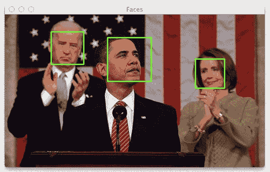
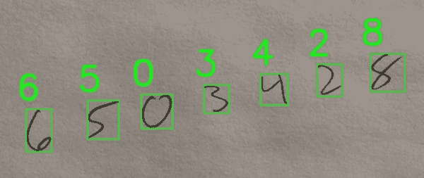
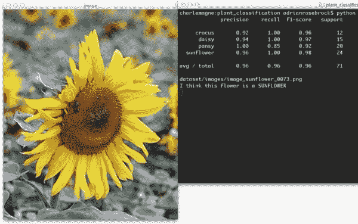

# 宣布“案例研究:用计算机视觉解决现实世界的问题”

> 原文：<https://pyimagesearch.com/2014/06/26/announcing-case-studies-solving-real-world-problems-computer-vision/>

今天我有一些重大消息要宣布…

除了写一大堆关于计算机视觉、图像处理和图像搜索引擎的博客帖子，我一直在幕后， ***在写第二本书*** 。

而且你可能在想，哎，你不是刚做完 *[实用 Python 和 OpenCV](https://pyimagesearch.com/practical-python-opencv/)* 吗？

没错。我做到了。

别误会我的意思。实用 Python 和 OpenCV 的反馈令人惊讶。它完成了我所想的——在一个周末 教授开发者、程序员和像你一样的学生计算机视觉的基础知识 ***。***

但是现在你已经知道了计算机视觉的基础，并且有了一个坚实的起点，是时候继续学习一些更有趣的东西了…

让我们用你的计算机视觉知识来解决一些 ***实际的、真实世界的问题*** 。

什么类型的问题？

我很高兴你问了。继续读下去，我会告诉你的。

# 这本书包括什么？

这本书涵盖了现实世界中与计算机视觉相关的五个主要主题。看看下面的每一个，以及每一个的截图。

## #1.照片和视频中的人脸检测

**Figure 1:** Learn how to use OpenCV and Python to detect faces in images.

到目前为止，这个博客上最受欢迎的教程*一直是 ***“我如何在图像中找到人脸？”*** 如果你对人脸检测以及在图像和视频中寻找人脸感兴趣，那么这本书正适合你。*

## #2.视频中的目标跟踪

**Figure 2:** My *Case Studies* book will show you how to track objects in video as they move along the screen.

另一个我经常被问到的问题是 ***“我如何在视频中追踪物体？”*** 在这一章中，我将讨论如何使用一个物体的颜色来跟踪它在视频中移动时的轨迹。

## #3.基于梯度方向直方图的手写识别

**Figure 3:** Learn how to use HOG and a Linear Support Vector Machine to recognize handwritten text.

这可能是整本*案例研究*书中我最喜欢的一章，因为它是如此*实用和有用*。

想象一下，你和一群朋友在酒吧或酒馆，突然一个漂亮的陌生人向你走来，递给你写在餐巾上的电话号码。

你会把餐巾塞在口袋里，希望不要弄丢吗？你会拿出手机手动创建一个新的联系人吗？

你可以。或者。你可以拍下电话号码的照片，让它被自动识别并安全存储。

在我的*案例研究*一书中的这一章，你将学习如何使用*梯度方向直方图(HOG)描述符*和*线性支持向量机*到**对图像中的数字进行分类。**

## #4.基于颜色直方图和机器学习的植物分类

**Figure 4:** Learn how to apply machine learning techniques to classify the species of flowers.

计算机视觉的一个常见用途是对图像内容进行分类。为了做到这一点，你需要利用机器学习。这一章探索了如何*使用 OpenCV 提取颜色直方图*，然后*使用 scikit-learn 训练一个随机森林分类器*对一种花进行分类。

## #5.构建 Amazon.com 图书封面搜索

**Figure 5:** Applying keypoint detection and SIFT descriptors to recognize and identify book covers.

三周前，我和我的朋友格雷戈里出去喝了几杯啤酒，格雷戈里是旧金山一位炙手可热的企业家，他一直在开发一款软件，只使用一张图像就能立即识别和识别图书封面。使用这款软件，用户可以拍下他们感兴趣的书籍的照片，然后将它们自动添加到他们的购物车并运送到他们的家门口——比你的标准*Barnes&Noble 便宜得多！*

总之，我猜格雷戈里喝了太多啤酒，因为你猜怎么着？

他向我透露了他的秘密。

格雷戈里求我不要说出来…但我无法抗拒。

在本章中，你将学习如何利用**关键点提取和 SIFT 描述符**来执行关键点匹配。

最终的结果是一个系统，可以识别和识别一本书的封面在一瞬间…你的智能手机！

所有这些例子都有详细的介绍，从前面到后面，有很多代码。

当你读完我的*案例研究*书后，你将成为解决现实世界计算机视觉问题的专家。

# 那么这本书是给谁看的呢？

这本书是为像你一样有扎实的计算机视觉和图像处理基础的人准备的。理想情况下，你已经通读了*实用 Python 和 OpenCV* 并且对基础知识有了很强的掌握(如果你还没有机会阅读*实用 Python 和 OpenCV* ，[绝对拿起一本](https://pyimagesearch.com/practical-python-opencv/))。

我认为我的新*案例研究*书是你学习计算机视觉旅程的下一步。

你看，这本书侧重于计算机视觉的基础知识，然后将它们应用于 ***解决实际现实世界的问题*** 。

因此，如果你对应用计算机视觉解决现实世界的问题感兴趣，你肯定会想买一本。

# 请排队预留您的位置，以便提前入场

如果你注册了我的时事通讯，我会发送每一章的预览，这样你就可以直接看到如何使用计算机视觉技术来解决现实世界的问题。

但是，如果你只是*等不及*并且想要锁定你的位置来排队接收 ***提前访问*** 到我的新*案例研究*电子书，[只需点击这里](https://pyimagesearch.com/case-studies/)。

听起来不错吧？

[现在注册，在图书发布时获得一份 ***独家*** 预发行协议。](https://pyimagesearch.com/case-studies/)