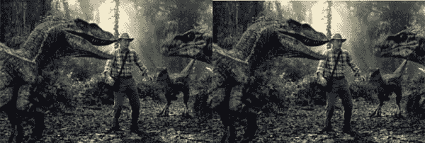

# 图像中 1 个像素的偏移会如何影响您的 RBM 性能

> 原文：<https://pyimagesearch.com/2014/06/16/1-pixel-shifts-images-can-kill-rbm-performance/>

[](https://pyimagesearch.com/wp-content/uploads/2014/06/raptor_translate.jpg)

你能说出上面两幅图像的区别吗？

大概不会。

右边的那个已经向下移动了一个像素。

虽然对我们来说，它看起来仍然是同一个图像，对一台受限的玻尔兹曼机器来说，这种转换可能会带来麻烦。

# 作为特征向量的原始像素强度

你知道吗，当使用原始像素作为特征向量时，有一个微妙而又关键的问题，这通常是在基于图像的深度学习分类任务中完成的。

如果你不小心，没有采取适当的预防措施，输入图像中的*小，1 像素偏移*会*显著*损害你的分类器的性能。

我们只是在谈论一个像素的移动。如此小的位移几乎(如果有的话)不会被人眼察觉。

但是如果你已经在原始像素特征上训练了你的受限玻尔兹曼机器，你可能会大吃一惊。

当然，卷积神经网络有助于缓解这个翻译问题。其实，*缓解*这个词太强了。他们能够*容忍*在图像中的翻译。卷积网络(一般而言)仍然容易受到这种转换问题的影响。

正如谷歌最近的论文之一*神经网络的有趣特性*所表明的，输入图像的微小变化可以极大地改变网络的整体分类。

作者称这些类型的图像为“对立图像”,事实上，根据人眼的观察，它们实际上与原始图像完全相同。

*注意:如果你有兴趣阅读更多关于谷歌的论文(以及我对机器学习时尚的批评)，一定要看看我以前的帖子，* [摆脱深度学习的狂热，获得一些观点](https://pyimagesearch.com/2014/06/09/get-deep-learning-bandwagon-get-perspective/) *。*

然而，这些对立的图像是用一种比输入图像的简单的一个像素平移复杂得多的方法构建的。事实上，这些图像是通过非常少量地操纵像素值来构造的，以便最大化深度学习网络的误差。

但它确实证明了当使用原始像素特征时，图像中人眼完全察觉不到的细微变化会导致错误分类。

# 图像中 1 个像素的偏移会如何影响您的 RBM 性能

为了证明(在相当小的规模上)与基于原始像素特征向量的深度学习网络相关的一些问题，我决定进行一个小实验: ***如果我拿着我的测试图像集，将每张图像向上、向下、向左和向右移动一个像素，性能会下降吗？***

再说一次，对于所有的意图和目的来说，这些一个像素的移动对于人类的眼睛来说是不明显的……但是受限玻尔兹曼机器呢？

**所以我们接下来要做的是:**

*   使用 [MNIST 数据集](http://yann.lecun.com/exdb/mnist/)的样本的原始像素特征构建训练和测试分割。
*   应用单个受限玻尔兹曼机器从 MNIST 样本学习无监督特征表示。
*   在学习的特征之上训练逻辑回归分类器。
*   使用测试集评估分类器以获得基线。
*   通过将图像上下左右移动一个像素来扰乱测试集。
*   重新评估我们的分类管道，看看准确性是否下降。同样，这些一个像素的偏移对人眼来说几乎是不可见的，但它们最终会损害系统的整体性能。

**这是我们*而不是*要做的事情:**

*   使用对立的图像复制谷歌的结果。
*   声称这些结果是所有基于原始像素的方法的罪证。他们不是。这里我只使用一个 RBM。所以不会有任何堆积——因此也不会有任何深度学习。
*   声称研究人员和开发人员应该放弃基于原始像素的方法。有很多方法可以解决我在这篇文章中提出的问题。最常见的方法是在训练时对图像应用变形(即通过人工转换图像来生成更多的训练数据)，以使神经网络更加鲁棒。第二种方法是对输入图像的区域进行子采样。

但是*我将要做的*是向你展示如果不采取适当的预防措施，图像中一个像素的微小移动**会极大地降低你的 RBM 的精确度。**

 **希望这一系列的博客文章，包括 Python 和 scikit-learn 代码，将帮助一些正在探索神经网络和将原始像素特征向量映射到输出的学生和研究人员。

# 初步结果

生成我的结果的代码还不太好看(将在下一篇文章中介绍)，但是我想展示一些初步的结果:

```py
RBM + LOGISTIC REGRESSION ON ORIGINAL DATASET
             precision    recall  f1-score   support

          0       0.95      0.98      0.97       196
          1       0.97      0.96      0.97       245
          2       0.92      0.95      0.94       197
          3       0.93      0.91      0.92       202
          4       0.92      0.95      0.94       193
          5       0.95      0.86      0.90       183
          6       0.95      0.95      0.95       194
          7       0.93      0.91      0.92       212
          8       0.91      0.90      0.91       186
          9       0.86      0.90      0.88       192

avg / total       0.93      0.93      0.93      2000

```

我做的第一件事是获取 MNIST 数据集的样本(2000 个数据点；大致均匀地分布在每个类别标签上)并构建了 60/40 的划分— 60%的数据用于训练，40%用于验证。

然后我使用伯努利限制的玻尔兹曼机器从训练数据中学习无监督的特征表示，然后将其输入到逻辑回归分类器中。

最后，使用测试数据评估该 RBM +逻辑回归管道，获得 93%的准确度。

所有相关参数都经过网格搜索和交叉验证，以帮助确保最佳值。

然后，我决定“微调”测试，将测试集中的每个图像向上、向下、向左和向右移动一个像素，产生一个比原始图像大四倍的测试集。

这些移位的图像虽然与人眼几乎相同，但对管道来说是一个挑战，精度下降了 5%。

```py
RBM + LOGISTIC REGRESSION ON NUDGED DATASET
             precision    recall  f1-score   support

          0       0.94      0.93      0.94       784
          1       0.96      0.89      0.93       980
          2       0.87      0.91      0.89       788
          3       0.85      0.85      0.85       808
          4       0.88      0.92      0.90       772
          5       0.86      0.80      0.83       732
          6       0.90      0.91      0.90       776
          7       0.86      0.90      0.88       848
          8       0.80      0.85      0.82       744
          9       0.84      0.79      0.81       768

avg / total       0.88      0.88      0.88      8000

```

在小范围内，我们可以看到使用原始像素作为特征向量的问题。图像中轻微的平移、微小的旋转，甚至图像捕捉过程中的噪声，在输入网络时都会降低准确性。

虽然这些结果决不是结论性的，但它们至少证明了一般直觉，即使用原始像素特征向量在没有预先进行有效预处理的情况下容易出错。

# 摘要

在这篇博文中，我介绍了一个概念，即如果你不小心，图像中小的一个像素的移动会杀死你受限的玻尔兹曼机器的性能。

然后，我提供了一组“挑逗性”的结果，以证明图像中的一个像素平移虽然与人眼几乎相同，但会导致准确性下降。

# 接下来:

在我的下一篇博客文章中，我将向您展示我的 Python 代码，以将深度学习和受限玻尔兹曼机器应用于 MNIST 数据集。

请务必注册下面的时事通讯，以便在帖子发布时收到更新！你不会想错过它的…**