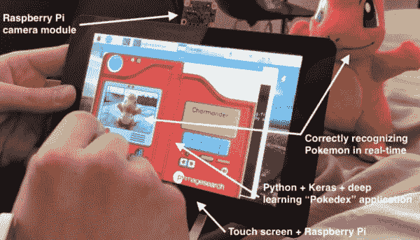

# 面向初学者、学生和业余爱好者的有趣的动手深度学习项目

> 原文：<https://pyimagesearch.com/2018/04/30/a-fun-hands-on-deep-learning-project-for-beginners-students-and-hobbyists/>

今天的博文是我们关于构建完整的端到端深度学习应用的最新系列中的“额外教程”:

*   **第一部分:** [如何(快速)建立深度学习图像数据集](https://pyimagesearch.com/2018/04/09/how-to-quickly-build-a-deep-learning-image-dataset/)
*   **第二部分** : [Keras 和卷积神经网络](https://pyimagesearch.com/2018/04/16/keras-and-convolutional-neural-networks-cnns/)
*   **第三部分:** [用 CoreML 在 iOS 上运行 Keras 模型](https://pyimagesearch.com/2018/04/23/running-keras-models-on-ios-with-coreml/)

在这个系列中，我们一直在实现我儿时的梦想:建造一个 Pokedex。

**Pokedex 是一个来自口袋妖怪世界的虚构设备(我过去是/现在仍然是一个超级口袋妖怪书呆子)** **并允许最终用户:**

1.  把它对准一个口袋妖怪(类似动物的生物)，大概是用某种相机
2.  并且自动识别口袋妖怪，提供关于该生物的详细信息

因此，你可以把 Pokedex 想象成一个智能手机应用程序，它(1)访问你的相机，并且(2)实时识别动物/生物。

为了识别口袋妖怪，我们[使用 Keras](https://pyimagesearch.com/2018/04/16/keras-and-convolutional-neural-networks-cnns/) 训练了一个卷积神经网络——这个模型能够正确识别图像和视频流中的口袋妖怪。

然后使用 Keras、CoreML 和 iOS 将该模型[部署到移动应用程序，以创建实际的“Pokedex 应用程序”。](https://pyimagesearch.com/2018/04/23/running-keras-models-on-ios-with-coreml/)

但是为什么要止步于此呢？

PyImageSearch 博客的长期读者都知道我喜欢树莓派…

…我情不自禁地制作了一个实际的 Pokedex 设备，使用了:

*   树莓派
*   相机模块
*   7 英寸触摸屏

这个系列肯定是一个有趣的怀旧项目——谢谢你陪我走完这段旅程。

**要了解这个有趣的深度学习项目的更多信息，并在树莓 Pi 上实时运行深度学习模型，*请继续阅读！***

## 面向初学者、学生和业余爱好者的有趣的动手深度学习项目

<https://www.youtube.com/embed/em1oFZO-XW8?feature=oembed>