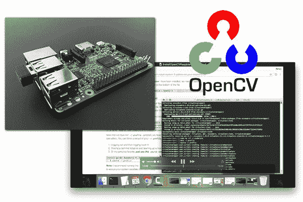

# Raspbian Stretch:在您的 Raspberry Pi 上安装 OpenCV 3 + Python

> 原文：<https://pyimagesearch.com/2017/09/04/raspbian-stretch-install-opencv-3-python-on-your-raspberry-pi/>

拉斯比恩·杰西的释放已经过去两年多了。截止 2017 年 8 月 17 日，树莓 Pi 基金会正式发布了 Raspbian Jessie 的继任者— ***Raspbian Stretch。***

正如我在以前的博客文章中所做的那样，我将展示如何在 Raspbian *Stretch* *上使用 Python 绑定安装 OpenCV 3。*

如果您正在寻找不同平台的先前安装说明，请参考以下列表:

*   [安装指南:Raspberry Pi 3+**Raspbian Jessie**+OpenCV 3](https://pyimagesearch.com/2016/04/18/install-guide-raspberry-pi-3-raspbian-jessie-opencv-3/)
*   [如何在 ***Raspbian Jessie** 上安装 OpenCV 3.0？*](https://pyimagesearch.com/2015/10/26/how-to-install-opencv-3-on-raspbian-jessie/)
*   [在你的*Raspberry Pi Zero*running*Raspbian Jessie 上安装 OpenCV。*](https://pyimagesearch.com/2015/12/14/installing-opencv-on-your-raspberry-pi-zero/)
*   [在 ***拉斯边喘息***上同时安装 Python 2.7 和 Python 3+的 OpenCV 3.0。](https://pyimagesearch.com/2015/07/27/installing-opencv-3-0-for-both-python-2-7-and-python-3-on-your-raspberry-pi-2/)
*   [在 ***拉斯边喘息*** 上为 Python 2.7 安装 OpenCV 2.4。](https://pyimagesearch.com/2015/02/23/install-opencv-and-python-on-your-raspberry-pi-2-and-b/)

否则，让我们继续在 Raspian Stretch 上安装带有 Python 绑定的 OpenCV 3！

## 快速入门视频教程

如果这是你第一次安装 OpenCV，或者你刚刚开始使用 Linux，我*强烈建议*你观看下面的视频，跟着我一步一步地指导你如何在运行 Raspbian Stretch 的 Raspberry Pi 上安装 OpenCV 3:

<https://www.youtube.com/embed/j6RD3X94rEA?feature=oembed>