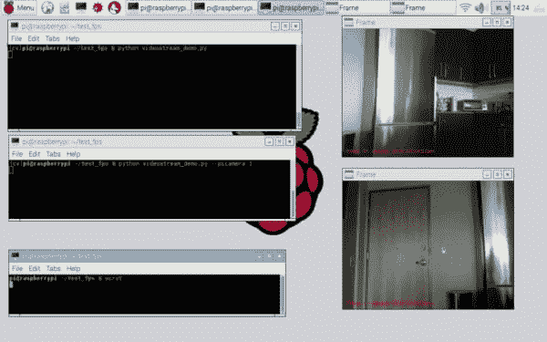

# 统一 picamera 和 cv2。使用 OpenCV 将视频捕获到单个类中

> 原文：<https://pyimagesearch.com/2016/01/04/unifying-picamera-and-cv2-videocapture-into-a-single-class-with-opencv/>

在过去两周的 PyImageSearch 博客上，我们讨论了如何使用线程来*提高我们在*[内置/USB 网络摄像头](https://pyimagesearch.com/2015/12/21/increasing-webcam-fps-with-python-and-opencv/)以及 [Raspberry Pi 摄像头模块](https://pyimagesearch.com/2015/12/28/increasing-raspberry-pi-fps-with-python-and-opencv/)上的 FPS 处理速率*。*

 *通过利用线程，我们了解到我们可以显著降低 I/O 延迟的影响，让主线程在等待 I/O 操作完成(即从摄像头传感器读取最新帧)时不会被阻塞。

使用这种线程模型，*我们可以将帧处理速率大幅提高 200%以上。*

虽然 FPS 处理速度的提高是惊人的，但仍有一个(有点不相关的)问题困扰我很久了。

你看，在 PyImageSearch 博客上，我写了很多关于内置或 USB 摄像头的帖子，比如:

*   **[用 Python 和 OpenCV 实现基本的运动检测和跟踪](https://pyimagesearch.com/2015/05/25/basic-motion-detection-and-tracking-with-python-and-opencv/)**
*   **[跟踪物体运动](https://pyimagesearch.com/2015/09/21/opencv-track-object-movement/)**
*   **[在无人机/四轴飞行器流中寻找目标](https://pyimagesearch.com/2015/05/04/target-acquired-finding-targets-in-drone-and-quadcopter-video-streams-using-python-and-opencv/)**

所有这些帖子都依赖于`cv2.VideoCapture`方法。

然而，如果您想在我们的 Raspberry Pi 上使用代码，这种对`cv2.VideoCapture`的依赖就成了一个问题。假设你是*而不是*使用带 Pi 的 USB 摄像头，并且*实际上使用的是 [picamera](https://picamera.readthedocs.org/en/release-1.10/) 模块*，你需要修改代码以兼容`picamera`，如[使用 Python 和 OpenCV 访问 Raspberry Pi 摄像头](https://pyimagesearch.com/2015/03/30/accessing-the-raspberry-pi-camera-with-opencv-and-python/)一文中所讨论的。

虽然只需要对代码做一些修改(例如，实例化`PiCamera`类并交换出帧读取循环)，但这仍然很麻烦，尤其是如果您刚刚开始使用 Python 和 OpenCV 的话。

相反，PyImageSearch 博客上有其他帖子使用了`picamera`模块*而不是* `cv2.VideoCapture`。这种帖子的一个很好的例子是 **[用树莓派、Python、OpenCV 和 Dropbox](https://pyimagesearch.com/2015/06/01/home-surveillance-and-motion-detection-with-the-raspberry-pi-python-and-opencv/)** 实现家庭监控和运动检测。如果你没有 Raspberry Pi(或者想要使用内置或 USB 网络摄像头而不是 Raspberry Pi 摄像头模块)，你将不得不再次换出几行代码。

因此，这篇文章的目标是构建一个 ***统一接口*** 给`picamera`和`cv2.VideoCapture`，只用一个名为`VideoStream`的 ***类*** 。这个类将根据提供给构造函数的参数调用`WebcamVideoStream`或`PiVideoStream`。

最重要的是，我们对`VideoStream`类的实现将允许 PyImageSearch 博客上未来的视频处理帖子在**内置网络摄像头**、 **USB 摄像头**或**树莓 Pi 摄像头模块** — ***上运行，而无需更改一行代码！***

请继续阅读，了解更多信息。

<https://www.youtube.com/embed/--90GjhAFH4?feature=oembed>*