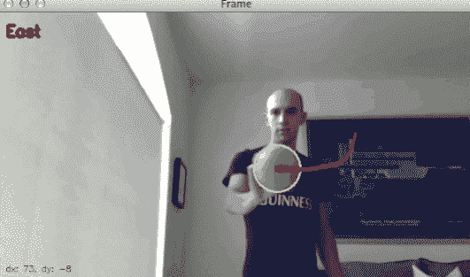

# OpenCV 跟踪对象运动

> 原文：<https://pyimagesearch.com/2015/09/21/opencv-track-object-movement/>

上周六，我陷入了对童年的怀念，所以我拿出了我的 PlayStation 1 和我的原版《最终幻想 7》。作为一个初中/高中早期的孩子，我花了 *70 多个小时*玩这个令人心碎、鼓舞人心、绝对经典的 RPG 游戏。

作为一个中学时代的孩子(那时我有更多的空闲时间)，这个游戏几乎就像一张安全毯，一个最好的朋友，一个编码在 *1 的*和 *0 的*中的虚构世界，在那里我可以逃避，远离日常的青少年焦虑、不安和恐惧。

我在这个交替世界里花了太多时间，以至于我几乎完成了所有的支线任务。终极和红宝石武器？没问题。全斜线？完成了。圆形骑士？大师级别。

大概不用说，*最终幻想 VII* 是我有史以来最喜欢的 RPG——*，感觉* ***绝对牛逼*** *再玩一次*。

但几天前的一个晚上，当我坐在沙发上，一边喝着季节性的 Sam Adams 十月节，一边招待我的老朋友 Cloud、Tifa、Barret 和其他人时，我开始思考:*“不仅有***视频游戏在过去 10 年里发生了巨大的变化，而且* ***控制器也有*** *。”**

 *想想吧。虽然有点噱头，但 Wii 遥控器是用户/游戏互动的一个重大范式转变。在 PlayStation 方面，我们有 *PlayStation Move* ，本质上是一个棒，带有(1)内部运动传感器，(2)和通过连接到 PlayStation 3 本身的网络摄像头的外部运动跟踪组件。当然，还有 XBox Kinect(现代计算机视觉最大的成功故事之一，*尤其是游戏领域的*)不需要额外的遥控器或魔杖——使用立体摄像机和回归森林进行姿势分类，Kinect 允许 ***你成为控制器*** 。

本周的博客文章是上周关于用 OpenCV 跟踪 [球的教程的延伸。我们不会学习如何构建下一代突破性的视频游戏控制器——但我会向你展示如何用 ***追踪图像中的物体移动*** ，让你用 ***确定物体移动的方向:***](https://pyimagesearch.com/2015/09/14/ball-tracking-with-opencv/)

<https://www.youtube.com/embed/V9Hup-wImfA?feature=oembed>*