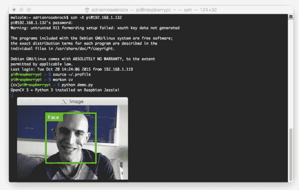

# 如何在 Raspbian Jessie 上安装 OpenCV 3

> 原文：<https://pyimagesearch.com/2015/10/26/how-to-install-opencv-3-on-raspbian-jessie/>

几周前，Raspbian Jessie 发布了，[带来了大量新的、伟大的功能](https://www.raspberrypi.org/blog/raspbian-jessie-is-here/)。

然而，对 Jessie 的更新也打破了之前 Raspbian Wheezy 的 OpenCV + Python 安装说明:

*   [在 Raspbian Wheezy 上安装 OpenCV 2.4 与 Python 2.7 绑定。](https://pyimagesearch.com/2015/02/23/install-opencv-and-python-on-your-raspberry-pi-2-and-b/)
*   [在 Raspbian Wheezy 上安装带有 Python 2.7/Python 3+绑定的 OpenCV 3.0。](https://pyimagesearch.com/2015/07/27/installing-opencv-3-0-for-both-python-2-7-and-python-3-on-your-raspberry-pi-2/)

由于 PyImageSearch 已经成为在 Raspberry Pi 上学习计算机视觉+ OpenCV 的在线目的地,我决定写一个关于**在 Raspbian Jessie 上安装 OpenCV 3 和 Python 绑定的新教程。**

作为额外的奖励，**我还包含了一个*视频教程*** ，当我在我自己的运行 Raspbian Jessie 的 Raspberry Pi 2 上安装 OpenCV 3 时，你可以使用它来跟随我。

这个视频教程应该有助于解决第一次在 Raspberry Pi 上安装 OpenCV + Python 绑定时出现的最常见的问题、疑虑和陷阱。

## 假设

在本教程中，我假设你已经拥有一台 [Raspberry Pi 2](http://www.amazon.com/gp/product/B00G1PNG54/ref=as_li_tl?ie=UTF8&camp=1789&creative=390957&creativeASIN=B00G1PNG54&linkCode=as2&tag=trndingcom-20&linkId=ALHWRQ5K43RPQ4RX) 并安装了[Raspbian Jessie](https://www.raspberrypi.org/downloads/raspbian/)。除此之外，你应该有(1) *物理访问*到你的 Pi 2 并且可以打开一个终端，或者(2) *远程访问*在那里你可以 SSH 进入。我将通过 SSH 来完成本教程，但是只要您可以访问终端，这真的没有关系。

## 快速入门视频教程

在我们开始本教程之前，让我问你两个简单的问题:

1.  这是你第一次安装 OpenCV 吗？
2.  你是刚刚开始学习 Linux 和如何使用命令行吗？

如果你对这些问题中的任何一个回答了 ***是*** ，我*强烈建议*你观看下面的视频，并跟随我一步一步地指导你如何在运行 Raspbian Jessie 的 Raspberry Pi 2 上安装 OpenCV 3 和 Python 绑定:

<https://www.youtube.com/embed/YStdNJwcovY?feature=oembed>