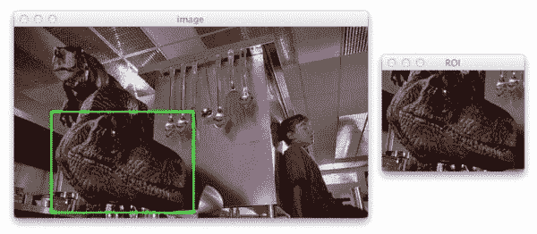

# 用 Python 和 OpenCV 捕捉鼠标点击事件

> 原文：<https://pyimagesearch.com/2015/03/09/capturing-mouse-click-events-with-python-and-opencv/>

在美国东海岸长大，我想我现在应该已经习惯了下雪——但我没有。小时候，我喜欢雪。我喜欢滑雪橇、滑雪和打雪仗。

但是现在，作为一个成年人，雪只是意味着不便。这意味着旅行将会很糟糕。意思是不能开车去健身房。这意味着被困在公寓里。

也就是说，我将在东海岸的这个下雪天写一篇关于用 Python 和 OpenCV 捕捉鼠标点击事件的博文。

<https://www.youtube.com/embed/OzxT3tsp1pI?feature=oembed>