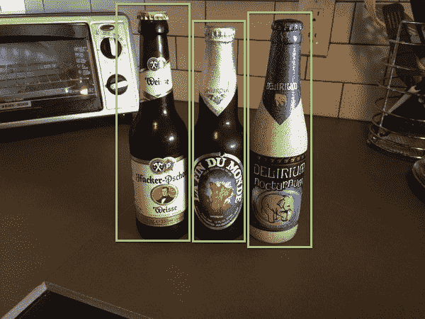
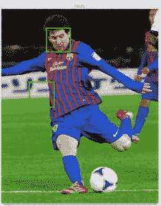
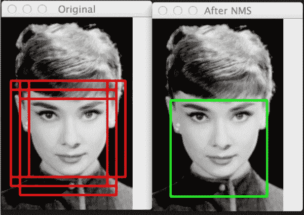

# 方向梯度直方图和目标检测

> 原文：<https://pyimagesearch.com/2014/11/10/histogram-oriented-gradients-object-detection/>

如果你最近一直关注我的 Twitter 账户，你可能已经注意到了我一直在做的[一个](https://twitter.com/PyImageSearch/status/523197501181272064)或[两个](https://twitter.com/PyImageSearch/status/523516653238484992)预告片——一个 Python 框架/包，使用方向梯度直方图和线性支持向量机快速构建对象检测器。

老实说，我真的无法忍受使用 OpenCV 提供的 Haar 级联分类器(即 Viola-Jones 检测器)——因此我正在开发自己的分类器套件。虽然级联方法非常快，但它们仍有许多不足之处。如果你曾经使用过 OpenCV 来检测人脸，你就会知道我在说什么。

**Figure 1:** Example of falsely detecting a face in an image. This is a common problem when using cv2.detectMultiScale.

为了检测 OpenCV 中的人脸/人/物体/任何东西(并消除误报)，您将花费大量时间调整`cv2.detectMultiScale`参数。同样，也不能保证图像与图像之间的参数完全相同。这使得批量处理大型数据集进行人脸检测成为一项乏味的任务，因为你会非常担心(1)错误地检测到人脸或(2)完全丢失人脸，这仅仅是因为每个图像的参数选择不当。

还有一个问题是维奥拉-琼斯探测器 ***已经接近 15 年了。*** 如果这台探测器是一瓶上好的赤霞珠葡萄酒，我现在可能会非常兴奋。但是从那以后，这个领域已经取得了实质性的进展*。*早在 2001 年，Viola-Jones 探测器就是最先进的，它们无疑是我们今天在物体探测方面取得令人难以置信的新进展的巨大推动力。

Viola-Jones 探测器并不是我们探测物体的唯一选择。我们使用关键点、局部不变描述符和视觉单词包模型进行对象检测。我们有方向梯度直方图。我们有可变形零件模型。模范模特。我们现在正在利用金字塔的深度学习来识别不同尺度的物体！

尽管如此，尽管用于对象识别的梯度方向直方图描述符已经有近十年的历史了，但它今天仍然被大量使用，并且产生了惊人的结果。Dalal 和 Triggs 在他们 2005 年的开创性论文 [*用于人体检测的定向梯度直方图*](http://lear.inrialpes.fr/people/triggs/pubs/Dalal-cvpr05.pdf) 中提出的定向梯度直方图方法证明了定向梯度直方图(HOG)图像描述符和线性支持向量机(SVM)可以用于训练高度精确的物体分类器，或者在他们的特定研究中，训练人体检测器。

# 方向梯度直方图和目标检测

我不打算回顾使用梯度方向直方图训练对象检测器的整个详细过程，因为每个步骤都相当详细。但我想花一分钟，详细说明使用梯度方向直方图训练对象检测器的一般算法。事情大概是这样的:

### 第一步:

Sample *P* 从您想要检测的对象的训练数据中提取阳性样本，并从这些样本中提取 HOG 描述符。

### 第二步:

样本 *N* 来自*负训练集*的负样本，该负训练集 ***不包含*** 任何你想要检测的对象，并从这些样本中提取 HOG 描述符。在实践中*N>p*

### 第三步:

在你的正负样本上训练一个线性支持向量机。

### 第四步:

**Figure 2:** Example of the sliding a window approach, where we slide a window from left-to-right and top-to-bottom. *Note: Only a single scale is shown. In practice this window would be applied to multiple scales of the image.*

**应用硬负挖掘。**对于每幅图像和负训练集中每幅图像的每种可能比例，应用滑动窗口技术，在图像上滑动窗口。在每个窗口计算你的 HOG 描述符并应用你的分类器。如果你的分类器(不正确地)将给定的窗口分类为一个对象(它会，绝对会有假阳性)，记录与假阳性补丁相关的特征向量以及分类的概率。**这种方法被称为*硬负开采。***

### 第五步:

获取在硬阴性挖掘阶段发现的假阳性样本，根据它们的置信度(即概率)对它们进行排序，并使用这些硬阴性样本重新训练您的分类器。(注意:你可以迭代地应用步骤 4-5，但是在实践中，一个阶段的硬负挖掘通常就足够了。在随后的硬负挖掘运行中，准确性的提高往往是最小的。)

### 第六步:

您的分类器现在已经训练好了，可以应用于您的测试数据集。同样，就像在步骤 4 中一样，对于测试集中的每个图像，以及图像的每个比例，应用滑动窗口技术。在每个窗口提取 HOG 描述符并应用你的分类器。如果你的分类器以足够大的概率检测到一个对象，记录窗口的边界框。扫描完图像后，应用非最大抑制来移除多余和重叠的边界框。

这些是需要的最少步骤，但是通过使用这 6 个步骤的过程，你可以训练和建立你自己的物体检测分类器！这种方法的扩展包括一个[可变形部件模型](http://cs.brown.edu/~pff/papers/lsvm-pami.pdf)和[样本支持向量机](http://www.cs.cmu.edu/~efros/exemplarsvm-iccv11.pdf)，在这里你为*的每个* *正实例*训练一个分类器，而不是它们的*集合。*

然而，如果你曾经处理过图像中的对象检测，你可能会遇到这样的问题:*检测图像中你想要检测的对象周围的多个* *边界框。*

这里有一个重叠边界框问题的例子:

**Figure 3:** *(Left)* Detecting multiple overlapping bounding boxes around the face we want to detect. *(Right)* Applying non-maximum suppression to remove the redundant bounding boxes.

注意左边*的*我们有 6 个重叠的边界框，它们正确地检测到了奥黛丽·赫本的脸。然而，这 6 个边界框都指向同一个面——我们需要一种方法来抑制该区域中 5 个最小的边界框，只保留最大的一个，如右边*的*所示。

这是一个常见的问题，不管你是使用基于 Viola-Jones 的方法还是遵循 Dalal-Triggs 的论文。

有多种方法可以解决这个问题。Triggs 等人建议使用 [Mean-Shift 算法](http://en.wikipedia.org/wiki/Mean-shift)通过利用包围盒的 *(x，y)* 坐标以及图像当前尺度的对数来检测包围盒空间中的多个模式。

我个人试过这种方法，对结果不满意。相反，你最好依靠一个*强分类器*和*更高的精确度*(意味着很少有假阳性)，然后对边界框应用非最大抑制。

我花了一些时间在 Python 中寻找一个好的非最大值抑制(有时称为非最大值抑制)实现。当我找不到的时候，我就和我的朋友 Tomasz Malisiewicz 博士聊天，他整个职业生涯都在研究物体探测器算法和猪描述符。在 T2，我知道没有人比托马斯在这方面更有经验。如果你读过他的论文，你就会知道为什么。他的工作棒极了。

反正跟他聊完之后，他给我指了两个 MATLAB 实现。第一部基于 [Felzenszwalb 等人](http://cs.brown.edu/~pff/)的作品。和它们的可变形部分模型。

第二种[方法](http://quantombone.blogspot.com/2011/08/blazing-fast-nmsm-from-exemplar-svm.html)由 Tomasz 自己为他的 [Exemplar SVM](https://github.com/quantombone/exemplarsvm) 项目实现，他在他的论文和他的 ICCV 2011 年论文[*Exemplar-SVMs 集合用于对象检测和超越*](http://www.cs.cmu.edu/~tmalisie/projects/iccv11/index.html) 。值得注意的是，Tomasz 的方法*比 Felzenszwalb 等人的方法*快 100 多倍。当您执行非最大抑制函数数百万次时，100 倍的加速非常重要。

我已经实现了 Felzenszwalb 等人和 Tomasz 等人的方法，并将它们从 MATLAB 移植到 Python。下周我们将从 Felzenszwalb 方法开始，然后下周我将介绍 Tomasz 的方法。虽然 Tomasz 的方法要快得多，但我认为看到这两种实现方式很重要，这样我们就能准确理解*为什么*他的方法获得如此大的加速。

一定要留下来看看这些帖子！这些绝对是构建你自己的物体探测器的关键步骤！

# 摘要

在这篇博文中，我们上了一堂关于物体探测器的历史课。我们还偷偷看了一眼我正在开发的用于图像中物体检测的 Python 框架。

从那里，我们快速回顾了如何结合线性 SVM 使用梯度方向直方图方法来训练鲁棒的对象检测器。

但是，无论您使用哪种对象检测方法，您都可能会在要检测的对象周围出现多个边界框。为了移除这些多余的盒子，你需要应用非最大抑制。

在接下来的两周里，我将向您展示非最大抑制的两种实现，您可以在自己的对象检测项目中使用它们。

请务必在下面的表格中输入您的电子邮件地址，以便在这些帖子发布时收到通知！非最大抑制对于使用 HOG 获得精确和鲁棒的对象检测系统是绝对关键的，所以你绝对不想错过这些帖子！