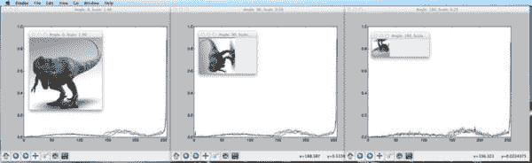

# 构建图像搜索引擎:定义图像描述符(第 1 步，共 4 步)

> 原文：<https://pyimagesearch.com/2014/02/03/building-an-image-search-engine-defining-your-image-descriptor-step-1-of-4/>

周一，我从头到尾向你展示了如何构建一个令人敬畏的指环王图片搜索引擎。这很有趣，我们学到了很多东西。我们使用了 OpenCV 图像描述符。更重要的是，我们要看看一些真实世界的代码，看看一个图像搜索引擎到底是如何构建的。

但是让我们后退一步。

在那篇博文中，我提到了构建图片搜索引擎的四个步骤:

1.  **定义您的描述符:**您将使用哪种类型的描述符？你描述的是图像的哪个方面？
2.  **索引您的数据集:**将您的描述符应用到数据集中的每个图像。
3.  **定义你的相似性度量:**你如何确定两幅图像有多“相似”？
4.  **搜索:**实际的搜索是如何进行的？如何将查询提交到您的图像搜索引擎？

虽然周一的帖子是一篇“让我们动手写点代码”类型的文章，但接下来的几篇博客帖子将会更上一层楼。但是如果你计划建立一个自己的图片搜索引擎，**这是你需要了解的四个步骤**。

今天我们将只关注第一步:**定义我们的图像描述符**。

我们将在接下来的几周内探索剩余的步骤。

# 定义您的图像描述符

在我们的*指环王*图像搜索引擎中，我们使用 3D 颜色直方图来表征每张图像的颜色。这个 OpenCV 图像描述符是一个全局图像描述符，并应用于整个图像。对于我们的数据集来说，3D 颜色直方图是一个很好的选择。我们从电影中利用的五个场景都有相对不同的颜色分布，因此颜色直方图更容易返回相关的结果。

当然，颜色直方图不是我们可以使用的唯一图像描述符。我们还可以利用一些方法来描述图像中物体的纹理和形状。

让我们来看看:

### **颜色**

正如我们已经看到的，颜色是描述图像的最基本的方面，也可以说是计算上最简单的。我们可以使用每个通道的像素强度的平均值、标准偏差和偏差来表征图像的颜色。我们也可以使用[颜色直方图](https://pyimagesearch.com/2014/01/22/clever-girl-a-guide-to-utilizing-color-histograms-for-computer-vision-and-image-search-engines/)，就像我们在其他博客文章中看到的那样。颜色直方图是应用于整个图像的全局图像描述符。

使用简单颜色方法的一个好处是，我们可以很容易地获得图像大小(比例)和方向(图像如何旋转)的不变性。

这怎么可能？

好吧，让我们来看看这个不同比例和方向的侏罗纪公园的霸王龙模型，以及从每个图像中提取的直方图。

**Figure 1:** No matter how we rotate and scale the T-Rex image, we still have the same histogram.

正如你所看到的，我们用不同的角度和比例因子来旋转和调整图像的大小。箱的数量沿 X 轴绘制，放置在每个箱中的像素百分比沿 Y 轴绘制。

在每种情况下，直方图都是相同的，因此表明颜色直方图不会随着图像的缩放和旋转而改变。

图像描述符的旋转和尺度不变性都是图像搜索引擎的期望属性。如果用户向我们的图像搜索引擎提交一个查询图像，系统应该找到相似的图像，*不管查询图像如何调整大小或旋转。当描述符对旋转和缩放等变化具有鲁棒性时，我们称它们为*不变量*，因为即使图像被旋转和缩放，描述符也是*不变量*(即不变)。*

### 纹理

纹理试图模拟图像中物体的感觉、外观和整体触觉质量；然而，纹理往往难以表现。例如，我们如何构建一个图像描述符来描述霸王龙的鳞片是“粗糙”还是“粗糙”？

大多数试图对纹理建模的方法检查的是灰度图像，而不是彩色图像。如果我们使用灰度图像，我们只需要一个像素强度的 *NxN* 矩阵。我们可以检查这些像素对，然后构建这样的像素对在彼此的 *X* 像素内出现的频率分布。这种类型的分布称为灰度共生矩阵(GLCM)。

一旦我们有了 GLCM，我们就可以计算统计数据，例如对比度、相关性和熵等等。

也存在其他纹理描述符，包括对灰度图像进行[傅立叶](http://en.wikipedia.org/wiki/Fourier_transform)或[小波](http://en.wikipedia.org/wiki/Wavelet_transform)变换，并检查变换后的系数。

最后，最近比较流行的纹理描述符之一，[梯度方向直方图](http://en.wikipedia.org/wiki/Histogram_of_oriented_gradients)，在图像中的人物检测中非常有用。

### 形状

当讨论形状时，我不是在讨论图像所表示的 NumPy 数组的形状(维度，根据宽度和高度)。相反，我说的是图像中特定物体的形状。

当使用形状描述符时，第一步通常是应用分割或边缘检测技术，使我们能够严格关注我们想要描述的形状的轮廓。然后，一旦我们有了轮廓，我们可以再次计算统计矩来表示形状。

让我们看一个使用皮卡丘图像的例子:

**Figure 2:** The image on the left is not suited for shape description. We first need to either perform edge detection (middle) or examine the countered, masked region (right).

在左边，我们有皮卡丘的全彩色图像。通常，我们不会用这种类型的图像来描述形状。相反，我们会将图像转换为灰度并执行边缘检测(中心)或利用皮卡丘的遮罩(即我们想要描述的图像的相关部分)。

OpenCV 提供了 [Hu 矩](http://en.wikipedia.org/wiki/Image_moment)方法，它被广泛用作简单的形状描述符。

在接下来的几周里，我将展示我们如何使用各种形状描述符来描述图像中物体的形状。

# 摘要

在这篇文章中，我们讨论了构建图像搜索引擎的第一步:选择图像描述符。我们需要检查我们的数据集，并决定我们要描述图像的哪些方面。执行搜索时，图像的颜色分布是否重要？图像中物体的纹理呢？还是外形？或者我们需要描述这三者的特征？

选择描述符只是第一步。下周，我们将探索如何将图像描述符应用到数据集中的每个图像。

# 下载:

你可以在这里下载代码和示例图片的. zip 文件。