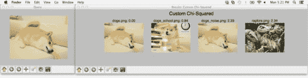
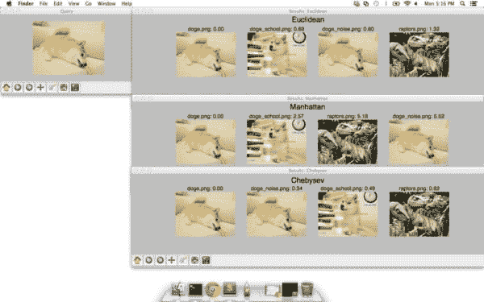

# How-To:使用 OpenCV 和 Python 比较直方图的 3 种方法

> 原文：<https://pyimagesearch.com/2014/07/14/3-ways-compare-histograms-using-opencv-python/>

[](https://pyimagesearch.com/wp-content/uploads/2014/06/custom_histogram_comp_methods.jpg)

所以你已经从一组图像中提取了颜色直方图…

但是你如何比较它们的相似性呢？

你需要一个距离函数来处理这个问题。

但是哪一个呢？你如何选择？如何使用 Python 和 OpenCV 比较直方图？

别担心，我会掩护你的。

在这篇博文中，我将向您展示使用 Python 和 OpenCV 比较直方图的三种不同方法，包括`cv2.compareHist`函数。

在这篇文章的结尾，你将会像专家一样比较直方图。

# 我们的示例数据集

[](https://pyimagesearch.com/wp-content/uploads/2014/06/queries.jpg)

**Figure 1:** Our test dataset of four images — two images of Doge, another with Gaussian noise added, and velociraptors, for good measure.

我们的示例数据集由四幅图像组成:两幅 Doge memes，第三幅 Doge 图像，但这次添加了高斯噪声，从而扭曲了图像，然后是迅猛龙。因为老实说，我不能写一篇不包括《侏罗纪公园》的博文。

在这些示例中，我们将使用左上角的图像作为我们的“查询”图像。我们将获取此图像，然后根据直方图距离函数对最“相似”的图像的数据集进行排序。

理想情况下，Doge 图像将出现在前三个结果中，表明它们与查询更“相似”，猛禽的照片放在底部，因为它在语义上最不相关。

然而，正如我们将会发现的那样，在左下方的 Doge 图像中添加高斯噪声会打乱我们的直方图比较方法。选择使用哪种直方图比较函数通常取决于(1)数据集的大小(2)以及数据集中图像的质量-您肯定希望进行一些实验并探索不同的距离函数，以感受哪种度量最适合您的应用。

说了这么多，让 Doge 教我们比较直方图。

多直方图。哇哦。我 OpenCV。很多计算机视觉，真的。

# 使用 OpenCV 和 Python 比较直方图的 3 种方法

```py
# import the necessary packages
from scipy.spatial import distance as dist
import matplotlib.pyplot as plt
import numpy as np
import argparse
import glob
import cv2

# construct the argument parser and parse the arguments
ap = argparse.ArgumentParser()
ap.add_argument("-d", "--dataset", required = True,
	help = "Path to the directory of images")
args = vars(ap.parse_args())

# initialize the index dictionary to store the image name
# and corresponding histograms and the images dictionary
# to store the images themselves
index = {}
images = {}

```

我们要做的第一件事是在**2-7**线导入我们需要的包。SciPy 的`distance`子包包含许多距离函数的实现，所以我们将用别名`dist`导入它，以使我们的代码更加简洁。

我们还将使用`matplotlib`来显示我们的结果，NumPy 用于一些数字处理，`argparse`用于解析命令行参数，`glob`用于获取图像数据集的路径，而`cv2`用于 OpenCV 绑定。

然后，**第 10-13 行**处理解析我们的命令行参数。我们只需要一个开关`--dataset`，它是包含我们的图像数据集的目录的路径。

最后，在**第 18 行和第 19 行**，我们初始化了两个字典。第一个是`index`，它存储从我们的数据集中提取的颜色直方图，文件名(假设是惟一的)作为键，直方图作为值。

第二个字典是`images`，它存储实际的图像本身。在展示我们的比较结果时，我们将使用这本词典。

现在，在我们开始比较直方图之前，我们首先需要从我们的数据集中*提取*直方图:

```py
# loop over the image paths
for imagePath in glob.glob(args["dataset"] + "/*.png"):
	# extract the image filename (assumed to be unique) and
	# load the image, updating the images dictionary
	filename = imagePath[imagePath.rfind("/") + 1:]
	image = cv2.imread(imagePath)
	images[filename] = cv2.cvtColor(image, cv2.COLOR_BGR2RGB)

	# extract a 3D RGB color histogram from the image,
	# using 8 bins per channel, normalize, and update
	# the index
	hist = cv2.calcHist([image], [0, 1, 2], None, [8, 8, 8],
		[0, 256, 0, 256, 0, 256])
	hist = cv2.normalize(hist, hist).flatten()
	index[filename] = hist

```

首先，我们利用`glob`抓取我们的图像路径，并开始在**行 22** 上循环。

然后，我们从路径中提取文件名，加载图像，然后将图像存储在第 25-27 行的`images`字典中。

记住，默认情况下，OpenCV 以 BGR 格式存储图像，而不是 RGB 格式。然而，我们将使用`matplotlib`来显示我们的结果，并且`matplotlib`假设图像是 RGB 格式的。为了解决这个问题，在第 27 行的**上对`cv2.cvtColor`做了一个简单的调用，将图像从 BGR 转换成 RGB。**

在**行 32** 上处理颜色直方图的计算。我们将提取一个每个通道有 8 个面元的 3D RGB 颜色直方图，在展平后产生一个 512 维的特征向量。直方图在**第 34 行**被归一化，并最终存储在**第 35 行**的索引字典中。

关于`cv2.calcHist`功能的更多细节，一定要看看我的[关于利用计算机视觉和图像搜索引擎的颜色直方图的指南](https://pyimagesearch.com/2014/01/22/clever-girl-a-guide-to-utilizing-color-histograms-for-computer-vision-and-image-search-engines/ "Clever Girl: A Guide to Utilizing Color Histograms for Computer Vision and Image Search Engines")。

现在我们已经为每张图像计算了直方图，让我们试着比较它们。

## 方法 1:使用 OpenCV cv2.compareHist 函数

也许不足为奇的是，OpenCV 有一个内置的方法来简化直方图的比较:`cv2.compareHist`。查看下面的函数签名:

`cv2.compareHist(H1, H2, method)`

`cv2.compareHist`函数有三个参数:`H1`，它是要比较的第一个直方图，`H2`，它是要比较的第二个直方图，`method`，它是一个标志，表示应该执行哪种比较方法。

`method`标志可以是以下任何一种:

现在是时候应用`cv2.compareHist`函数来比较我们的颜色直方图了:

```py
# METHOD #1: UTILIZING OPENCV
# initialize OpenCV methods for histogram comparison
OPENCV_METHODS = (
	("Correlation", cv2.HISTCMP_CORREL),
	("Chi-Squared", cv2.HISTCMP_CHISQR),
	("Intersection", cv2.HISTCMP_INTERSECT),
	("Hellinger", cv2.HISTCMP_BHATTACHARYYA))

# loop over the comparison methods
for (methodName, method) in OPENCV_METHODS:
	# initialize the results dictionary and the sort
	# direction
	results = {}
	reverse = False

	# if we are using the correlation or intersection
	# method, then sort the results in reverse order
	if methodName in ("Correlation", "Intersection"):
		reverse = True

```

**第 39-43 行**定义了我们的 OpenCV 直方图比较方法元组。我们将探索相关、卡方、交集和 Hellinger/Bhattacharyya 方法。

我们在第 46 行开始循环这些方法。

然后，我们在第 49 行的**上定义我们的`results`字典，使用图像的文件名作为关键字，使用它的相似性得分作为值。**

我想特别提请注意**线 50-55** 。我们首先将一个`reverse`变量初始化为`False`。该变量处理如何对`results`字典进行排序。对于一些相似性函数， ***较大的*** 值表示较高的相似性(相关性和交集)。而对于其他人来说， ***越小的*** 值表示相似性越高(卡方和海灵格)。

因此，我们需要对**线 54** 进行检查。如果我们的距离方法是相关或相交，我们的结果应该以相反的顺序排序。

现在，让我们比较一下直方图:

```py
	# loop over the index
	for (k, hist) in index.items():
		# compute the distance between the two histograms
		# using the method and update the results dictionary
		d = cv2.compareHist(index["doge.png"], hist, method)
		results[k] = d

	# sort the results
	results = sorted([(v, k) for (k, v) in results.items()], reverse = reverse)

```

我们从第 58 行的**开始循环我们的索引字典。**

然后，我们将 Doge 查询图像的颜色直方图(见上面图 1 左上角的图像)与**字典第 61 行**的当前颜色直方图进行比较。然后用距离值更新`results`字典。

最后，我们在第 65 行的**中将`results`排序。**

现在，让我们继续展示我们的结果:

```py
	# show the query image
	fig = plt.figure("Query")
	ax = fig.add_subplot(1, 1, 1)
	ax.imshow(images["doge.png"])
	plt.axis("off")

	# initialize the results figure
	fig = plt.figure("Results: %s" % (methodName))
	fig.suptitle(methodName, fontsize = 20)

	# loop over the results
	for (i, (v, k)) in enumerate(results):
		# show the result
		ax = fig.add_subplot(1, len(images), i + 1)
		ax.set_title("%s: %.2f" % (k, v))
		plt.imshow(images[k])
		plt.axis("off")

# show the OpenCV methods
plt.show()

```

我们首先在第 68-71 行创建我们的查询图。该图只是显示了我们的 Doge 查询图像，以供参考。

然后，我们在**第 74-83 行**为我们的每个 OpenCV 直方图比较方法创建一个图。这段代码相当简单明了。我们所做的就是循环第 78 行**上的`results`，并将与当前结果相关的图像添加到第 82** 行**上的图形中。**

最后，**行 86** 显示我们的数字。

执行时，您应该会看到以下结果:

[](https://pyimagesearch.com/wp-content/uploads/2014/06/opencv_histogram_comp_methods.jpg)

**Figure 2:** Comparing histograms using OpenCV, Python, and the `cv2.compareHist` function.

*l*eft 上的图像是我们最初的 Doge 查询。右边*的数字*包含我们的结果，分别使用相关、卡方、交集和海灵格距离进行排序。

对于每个距离度量，我们的原始 Doge 图像被放置在#1 结果位置-这是有意义的，因为我们正在使用我们的数据集中已经存在的图像作为查询。我们*期望*该图像位于#1 结果位置，因为该图像与其自身相同。如果这张图片不在结果的第一位，那么我们就会知道在我们的代码中可能有一个 bug！

然后我们看到 Doge school meme 在所有距离度量的结果中排名第二。

然而，将高斯噪声添加到原始 Doge 图像会损害性能。卡方距离似乎特别敏感。

这是否意味着不应使用卡方度量？

绝对不行！

实际上，您使用的相似性函数完全取决于您的数据集和应用程序的目标。 ***您将需要运行一些实验来确定最佳性能指标。***

接下来，让我们探索一些科学的距离函数。

## 方法 2:使用科学距离度量

使用 SciPy 距离函数和 OpenCV 方法的主要区别在于 OpenCV 中的方法是特定于*直方图的*。SciPy 则不是这样，它实现了更一般的距离函数。但是，它们仍然值得注意，您可以在自己的应用程序中使用它们。

让我们来看看代码:

```py
# METHOD #2: UTILIZING SCIPY
# initialize the scipy methods to compaute distances
SCIPY_METHODS = (
	("Euclidean", dist.euclidean),
	("Manhattan", dist.cityblock),
	("Chebysev", dist.chebyshev))

# loop over the comparison methods
for (methodName, method) in SCIPY_METHODS:
	# initialize the dictionary dictionary
	results = {}

	# loop over the index
	for (k, hist) in index.items():
		# compute the distance between the two histograms
		# using the method and update the results dictionary
		d = method(index["doge.png"], hist)
		results[k] = d

	# sort the results
	results = sorted([(v, k) for (k, v) in results.items()])

	# show the query image
	fig = plt.figure("Query")
	ax = fig.add_subplot(1, 1, 1)
	ax.imshow(images["doge.png"])
	plt.axis("off")

	# initialize the results figure
	fig = plt.figure("Results: %s" % (methodName))
	fig.suptitle(methodName, fontsize = 20)

	# loop over the results
	for (i, (v, k)) in enumerate(results):
		# show the result
		ax = fig.add_subplot(1, len(images), i + 1)
		ax.set_title("%s: %.2f" % (k, v))
		plt.imshow(images[k])
		plt.axis("off")

# show the SciPy methods
plt.show()

```

在第**行第 90-93** 行，我们定义了包含我们将要探索的科学距离函数的元组。

具体来说，我们将使用 ***欧几里得*** 距离、 ***曼哈顿*** (也称为城市街区)距离，以及 ***切比雪夫*** 距离。

从那以后，我们的代码与上面的 OpenCV 例子非常相似。

我们在**行 96** 上循环距离函数，在**行 101-108** 上执行排序，然后在**行 111-129** 上使用 matplotlib 呈现结果。

下图显示了我们的结果:

[](https://pyimagesearch.com/wp-content/uploads/2014/06/scipy_histogram_comp_methods.jpg)

**Figure 3:** Comparing histograms using the built-in SciPy distance metrics.

## 方法 3:自己总结相似性度量

比较直方图的第三种方法是“滚动自己的”相似性度量。我将自己的卡方距离函数定义如下:

```py
# METHOD #3: ROLL YOUR OWN
def chi2_distance(histA, histB, eps = 1e-10):
	# compute the chi-squared distance
	d = 0.5 * np.sum([((a - b) ** 2) / (a + b + eps)
		for (a, b) in zip(histA, histB)])

	# return the chi-squared distance
	return d

```

你可能会想，嘿，卡方距离不是已经在 OpenCV 中实现了吗？

是的。确实是。

但是 OpenCV 实现只取每个独立仓的平方差，除以第一个直方图的仓计数。

在我的实现中，我取每个箱计数的平方差，除以箱计数值的总和，这意味着箱中的较大差异应该贡献较小的权重。

从这里，我们可以将我的自定义卡方函数应用于图像:

```py
# initialize the results dictionary
results = {}

# loop over the index
for (k, hist) in index.items():
	# compute the distance between the two histograms
	# using the custom chi-squared method, then update
	# the results dictionary
	d = chi2_distance(index["doge.png"], hist)
	results[k] = d

# sort the results
results = sorted([(v, k) for (k, v) in results.items()])

# show the query image
fig = plt.figure("Query")
ax = fig.add_subplot(1, 1, 1)
ax.imshow(images["doge.png"])
plt.axis("off")

# initialize the results figure
fig = plt.figure("Results: Custom Chi-Squared")
fig.suptitle("Custom Chi-Squared", fontsize = 20)

# loop over the results
for (i, (v, k)) in enumerate(results):
	# show the result
	ax = fig.add_subplot(1, len(images), i + 1)
	ax.set_title("%s: %.2f" % (k, v))
	plt.imshow(images[k])
	plt.axis("off")

# show the custom method
plt.show()

```

这段代码现在应该感觉很标准了。

我们对`index`进行循环，并在**的第 144-152 行**对结果进行排序。然后我们在**第 155-173 行**展示结果。

下面是使用我的自定义卡方函数的输出:

[](https://pyimagesearch.com/wp-content/uploads/2014/06/custom_histogram_comp_methods.jpg)

**Figure 4:** Applying my custom Chi-Squared function to compare histograms.

花点时间比较一下上面的图 4 和图 2。具体来说，检查 OpenCV 卡方结果与我的自定义卡方函数——添加了噪声的 Doge 图像现在位于第三个结果位置，而不是第四个。

这是否意味着你应该使用我的实现而不是 OpenCV？

不，不是真的。

实际上，我的实现会比 OpenCV 慢得多，因为 OpenCV 是编译的 C/C++代码，比 Python 快。

但如果你需要滚动自己的距离功能，这是最好的办法。

请务必花时间进行一些实验，看看哪个距离函数适合您的应用。

# 摘要

在这篇博文中，我展示了使用 Python 和 OpenCV 比较直方图的三种方法。

第一种方式是使用 OpenCV 内置的`cv2.compareHist`函数。这个功能的好处是它的*极快*。请记住，OpenCV 是编译的 C/C++代码，与标准的普通 Python 相比，您的性能会有很大提高。

第二个好处是这个函数实现了四种适合比较直方图的距离方法，包括相关、卡方、交集和 Bhattacharyya/Hellinger。

但是，你被这些函数限制了。如果你想定制距离函数，你必须实现你自己的。

使用 OpenCV 和 Python 比较直方图的第二种方法是利用 SciPy 的`distance`子包中包含的距离度量。

然而，如果以上两种方法不是你所寻找的，你将不得不采取第三种方法，手动实现“滚动”距离函数。

希望这有助于您使用 OpenCV 和 Python 进行直方图比较！

如果你想聊更多关于直方图比较方法的内容，欢迎在下面留下评论或给我发电子邮件。

一定要注册下面的时事通讯，以获得我没有在这个博客上发表的精彩的独家内容！