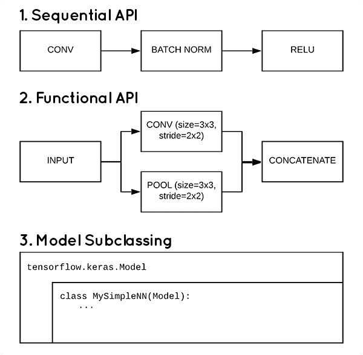
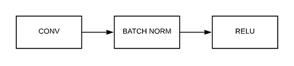
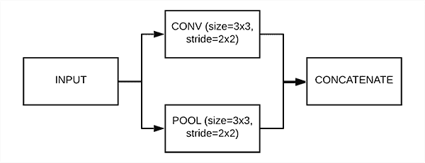
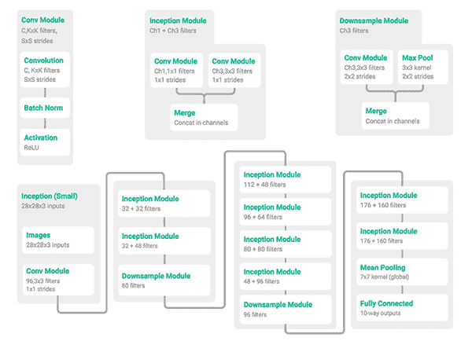
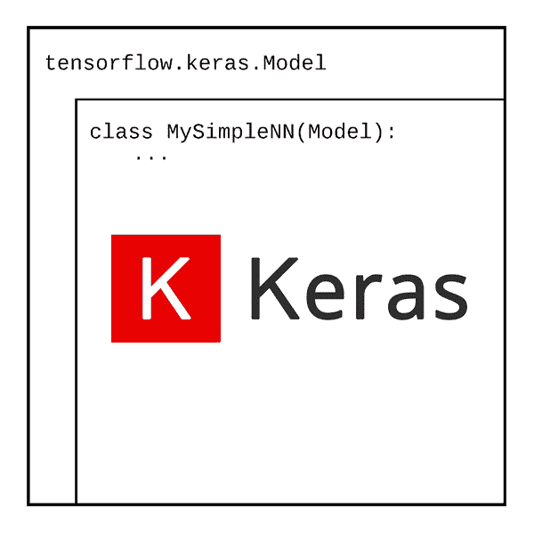
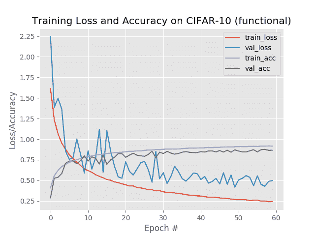
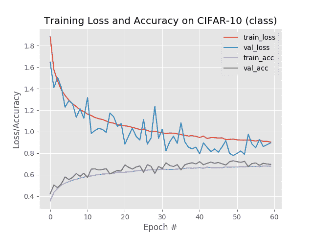

# 使用 TensorFlow 2.0 创建 Keras 模型的 3 种方法(顺序、函数和模型子类化)

> 原文：<https://pyimagesearch.com/2019/10/28/3-ways-to-create-a-keras-model-with-tensorflow-2-0-sequential-functional-and-model-subclassing/>

[](https://pyimagesearch.com/wp-content/uploads/2019/10/keras_3_model_types_header.png)

Keras 和 TensorFlow 2.0 为您提供了三种方法来实现您自己的神经网络架构:

1.  顺序 API
2.  功能 API
3.  模型子类化

在本教程中，您将学习如何利用这些方法，包括如何为工作选择正确的 API。

**要了解更多关于 Keras 和 TensorFlow 2.0 的顺序、函数和模型子类化的信息，*请继续阅读！***

## 使用 TensorFlow 2.0 创建 Keras 模型的 3 种方法(顺序、函数和模型子类化)

在本教程的前半部分，您将学习如何使用 Keras 和 TensorFlow 2.0 实现顺序、功能和模型子类化架构。然后，我将向您展示如何训练这些模型架构。

一旦我们的训练脚本被实现，我们将训练每个顺序的、功能的和子类化的模型，并检查结果。

此外，这里涵盖的所有代码示例都将与 Keras 和 TensorFlow 2.0 兼容。

### 项目结构

继续使用本教程的 ***“下载”*** 部分获取这篇文章的源代码。然后提取文件并使用`tree`命令检查目录内容:

```py
$ tree --dirsfirst
.
├── output
│   ├── class.png
│   ├── functional.png
│   └── sequential.png
├── pyimagesearch
│   ├── __init__.py
│   └── models.py
└── train.py

2 directories, 6 files

```

我们的`models.py`包含三个函数，分别使用顺序、函数和模型子类 API 来构建 Keras/TensorFlow 2.0 模型。

训练脚本`train.py`将根据所提供的命令行参数加载一个模型。该模型将在 CIFAR-10 数据集上进行训练。精度/损耗曲线图将输出到`output`目录下的`.png`文件中。

### 使用 Keras 和 TensorFlow 2.0 实现序列模型

[](https://pyimagesearch.com/wp-content/uploads/2019/10/keras_3_model_types_sequential.png)

**Figure 1:** The “Sequential API” is one of the 3 ways to create a Keras model with TensorFlow 2.0.

顾名思义，顺序模型允许您一步一步地一层一层地创建模型**。**

**Keras Sequential API** 是迄今为止最容易启动并运行 Keras 的方法，但它也是最受限制的——您*不能*创建这样的模型:

*   共享图层
*   有分支(至少不容易)
*   有多个输入
*   有多个输出

您可能已经使用或实施的开创性顺序体系结构的示例包括:

*   LeNet
*   AlexNet
*   VGGNet

让我们使用 TensorFlow 2.0 和 Keras 的顺序 API 实现一个基本的卷积神经网络。

打开项目结构中的`models.py`文件，插入以下代码:

```py
# import the necessary packages
from tensorflow.keras.models import Model
from tensorflow.keras.models import Sequential
from tensorflow.keras.layers import BatchNormalization
from tensorflow.keras.layers import AveragePooling2D
from tensorflow.keras.layers import MaxPooling2D
from tensorflow.keras.layers import Conv2D
from tensorflow.keras.layers import Activation
from tensorflow.keras.layers import Dropout
from tensorflow.keras.layers import Flatten
from tensorflow.keras.layers import Input
from tensorflow.keras.layers import Dense
from tensorflow.keras.layers import concatenate

```

注意我们在**2-13 行**的所有 Keras 进口是如何来自`tensorflow.keras`(也称为`tf.keras`)。

为了实现我们的顺序模型，我们需要第 3 行的**导入。现在让我们继续创建**序列模型**:**

```py
def shallownet_sequential(width, height, depth, classes):
	# initialize the model along with the input shape to be
	# "channels last" ordering
	model = Sequential()
	inputShape = (height, width, depth)

	# define the first (and only) CONV => RELU layer
	model.add(Conv2D(32, (3, 3), padding="same",
		input_shape=inputShape))
	model.add(Activation("relu"))

	# softmax classifier
	model.add(Flatten())
	model.add(Dense(classes))
	model.add(Activation("softmax"))

	# return the constructed network architecture
	return model

```

**第 15 行**定义了`shallownet_sequential`模型构建器方法。

注意在**的第 18** 行，我们将模型初始化为`Sequential`类的一个实例。然后我们将每一层添加到`Sequential`类中，一次一层。

ShallowNet 包含一个`CONV => RELU`层，后跟一个 softmax 分类器(**第 22-29 行**)。注意每一行代码，我们称之为`model.add`,用适当的构件组装 CNN。顺序很重要——你必须按照你想要插入层、标准化方法、softmax 分类器等的顺序调用`model.add`。

一旦你的模型拥有了你想要的所有组件，你就可以`return`这个对象，这样以后就可以编译它了。

**第 32 行**返回我们的顺序模型(我们将在我们的训练脚本中使用它)。

### 使用 Keras 和 TensorFlow 2.0 创建功能模型

[](https://pyimagesearch.com/wp-content/uploads/2019/10/keras_3_model_types_functional.png)

**Figure 2:** The “Functional API” is one of the 3 ways to create a Keras model with TensorFlow 2.0.

一旦你使用 Keras 的顺序 API 实现了一些基本的神经网络架构，你就会想要获得使用函数 API 的经验。

Keras 的函数式 API 易于使用，通常受到使用 Keras 深度学习库的大多数深度学习从业者的青睐。

**使用功能 API，您可以:**

*   创建更复杂的模型。
*   具有多个输入和多个输出。
*   轻松定义架构中的分支(例如初始块、ResNet 块等。).
*   设计有向无环图。
*   轻松共享架构内的层。

此外，*任何*顺序模型都可以使用 Keras 的 Functional API 实现。

具有功能特征(如层分支)的模型示例包括:

*   ResNet
*   谷歌网/盗梦空间
*   Xception
*   斯奎泽尼

为了获得使用 TensorFlow 2.0 和 Keras 的函数式 API 的经验，让我们实现一个 MiniGoogLeNet，它包括来自 Szegedy 等人的开创性的 [*用卷积*](https://arxiv.org/abs/1409.4842) 深入研究论文的初始模块的简化版本:

[](https://pyimagesearch.com/wp-content/uploads/2019/10/keras_3_model_types_minigooglenet.png)

**Figure 3:** The “Functional API” is the best way to implement GoogLeNet to create a Keras model with TensorFlow 2.0\. ([image source](https://arxiv.org/abs/1611.03530))

如您所见，MiniGoogLeNet 架构中有三个模块:

1.  `conv_module`:对输入体积执行卷积，利用批量标准化，然后应用 ReLU 激活。我们定义这个模块是出于*简单性*，并使其*可重用，*确保我们可以使用尽可能少的代码行在我们的架构内轻松应用“卷积块”，保持我们的实现整洁、有组织，并且更容易调试。
2.  `inception_module`:实例化两个`conv_module`对象。第一个 CONV 块应用 *1×1* 卷积，而第二个块使用“相同”填充执行 *3×3* 卷积，确保 *1×1* 和 *3×3* 卷积的输出音量大小相同。然后，输出音量沿着通道维度连接在一起。
3.  `downsample_module`:该模块负责缩小输入体积。与`inception_module`相似，这里使用了两个分支。第一分支执行 *3×3* 卷积，但是具有(1) *2×2* 步距和(2)“有效”填充，从而减小了音量大小。第二个分支应用 *3×3* 最大池，步长为 *2×2* 。两个分支的输出音量大小相同，因此它们可以沿通道轴连接在一起。

将这些模块中的每一个都想象成乐高——我们实现每种类型的乐高，然后以特定的方式将它们堆叠起来，以定义我们的模型架构。

乐高可以以近乎无限的可能性组织和组合在一起；然而，**既然形式定义功能，**我们就需要小心翼翼，考虑这些乐高积木应该如何组合在一起。

***注:**如果你想详细回顾 MiniGoogLeNet 架构内的每个模块，请务必参考 *[用 Python 进行计算机视觉的深度学习](https://pyimagesearch.com/deep-learning-computer-vision-python-book/)* ，在那里我会详细介绍它们。*

作为将我们的“乐高模块”拼凑在一起的一个例子，现在让我们开始实现 MiniGoogLeNet:

```py
def minigooglenet_functional(width, height, depth, classes):
	def conv_module(x, K, kX, kY, stride, chanDim, padding="same"):
		# define a CONV => BN => RELU pattern
		x = Conv2D(K, (kX, kY), strides=stride, padding=padding)(x)
		x = BatchNormalization(axis=chanDim)(x)
		x = Activation("relu")(x)

		# return the block
		return x

```

**第 34 行**定义了`minigooglenet_functional`模型构建器方法。

我们将定义三个可重用模块，它们是 GoogLeNet 架构的一部分:

*   `conv_module`
*   `inception_module`
*   `downsample_module`

请务必参考以上各项的详细说明。

像这样将模块定义为子功能允许我们*重用*结构并节省代码行，更不用说更容易阅读和修改了。

**第 35 行**定义了`conv_module`及其参数。最重要的参数是`x` —该模块的输入。其他参数传递给`Conv2D`和`BatchNormalization`。

**第 37-39 行**建立一组`CONV => BN => RELU`层。

请注意，每一行的开头以`x =`开始，结尾以`(x)`结束。这种风格是 Keras 函数式 API 的代表。层被附加到另一层，其中`x`作为后续层的输入。这种功能风格将贯穿整个`minigooglenet_functional`方法。

**第 42 行**将构建好的`conv_module`返回给调用者。

让我们创建由两个卷积模块组成的`inception_module`:

```py
	def inception_module(x, numK1x1, numK3x3, chanDim):
		# define two CONV modules, then concatenate across the
		# channel dimension
		conv_1x1 = conv_module(x, numK1x1, 1, 1, (1, 1), chanDim)
		conv_3x3 = conv_module(x, numK3x3, 3, 3, (1, 1), chanDim)
		x = concatenate([conv_1x1, conv_3x3], axis=chanDim)

		# return the block
		return x

```

**第 44 行**定义了我们的`inception_module`和参数。

初始模块包含*和`conv_module`的两个分支*，这两个分支连接在一起:

1.  在*第一分支*中，我们执行 *1×1* 卷积(**第 47 行**)。
2.  在*第二分支*中，我们执行 *3×3* 卷积(**第 48 行**)。

对**线 49** 上`concatenate`的调用将模块分支跨通道维度集合在一起。因为填充是两个分支的`“same”`,所以输出音量大小相等。因此，它们可以沿着信道维度连接起来。

第 51 行将`inception_module`块返回给调用者。

最后，我们将实现我们的`downsample_module`:

```py
	def downsample_module(x, K, chanDim):
		# define the CONV module and POOL, then concatenate
		# across the channel dimensions
		conv_3x3 = conv_module(x, K, 3, 3, (2, 2), chanDim,
			padding="valid")
		pool = MaxPooling2D((3, 3), strides=(2, 2))(x)
		x = concatenate([conv_3x3, pool], axis=chanDim)

		# return the block
		return x

```

**第 54 行**定义了我们的`downsample_module`和参数。下采样模块负责减小输入体积大小，它还利用了*两个分支*:

1.  *第一分支*执行 *3×3* 卷积与 *2×2* 步距(**行 57 和 58** )。
2.  *第二分支*以 *2×2* 步距(**第 59 行**)执行 *3×3* 最大拼版。

然后通过调用`concatenate` ( **第 60 行**)将分支的输出沿着通道维度堆叠。

第 63 行将下采样块返回给调用者。

定义了我们的每个模块后，我们现在可以使用它们来**构建使用功能 API 的整个 MiniGoogLeNet 架构:**

```py
	# initialize the input shape to be "channels last" and the
	# channels dimension itself
	inputShape = (height, width, depth)
	chanDim = -1

	# define the model input and first CONV module
	inputs = Input(shape=inputShape)
	x = conv_module(inputs, 96, 3, 3, (1, 1), chanDim)

	# two Inception modules followed by a downsample module
	x = inception_module(x, 32, 32, chanDim)
	x = inception_module(x, 32, 48, chanDim)
	x = downsample_module(x, 80, chanDim)

	# four Inception modules followed by a downsample module
	x = inception_module(x, 112, 48, chanDim)
	x = inception_module(x, 96, 64, chanDim)
	x = inception_module(x, 80, 80, chanDim)
	x = inception_module(x, 48, 96, chanDim)
	x = downsample_module(x, 96, chanDim)

	# two Inception modules followed by global POOL and dropout
	x = inception_module(x, 176, 160, chanDim)
	x = inception_module(x, 176, 160, chanDim)
	x = AveragePooling2D((7, 7))(x)
	x = Dropout(0.5)(x)

	# softmax classifier
	x = Flatten()(x)
	x = Dense(classes)(x)
	x = Activation("softmax")(x)

	# create the model
	model = Model(inputs, x, name="minigooglenet")

	# return the constructed network architecture
	return model

```

**第 67-71 行**设置我们的`inputs`到 CNN。

从那里，我们使用函数式 API 来组装我们的模型:

1.  首先，我们应用一个单独的`conv_module` ( **第 72 行**)。
2.  然后，在使用`downsample_module`减少体积大小之前，将两个`inception_module`模块堆叠在彼此的顶部。(**第 75-77 行**)。
3.  然后，在通过`downsample_module` ( **第 80-84 行**)减少卷大小之前，我们通过应用四个`inception_module`块来深化模块。
4.  然后，在应用平均池和构建完全连接的层头之前，我们再堆叠两个`inception_module`块(**行 87-90** )。
5.  然后应用 softmax 分类器(**第 93-95 行**)。
6.  最后，完整构造的`Model`被返回给调用函数(**第 98-101 行**)。

同样，请注意我们是如何使用函数式 API 与前一节中讨论的顺序式 API 进行比较的。

关于如何利用 Keras 的函数式 API 来实现您自己的定制模型架构的更详细的讨论，请务必参考我的书， *[用 Python 进行计算机视觉的深度学习](https://pyimagesearch.com/deep-learning-computer-vision-python-book/)* ，在那里我更详细地讨论了函数式 API。

此外，我要感谢张等人，他们在论文 [*中以一种美丽的可视化方式首次提出了 MiniGoogLeNet 架构，理解深度学习需要重新思考泛化*](https://arxiv.org/abs/1611.03530) 。

### 使用 Keras 和 TensorFlow 2.0 创建模型子类

[](https://pyimagesearch.com/wp-content/uploads/2019/10/keras_3_model_types_subclassing.png)

**Figure 4:** “Model Subclassing” is one of the 3 ways to create a Keras model with TensorFlow 2.0.

第三种也是最后一种使用 Keras 和 TensorFlow 2.0 实现模型架构的方法叫做**模型子类化。**

在 Keras 内部,`Model`类是用于定义模型架构的根类。由于 Keras 利用了面向对象编程，我们实际上可以*子类化*类，然后插入我们的架构定义。

模型子类化**是完全可定制的**，并且使你能够**实现你自己定制的模型前向传递**。

然而，这种灵活性和定制是有代价的——与顺序 API 或函数 API 相比，模型子类化更难利用。

那么，如果模型子类化方法如此难以使用，为什么还要费力去利用它呢？

奇特的架构或定制的层/模型实现，尤其是那些被研究人员利用的实现，如果不是不可能的话，使用标准的顺序或功能 API 来实现可能会非常具有挑战性(T2)。

相反，研究人员希望能够控制网络和训练过程的每一个细微差别——这正是模型子类化为他们提供的。

让我们看一个实现 MiniVGGNet 的简单例子，它是一个顺序模型，但是被转换成了一个**模型子类:**

```py
class MiniVGGNetModel(Model):
	def __init__(self, classes, chanDim=-1):
		# call the parent constructor
		super(MiniVGGNetModel, self).__init__()

		# initialize the layers in the first (CONV => RELU) * 2 => POOL
		# layer set
		self.conv1A = Conv2D(32, (3, 3), padding="same")
		self.act1A = Activation("relu")
		self.bn1A = BatchNormalization(axis=chanDim)
		self.conv1B = Conv2D(32, (3, 3), padding="same")
		self.act1B = Activation("relu")
		self.bn1B = BatchNormalization(axis=chanDim)
		self.pool1 = MaxPooling2D(pool_size=(2, 2))

		# initialize the layers in the second (CONV => RELU) * 2 => POOL
		# layer set
		self.conv2A = Conv2D(32, (3, 3), padding="same")
		self.act2A = Activation("relu")
		self.bn2A = BatchNormalization(axis=chanDim)
		self.conv2B = Conv2D(32, (3, 3), padding="same")
		self.act2B = Activation("relu")
		self.bn2B = BatchNormalization(axis=chanDim)
		self.pool2 = MaxPooling2D(pool_size=(2, 2))

		# initialize the layers in our fully-connected layer set
		self.flatten = Flatten()
		self.dense3 = Dense(512)
		self.act3 = Activation("relu")
		self.bn3 = BatchNormalization()
		self.do3 = Dropout(0.5)

		# initialize the layers in the softmax classifier layer set
		self.dense4 = Dense(classes)
		self.softmax = Activation("softmax")

```

**第 103 行**定义了我们的`MiniVGGNetModel`类，后面是**第 104 行**定义了我们的构造函数。

**第 106 行**使用`super`关键字调用我们的父构造函数。

从那里，我们的层被定义为实例属性，每个都有自己的名字(**第 110-137 行**)。Python 中的属性使用`self`关键字，并且通常(但不总是)在构造函数中定义。现在让我们来回顾一下:

*   第`(CONV => RELU) * 2 => POOL`层集合(**第 110-116 行**)。
*   第二`(CONV => RELU) * 2 => POOL`层集合(**第 120-126 行**)。
*   我们的全连接网络头(`Dense`)带有`"softmax"`分类器(**线 129-138** )。

**注意每一层是如何在构造函数中定义的*——这是故意的！***

假设我们有自己的自定义层实现，它执行一种特殊类型的卷积或池化。该层可以在`MiniVGGNetModel`中的其他地方定义，然后在构造函数中实例化。

一旦定义了我们的 Keras 层和自定义实现层，我们就可以在用于执行前向传递的`call`函数中定义网络拓扑/图形:

```py
	def call(self, inputs):
		# build the first (CONV => RELU) * 2 => POOL layer set
		x = self.conv1A(inputs)
		x = self.act1A(x)
		x = self.bn1A(x)
		x = self.conv1B(x)
		x = self.act1B(x)
		x = self.bn1B(x)
		x = self.pool1(x)

		# build the second (CONV => RELU) * 2 => POOL layer set
		x = self.conv2A(x)
		x = self.act2A(x)
		x = self.bn2A(x)
		x = self.conv2B(x)
		x = self.act2B(x)
		x = self.bn2B(x)
		x = self.pool2(x)

		# build our FC layer set
		x = self.flatten(x)
		x = self.dense3(x)
		x = self.act3(x)
		x = self.bn3(x)
		x = self.do3(x)

		# build the softmax classifier
		x = self.dense4(x)
		x = self.softmax(x)

		# return the constructed model
		return x

```

注意这个模型本质上是一个序列模型；然而，我们可以很容易地定义一个具有多个输入/输出、分支等的模型。

大多数深度学习从业者不会必须使用模型子类化方法，但只要知道如果你需要它，它是可用的！

### 实施培训脚本

我们的三个模型架构都实现了，但是我们要如何训练它们呢？

答案就在`train.py`里面——我们来看看:

```py
# set the matplotlib backend so figures can be saved in the background
import matplotlib
matplotlib.use("Agg")

# there seems to be an issue with TensorFlow 2.0 throwing non-critical
# warnings regarding gradients when using the model sub-classing
# feature -- I found that by setting the logging level I can suppress
# the warnings from showing up (likely won't be required in future
# releases of TensorFlow)
import logging
logging.getLogger("tensorflow").setLevel(logging.CRITICAL)

# import the necessary packages
from pyimagesearch.models import MiniVGGNetModel
from pyimagesearch.models import minigooglenet_functional
from pyimagesearch.models import shallownet_sequential
from sklearn.preprocessing import LabelBinarizer
from sklearn.metrics import classification_report
from tensorflow.keras.preprocessing.image import ImageDataGenerator
from tensorflow.keras.optimizers import SGD
from tensorflow.keras.datasets import cifar10
import matplotlib.pyplot as plt
import numpy as np
import argparse

```

**第 2-24 行**导入我们的包:

*   对于`matplotlib`，我们将后端设置为`"Agg"`，这样我们就可以将我们的绘图作为`.png`文件(**第 2 行和第 3 行**)导出到磁盘。
*   我们导入`logging`并将日志级别设置为忽略除关键错误之外的任何内容(**第 10 行和第 11 行**)。TensorFlow 在使用 Keras 的模型子类化功能训练模型时报告了(不相关的)警告消息，因此我更新了日志记录，只报告关键消息。*我认为警告本身是 TensorFlow 2.0 中的一个错误，在下一个版本中可能会被删除。*
*   我们 CNN 的三款都是进口的:(1) `MiniVGGNetModel`、(2) `minigooglenet_functional`、(3)`shallownet_sequential`(**14-16 行**)。
*   我们导入我们的 CIFAR-10 数据集(**第 21 行**)。

从这里开始，我们将继续解析[命令行参数](https://pyimagesearch.com/2018/03/12/python-argparse-command-line-arguments/):

```py
# construct the argument parser and parse the arguments
ap = argparse.ArgumentParser()
ap.add_argument("-m", "--model", type=str, default="sequential",
	choices=["sequential", "functional", "class"],
	help="type of model architecture")
ap.add_argument("-p", "--plot", type=str, required=True,
	help="path to output plot file")
args = vars(ap.parse_args())

```

我们的两个命令行参数包括:

*   `--model`:必须使用以下`choices=["sequential", "functional", "class"]`之一来使用 Keras 的 API 加载我们的模型。
*   `--plot`:输出绘图图像文件的路径。你可以像我一样将你的图保存在`output/`目录中。

从这里，我们将(1)初始化一些超参数，(2)准备我们的数据，以及(3)构造我们的数据扩充对象:

```py
# initialize the initial learning rate, batch size, and number of
# epochs to train for
INIT_LR = 1e-2
BATCH_SIZE = 128
NUM_EPOCHS = 60

# initialize the label names for the CIFAR-10 dataset
labelNames = ["airplane", "automobile", "bird", "cat", "deer", "dog",
	"frog", "horse", "ship", "truck"]

# load the CIFAR-10 dataset
print("[INFO] loading CIFAR-10 dataset...")
((trainX, trainY), (testX, testY)) = cifar10.load_data()

# scale the data to the range [0, 1]
trainX = trainX.astype("float32") / 255.0
testX = testX.astype("float32") / 255.0

# convert the labels from integers to vectors
lb = LabelBinarizer()
trainY = lb.fit_transform(trainY)
testY = lb.transform(testY)

# construct the image generator for data augmentation
aug = ImageDataGenerator(rotation_range=18, zoom_range=0.15,
	width_shift_range=0.2, height_shift_range=0.2, shear_range=0.15,
	 horizontal_flip=True, fill_mode="nearest")

```

在这个代码块中，我们:

*   初始化(1)学习率，(2)批量大小，以及(3)训练时期数(**第 37-39 行**)。
*   设置 CIFAR-10 数据集`labelNames`，加载数据集，并对其进行预处理(**第 42-51 行**)。
*   将我们的标签二进制化(**第 54-56 行**)。
*   用随机旋转、缩放、移动、剪切和翻转的设置实例化我们的[数据扩充](https://pyimagesearch.com/2019/07/08/keras-imagedatagenerator-and-data-augmentation/)对象(**第 59-61 行**)。

**脚本的核心在下一个代码块中，我们在这里实例化我们的模型:**

```py
# check to see if we are using a Keras Sequential model
if args["model"] == "sequential":
	# instantiate a Keras Sequential model
	print("[INFO] using sequential model...")
	model = shallownet_sequential(32, 32, 3, len(labelNames))

# check to see if we are using a Keras Functional model
elif args["model"] == "functional":
	# instantiate a Keras Functional model
	print("[INFO] using functional model...")
	model = minigooglenet_functional(32, 32, 3, len(labelNames))

# check to see if we are using a Keras Model class
elif args["model"] == "class":
	# instantiate a Keras Model sub-class model
	print("[INFO] using model sub-classing...")
	model = MiniVGGNetModel(len(labelNames))

```

在这里，我们**检查我们的顺序、功能或模型子类化架构是否应该被实例化。**在基于命令行参数的`if/elif`语句之后，我们初始化适当的`model`。

从那里，我们准备好编译模型并适合我们的数据:

```py
# initialize the optimizer and compile the model
opt = SGD(lr=INIT_LR, momentum=0.9, decay=INIT_LR / NUM_EPOCHS)
print("[INFO] training network...")
model.compile(loss="categorical_crossentropy", optimizer=opt,
	metrics=["accuracy"])

# train the network
H = model.fit_generator(
	aug.flow(trainX, trainY, batch_size=BATCH_SIZE),
	validation_data=(testX, testY),
	steps_per_epoch=trainX.shape[0] // BATCH_SIZE,
	epochs=NUM_EPOCHS,
	verbose=1)

```

我们所有的模型都是用随机梯度下降(`SGD`)和学习率衰减(**第 82-85 行**)编译的。

**第 88-93 行**开始使用 Keras 的`.fit_generator`方法处理数据扩充的培训。你可以[在这篇文章](https://pyimagesearch.com/2018/12/24/how-to-use-keras-fit-and-fit_generator-a-hands-on-tutorial/)中深入了解`.fit_generator`方法。

最后，我们将评估我们的模型并绘制培训历史:

```py
# evaluate the network
print("[INFO] evaluating network...")
predictions = model.predict(testX, batch_size=BATCH_SIZE)
print(classification_report(testY.argmax(axis=1),
	predictions.argmax(axis=1), target_names=labelNames))

# determine the number of epochs and then construct the plot title
N = np.arange(0, NUM_EPOCHS)
title = "Training Loss and Accuracy on CIFAR-10 ({})".format(
	args["model"])

# plot the training loss and accuracy
plt.style.use("ggplot")
plt.figure()
plt.plot(N, H.history["loss"], label="train_loss")
plt.plot(N, H.history["val_loss"], label="val_loss")
plt.plot(N, H.history["accuracy"], label="train_acc")
plt.plot(N, H.history["val_accuracy"], label="val_acc")
plt.title(title)
plt.xlabel("Epoch #")
plt.ylabel("Loss/Accuracy")
plt.legend()
plt.savefig(args["plot"])

```

**第 97-99 行**对测试集进行预测并评估网络。分类报告被打印到终端。

**第 102-117 行**绘制了训练精度/损失曲线，并将该图输出到磁盘。

### Keras 顺序模型结果

我们现在准备使用 Keras 和 TensorFlow 2.0 来训练我们的序列模型！

现在花点时间使用本教程的 ***【下载】*** 部分下载本指南的源代码。

从那里，打开一个终端并执行以下命令来训练和评估顺序模型:

```py
$ python train.py --model sequential --plot output/sequential.png
[INFO] loading CIFAR-10 dataset...
[INFO] using sequential model...
[INFO] training network...
Epoch 1/60
390/390 [==============================] - 25s 63ms/step - loss: 1.9162 - accuracy: 0.3165 - val_loss: 1.6599 - val_accuracy: 0.4163
Epoch 2/60
390/390 [==============================] - 24s 61ms/step - loss: 1.7170 - accuracy: 0.3849 - val_loss: 1.5639 - val_accuracy: 0.4471
Epoch 3/60
390/390 [==============================] - 23s 59ms/step - loss: 1.6499 - accuracy: 0.4093 - val_loss: 1.5228 - val_accuracy: 0.4668
...
Epoch 58/60
390/390 [==============================] - 24s 61ms/step - loss: 1.3343 - accuracy: 0.5299 - val_loss: 1.2767 - val_accuracy: 0.5655
Epoch 59/60
390/390 [==============================] - 24s 61ms/step - loss: 1.3276 - accuracy: 0.5334 - val_loss: 1.2461 - val_accuracy: 0.5755
Epoch 60/60
390/390 [==============================] - 24s 61ms/step - loss: 1.3280 - accuracy: 0.5342 - val_loss: 1.2555 - val_accuracy: 0.5715
[INFO] evaluating network...
              precision    recall  f1-score   support   

    airplane       0.73      0.52      0.60      1000   
  automobile       0.62      0.80      0.70      1000   
        bird       0.58      0.30      0.40      1000   
         cat       0.51      0.24      0.32      1000   
        deer       0.69      0.32      0.43      1000   
         dog       0.53      0.51      0.52      1000   
        frog       0.47      0.84      0.60      1000   
       horse       0.55      0.73      0.62      1000   
        ship       0.69      0.69      0.69      1000   
       truck       0.52      0.77      0.62      1000   

    accuracy                           0.57     10000   
   macro avg       0.59      0.57      0.55     10000   
weighted avg       0.59      0.57      0.55     10000

```

[](https://pyimagesearch.com/wp-content/uploads/2019/10/sequential.png)

**Figure 5:** Using TensorFlow 2.0’s Keras Sequential API (one of the 3 ways to create a Keras model with TensorFlow 2.0), we have trained ShallowNet on CIFAR-10.

在这里，我们在 CIFAR-10 数据集上获得了 59%的准确率。

查看**图 5** 中的训练历史图，我们注意到，在几乎整个训练过程中，我们的[验证损失小于我们的训练损失](https://pyimagesearch.com/2019/10/14/why-is-my-validation-loss-lower-than-my-training-loss/)—我们可以通过增加模型复杂性来提高我们的准确性，这正是我们将在下一节中做的。

### Keras 功能模型结果

我们的功能模型实现比我们的顺序示例更深入、更复杂。

同样，确保您已经使用本指南的 ***【下载】*** 部分下载了源代码。

有了源代码后，执行以下命令来训练我们的功能模型:

```py
$ python train.py --model functional --plot output/functional.png
[INFO] loading CIFAR-10 dataset...
[INFO] using functional model...
[INFO] training network...
Epoch 1/60
390/390 [==============================] - 69s 178ms/step - loss: 1.6112 - accuracy: 0.4091 - val_loss: 2.2448 - val_accuracy: 0.2866
Epoch 2/60
390/390 [==============================] - 60s 153ms/step - loss: 1.2376 - accuracy: 0.5550 - val_loss: 1.3850 - val_accuracy: 0.5259
Epoch 3/60
390/390 [==============================] - 59s 151ms/step - loss: 1.0665 - accuracy: 0.6203 - val_loss: 1.4964 - val_accuracy: 0.5370
...
Epoch 58/60
390/390 [==============================] - 59s 151ms/step - loss: 0.2498 - accuracy: 0.9141 - val_loss: 0.4282 - val_accuracy: 0.8756
Epoch 59/60
390/390 [==============================] - 58s 149ms/step - loss: 0.2398 - accuracy: 0.9184 - val_loss: 0.4874 - val_accuracy: 0.8643
Epoch 60/60
390/390 [==============================] - 61s 156ms/step - loss: 0.2442 - accuracy: 0.9155 - val_loss: 0.4981 - val_accuracy: 0.8649
[INFO] evaluating network...
              precision    recall  f1-score   support

    airplane       0.94      0.84      0.89      1000
  automobile       0.95      0.94      0.94      1000
        bird       0.70      0.92      0.80      1000
         cat       0.85      0.64      0.73      1000
        deer       0.77      0.92      0.84      1000
         dog       0.91      0.70      0.79      1000
        frog       0.88      0.94      0.91      1000
       horse       0.95      0.85      0.90      1000
        ship       0.89      0.96      0.92      1000
       truck       0.89      0.95      0.92      1000

    accuracy                           0.86     10000
   macro avg       0.87      0.86      0.86     10000
weighted avg       0.87      0.86      0.86     10000

```

[](https://pyimagesearch.com/wp-content/uploads/2019/10/functional.png)

**Figure 6:** Using TensorFlow 2.0’s Keras Functional API (one of the 3 ways to create a Keras model with TensorFlow 2.0), we have trained MiniGoogLeNet on CIFAR-10.

这一次，我们已经能够将我们的准确率一路提高到 87%！

### Keras 模型子类化结果

我们最后的实验评估了使用 Keras 的模型子类化的实现。

我们在这里使用的模型是 VGGNet 的一个变体，这是一个本质上连续的模型，由 *3×3* CONVs 和 *2×2* max-pooling 组成，用于减少卷维度。

我们在这里使用 Keras 模型子类化(而不是顺序 API)作为一个简单的例子，说明如何将现有的模型转换成子类化的架构。

***注意:**为模型子类化 API 实现你自己的定制层类型和训练程序超出了这篇文章的范围，但是我会在以后的指南中介绍它。*

要查看 Keras 模型子类化的运行情况，请确保您已经使用了本指南的 ***“下载”*** 部分来获取代码——从那里您可以执行以下命令:

```py
$ python train.py --model class --plot output/class.png
[INFO] loading CIFAR-10 dataset...
[INFO] using model sub-classing...
[INFO] training network...
Epoch 1/60
Epoch 58/60
390/390 [==============================] - 30s 77ms/step - loss: 0.9100 - accuracy: 0.6799 - val_loss: 0.8620 - val_accuracy: 0.7057
Epoch 59/60
390/390 [==============================] - 30s 77ms/step - loss: 0.9100 - accuracy: 0.6792 - val_loss: 0.8783 - val_accuracy: 0.6995
Epoch 60/60
390/390 [==============================] - 30s 77ms/step - loss: 0.9036 - accuracy: 0.6785 - val_loss: 0.8960 - val_accuracy: 0.6955
[INFO] evaluating network...
              precision    recall  f1-score   support

    airplane       0.76      0.77      0.77      1000
  automobile       0.80      0.90      0.85      1000
        bird       0.81      0.46      0.59      1000
         cat       0.63      0.36      0.46      1000
        deer       0.68      0.57      0.62      1000
         dog       0.78      0.45      0.57      1000
        frog       0.45      0.96      0.62      1000
       horse       0.74      0.81      0.77      1000
        ship       0.90      0.79      0.84      1000
       truck       0.73      0.89      0.80      1000

    accuracy                           0.70     10000
   macro avg       0.73      0.70      0.69     10000
weighted avg       0.73      0.70      0.69     10000

```

[](https://pyimagesearch.com/wp-content/uploads/2019/10/class.png)

**Figure 7:** Using TensorFlow 2.0’s Keras Subclassing (one of the 3 ways to create a Keras model with TensorFlow 2.0), we have trained MiniVGGNet on CIFAR-10.

在这里，我们获得了 73%的准确率，没有我们的 MiniGoogLeNet 实现那么好，但是它仍然是一个如何使用 Keras 的模型子类化特性来实现架构的例子。

**一般情况下，*我不推荐*使用 Keras 的模型子类:**

*   比较难用。
*   它增加了代码的复杂性
*   更难调试。

**…但是*确实*给了你对模型的完全控制权。**

通常，我只推荐你使用 Keras 的模型子类化，如果你是:

*   深度学习研究员实现定制层、模型和训练程序。
*   深度学习实践者试图复制一个研究人员/论文的结果。

大多数深度学习实践者不需要 Keras 的模型子类化功能。

总结

在本教程中，您学习了使用 Keras 和 TensorFlow 2.0 实现神经网络架构的三种方法:

*   **顺序:**用于实现简单的逐层架构，没有多输入、多输出或层分支。通常是开始使用 Keras 时使用的第一个模型 API。
*   **功能:**最流行的 Keras 模型实现 API。允许顺序 API 中的一切，但也有助于*实质上*更复杂的架构，其中包括多个输入和输出、分支等。最棒的是，Keras 的功能 API 的语法是*干净*和*易于使用*。
*   **模型子类化:**当深度学习研究者/实践者需要*完全控制*模型、层和训练过程实现时使用。代码冗长，更难编写，更难调试。大多数深度学习实践者不需要使用 Keras 对模型进行子类化，但如果你在做研究或定制实现，*如果你需要，模型子类化就在那里！*

如果您有兴趣了解更多关于顺序、函数和模型子类化 API 的信息，请务必参考我的书， *[使用 Python 的计算机视觉深度学习](https://pyimagesearch.com/deep-learning-computer-vision-python-book/)* ，在那里我会更详细地介绍它们。

我希望你喜欢今天的教程！

**要下载这篇文章的源代码，并在 PyImageSearch 上发布未来教程时得到通知，*只需在下面的表格中输入您的电子邮件地址！***