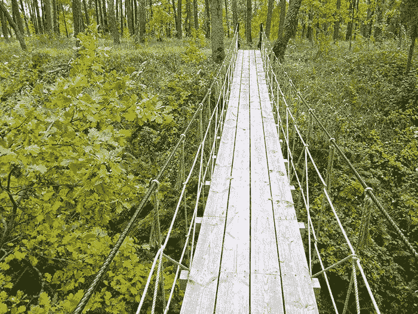

# 谷歌视频人工智能研究员胡格恩斯·让访谈

> 原文：<https://pyimagesearch.com/2020/09/02/an-interview-with-huguens-jean-video-ai-researcher-at-google/>

在这篇文章中，我采访了我以前的 UMBC 实验室伙伴胡格恩斯·吉恩博士，他刚刚被谷歌视频人工智能小组聘为人工智能研究员。

胡格恩斯分享了他的励志故事，从他出生和长大的海地太子港开始，到他在 UMBC 的学校教育，以及现在他在谷歌的最新职位。

他还分享了他的人道主义努力的细节，他成功地将计算机视觉和深度学习应用到卢旺达农村，以帮助计算客流量。

他和他的团队通过客流量分析收集的数据被用于帮助一个非营利组织建设桥梁和道路等基础设施，以更好地连接撒哈拉以南非洲的村庄。

让我们热烈欢迎胡格恩斯·让博士分享他的故事。

## 谷歌视频人工智能研究员胡格恩斯·让博士访谈

阿德里安:你好，胡格人！谢谢你接受这次采访。非常高兴您能来到 PyImageSearch 博客。

胡格恩斯:很高兴和你在一起。

* * *

阿德里安:你能介绍一下你自己吗？你在哪里上学，是如何对计算机视觉产生兴趣的？

胡格恩派教徒:我来自海地的太子港。我去了圣路易学院，冈萨格。

2010 年海地地震后，我和 UMBC 大学的校友 Philip Knowlton 一起拍摄了一部非常亲密的纪录片。这部电影讲述了两兄弟信守对祖父的承诺的故事。在这本书里，我更多地谈论了我的家人和在海地的生活。

当我 1997 年来到美国时，我去了霍华德高中。蔻驰·大卫·格伦向我介绍了跳高。我被 UMBC 的蔻驰·吉姆·弗洛格纳和蔻驰·大卫·鲍勃招募了。这让我在 UMBC 大学学习了计算机工程和电子工程。

我读研期间在 NASA 工作。2010 年海地地震后，我进入了私营部门，开始做软件工程师。我想这场悲剧让我不再相信我的导师们想获得博士学位的愿景。

一天，UMBC 研究生院院长珍妮特·拉特利奇博士带我出去吃午饭。她说:“你让我看起来很糟糕。”我辞掉了工作，去看蒂姆·奥茨医生。我们赢得了一些研究资金，我最终在 2015 年获得了博士学位。

我不相信我能做到，直到我去了坦桑尼亚。我在伯克利大学读过匡辰的研究。他的作品激励了我。在 Captricity，我和他一起写了一份关于分析数字图像内容的专利，毕业后我在加州奥克兰住了大约 3 年。

* * *

阿德里安:你最近在[谷歌的视频人工智能部门](https://cloud.google.com/video-intelligence)获得了一个职位，祝贺你！你是怎么得到这么好的机会的？

胡格恩斯:我重新联系了两年前的招聘人员。在谷歌第一次失败后，人们需要等待一年才能再次尝试。两年前我尝试过，但没有成功。我在纽约办公室面试，我的表现不是很好。我知道它会进去。

但 6 周前，我是另一个工程师。我对计算机科学有不同的感受。面试前，我拼命学习了大约两个星期。

我按照他们的指导，专注于真正了解数据结构，比如列表、堆栈、队列、树、堆、图和 trie。我练习了像 DFS、BFS、A*和排序这样的算法。我想做好一切准备。对于计算机视觉和数据科学部分，我从你那里学到了很多。

* * *

阿德里安:我们都知道谷歌因挑战性面试而在*臭名昭著*。计算机视觉/深度学习工作的面试过程是怎样的？

如你所说，这是出了名的困难。一周内，我做了 7 次技术面试。一天 5 次视频采访和两次技术展示，一次在谷歌，另一次在脸书。

在谷歌，我同时面试两个职位:机器学习通才和数据科学职位。对于机器学习通才的角色，前两次面试是关于数据结构的。用数据结构解决问题需要练习。你必须快速思考，避免过度思考解决方案。我不是最好的应试者，在没有运行代码的情况下，在谷歌文档中解决这些问题是很伤脑筋的。

第三次面试是在谷歌上。第四次和第五次面试是关于计算机视觉的。这是因为我的招聘人员提出了一个特殊的要求，以确保我有公平的机会展示我在机器学习方面的优势。领域广阔。

有太多的东西需要了解，谷歌已经准备好询问 NLP 和强化学习。我在这些领域不是很强。

对于数据科学的角色，经过技术筛选，Google 觉得我会更适合他们的视频 AI 组。

* * *

**Adrian:** 在谷歌工作之前，你参与了一些令人难以置信的人道主义工作，这些工作在撒哈拉以南非洲的农村地区使用了计算机视觉和深度学习技术。你能告诉我们关于这个项目，以及你是如何提交一篇关于这个主题的论文发表的吗？

一名研究人员雇佣了 Synaptiq 来进行这个项目。 [Synaptiq.ai](https://www.synaptiq.ai/) 归蒂姆·奥茨博士所有。作为 UMBC 大学的博士生，他给你和我都提了建议。

我需要离女儿近一点，而在马里兰州当地工作提供了合适的机会。奥茨博士需要一个 OCR 项目的人，我开始在那里做顾问。蒂姆和我过去做过类似的研究。

我在那里的工作最终引导我做了这个项目。他在撒哈拉以南的非洲农村架设了摄像机来观察行人过桥。

**Figure 4:** An example pedestrian footbridge in Subsaharan Africa.

起初，研究人员试图使用你的代码对[人计数](https://pyimagesearch.com/2018/08/13/opencv-people-counter/)，但在该教程中，预先训练的 MobileNet SSD 用于检测物体的性能很差。在 Synaptiq 的帮助下，我们能够在 GPU 上将探测器升级到 YOLOv3，并使用 DeepSort 加强质心跟踪器。

***注:*** *最初我曾收录了一张展示胡格恩派和研究团队工作的图；然而，该团队要求我在他们的论文正式发表之前记下这个数字。*

在我们的论文中引用这两个教程确实是一种荣誉。在 GPU 上使用这些新模型，我们能够及时地从数小时的视频中提取有意义的信息。

* * *

**Adrian:** 在你的农村人流计数器项目中，最困难的方面是什么，为什么？

即使在 GPU 机器上，为了收集数据而处理数小时的视频也需要很长时间。我的合同快到期了，我们需要一个 NVIDIA docker 容器，它可以在 RTX2080 计算机(也就是 UMBC 的 Synaptiq 机器)上自动运行几个小时剩余镜头的代码。就在那时，蒂姆和我们的另一个共同朋友祖贝尔·艾哈迈德冲过了终点线。

* * *

阿德里安:如果你必须选择你在研究过程中应用的最重要的技术，那会是什么？

胡格恩斯:如果你在谈论计算机科学技术，递归胜出。但如果你在谈论计算机视觉和机器学习，聚类运动向量是一个很好的方法。

* * *

**Adrian:** 你平时用什么深度学习/计算机视觉工具和库？哪些是你的最爱？

**胡格恩斯:**我用了很多 OpenCV。这是迄今为止我最喜欢的计算机视觉 Python 库。通过深度学习，我又一次从你们身上学到了很多。我是 Keras 和 Tensorflow 的超级粉丝。

* * *

**Adrian:** 你会给想进行计算机视觉/深度学习研究但不知道如何入门的人什么建议？

**胡格恩斯:**读完研究生后，我自己也不确定从哪里开始，直到[从 PyImageSearch](https://pyimagesearch.com/books-and-courses/) 购买了大量资料，并开始关注你的博客。我们边做边学。你在你的书里说过。那不是谎言。

如果你想真正擅长某件事，你必须练习。我像运动员一样思考。关于学习新的东西，我试着比前一天做得更多。我的心灵不像我的身体那样疼痛。我一天都不用翘课。我上 LinkedIn 或脸书，搜索一个引人注目的知识库，或者一些令人惊叹的技术/书籍，然后阅读。

* * *

**Adrian:** 你是 PyImageSearch 的长期读者和客户，已经阅读了用 Python 编写的 *[用于计算机视觉的深度学习](https://pyimagesearch.com/deep-learning-computer-vision-python-book/)* 、 *[用于计算机视觉的树莓派](https://pyimagesearch.com/raspberry-pi-for-computer-vision/)* ，并参加了 [PyImageSearch 大师课程](https://pyimagesearch.com/pyimagesearch-gurus/)。这些书籍和课程对你的职业生涯有什么帮助？

胡格恩派教徒:他们给了我很大的帮助。就像我的朋友，Jezette 工作室的首席执行官 Salette Thimot-Campos 在脸书上写道:

> 消除疑虑的唯一方法是通过教育。我学得越多，就越觉得自己强大，越觉得自己与这个世界联系紧密。4 年前，我在探索一些我从未想过自己有任何业务需要探究的话题。但是现在，随着我对每一个技术术语和功能的理解和掌握，我感到越来越强大和勇敢。

我对你的书和博客的体验与她的话相呼应。博士学位只会提醒我，我一直都很优秀，足以学习任何东西。

我不知道你是否记得蔡福森教授。他和蒂姆一起给我出主意。他会说*【广度和深度】*。对我来说，这通常意味着对一件事知道很多，对每件事都知道一点。他鼓励我永远保持好奇心。

除了为你的读者提供评论良好的代码之外，你还有一种创造性的方式来解释事情，很多时候是通过图片和视频。我等待你的下一个博客，就像等待下一部 iPhone，因为我不知道会发生什么。有时候我很忙，但每周一早上，我至少会努力去回忆你做了什么。你永远不知道在哪里会再次看到类似的想法。

* * *

**Adrian:** 您会向其他试图学习计算机视觉和深度学习的开发人员、学生和研究人员推荐使用 PythonT5、*[Raspberry Pi for Computer Vision](https://pyimagesearch.com/raspberry-pi-for-computer-vision/)*和 [PyImageSearch Gurus 课程](https://pyimagesearch.com/pyimagesearch-gurus/)的*？*

**胡格恩派:**绝对。像电影《T4 空手道小子》中的*上蜡，下蜡*一样学习基本原理。我不得不在 Linux 上多次安装 OpenCV。为 GPU 机器做，需要耐心。训练深度学习模型需要耐心，但体验其中的魔力是值得的。

* * *

阿德里安:如果有人想追随你的脚步，学习计算机视觉和深度学习，然后在谷歌找到一份令人惊叹的工作，你有什么建议吗？

胡格恩斯:我鼓励人们把他们的教育当成一种运动，一种精神上的运动，就像国际象棋一样，并且永远向比你年长和年轻的人学习。练习。练习。为月亮练习和射击。

* * *

Adrian: 如果一个 PyImageSearch 的读者想聊天，最好在哪里联系你？

**胡格恩派:**他们可以在 [LinkedIn](https://www.linkedin.com/in/huguens-jean-b82186b4/) 上关注我，在[me@huguensjean.com](mailto:me@huguensjean.com)给我发电子邮件，或者在 [huguensjean.ai](https://huguensjean.ai/) 查看我的网站。

## 摘要

在这篇博文中，我们采访了谷歌视频 AI 小组的人工智能研究员胡格恩斯·让博士。

我和胡格恩斯在 UMBC 大学读研时是实验室的同事。从那以后我们就成了朋友(他甚至参加了我的婚礼)。

分享胡格恩斯的作品真的是一种荣誉——他真的改变了世界。

如果你想成功地将计算机视觉和深度学习应用到现实世界的项目中(就像胡格恩斯所做的那样)，一定要拿起一本用 Python 编写的 *[用于计算机视觉的深度学习。](https://pyimagesearch.com/deep-learning-computer-vision-python-book/)*

使用本书，您可以:

1.  成功地将深度学习和计算机视觉应用到您自己的工作项目中
2.  转换职业，在一家受人尊敬的公司/组织获得一个简历/DL 职位
3.  获得完成理学硕士或博士学位所需的知识
4.  进行值得在著名期刊和会议上发表的研究
5.  周末完成你的业余爱好 CV/DL 项目

我希望你能加入我，Huguens Jean 博士，以及成千上万的其他 PyImageSearch 的读者，他们不仅掌握了计算机视觉和深度学习，而且利用这些知识改变了他们的生活。

我们在另一边见。

**在 PyImageSearch 上发布未来的博客文章和采访时，我们会通知您，*只需在下面的表格中输入您的电子邮件地址，*，我会确保让您随时了解情况。**