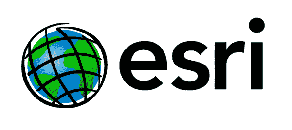
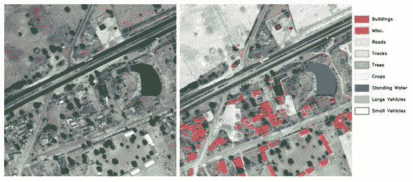
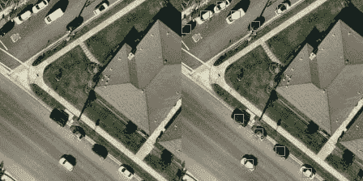
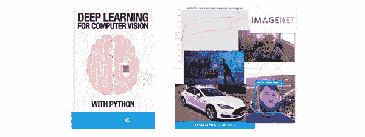

# R&D Esri 数据科学家 Kapil Varshney 访谈

> 原文：<https://pyimagesearch.com/2019/08/12/an-interview-with-kapil-varshney-data-scientist-at-esri-rd/>

在今天的博客文章中，我采访了一位 PyImageSearch 读者 Kapil Varshney，他最近被 Esri 研发中心聘为数据科学家，专注于计算机视觉和深度学习。

Kapil 的故事非常重要，因为它表明，无论你的背景如何，你*都可以*在计算机视觉和深度学习方面取得成功——***你只需要首先接受正确的教育！***

你看，Kapil 是 PyImageSearch 的长期读者，去年用 Python (DL4CV)阅读了 [*用于计算机视觉的深度学习。*](https://pyimagesearch.com/deep-learning-computer-vision-python-book/)

在阅读 DL4CV 后不久，Kapil 参加了由 Esri 赞助的一项挑战，即**检测和定位卫星图像中的物体**(包括汽车、游泳池等。).

他在 53 名参赛者中名列第三。

Esri 对 Kapil 的工作印象深刻，以至于比赛结束后他们叫他去面试。

Kapil 通过了面试，并被 Esri 研究院& D. 全职聘用

他在 Esri 的卫星图像分析工作现在每天影响着全球数百万人，这是他辛勤工作的真实证明。

我非常喜欢 Kapil(更不用说，作为一名 PyImageSearch 读者，我为他感到非常自豪)。

让我们热烈欢迎 Kapil 分享他的故事。在面试过程中，你将了解到**你如何跟随他的脚步。**

## R&D Esri 数据科学家 Kapil Varshney 访谈

阿德里安:嗨，卡皮尔！谢谢你接受这次采访。很高兴您能来到 PyImageSearch 博客。

你好，阿德里安！谢谢你邀请我上 PyImageSearch 博客。很荣幸。我关注这个博客已经有一段时间了，并从中学到了很多。

* * *

**Figure 1:** Kapil works as a Data Scientist at Esri R&D in New Delhi. He applies Computer Vision and Deep Learning to satellite image analysis.

阿德里安:介绍一下你自己，你在哪里工作，你的工作是什么？

目前，我作为一名数据科学家在 Esri 研发中心(T2)工作。我的大部分工作都集中在应用于卫星和航空图像的计算机视觉和深度学习上。但是，我有过不同的职业生涯。

我喜欢称自己为从火箭科学家转变为数据科学家。我在伊利诺伊大学香槟分校学习航空航天工程。在过去的几年里，我做过航天设计工程师、营销经理、教师，也尝试过创业。

* * *

**Adrian:** 你最初是如何对计算机视觉和深度学习产生兴趣的？

**Kapil:** 它首先从分析开始。当我意识到基本分析的力量时，我开始在我的初创公司应用它。后来，随着我在这个领域的深入研究，我发现了机器学习，然后是深度学习，这最终将我引向了计算机视觉应用。我是一个视觉型的人。当我看到和想象事物时，我记得更清楚，而且我有更好的视觉回忆。你能让计算机像人类一样“看”和推断的想法天生就让我兴奋。

* * *

**Figure 2:** Satellite image analysis with deep learning ([image source](http://www.aimechanic.com/2017/04/13/d424-satellite-imagery-deep-learning-via-image-segmentation/)).

**Adrian:** 让我们投入到你参加的 [Esri 航拍影像竞赛](https://www.hackerearth.com/challenges/hiring/esri-data-science-challenge-2019/)中。比赛的目标是什么，是什么让比赛如此具有挑战性？

Esri 最近举办了一场比赛，目标是在美国城市居民区的航空影像中识别汽车和游泳池。可用的数据集包括 3748 个 *224×224* 像素的图像芯片。主要挑战是:

1.  可用的有限数据集
2.  低分辨率图像
3.  被探测的物体(尤其是汽车)的尺寸非常小

* * *

**Figure 3:** *Left:* Input image captured from satellite. *Right:* Output of applying the RetinaNet object detector to detect and localize vehicles in the image.

**Adrian:** 告诉我们你获得第三名的解决方案。你用了什么算法和技术？

**Kapil:** 我用 RetinaNet 解决了这个问题。RetinaNet 是一个最先进的对象检测模型，非常适合小对象。它采用特征金字塔网络和焦点损失来提供很好的结果。

我使用了 RetinaNet 的 TensorFlow/Keras 实现，这是你在简历书的[深度学习中使用过的。](https://pyimagesearch.com/deep-learning-computer-vision-python-book/)

我对锚箱的比例和比率做了一点试验，以改善结果，最终得到了 77.99 的地图，这使我在比赛中获得了第三名。本部分的顶部显示了一个应用于其中一个芯片的检测示例。原始图像在左侧的*处，右侧*的*处的图像带有用绿色方框标记的车辆检测。*

* * *

**Adrian:** 在你获得第三名后，Esri 叫你去面试。你能告诉我们这个过程吗？它是什么样的？

比赛结束后，我收到一封来自 Esri 的电子邮件，要求下周在新德里安排一次面对面的面试。有两轮面试——一轮是采访新德里研发中心的总经理[罗希特·辛格](https://www.esri.com/arcgis-blog/author/rsinghesri-com/)，另一轮是采访 ArcGIS Enterprise 的首席技术官[杰伊·西奥多](https://www.esri.com/about/newsroom/author/jtheodore/)。

面试包括围绕我对挑战的解决方案、我的非传统背景以及许多关于计算机视觉和深度学习的技术问题的讨论。几天后，人力资源部又进行了一次简短的电话面试，几周后，我得到了肯定的答复。

* * *

阿德里安:你现在在 Esri 的研发团队&工作，恭喜你！从参加计算机视觉挑战赛到被公司录用，你有什么感受？那一定很棒！

**Kapil:** 谢谢。的确，这是一种奇妙的感觉。

我参加 Esri 挑战赛更多的是作为一个项目而不是竞赛，几个月后，我在新德里的 Esri R&D 中心全职工作。

我开始研究卫星/航空图像和空间数据，这结合了我对地理、GIS、航空航天技术、视觉和深度学习的兴趣。成千上万的 Esri 用户将使用我正在研究的问题解决方案，这将直接或间接影响全球数百万人和我们的星球。

* * *

**Figure 4:** Kapil used the knowledge inside *Deep Learning for Computer Vision with Python* to help prepare himself for the Esri competition and interview.

**Adrian:**[*用 Python 进行计算机视觉的深度学习*](https://pyimagesearch.com/deep-learning-computer-vision-python-book/) (DL4CV)是如何为你准备/帮助你参加航拍影像比赛的？

**Kapil:**DL4CV 这本书是一个**巨大的资源，它不仅帮助我为 Esri 挑战赛和面试做好准备，*还帮助我过渡到计算机视觉专业人员的角色。***

我从你的书中了解了 RetinaNet(我在 Esri 比赛中使用的物体探测器)以及如何使用它。

此外，我在其他项目中也使用了很多从 DL4CV 中学到的东西。

* * *

**Adrian:** 你会向其他试图学习计算机视觉和深度学习的开发者、学生和研究人员推荐*用 Python 进行计算机视觉的深度学习*吗？

**Kapil:** 绝对！对于任何试图学习计算机视觉和深度学习的人来说，这是必不可少的。有很多资源，但你在书中和教程中采用的实用方法是惊人的。**仅仅谈论概念和理论是一回事，但在数据集上实际应用模型并用结构良好的代码实现它是学习者需要练习的。DL4CV 正好有助于这一点。**

我还想补充一下，用 Python 进行计算机视觉深度学习的*是 SenseHawk 的 CTO[Saideep Talari](https://pyimagesearch.com/2017/06/12/pyimagesearch-gurus-member-spotlight-saideep-talari/)向我推荐的。他是一个好朋友，在我的转变过程中一直引导着我。现在我已经成功过渡了，我可以毫无疑问地提出同样的建议。*

 ** * *

**Adrian:** 如果一个 PyImageSearch 的读者想聊天，联系你的最佳地点是哪里？

与我联系的最佳地点是 LinkedIn。以下是我个人资料的链接:

[https://www.linkedin.com/in/kapilvarshney14/](https://www.linkedin.com/in/kapilvarshney14/)

读者也可以关注我的博客:

[https://medium.com/@kapilvarshney](https://medium.com/@kapilvarshney)

再次感谢阿德里安，感谢你为你的书和教程所做的一切。你的作品帮助并激励了我，就像它激励了成千上万的其他读者一样。保持下去。

## 摘要

在这篇博文中，我们采访了计算机视觉和深度学习从业者 Kapil Varshney，他刚刚被聘为 Esri 在新德里的研发团队的一部分。

Kapil 是一个长期的 PyImageSearch 读者，他最近读完了我的书， [*用 Python 进行计算机视觉的深度学习。*](https://pyimagesearch.com/deep-learning-computer-vision-python-book/)

读完这本书后不久，他参加了由 Esri 赞助的物体探测比赛。

挑战？

检测和定位卫星图像中的对象，包括汽车、游泳池和其他对象。

Kapil **在 53 名参赛选手中名列第三，**比赛结束后不久， **Esri 为 Kapil 提供了一个全职职位。**

他的故事表明，你可以在计算机视觉和深度学习方面取得成功。你只需要:

1.  适当的教育
2.  自我激励和奉献

Kapil 两者都有，但你呢？

如果你想追随他的脚步，一定要拿起一本用 Python (DL4CV)编写的 *[计算机视觉深度学习。](https://pyimagesearch.com/deep-learning-computer-vision-python-book/)*

**使用 DL4CV 图书您可以:**

1.  获得完成理学硕士或博士学位所需的知识
2.  进行值得在期刊上发表的研究
3.  转换职业，在一家公司或机构获得一个简历或 DL 职位
4.  将深度学习和计算机视觉应用到您自己的工作项目中
5.  周末完成你的业余爱好 CV/DL 项目

我希望你能加入我、Kapil 和其他成千上万的 PyImageSearch 读者的行列，他们不仅掌握了计算机视觉和深度学习，还利用这些知识改变了他们的生活。

我们在另一边见。

**在 PyImageSearch 上发布未来的博客文章和采访时，我们会通知您，*请务必在下面的表格中输入您的电子邮件地址，*，我会让您随时了解情况。***