# PyImageConf 2018 概要

> 原文：<https://pyimagesearch.com/2018/10/01/pyimageconf-2018-recap/>

PyImageConf 2018，PyImageSearch 自己的计算机视觉和深度学习教育会议，于 8 月 26 日至 28 日在加利福尼亚州旧金山的 Regency Hyatt 举行。这是一次令人惊叹的会议*，根据与会者的反馈，这是一次巨大的成功。*

 *今天，我想总结一下这次会议，分享一些亮点，也许最重要的是，讨论一下这次会议进展顺利的方面……以及需要改进的地方，如果将来有 PyImageConf，我会采取不同的做法。

虽然今天的博文在一定程度上是一个回顾，但它(本质上)也是一封写给未来自己的信，提醒我应该加倍努力什么以及我可以做得更好。

我将使用我在 PyImageConf 上使用的相同开场白来开始这个摘要，当我走上舞台，介绍我自己和 Jeff Nova (PyImageConf 的共同主持人)时，然后说了以下内容:

> PyImageSearch 和现在的 PyImageConf，不是关于我的，而是关于你这个参与者和 PyImageSearch 的读者。这一切都是为了你。我可能是图片搜索的“代言人”，但你更重要。是你们成就了这个博客、书籍和课程，最重要的是，成就了这个社区。**感谢你们来到这里，感谢你们使这一切成为可能，感谢你们给我特权和荣誉来教你们。**

## PyImageConf 2018 概要

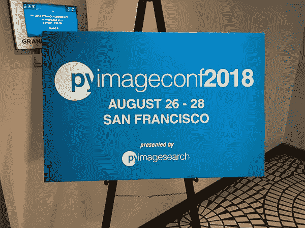

**Figure 1:** PyImageConf 2018 took place August 26-28th in San Francisco, CA. The three day event included talks, workshops, and evening receptions every night.

PyImageConf 的想法始于三年前，坦率地说，这甚至不是我的主意。

旧金山 Colorhythm 的所有者、PyImageSearch 大师杰夫·诺瓦(Jeff Nova)找到我，问我是否有兴趣做一次现场教学活动(杰夫可以使用一个能容纳 50 名学生的大教室)。

当时，这不是我能做的事。

我没有时间也没有心理承受能力。我已经超负荷了。也许像所有好主意一样，我们让它搁置了几年。

然后，去年 8 月，我打电话给杰夫，问他是否仍有兴趣举办一场面对面的活动，但要扩大规模，让我们举办一场真正的会议。

我知道我需要 Jeff 来完成这项活动，当他说*“是”*时，我们启动了 PyImageConf 2018。

我的目标是让 PyImageConf 保持小巧、私密和易于操作。

本质上，我希望 PyImageConf 成为我一直想参加的计算机视觉和深度学习会议。

我想把会议开得小而私密，最多 200 名与会者。

我*特意*将会议开得很小，以便与会者能够:

*   向演讲者和演示者学习
*   与计算机视觉和深度学习领域的专家进行一对一的交流
*   与同行和同事建立更好的关系网

最终，我认为保持会议的小规模是绝对正确的决定。

PyImageConf 与会者 Douglas Jones 在会后调查中分享了以下内容:

> 向 Adrian 和所有辛勤工作的人们致以最诚挚的谢意，感谢他们举办了我参加过的最好的会议。这是一个非常小而私密的会议，在这里你可以和演讲者交谈并提问。小型会议的另一大好处是，你有更多机会认识同修，分享想法、秘诀和窍门。很容易遇到一个人，他面临着同样的绊脚石，可以帮助你，或者你有一些经验可以分享。如果你错过了这个 PyImageConf，对不起，你真的错过了什么。如果还有，千万不要错过！

安德鲁·贝克也有类似的观点:

> 英伟达 GTC 可以是一个压倒性的经验，由于它的规模。PyImageConf 提供了近距离的体验。演示者让他们自己对与会者可用。PyImageConf 提供了进入 CV 和 DL 世界的途径。

一旦 PyImageConf 的愿景形成，就该联系演讲者和研讨会主持人了。

我的目标是将计算机视觉、深度学习教育领域的大腕们聚集在一起，为与会者提供尽可能好的现场实践培训和讲座——哇，这些演讲者太棒了:

*   **Fran ois Chollet:**作者 [Keras 深度学习库](https://keras.io/)。[谷歌](https://research.google.com/pubs/105096.html)深度学习和人工智能研究员。作品在 CVPR、日本、ICLR 等地出版。
*   **Katherine Scott:** 前[行星实验室](https://www.planet.com/)分析团队负责人。卫星图像分析专家。《T4》的合著者。
*   **戴维斯·金:**作者 [dlib 库](http://dlib.net/)。物体探测专家。十多年来，开源开发者和从业者一直在构建行业 CV 系统。
*   Satya Mallick:[learn openv](https://www.learnopencv.com/)的作者和创作者。人脸专家的计算机视觉。在 CV 和 ML 工作的企业家。
*   **约瑟夫·豪斯:**帕克特出版社出版的[六部计算机视觉/OpenCV 书籍的作者](https://nummist.com/opencv/)。通过他的公司 [Nummist Media](https://nummist.com/) 进行计算机视觉和咨询。增强现实、虚拟现实和红外计算机视觉系统方面的专家。
*   **亚当·盖特吉:***的作者[机器学习很有趣！](https://medium.com/@ageitgey/machine-learning-is-fun-80ea3ec3c471)*博客系列，领英学习，和 Lynda.com。喜欢用机器学习和计算机视觉来构建产品。
*   **Jeff Bass:** Raspberry Pi 黑客，计算机视觉从业者，计量经济学精灵，35 年统计学经验。
*   **Adrian rose Brock:**PyImageSearch.com 的作者和创造者， *[实用 Python 和 OpenCV](https://pyimagesearch.com/practical-python-opencv/)* ， *[PyImageSearch 大师](https://pyimagesearch.com/pyimagesearch-gurus/)* ， *[用 Python 进行计算机视觉的深度学习](https://pyimagesearch.com/deep-learning-computer-vision-python-book/)* 。计算机视觉企业家。

如果你在网上看到这些演讲者，*请*感谢他们为会议付出的时间和精力。没有它们，PyImageConf 是不可能的。

### 第一天——招待会

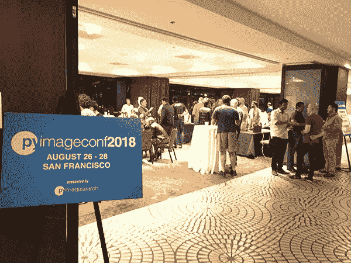

**Figure 2:** The PyImageConf 2018 reception, including an open bar and networking. Some attendees even brought their laptops to demo and share what they’ve created!

PyImageConf 2018 的第一天(或者说是晚上)是开幕酒会。

从下午 6:30 到 9:30，我们举办了一个长达三个小时的招待会，包括开放酒吧。

招待会的目的当然是欢迎与会者，但更重要的是，让与会者相互联系，建立关系。

我经常认为技术会议甚至学术会议缺少建立关系的方面——在许多方面，从长远来看，你与其他人建立的联系可能比技术内容更有价值。

一名研究生与雇主交谈，一名企业家与一名承包商交谈，或者一名研究人员与某个行业人士交谈，这些交谈都可能改变你的职业轨迹。永远不要忽视人际网络和与他人的联系。

PyImageConf 与会者 Mike Baum 分享了以下关于招待会的内容:

> 我认为你设立了晚间开放酒吧，所有的演讲者都出席并参与了非正式的讨论，这太棒了。我也喜欢晚上额外的时间和其他人交谈，了解他们在做什么，倾听他们的挑战，并为我的一些挑战收集想法。

对我个人来说，我真的很高兴能够面对面地与 PyImageSearch 的读者见面:

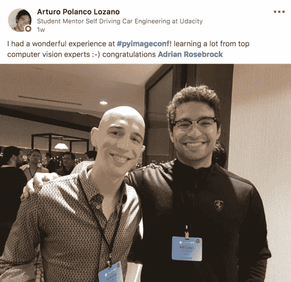

**Figure 3:** One of my favorite aspects of PyImageConf was being able to meet readers in person!

第一天也是演讲者晚宴。我，演讲者和研讨会主持人，以及他们的配偶在招待会完全开始前一起出去吃饭。

这真是一顿美妙的晚餐——与一些最聪明、最成功的计算机视觉和深度学习从业者、工程师和教育工作者围坐在一起是我真正珍惜的事情。没有这些演讲者，PyImageConf 是不可能的，所以如果你在网上看到他们，一定要感谢他们。

你可能还会惊讶地发现，我们的谈话并不总是围绕着 CV 和 DL！

虽然 CV 和 DL 可能让我们走到了一起，当然这也是我们在那个房间的原因，但我们也讨论了更多的个人问题，包括我们的生活，我们正在做什么，以及我们下一步希望做什么。

我知道我将永远记得的一次谈话是与我真正尊敬的演讲者杰夫·巴斯的谈话。

我认识杰夫有几年了。我们最初是通过 PyImageSearch Gurus 课程认识的。随着我对他的了解，我意识到他有着真正非凡的一生。他是一名飞行员，曾在越南服役，为安进公司工作多年，现在已经退休，正在建立自己的永久性农场。

这些年来，杰夫的故事和生活经历在很多方面帮助了我——这对我来说就是做人的真正意义——与一群有共同兴趣的人共处一室，但这种兴趣只是一个开始，它会给你带来巨大的帮助。

### 第二天——会谈

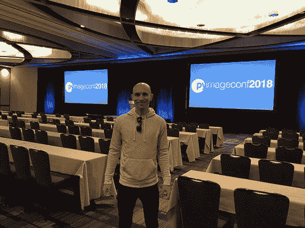

**Figure 4:** The grand ballroom at the Regency Hyatt was absolutely stunning. Here I am on Sunday, a few hours before the reception gets underway.

PyImageConf 的第二天，会谈在凯悦酒店的大宴会厅举行。

当我在前一天晚上看到舞厅时，我被震撼了——它非常漂亮，非常专业。

Adam Geitgey 以他关于使用深度学习的*图像分割*的演讲开始了会议，特别是 Mask R-CNN。

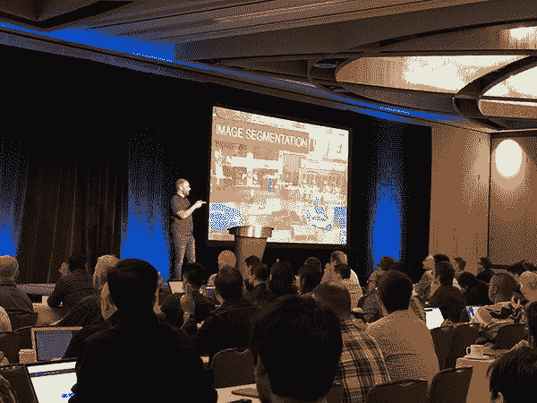

**Figure 5:** Adam Geitgey at PyImageConf 2018 giving his talk on *Image Segmentation*.

Adam 经历了整个语义分割管道，从分割如何不同于标准分类和对象检测开始，然后继续讨论如何注释您的训练数据，如何训练您的 Mask R-CNN，最后如何将其应用于您自己的图像。

**亚当的讲话是会议的*完美的*开场，他的讲话也为会议的其余部分定下了基调**——我们一起在那个舞厅里会学到很多东西。

Satya Mallick 的演讲*计算机视觉:现实世界应用*，讨论了他和他的团队使用计算机视觉算法处理和解决的实际应用。

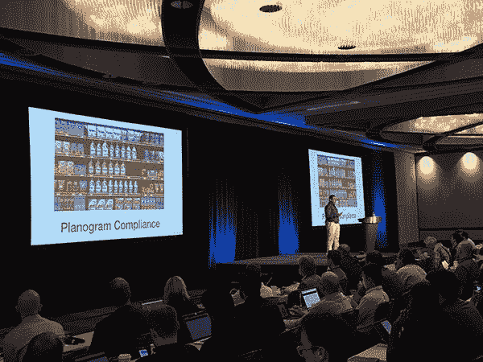

**Figure 6:** Satya Mallick, author of the LearnOpenCV blog and owner of Big Vision LLC, giving his talk on Computer Vision and Real-World Applications at PyImageConf 2018.

最重要的是，萨提亚还讨论了一些他必须应用的特殊技巧来有效地解决这些问题。

戴维斯·金随后上台发表了他的演讲,*训练和改进你的物体探测器。*

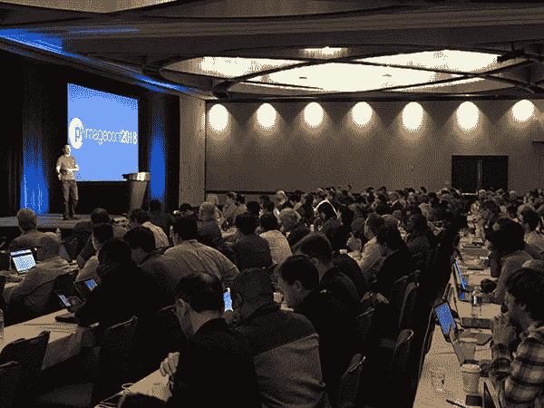

**Figure 7:** There wasn’t an empty seat in the house for Davis King’s object detection talk at PyImageConf 2018.

Davis 回顾了*整个*对象检测管道，从基础开始(即滑动窗口、图像金字塔)，逐步发展到 HOG +线性 SVM，最后是基于深度学习的对象检测器。

他的演讲不仅实用、信息丰富、有用，而且还很歇斯底里，包括许多有趣的妙语和来自实际计算机视觉项目的轶事。

然后我们停下来吃午饭，享受了一顿由凯悦酒店员工精心准备的美食。再一次，这是与会者相互交流和联系的绝佳时机。

午饭后，我们回到舞厅，杰夫·巴斯在那里讨论*阴阳牧场:用多台树莓派和苹果机构建分布式计算机视觉管道。*

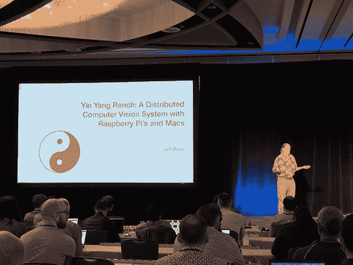

**Figure 8:** Jeff Bass discussing computer vision on the Raspberry Pi at PyImageConf 2018, including how we can build distributed computer vision systems.

Jeff 正在他的土地上建造一个永久性农场，他利用树莓 Pi 和计算机视觉来监控农场，包括:

*   读取水表读数，优化用水
*   数蜜蜂、蝴蝶和其他授粉者
*   追踪郊狼、兔子、浣熊和其他动物
*   监控车库门、谷仓门以及大门是开着还是关着
*   跟踪日照时间、日照强度、云量等。
*   监控非摄像头传感器，如温度、湿度、太阳能电池板输出等

杰夫的演讲确实很特别——他不仅讨论了计算机视觉技术，还详细介绍了如何将所有的部分粘在一起！

他甚至创建了自己的 Python 库，以便有效地将树莓 Pi 中的图像/帧共享回中心。

从 Jeff 的演讲中学到的技术帮助与会者构建他们自己的真实世界计算机视觉应用。

约瑟夫·豪斯接着杰夫做了一个关于可视化无形事物的演讲。

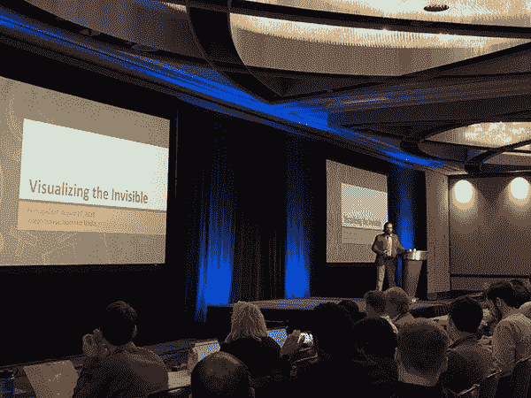

**Figure 9:** Joe Howse discussed the concept of “invisible markers” and the role they can play in computer vision and augmented reality.

我喜欢乔的演讲。

在计算机视觉中，我们常常只关注可见光，但也有不可见光的形式。那么，如果我们可以利用只在特定波长下出现的隐形标记，会怎么样呢？我们能在此基础上构建增强现实应用吗？

答案是肯定的，在他的演讲中，Joe 向我们展示了如何构建这样一个应用程序的基础知识(包括一个实际的例子和演示)。

凯瑟琳·斯科特是下一个，她做了一个关于*传感器> >相机*以及计算机视觉如何不仅仅是推动像素的演讲。相反，计算机视觉是“分析光线以获得答案”的过程——在我们开始推动像素之前*，我们需要考虑*我们的图像是如何被*捕捉的。*

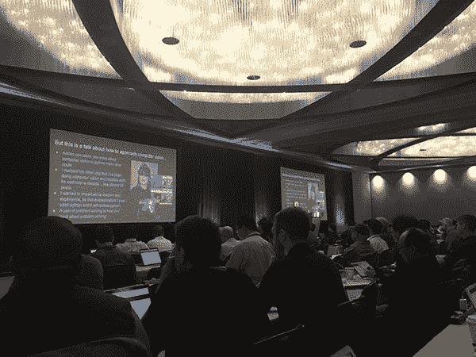

**Figure 10:** Katherine Scott challenged our assumptions that images must be 3-channel, 8-bit RGB data. Her PyImageConf 2018 talk was incredibly inspiring.

特别是，我们的世界针对 3 通道、8 位 RGB 数据进行了优化，但还有其他伪彩色技术可供探索。

凯特的演讲不仅提供了丰富的信息，也鼓舞了 T2。

Francois Chollet，可以说是一个不需要介绍的人，Keras 的创始人和谷歌的深度学习工程师，做了一个关于计算机视觉的 Xception 架构的演讲。

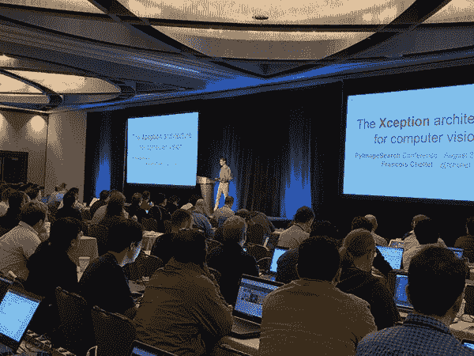

**Figure 11:** Francois Chollet, sharing technical details and the theory surrounding depthwise separable convolutions and their role in the Xception architecture.

特别是，Francois 的演讲集中在深度方向可分离卷积的概念，以及这种技术如何使他能够构想出异常神经网络架构，将剩余连接和深度方向可分离卷积结合起来。

这种架构受 Szegedy 等人的 Inception 架构的启发，优于 Inception 和其他架构，需要更少的参数和更少的训练步骤。

最后，我上台做了当天的最后一次演讲。

我的演讲题为 *7 个教训——我对推出你的第一个计算机视觉或深度学习产品的建议。*

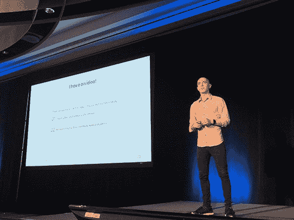

**Figure 12:** Adrian Rosebrock delivering his PyImageConf 2018 talk, *7 lessons learned — My advice on launching your first computer vision or deep learning product.*

在 PyImageSearch 博客上，我通常会教你一种特定的算法或技术，但在这次演讲中，我会教与会者如何让一切回到原点，特别是在你写一行代码或进行一次实验之前验证你的想法的重要性。

我分享了我多年来的经验，有好有坏，演讲结束后，与会者有了一个框架，他们可以在推出自己的想法或产品时应用。

第一天取得了巨大的成功，我真的要感谢各位演讲者在百忙之中抽出时间来促成这次会议——谢谢大家！

### 第 3 天—研讨会

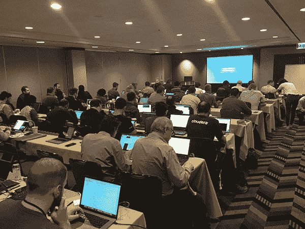

**Figure 13:** It was a packed house for Davis King’s, creator of dlib, PyImageConf 2018 workshop.

第三天是研讨会日。举办了四次全天研讨会(上午 9 时至下午 5 时)，包括:

*   *用于面部识别和其他面部应用的计算机视觉* — Sayta Mallick
*   用于现实世界应用的先进计算机视觉技术
*   *增强现实和计算机视觉虚拟现实* —约瑟夫·豪斯
*   *用于物体检测的 DL 是如何完成的:实现和使用更快的 R-CNN* — Alan Descoins 和 Augustín Azzinnari

每个研讨会都是满满当当的，每个研讨会都被设计成让你在笔记本电脑上学习、编写代码、应用特定的技术并获得结果。

本质上，我们的目标是将整个 PyImageSearch 教学体验带入一个现场的、面对面的研讨会。

与会者 Nicholas McKinney 特别喜欢他与 Satya 的研讨会:

> 我参加的研讨会非常注重实践，让我可以建立自己的计算机视觉实验室，使用记录良好的代码进行构建。

Giulio Giorcelli 也分享了他的经历:

> PyImageConf 是一个由深度学习实践者为深度学习实践者举办的无废话、手把手的会议。我学到了很多新的东西，并用游戏中最优秀的人在他们自己的代码中使用的实用技术改进了我当前的工具箱。我带回家的新知识是无价的。

大卫斯通非常喜欢艾伦和奥古斯丁的快速 R-CNN 工作室:

> 我很兴奋能来，我没有失望。演讲者非常出色。我真的很喜欢“用更快的 R-CNN 进行物体检测”的研讨会，学到了很多东西。这是一个伟大的社区团体，也是我参加过的最友好的会议。

### 哪些进展顺利，哪些可以改进

本节的重点是强调会议的各个方面，包括未来 PyImageConf 可以改进的地方。

我不仅认为与你，PyImageSearch 的读者分享这些细节很重要，它们也是对我自己的笔记(以及对任何有兴趣在未来举行会议的人的笔记)。

#### 涵盖了大量不同的主题(尤其是对于小型会议)

进展非常顺利的一个方面是话题的多样性。

PyImageConf 可能很小，但它有很大的冲击力。

亚当关于图像分割的演讲非常实用，为会议定下了基调——戴维斯的演讲也是如此。

Jeff Bass 的演讲探讨了我们如何将所有的碎片粘在一起，并解决现实世界中的实际问题。

Francois 对 Xception 架构以及我们如何在自己的应用程序中使用它进行了高度技术性的讨论。

Kat 的演讲非常鼓舞人心，让我们深入了解了计算机视觉不仅仅是 RGB 数据。

这种主题的多样性是一个巨大的成功，我要为此感谢发言者。

#### 场地本身非常棒

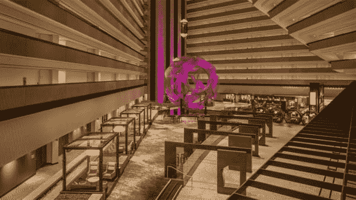

**Figure 14:** It’s hard to argue with the incredibly professional, aesthetically pleasing atmosphere at the Regency Hyatt.

凯悦酒店是 PyImageConf 的绝佳场地。那里很漂亮，非常专业，他们提供的食物也很棒。我真的很享受在那里的时光，我知道与会者也一样。

#### 招待会大受欢迎

PyImageConf 的每晚都有一个接待和开放酒吧，开放时间约为 2.5-3 小时。

正如我在这篇文章前面提到的，我坚信应该给与会者一个连接网络的机会。

这些联系往往比实际的讲座和研讨会本身更有价值。

#### 我们的赞助商棒极了

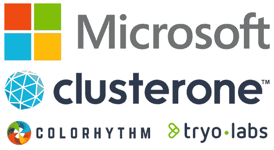

**Figure 15:** PyImageConf 2018 was sponsored by Microsoft Azure, Clusterone, Colorhytm, and TryoLabs.

PyImageConf 的赞助商是:

*   [微软 Azure](https://azure.microsoft.com/en-us/)
*   [集群一](https://clusterone.com/)
*   [节奏节奏](http://www.colorhythm.com/)
*   [TryoLabs](https://tryolabs.com/)

微软甚至在云端提供了 *GPU 实例*供与会者使用。

与所有这些赞助商合作愉快。感谢您让 PyImageConf 成为可能！

#### 在演讲者中更加强调种族和性别的多样性

对于未来的 PyImageConf，我想强调的一个方面是更多的种族和性别多样性——Satya 是唯一的非白人演讲者，Kat 是唯一的非男性演讲者。

当然，总共只有八位演讲者，但在未来，我将亲自确保有更多的种族和性别多样性。

PyImageConf 当然令人惊叹，我完全相信这组演讲者绝对适合这次会议，但我也知道，向前迈进，我有责任确保更多的多样性。这是我不能掉以轻心的事情，绝对是我愿意努力的领域。

也就是说，我们的与会者中确实有来自*和*的多样性。一些与会者从非洲、韩国、中国、日本、乌拉圭、印度和澳大利亚远道而来。

布莱恩·卡伦巴(Brian Karemba)从津巴布韦的哈拉雷远道而来，他对自己的旅行很满意:

> PyImageConf2018 绝对是一次惊艳的体验！它不仅提供了一个独特的机会向该领域的大师学习，而且与简历专家、从业者和爱好者(像我一样)的交流和互动也是无价的。会场是一流的，会议的整体组织也是如此。向 Adrian、所有演讲者和与会者致敬，感谢他们让这次活动成为现实，并公开分享他们的知识、经验和见解。从哈拉雷到旧金山的 27 小时飞行非常值得！！期待 PyImageConf2019！？！

尤因·许在他的 PyImageConf 后调查中分享了以下内容:

> 从顾问、研究人员到教育工作者，PyImageConf 抓住了计算机视觉的本质。演讲者对他们正在展示的主题非常有热情，广泛的主题让我想知道接下来会发生什么。更重要的是，与会者的多样性给我留下了深刻的印象。从研究生，创业创新者，到真正的公司员工，每个人的背景和对计算机视觉的兴趣都给我留下了深刻的印象。这是一次真正的会议，将激励任何想了解计算机视觉的人。

看到这么多 PyImageSearch 的读者在同一个房间里，对我来说是一种屈辱的经历。PyImageSearch 社区是如此的强大和相互支持，有时候我开始感觉有点情绪失控(以一种好的方式)。

#### 年龄多样性非常好

我认为我们确定的一个方面是演讲者和与会者的年龄差异——这是我永远不想改变的。

正如种族和性别多样性很重要一样，年龄多样性也很重要。我们都在不同的年龄经历不同的生活，我们都来自不同的行业。因此，我们在职业和个人方面都有不同的经历可以分享。我们插入的多样性越多，我们就越能相互学习。

#### 杰夫·诺瓦是我能想到的最好的搭档主持人

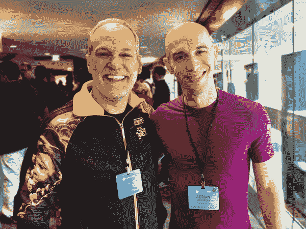

Figure 16: Me (Adrian) with PyImageConf co-host, Jeff Nova. Jeff Nova owns [Colorhythm](http://www.colorhythm.com/), an image processing and retouching company. Look how amazing this photo looks after Colorhythm applied their magic!

杰夫·诺瓦确实是一个特别的人。

他是我的同事。一个朋友。在很多方面，他感觉就像是我从未有过的哥哥。

Jeff 共同主持 PyImageConf 并分担 MC 职责。没有他我不可能完成 PyImageConf。他总是在那里帮忙，伸出援手，确保会议顺利进行。

杰夫，如果你在读这封信，谢谢你。

#### 有一个会议协调员是至关重要的

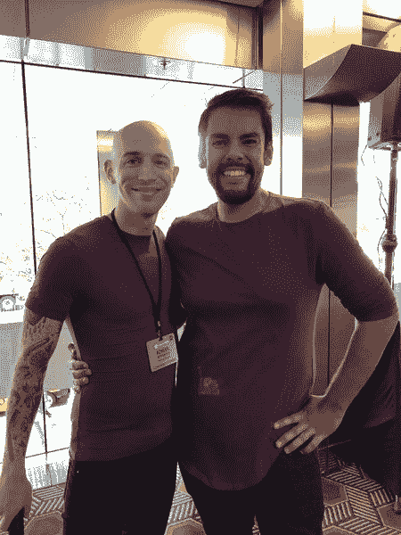

**Figure 17:** PyImageConf would not have been possible without Xander Castro, a truly excellent conference coordinator. Hysterically, we (totally accidentally) ended up matching during the final day of the conference!

我无法想象在没有会议协调员的情况下运行 PyImageConf。

有这么多的后勤工作要跟踪，有这么多的账单要付，有这么多的人要联系——如果我试图自己做这件事，我想我的光头上会重新长出头发，这样我就有东西可以拔了。

我过去参加过大约 6-7 次由史云光·卡斯特罗和他的公司 [Startup Event Solutions](http://www.startupeventsolutions.com/) 协调的会议，所有这些会议都是*令人难以置信的*执行得非常好，非常专业。

在一次会议上，就在午餐前，甚至有一个消防喷头爆炸，导致 40 年前的脏水(已经在管道中存放了几十年)倾泻而出，淹没了舞厅的整个角落。

史云光和他的团队忙得不可开交，午饭后他们为我们准备了一个新舞厅——会议从不错过任何一个节拍。

幸运的是，在 PyImageConf 上没有出现与洒水器相关的问题，但这只是向你展示了史云光在工作上有多出色。

#### 拥有一个团队让这成为可能

在会议期间，大卫·麦克杜菲和大卫·霍夫曼，如果你以前给我发电子邮件的话，你们可能会有过互动，他们都在尽可能地提供帮助，无论是在登记台工作，拍照，还是在房间里为有问题的与会者安装麦克风。没有他们，我会觉得自己已经无路可走了。他们帮了大忙。

#### 解决车间注册问题

PyImageConf 的门票在会议召开前一个月就销售一空，然后，在会议召开前一周，史云光和我发出了一份调查，让与会者报名参加一个特定的研讨会。

研讨会人数上限为 50 人，原因如下:

1.  空间限制——每个房间最多能容纳 50 人
2.  研讨会主持人的理智——超过 50 人在一个房间里对主持人来说太难保持跟踪了

研讨会注册以先到先得的方式进行，一些研讨会很快就满员了。

不可避免的是，在一些情况下，与会者想要参加*X*研讨会(他们的第一选择)，但是已经满员了，所以他们需要参加*Y*研讨会(他们的第二选择)。

在未来，我想提供一个更好，更有效的车间注册过程，但不幸的是，它创造了一个有点“鸡和蛋”的情况。

一方面，当与会者购买 PyImageConf 的门票时，我们也可以让他们注册参加研讨会…

*…但同时，这也极大地限制了车间主持人:*

*   如果他们的工作坊改变了主题怎么办？
*   如果他们决定从研讨会中删除某个主题怎么办？
*   可以说最重要的是，对于一个研讨会主持人来说，提前 6 个月确定他们的研讨会细节是否现实？(那是反问句，答案是“*不，不现实”*)

对于这种情况，我还没有一个解决方案，因为它需要仔细的思考和冥想，但我确实想分享它，因为我相信必须有一个更好的解决方案。

#### 为研讨会提供预配置的开发环境

对于实践工作，你显然需要一个适当配置的开发环境。

研讨会主持人在会前提供了有关如何配置开发环境的详细信息；然而，众所周知，配置您的开发环境有时并不简单。特别是在 Davis 的研讨会中，研讨会的前 30-60 分钟用于确保机器配置正确。

在未来，我相信这个问题可以通过提供预配置的开发环境来缓解，这也是我想在未来的 PyImageConf 中探索的。

#### 车间使用多台显示器，这样人们可以看得更清楚

对于一些车间来说，如果人们坐在离教室前面较远的位置，就很难看到屏幕。

在与史云光交谈后，他建议在未来几年里，我们要么有(1)一个每个人都可以看到的大屏幕和/或(2)重复监视器，房间的每一侧各有两个，这样无论你坐在哪里，你都可以很容易地通过屏幕看到正在发生的事情。

史云光的解决方案是完美的，如果将来有 PyImageConf，我们无疑会利用它。

#### 使用 Slack 进行会议交流是一个全面的胜利

我不是 Slack 的忠实粉丝——这是我日常使用的“必要的邪恶”之一，但我*将*说，利用 Slack 帮助与会者连接和联网是*的一大胜利。*

在#meetups 频道里，有晚餐、饮料，甚至是与锻炼有关的聚会。看到友谊和纽带在会议之外形成真是太酷了。

#### “最友好的会议”

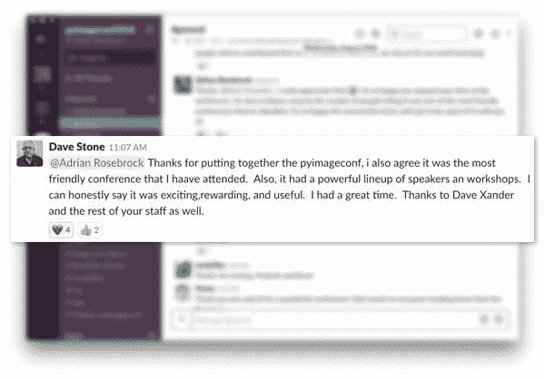

**Figure 15:** PyImageConf — not only technical and rewarding to attend, but also one of the most friendly conferences around!

从 PyImageConf 与会者那里听到的一个共同主题是，这是他们参加过的最友好的会议之一。

事实上，在我发起的会后调查中，这个主题多次出现。一位与会者的以下回应对我来说意义非凡:

> 我很内向，很难交谈(听起来像陈词滥调哈哈)，但每个人都很友好，很容易交谈，我在与其他与会者社交方面没有问题。午餐和网络招待会让这次会议成为一次很好的经历。

多年来，我是一个内向的人，我努力让自己变得与众不同。与人交往确实是我焦虑的来源，所以我能理解这位与会者的感受。在我看来，对他们来说，能够在社交环境中感到舒适并与他人建立关系网是 T2 的一大优势。

Thi Tran 还认为会议非常友好:

> 一次非常友好、组织良好、内容丰富的会议。我喜欢接触很多人，并向他们学习。实践研讨会是一个加分项。位置非常完美，可以看到海湾大桥的迷人景色和美味的食物。

戴夫·斯诺登也是如此:

> 毫无疑问，PyImageConf 2018 是我参加过的最友好、最受欢迎的会议。技术含量也很高！很荣幸见到一些人，并向他们学习，他们贡献了自己的时间来构建我们工作(和娱乐)所依赖的工具。

创造一个环境，让别人不仅能从这里学到东西，还能发现 T2 超级友好，这是一件值得骄傲的事情。

PyImageSearch 社区是一个友好、接纳和热情的社区，我永远也不想改变这一点？

### 我会主办 PyImageConf 2019 吗？

当我登上从旧金山飞回 CT 的飞机时，我发了以下微博:

[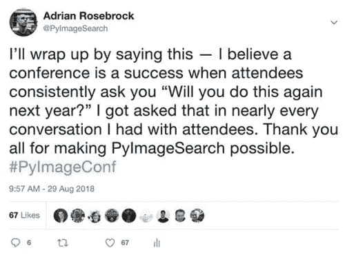](https://twitter.com/PyImageSearch/status/1034802298235449344)

**Figure 16:** Nearly every attendee who came up to me asked if I would do PyImageConf again next year. I would call that a success. Thank you all for making PyImageConf possible!

第二周，我发出了一份会后调查，以获得与会者的反馈。

其中一个问题是:

> 如果有 PyImageConf 2019，你会参加吗？

在参与调查的人中(约 50%)，90%的与会者表示， ***“是的，我会参加 PyImageConf 2019”。***

这是一个很大比例的参与者说他们明年会回来。史云光还证实，这是他见过的*最高的*数字之一——当然*也是第一年会议的最高数字。*

所以，就这样说:

**会有 PyImageConf 2019 吗？**

我现在还不打算做出任何承诺。主持 PyImageConf，虽然令人难以置信地值得，而且是我将永远记住的事情，但对我来说也是极其累人的。

我也是在 9 月 13 日(我结婚前大约一周)写这篇博客，所以我的大脑不一定在一个我可以预测到 2019 年的地方——我主要只是关注我即将成为的妻子。

在 2018 年剩下的时间里，我会花更多的时间来思考这个问题，但我会引用 PyImageSearch 读者 Douglas Jones 在询问 PyImageConf 2018 时的话作为结束:

> 我觉得你必须这么做。

我打开了 PyImageConf 和今天的博客，说没有你，PyImageSearch 阅读器，会议、博客书籍和课程是不可能的。你们都是这个家庭的一员，我很荣幸能和你们一起踏上这个旅程。*