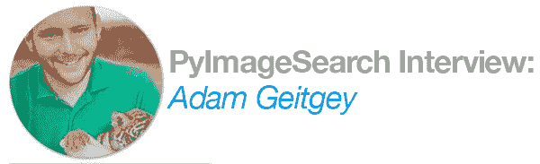
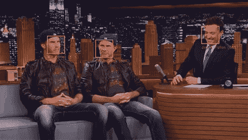
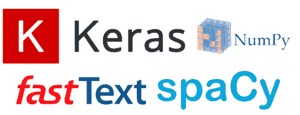
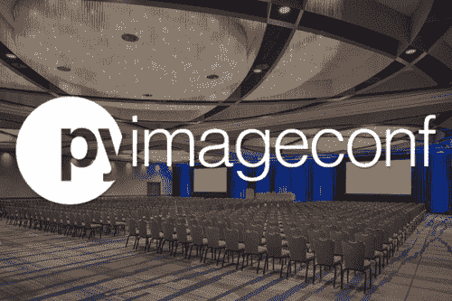

# 采访 Adam Geitgey，人脸识别 Python 库的创造者

> 原文：<https://pyimagesearch.com/2018/07/11/an-interview-with-adam-geitgey-creator-of-the-face_recognition-python-library/>

你可能已经注意到，在过去的几周里，我们在 PyImageSearch 博客上经常使用一个叫做`face_recognition`的特殊 Python 包:

*   我们首先用它来[建立一个人脸识别系统](https://pyimagesearch.com/2018/06/18/face-recognition-with-opencv-python-and-deep-learning/)
*   然后[我们将人脸识别应用于树莓派](https://pyimagesearch.com/2018/06/25/raspberry-pi-face-recognition/)
*   最近我们[对人脸进行聚类，以在数据集中找到独特的个体](https://pyimagesearch.com/2018/07/09/face-clustering-with-python/)

没有(1)`face_recognition`模块和(dlib 库，就不可能创建这些人脸识别应用程序。

**今天，我很高兴与大家分享对亚当·盖特基的采访，他是`face_recognition`图书馆的创建者。**

在采访中，亚当讨论了:

*   他如何以及为什么创建了`face_recognition` Python 模块
*   使用 RNNs 生成新的超级马里奥兄弟视频游戏水平
*   他最喜欢的工具和选择的库
*   作为 PyImageSearch 的读者，他对你的建议是，如何开始研究计算机视觉和深度学习
*   他在基于深度学习的细分、自动驾驶汽车和卫星/航空摄影方面的工作

**要查看 Adam 的完整邮件，*请继续阅读！***

## 采访 Adam Geitgey，人脸识别 Python 库的创造者

阿德里安:嘿，亚当！谢谢你今天来到这里。很高兴你能来到 PyImageSearch 博客。对于不认识你的人，你是谁，你是做什么的？

亚当:嗨，阿德里安！谢谢你邀请我！

我从小就开始编程。当我七岁的时候，我开始从我能找到的任何书籍中自学 Basic 和 Pascal。所以从我记事起，我就对编程很感兴趣。

这让我最终从事各行各业的软件工作——从中国的 3D CAD 软件到硅谷的初创企业。在过去的一年半时间里，我一直在为 LinkedIn Learning 创建机器学习教育课程，并做咨询项目。最近，我一直在与比尔和梅林达盖茨基金会的一个人工智能项目团队合作。

这是在说我不是在大学里专门研究机器学习的人。我有更传统的计算机科学和软件工程背景，我在职业生涯的后期进入了机器学习领域。

* * *

**Adrian:** 你最初是如何对机器学习和计算机视觉产生兴趣的？

当我在大学的时候，我对当时所谓的“人工智能”并不感兴趣。这发生在 2000 年左右，比 GPU 使大型神经网络实用化早了几年。在那一点上，整个人工智能领域对我来说就像一个科幻幻想，我对如何使用计算机解决更直接的问题更感兴趣。

但是几年后，我读了彼得·诺维格的[“如何写拼写纠正器”](https://norvig.com/spell-correct.html)的文章。它解释了用概率来解决一个本来很难解决的问题的想法。这完全让我大吃一惊！我觉得我已经错过了一个完全平行的编程世界，我开始学习我能学的一切。这导致了机器学习，计算机视觉，自然语言处理和其他一切。

* * *

**Figure 1:** One of Adam’s most popular *Machine Learning is Fun!* articles is on face recognition.

**阿德里安:**你的 [*机器学习很有趣！你博客上的*](https://medium.com/@ageitgey/machine-learning-is-fun-80ea3ec3c471) 系列很棒——是什么激发了你创作它的灵感？

每当我学习新东西时，无论是摄影、音乐理论还是机器学习，当我觉得学习材料可以更简单、更直接时，我就会感到沮丧。

某个领域的专家倾向于为其他未来的专家写作。但对我来说，更具挑战性和更有趣的是，尝试将一个话题简化为最基本的内容，并以任何人都能理解的方式呈现出来。我痴迷于试图将复杂的话题分解成最简单的形式。这可能与我的学习方式有很大关系——我喜欢在挖掘细节之前先了解全局。

对于任何一个程序员来说，这里有一些免费的职业建议——如果你能写非常清晰简单的电子邮件，解释你的团队正在解决的问题，这将会让你在大型科技公司的职业生涯中走得更远。

* * *

**Figure 2:** Adam used RNNs to generate new levels of the Super Mario Bros video game.

阿德里安:你在*写的最喜欢的文章是什么？机器学习很有趣！*为什么？

**Adam:** 我喜欢使用计算机作为创意工具的想法，并探索人类生成的艺术和计算机生成的艺术之间的界限。我写了一篇关于[使用 RNNs 生成新的超级马里奥兄弟视频游戏关卡的文章](https://medium.com/@ageitgey/machine-learning-is-fun-part-2-a26a10b68df3)。

* * *

**Adrian:** 你的[人脸识别](https://github.com/ageitgey/face_recognition)库是 GitHub 上最受欢迎的人脸识别库之一。我甚至在过去的三篇博文中都用过！你能告诉我们更多创建它的过程吗？

几乎每周都有令人兴奋的新研究论文问世，其中很多都包含工作代码。这是一个令人惊叹的程序员时代！问题是大多数研究代码都是作为一次性实验编写的。在您可以在生产应用程序中使用它之前，通常必须重写它。

我在用 Python 寻找一个好的人脸识别解决方案，但是我找到的所有东西都是用几种不同的编程语言拼凑起来的，并且需要下载额外的文件。我写了一篇关于人脸识别如何工作的文章，但是我收到的大多数问题都来自那些不能正确安装库的读者。我想要像“pip install face_recognition”一样简单的部署。

大约在那个时候， [Davis King](https://pyimagesearch.com/2017/03/13/an-interview-with-davis-king-creator-of-the-dlib-toolkit/) 更新了他优秀的 [dlib](http://dlib.net/) 库，加入了一个新的人脸识别模型。这看起来非常适合我想做的事情。因为 Davis 已经完成了大部分艰苦的工作，所以我所要做的就是用我喜欢的 API 把它打包，写一堆文档和例子，然后让它托管在 pip 上。老实说，整个过程中最困难的部分是说服运行 pip 的人托管它，因为它比他们通常允许的最大文件大小要大。

* * *

**阿德里安:**你见过的最酷/最整洁的项目是什么？

人们已经用它来构建各种各样的东西，比如在教室里使用人脸识别来自动点名的工具。但对我来说最酷的是一个用户，他使用人脸识别模型生成的编码作为输入来训练情绪检测模型。迁移学习真的很酷，我喜欢利用现有模型建立新模型的想法。

* * *

**Figure 3**: Some of Adam’s favorite libraries include Keras, spaCy, fastText, NumPy, and Pandas.

阿德里安:你有哪些工具和库可供选择？

我断断续续用 Python 编码大约有 20 年了，我在所有的机器学习项目中都使用它。最好的部分是所有令人惊叹的图书馆！

我最喜欢的一些库是用于训练新神经网络的 [Keras](https://keras.io/) ，用于自然语言处理的 [spaCy](https://spacy.io/) ，以及用于快速建立文本分类模型的 [fastText](https://fasttext.cc/) 。知道如何很好地使用 numpy 和 Pandas 将会为你节省很多清理数据的时间。

还有，我真的很喜欢 Python 3.6 和 3.7 最近的变化。如果你还在用 Python 2，那绝对是时候升级了！

* * *

阿德里安:接下来是什么？你正在进行什么类型的项目？

我正在撰写一系列关于自然语言处理的新文章。如果你想学习如何用电脑理解书面文字，请关注[我的网站](https://www.machinelearningisfun.com/)上的新帖子！

* * *

**Adrian:** 对于刚开始学习计算机视觉和深度学习的读者，你有什么建议吗？

如果你是 Python 编程语言的新手，花点时间好好学习语法和语言结构。从长远来看，这会节省你很多时间。我得到的许多问题实际上只是 Python 语法问题或误解。这是一种与 C++或 Java 非常不同的语言。

除此之外，学习训练模型的基本概念，然后直接投入到你感兴趣的项目中进行尝试！通过实践，你会学到比阅读更多的东西。

* * *

**Figure 4:** [PyImageConf 2018](https://www.pyimageconf.com/) will be head in San Francisco, CA on August 26-28th.

**Adrian:** 你将在 [**PyImageConf 2018**](https://www.pyimageconf.com/) 发表演讲，这是 PyImageSearch 自己的计算机视觉和深度学习会议——我们很高兴邀请到你！你能告诉我们更多关于你演讲的内容吗？

亚当:我将谈论如何进行图像分割。图像分割是指拍摄一张照片，不仅要识别照片中的物体，还要在每个物体周围画出线条。

图像分割有很多潜在的用途。例如，自动驾驶汽车需要能够将摄像头对准道路，并以高精度识别每个行人，图像分割是实现这一目标的一种方法。你也可以想象 Photoshop 的未来版本真的很擅长从图像中提取对象，能够自动跟踪每个对象。

但对我来说，图像分割最令人兴奋的用途是处理卫星和航空摄影。通过图像分割，我们实际上可以输入原始的卫星照片，然后让计算机自动描绘出每座建筑的轮廓和每条道路。这项工作过去由成千上万的人手工完成，耗资数百万美元。

这项技术有可能改变整个测绘行业。例如， [OpenStreetMap](https://www.openstreetmap.org) 是一个令人惊叹的项目，志愿者们试图通过使用他们的本地知识来追踪卫星图像和注释 GPS 轨迹，从而绘制整个世界的地图。但随着图像分割技术变得更加容易，计算机将能够完成 80%的追踪地图的繁重工作，然后人类只需清理和注释结果。**图像分割技术有潜力最终大大加快这一进程，我们的目标将不再只是绘制整个世界的地图，而是看看我们能以多快的速度根据最新的卫星图像绘制整个世界的地图。**

获取偏远地区的高质量地图数据对于人道主义和医疗团队至关重要。更好地提供偏远地区人口居住的地图有可能拯救生命。

* * *

**Adrian:** 如果一个 PyImageSearch 的读者想和你联系，最好去哪里联系？

亚当:你可以在 https://www.machinelearningisfun.com/的[阅读我所有的文章](https://www.machinelearningisfun.com/)，也可以在推特上给我打电话 [@ageitgey](https://twitter.com/ageitgey) 。谢谢！

## 摘要

在今天的博客文章中，我们采访了计算机视觉和深度学习从业者亚当·盖特基(Adam Geitgey)，他是流行的*机器学习很有趣的作者！*博客系列，以及广受欢迎的`face_recognition`图书馆的创建者。

请花点时间感谢 Adam 抽出时间接受采访。

**在 PyImageSearch 上发布未来的博客文章和采访时，我们会通知您，*请务必在下面的表格中输入您的电子邮件地址，*，我会让您随时了解情况。**