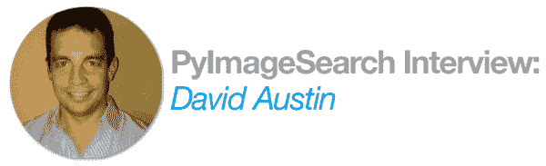
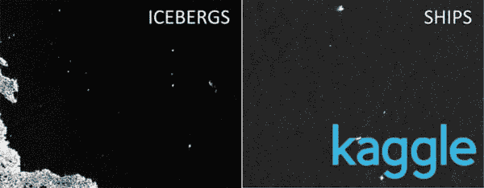
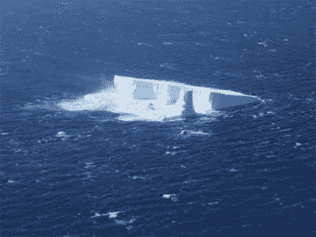
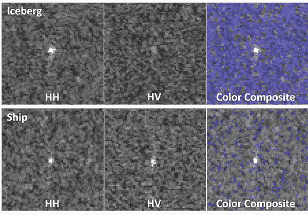
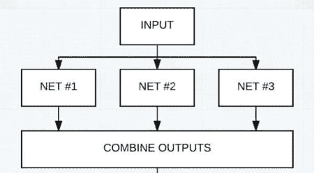
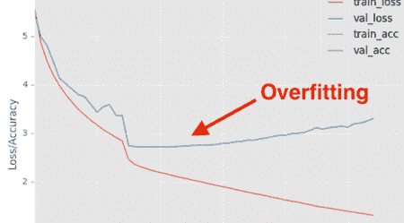
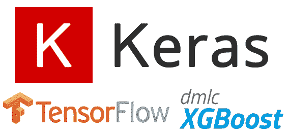
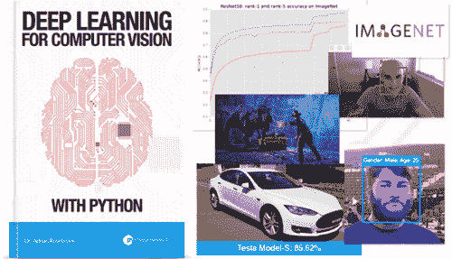

# 大卫·奥斯汀访谈:在 Kaggle 最受欢迎的图像分类比赛中获得第一名和 25，000 美元奖金

> 原文：<https://pyimagesearch.com/2018/03/26/interview-david-austin-1st-place-25000-kaggles-popular-competition/>

在今天的博文中，我采访了大卫·奥斯丁，他和他的队友王为民一起在[卡格尔冰山分类挑战赛](https://www.kaggle.com/c/statoil-iceberg-classifier-challenge/leaderboard)中获得了 ***第一名*(以及 25，000 美元)**。

David 和 Weimin 的获奖解决方案实际上可用于让船只在危险水域中更安全地航行，从而减少对船只和货物的损坏，最重要的是，减少事故、伤害和死亡。

根据 Kaggle 的说法，冰山图像分类挑战:

1.  ***是他们遇到过的最受欢迎的*图像分类挑战**(以参赛队伍来衡量)
2.  并且是*的**第七届最受欢迎的比赛(跨越所有挑战类型:图像、文本等。)***

 *比赛结束后不久，大卫给我发来了以下信息:

> 你好，阿德里安，我是一名 [PyImageSearch 大师的成员](https://pyimagesearch.com/pyimagesearch-gurus/)，你所有书籍的消费者，将于 8 月参加 [PyImageConf，并且总体上是一名欣赏你教学的学生。](https://www.pyimageconf.com/)
> 
> 我只是想与您分享一个成功的故事，因为我刚刚在挪威国家石油公司冰山分类器 Kaggle 竞赛中获得了 3，343 个团队中的第一名(25，000 美元第一名奖金)。
> 
> 我的许多深度学习和简历知识都是通过您的培训获得的，我从您那里学到的一些具体技术也用在了我的获奖解决方案中(特别是阈值和迷你谷歌网络)。只想说声谢谢，让你知道你的影响很大。
> 
> 谢谢！大卫

大卫的个人信息对我来说真的很重要，说实话，这让我有点激动。

作为一名教师和教育者，世界上没有比看到读者更好的感觉了:

1.  从你的博客文章、书籍和课程中获取你所教授的东西的价值
2.  用他们的知识丰富自己的生活，改善他人的生活

在今天的帖子中，我将采访大卫并讨论:

*   冰山图像分类的挑战是什么……为什么它很重要
*   David 和 Weimin 在其获奖作品中使用的方法、算法和技术
*   挑战中最困难的方面是什么(以及他们是如何克服的)
*   他对任何想参加追逐赛的人的建议是

我非常为大卫和为民高兴——他们值得所有的祝贺和热烈的掌声。

和我一起接受采访，探索大卫和他的队友伟民是如何赢得 Kaggle 最受欢迎的图像分类比赛的。

## 大卫·奥斯汀访谈:在 Kaggle 最受欢迎的比赛中获得第一名和 25，000 美元

**Figure 1:** The goal of the Kaggle Iceberg Classifier challenge is to build an image classifier that classifies input regions of a satellite image as either “iceberg” or “ship” ([source](https://www.kaggle.com/c/statoil-iceberg-classifier-challenge)).

阿德里安:嗨，大卫！谢谢你同意接受这次采访。祝贺您在 Kaggle 冰山分类器更换中获得第一名，干得好！

大卫:谢谢阿德里安，很高兴与你交谈。

* * *

**Adrian:** 你最初是如何对计算机视觉和深度学习产生兴趣的？

大卫:在过去的两年里，我对深度学习的兴趣一直在稳步增长，因为我看到人们如何使用它来从他们处理的数据中获得令人难以置信的洞察力。我对深度学习的积极研究和实际应用都感兴趣，所以我发现参加 Kaggle 比赛是保持技能敏锐和尝试新技术的好地方。

* * *

**Adrian:** 你参赛前在计算机视觉和机器学习/深度学习方面的背景如何？你参加过以前的 Kaggle 比赛吗？

**David:** 我第一次接触机器学习可以追溯到大约 10 年前，当时我刚开始学习梯度增强树和随机森林，并将它们应用于分类类型问题。在过去的几年里，我开始更广泛地关注深度学习和计算机视觉。

不到一年前，我开始在业余时间参加 Kaggle 比赛，以此来提高我的技能，这是我的第三次图像分类比赛。

* * *

**Figure 2:** An example of how an iceberg looks. The goal of the Kaggle competition was to recognize such icebergs from satellite imagery ([source](https://www.kaggle.com/c/statoil-iceberg-classifier-challenge)).

阿德里安:你能告诉我更多关于冰山分类器挑战的事情吗？是什么激励你参加比赛？

当然，冰山分类挑战是一个二进制图像分类问题，参与者被要求对船只和通过卫星图像收集的冰山进行分类。在能源勘探领域，能够识别和避免漂流冰山等威胁尤为重要。

该数据集有几个有趣的方面，这使得它成为一个有趣的挑战。

首先，数据集相对较小，训练集中只有 1604 幅图像，因此从硬件角度来看，进入的障碍相当低，但使用有限的数据集的难度很高。

其次，在观看图像时，**对人眼来说，许多图像看起来类似于电视屏幕上“下雪”的样子**，只是一堆椒盐噪声，在视觉上根本看不清哪些图像是船只，哪些是冰山:

**Figure 3:** It’s extremely difficult for the human eye to accurately determine if an input region is an “iceberg” or a “ship” ([source](https://www.kaggle.com/c/statoil-iceberg-classifier-challenge#Background)).

因此，事实上，人类很难准确预测分类，我认为这将是一个很好的测试，看看计算机视觉和深度学习能做什么。

* * *

**Figure 4:** David and Weimin winning solution involved using an ensemble of CNN architectures.

阿德里安:让我们来谈一点技术问题。你能告诉我们一些你在获奖作品中使用的方法、算法和技术吗？

大卫:嗯，总体方法与大多数典型的计算机视觉问题非常相似，因为我们花了相当多的时间预先理解数据。

我最喜欢的早期技术之一是使用无监督学习方法来识别数据中的自然模式，并使用该学习来确定采取什么样的深度学习方法。

在这种情况下，标准的 KNN 算法能够识别出帮助定义我们的模型架构的关键信号。从那时起，我们使用了一个非常广泛的 CNN 架构，它由 100 多个定制的 CNN 和 VGG 式架构组成，然后使用贪婪混合和两级堆叠以及其他图像功能来组合这些模型的结果。

这听起来可能是一个非常复杂的方法，但请记住，这里的目标函数是最小化对数损失误差，在这种情况下，我们只添加了模型，因为它们减少了对数损失而没有过度拟合，所以这是集合许多较弱学习者的力量的另一个很好的例子。

我们结束了第二次训练许多相同的 CNN，但只使用了我们在过程开始时从无监督学习中识别的数据子集，因为这也给了我们性能的改善。

* * *

**Figure 5:** The most difficult aspect of the Kaggle Iceberg challenge for David and his teammate was avoiding overfitting.

**Adrian:** 这次挑战对你来说最困难的方面是什么，为什么？

大卫:挑战中最困难的部分是确认我们没有过度适应。

图像分类问题的数据集规模相对较小，因此我们总是担心过度拟合可能是一个问题。出于这个原因，我们确保我们所有的模型都使用 4 重交叉验证，这增加了计算成本，但降低了过度拟合的风险。特别是当你处理像对数损失这样的无情损失函数时，你必须时刻警惕过度拟合。

* * *

阿德里安:训练你的模特花了多长时间？

**David:** 即使我们选择使用大量的 CNN，即使在整套模型上使用 4 重交叉验证，培训也只需要 1-2 天。没有交叉验证的单个模型在某些情况下可以训练几分钟。

* * *

阿德里安:如果让你选择你在比赛中运用的最重要的技术或技巧，你会选择什么？

**David:** 毫无疑问，最重要的一步是前期探索性分析，以便更好地理解数据集。

结果发现，除了图像数据之外，还有一个非常重要的信号，有助于消除数据中的大量噪声。

在我看来，任何 CV 或深度学习问题中最容易被忽视的步骤之一是理解数据并利用这些知识做出最佳设计选择所需的前期工作。

随着算法变得越来越容易获得和导入，经常会出现在没有真正理解这些算法是否适合工作，或者是否有工作应该在培训之前或之后完成以适当地处理数据的情况下，就匆忙地向问题“扔算法”的情况。

* * *

**Figure 6:** David used TensorFlow, Keras, and xgboost in the winning Kaggle submission.

阿德里安:你有哪些工具和库可供选择？

**大卫:**我个人认为 [Tensorflow](https://www.tensorflow.org/) 和 [Keras](https://keras.io/) 是最有用的，所以当处理深度学习问题时，我倾向于坚持使用它们。

对于堆叠和提升，我使用 [xgboost](https://github.com/dmlc/xgboost) ，这也是因为熟悉和它的已证实的结果。

在这个比赛中我使用了我的`dl4cv` virtualenv(一个在 [*内部使用的 Python 虚拟环境，用 Python*](https://pyimagesearch.com/deep-learning-computer-vision-python-book/) 进行计算机视觉的深度学习)并在其中加入了 xgboost。

* * *

阿德里安:你会给第一次想参加 Kaggle 比赛的人什么建议？

**David:**ka ggle 竞赛的一大优点是竞赛的社区性质。

有一个非常丰富的讨论论坛，如果参与者选择这样做，他们可以分享他们的代码。当你试图学习一般方法以及将代码应用于特定问题的方法时，这真的是非常宝贵的。

当我开始我的第一次比赛时，我花了几个小时阅读论坛和其他高质量的代码，发现这是最好的学习方法之一。

* * *

**Adrian:**[PyImageSearch 大师](https://pyimagesearch.com/pyimagesearch-gurus/)课程和 [*用 Python 进行计算机视觉深度学习*](https://pyimagesearch.com/deep-learning-computer-vision-python-book/) 的书是如何让你为 Kaggle 比赛做准备的？

与参加 Kaggle 竞赛非常相似，PyImageSearch Gurus 是一门边做边学的格式化课程。

对我来说，没有什么能像实际解决问题和遵循高质量的解决方案和代码一样让你为解决问题做好准备，我最欣赏 PyImageSearch 材料的一点是它通过生产级代码带你了解实际解决方案的方式。

我还认为，真正学习和理解深度学习架构的最佳方式之一是阅读一篇论文，然后尝试实现它。

这一策略在整个 ImageNet 捆绑包书中得到了实际实施，而且这一策略也可用于修改和调整架构，就像我们在本次竞赛中所做的那样。

我还从从业者捆绑包书中了解到了 MiniGoogleNet，这是我以前没有遇到过的，并且是在这次比赛中表现良好的一个模型。

* * *

**Adrian:** 你会向其他试图学习计算机视觉+深度学习的开发者、研究人员和学生推荐 PyImageSearch Gurus 或*用 Python 进行计算机视觉的深度学习*吗？

大卫:绝对是。我会向任何希望在 CV 和深度学习方面建立强大基础的人推荐它，因为你不仅要学习原理，还要学习如何使用最流行和最新的工具和软件将你的知识快速应用到现实世界的问题中。

* * *

阿德里安:接下来是什么？

大卫:嗯，我有一大堆项目要做，所以我会忙上一段时间。还有几个其他的 Kaggle 比赛，看起来真的很有趣，所以我也很有可能会参加这些比赛。

* * *

**Adrian:** 如果一个 PyImageSearch 的读者想聊天，和你联系的最佳地点是哪里？

大卫:联系我的最好方式是我的 [LinkedIn](https://www.linkedin.com/in/david-austin-037630123/) 个人资料。你也可以在 LinkedIn 上与[王为民](https://www.linkedin.com/in/weimin-wang-ab355325/)联系。如果你想亲自聊天，我还将参加 8 月举行的 2018 年 PyImageConf。

## 你呢？你准备好追随大卫的脚步了吗？

你准备好开始你的计算机视觉+深度学习掌握之旅并跟随大卫·奥斯汀的脚步了吗？

David 是一名长期的 PyImageSearch 读者，他已经阅读了以下两种材料:

*   **[PyImageSearch 大师课程](https://pyimagesearch.com/pyimagesearch-gurus/)** ，深入治疗计算机视觉和图像处理
*   [***计算机视觉深度学习用 Python***](https://pyimagesearch.com/deep-learning-computer-vision-python-book/) ，当今最全面的计算机视觉+深度学习书籍

我不能保证你会像大卫一样赢得 Kaggle 比赛，但我可以保证这是当今掌握计算机视觉和深度学习的两个最佳资源。

引用亚马逊机器人公司高级系统工程师斯蒂芬·卡尔达拉的话:

> 我对您创建的[PyImageSearch Gurus]内容非常满意。我会很容易地将其评为大学“硕士项目”水平。更有条理。

和广受欢迎的《机器学习很有趣》一书的作者亚当·盖特基一起！博客系列:

> 我强烈推荐用 Python 抢一本《计算机视觉深度学习》。它涉及了很多细节，并有大量详细的例子。这是我迄今为止看到的唯一一本既涉及事物如何工作，又涉及如何在现实世界中实际使用它们来解决难题的书。看看吧！

试试 [**课程**](https://pyimagesearch.com/pyimagesearch-gurus/) 和 [**书籍**](https://pyimagesearch.com/deep-learning-computer-vision-python-book/) 吧——我会在你身边帮助你一步步走下去。

## 摘要

在今天的博文中，我采访了大卫·奥斯丁，他和他的队友王为民在卡格尔的冰山分类挑战赛中获得了第一名(以及 25000 美元)。

大卫和魏民的辛勤工作将有助于确保通过冰山易发水域的旅行更加安全，危险性更低。

我为大卫和伟民感到无比的高兴和骄傲。请和我一起，在这篇博文的评论区祝贺他们。*