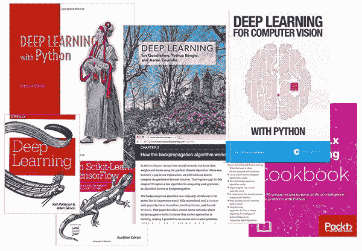
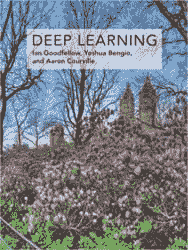
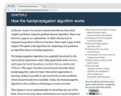
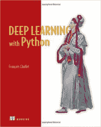
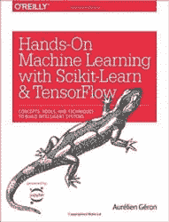
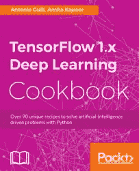
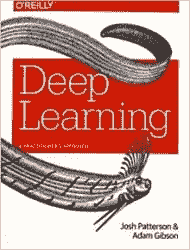
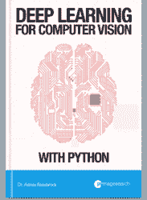

# 你现在应该阅读的 7 本最佳深度学习书籍

> 原文：<https://pyimagesearch.com/2018/03/05/7-best-deep-learning-books-reading-right-now/>

在今天的帖子中，我将与你分享我遇到的 7 本最好的深度学习书籍(排名不分先后),并推荐你阅读。

这些深度学习书籍中的一些是*理论性很强的*，专注于神经网络和深度学习背后的数学和相关假设。

其他深度学习书籍是*完全实用的*，通过*代码*而不是*理论*来教授。

甚至其他深度学习书籍也跨越了这条线，给你一剂健康的理论，同时使你能够“弄脏你的手”，并通过实施来学习(这些往往是我最喜欢的深度学习书籍)。

对于每本深度学习书籍，我都会讨论其中涵盖的核心概念、目标读者，以及这本书是否适合你。

**发现学习深度学习的 7 本最佳书籍，*继续读！***

## 你现在应该阅读的 7 本最佳深度学习书籍

在你选择一本深度学习书籍之前，最好评估一下你自己的个人学习风格，以确保你从书中获得最大的收益。

首先问自己以下问题:

> 我怎样才能最好地学习？我喜欢从理论文本中学习吗？还是我喜欢从代码片段和实现中学习？

每个人都有自己的个人学习风格，你在这里的答案将决定你应该阅读哪些深度学习书籍。

对我个人来说，我喜欢在两者之间取得平衡。

深度学习书籍完全是理论性的，过于抽象，让我的眼睛很容易忽略。

但另一方面，如果一本深度学习的书完全跳过理论，直接进入实施，我知道我错过了可能帮助我解决新的深度学习问题或项目的核心理论基础。

在我看来，一本好的深度学习书需要仔细平衡这两者。

我们需要理论来帮助我们理解深度学习的核心基础——同时我们需要实现和代码片段来帮助我们巩固我们刚刚学到的东西。

### 1。深度学习

很难(如果不是不可能的话)写一篇关于最佳深度学习书籍的博文而不提到 Goodfellow、Bengio 和库维尔的 [*深度学习*正文](http://www.deeplearningbook.org/)。

这本书旨在成为一本教科书，用于在大学级别的课堂上教授围绕深度学习的基础知识和理论。

Goodfellow 等人的*深度学习*是**完全理论化的**，是为学术受众写的。书中没有涉及代码。

该书从机器学习基础知识的讨论开始，包括有效研究深度学习所需的应用数学(线性代数、概率和信息论等。)从学术角度来说。

从那里，这本书进入现代深度学习算法和技术。

*深度学习*的最后一部分更加关注当前的研究趋势以及深度学习领域的发展方向。

我亲自通读了这本书两遍，从头到尾，并发现它非常有价值，前提是你具备这样一本教科书所需的数学/学术严谨性。

*深度学习*可从[该书的首页](http://www.deeplearningbook.org/)免费在线观看。你可以从亚马逊购买文本[的硬拷贝。](http://amzn.to/2GWPh37)

**如果……**你应该读读这本深度学习的书

*   你从*学习理论*而不是*实现*
*   你喜欢学术写作
*   你是从事深度学习的教授、本科生或研究生

### 

### 2.神经网络和深度学习

我的第二本基于理论的深度学习(e)书籍推荐是迈克尔·尼尔森的 [*神经网络和深度学习*](http://neuralnetworksanddeeplearning.com/) 。

这本书确实包括一些代码，但强调一下*“一些”*是很重要的——这本书总共有七个 Python 脚本，都在讨论各种基本的机器学习、神经网络或 MNIST 数据集上的深度学习技术。这些实现并不是世界上最“激动人心”的，但是它们将有助于演示文本中的一些理论概念。

如果你是机器学习和深度学习的新手，但渴望潜入基于*理论的*学习方法，尼尔森的书应该是你的第一站。

这本书比 Goodfellow 的*深度学习*读起来要快得多，尼尔森的写作风格结合偶尔的代码片段使其更容易理解。

**如果……**你应该读读这本深度学习的书

*   你在找一本基于理论的深度学习教材
*   是机器学习/深度学习的新手，希望从更学术的角度来研究这个领域

### 3。使用 Python 进行深度学习

Francois Chollet 是谷歌人工智能研究员，也是广受欢迎的 [Keras 深度学习库](https://keras.io/)的创建者，他在 2017 年 10 月出版了他的书 [*深度学习与 Python*](http://amzn.to/2oBWcYV) 。

弗朗索瓦的书采用了一种从业者的方法来进行深度学习。包括了一些理论和讨论，但是对于每几段理论，您会发现该技术的一个 Keras 实现。

这本书我最喜欢的一个方面是 Francois 如何将深度学习应用于计算机视觉、文本和序列的例子包括在内，这使得它成为了一本全面的书籍，适合那些希望在学习机器学习和深度学习基础知识的同时学习 Keras 库的读者。

我发现弗朗索瓦的作品清晰易懂。他对深度学习趋势和历史的额外评论是惊人的，有见地的。

值得注意的是，这本书并不是要深入学习。相反，它的主要用途是教你(1)深度学习的基础知识(2)通过 Keras 库(3)使用各种深度学习领域的实际例子。

**如果……**你应该读读这本深度学习的书

*   你对喀拉斯图书馆感兴趣
*   你“通过做/实施来学习”
*   你想快速了解深度学习是如何应用于各个领域的，比如计算机视觉、序列学习和文本

### 

### 4.使用 Scikit-Learn 和 TensorFlow 进行机器实践学习

当我第一次用 Scikit-Learn 和 TensorFlow 购买 Aurélien Géron 的 [*手动机器学习的副本时，我不确定会期待什么——如果标题没有包含“TensorFlow”这个词，我可能会轻易错过它，以为它只是机器学习的基本介绍。*](http://amzn.to/2CUfltn)

但与此同时，在一个似乎专注于基本机器学习的已经很长的标题上加上“TensorFlow”这个词，让我觉得这是一种廉价的营销策略，可以卖出更多的副本——每个人都对深度学习感兴趣，对吗？

幸运的是，我错了——这本书很值得一读，书名不应该阻止你通读。

Géron 的深度学习书分为两部分。

第一部分涵盖了基本的机器学习算法，如支持向量机(SVMs)，决策，树，随机森林，集成方法和基本的无监督学习算法。每个算法的 Scikit-learn 示例都包括在内。

第二部分通过 TensorFlow 库介绍了基本的深度学习概念。

**如果……**你应该读读这本深度学习的书

*   你是机器学习的新手，想从核心原则和代码示例开始
*   您对流行的 scikit-learn 机器学习库感兴趣
*   您希望快速学习如何操作 TensorFlow 库来完成基本的深度学习任务

### 5.TensorFlow 深度学习食谱

如果你喜欢“食谱”式的教学(很少甚至没有理论和大量代码)，我建议看看古利和卡普尔的 [*TensorFlow 深度学习食谱*](http://amzn.to/2F8rMUl) 。

这本深度学习书籍*完全是*动手操作，对 TensorFlow 用户来说是一个很好的参考。

同样，这本书并不意味着必然*教授*深度学习，而是向你展示如何在深度学习的*背景下*操作 TensorFlow 库。

不要误解我——你将*绝对*在这个过程中学习新的深度学习概念、技术和算法，但这本书采用了一种严厉的食谱方法:大量代码和对代码正在做什么的解释。

我对这本书唯一的批评是代码片段中有一些错别字。当写一本完全以代码为中心的书时，这是可以预料的。打字错误时有发生，我可以肯定地证明这一点。当你阅读课文的时候，要意识到这一点。

**如果……**你应该读读这本深度学习的书

*   你已经学习了深度学习的基础知识
*   您对 TensorFlow 库感兴趣
*   你喜欢“烹饪书”式的教学，提供代码来解决特定的问题，但不讨论基本的理论

### 6.深度学习:实践者的方法

虽然大多数包含代码样本的深度学习书籍都使用 Python，但亚当·吉布森和乔希·帕特森的 [*深度学习:从业者接近*](http://amzn.to/2CSqN8W) 而是使用 Java 和 [DL4J 库](https://deeplearning4j.org/)。

为什么是 Java？

Java 是大公司最常用的编程语言，尤其是在企业层面。

Gibson 和 Patterson 书中的前几章讨论了基本的机器学习和深度学习基础知识。本书的其余部分包括使用 DL4J 的基于 Java 的深度学习代码示例。

**如果……**你应该读读这本深度学习的书

*   您有一个需要使用 Java 编程语言的特定用例
*   您在一家主要使用 Java 的大公司或企业机构工作
*   你想了解如何操作 DL4J 库

### 7.用 Python 实现计算机视觉的深度学习

我将完全诚实和坦率地承认我有偏见——我用 Python 编写了用于计算机视觉的 [*。*](https://pyimagesearch.com/deep-learning-computer-vision-python-book/)

也就是说，我的书真的已经成为当今可用的最好的深度学习和计算机视觉资源之一(如果你需要诚实的第二意见，看看[这篇评论](http://zbigatron.com/deep-learning-for-computer-vision-with-python-review/)和[这篇](https://www.linkedin.com/pulse/you-need-check-out-book-want-understand-deep-learning-l%C3%B3pez-sanz/))。

谷歌人工智能研究员、Keras 创始人 Francois Chollet 这样评价我的深度学习新书:

> 这本书是对计算机视觉的实用深度学习的一次伟大而深入的探索。我发现这是一本平易近人、令人愉快的读物:解释清晰且非常详细。你会发现许多实用的提示和建议，它们很少出现在其他书籍或大学课程中。无论是对练习者还是初学者，我都强烈推荐它。 —弗朗索瓦·乔莱

还有流行的 [*的作者 Adam Geitgey，机器学习很好玩！*](https://medium.com/@ageitgey/how-to-break-a-captcha-system-in-15-minutes-with-machine-learning-dbebb035a710) 博客系列，这样说:

> 我强烈推荐用 Python 抓一本*计算机视觉深度学习。它涉及了很多细节，并有大量详细的例子。这是我迄今为止看到的唯一一本既涉及事物如何工作，又涉及如何在现实世界中实际使用它们来解决难题的书。看看吧！—亚当·盖特基*

如果你有兴趣研究应用于计算机视觉的深度学习(图像分类、物体检测、图像理解等。这是一本最适合你的书。

在我的书中，你将:

*   以一种平衡理论和实现的可访问方式学习机器学习和深度学习的**基础**
*   研究**高级深度学习技术**，包括对象检测、多 GPU 训练、转移学习和生成对抗网络(GANs)
*   **在 120 万 ImageNet 数据集上复制最先进论文的结果**，包括 ResNet、SqueezeNet、VGGNet 和其他

此外，我提供了对理论和实践的最佳平衡。对于每一个理论上的深度学习概念，你都会找到一个相关的 Python 实现来帮助你巩固知识。

[**一定要看一看**](https://pyimagesearch.com/deep-learning-computer-vision-python-book/)——当你借阅这本书的时候，别忘了带上你的(免费)目录+这本书的样本章节 PDF。

**如果……**你应该读读这本深度学习的书

*   你对应用于计算机视觉和图像理解的深度学习特别感兴趣
*   你需要理论和实现之间的完美平衡
*   你想要一本深度学习的书，让看似复杂的算法和技术容易掌握和理解
*   你想要一本清晰易懂的书来引导你走向深度学习的掌握

## 摘要

在这篇文章中，你发现了我最喜欢的七本研究深度学习的书。

你购买或通读过这些书吗？如果有，就留下评论，让我知道你对它的看法。

我错过了一本你认为应该在这份清单上的书吗？如果是这样，请务必[联系我](https://pyimagesearch.com/contact/)或留下评论。