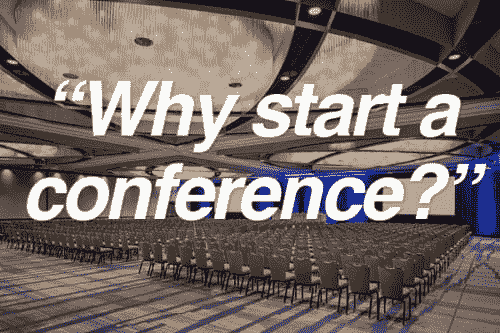
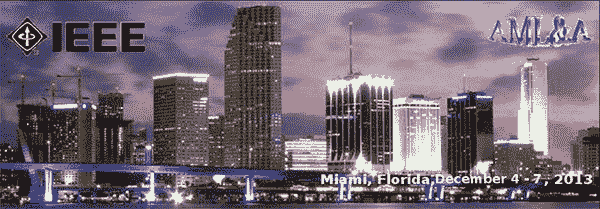
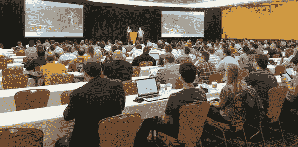
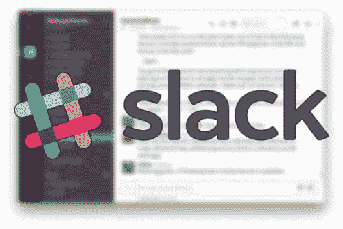

# 我为什么要开一个计算机视觉和深度学习会议

> 原文：<https://pyimagesearch.com/2018/01/15/started-computer-vision-deep-learning-conference/>

PyImageSearch 上的绝大多数博文都非常实用，并且遵循一种特定的模式:

1.  我们探索一个问题。
2.  我们写一些代码来解决这个问题。
3.  我们查看结果，解释哪些可行，哪些不可行，以及我们如何改进解决方案。

我喜欢这种方法，因为它使我能够分享你可以应用到你自己的项目和研究中的算法和技术。

然而，我时不时会写一篇更加个人化的文章，然后 T2 拉开窗帘，向大家展示运行 PyImageSearch 的过程。

今天就是其中之一。

在这篇文章中，我将近距离观察 [PyImageConf 2018](https://www.pyimageconf.com/) ，包括我的想法和背后的理性:

*   为什么我参加的第一次机器学习会议完全是一场灾难…
*   …为什么这完全是我的错
*   我为什么启动 PyImageConf
*   我参加的任何会议的两个“必备”特征
*   为什么您应该参加 PyImageConf 以及您将从中获得的价值

**看看 PyImageSearch 的幕后，以及我开始一场会议的思维过程，*继续阅读。***

## 我参加的第一次机器学习会议完全是一场灾难

**Figure 1:** ICMLA 2013, the first conference I presented at, was a complete disaster. And it was totally my fault (but not for the reasons you might think).

发生了什么事？

基本没有。

这是我的错。

我参加的第一个计算机视觉/机器学习会议是 IEEE 机器学习与应用国际会议(ICMLA) 2013。

会议于 2013 年 12 月 4 日至 7 日在佛罗里达州迈阿密举行。那年马里兰州的冬天特别寒冷，我很感激有机会逃到温暖的地方(享受世界闻名的迈阿密海滩)。

我提前一天到达会场进行登记，继续准备/练习我的演讲。至少可以说，我有点紧张，因为这是我提交的第一篇论文。这篇论文后来成为我博士论文的关键。

第二天，我做了报告——我肯定是那天第二个或第三个发言的人，这让我更加紧张。

当我的时间到了，我振作起来，发表了讲话。

会谈进行得很顺利。这篇论文很受欢迎。批评是次要的，但也是合理的。这几乎是每个发表第一篇论文的年轻研究生都希望的经历。

但是积极的一面也到此为止了。

会议的其余部分是一场灾难，我只能怪自己。

那时我是一个害羞、内向的人——我努力接近人们，进行基本的对话。在晚上的活动中，我不喜欢用酒精来帮助我放松和与人交往。作为一个内向的人，我倾向于从独处中获取能量，那是我最舒服的地方。

整个会议期间，我一共和五个人谈过话。其中一个是管理前台的人。当我要更多毛巾时，另一个是清洁工。其中只有三个是真正的与会者。

我花了会议的剩余时间:

*   独自走在沙滩上
*   独自坐在酒吧里
*   或者被拖进我的房间，看报纸(再次，你猜对了:独自一人)

2013 年对我来说是非常艰难的一年。有很多挑战性的个人/家庭问题正在发生，其中一些我在这篇文章中讨论过[。我有许多个人事务，这使我无法充分利用这次会议。](https://pyimagesearch.com/2017/11/27/image-hashing-opencv-python/)

但更重要的是，我没有学到一项有价值的技能:

走出去，真正向他人学习。

从大学的老师那里学习让我感觉很舒服……但从我刚在一次会议上认识的“陌生人”那里却不舒服。

在回家的飞机上，我记得那次经历让我感到沮丧和气馁。

我发誓再也不会让这种事发生了。

## 下一次会议不是一场灾难…我不会让它发生的

**Figure 2:** At my next conference, I vowed to never let my ICMLA experience happen again.

我在 2014 年 4 月得到了我的救赎。

这一次我不是在参加计算机视觉或机器学习会议——而是在拉斯维加斯参加一个小型企业家会议( [MicroConf](http://www.microconf.com/) )。

我对是否去犹豫不决。

当时，内向的我几乎是在编造借口，避免去拉斯维加斯这样高度刺激、令人无法抗拒的地方。

但我记得我在 ICMLA 的誓言:

我不会让另一场会议成为一场灾难。

我收拾好行李，出发去拉斯维加斯。

在注册过程中，我和会议协调员[史云光·卡斯楚](http://www.startupeventsolutions.com/)聊了聊(他现在是 PyImageConf 的会议协调员，也是你见过的最好的人之一)，问他在拉斯维加斯最喜欢去哪里吃饭。

然后，我走向我看到的第一组人，介绍了我自己，问他们每个人是做什么的。我和这个团队谈了大约 45 分钟，了解了他们的每一项业务。

当我的能量水平开始下降，我感到内向的借口开始出现，告诉我回到我的房间，独自一人，我走到酒吧，点了一杯啤酒。我立刻喝了三分之一的啤酒，然后在接下来的一个半小时里慢慢地啜饮剩下的。这次会议没有任何借口——我不会让我内向的习惯占上风，当我周围有这么多我可以学习的人时，我不会强迫我回到自己的房间。

我继续社交，与他人交谈，**最重要的是，*倾听他人*，T3*整个*接待的其余时间。我从听别人的技术、方法和战争故事中获得的价值，抵得上光是会议门票的价格。**

会议的其余部分取得了巨大的成功。

我不仅没有让历史重演*，而且我也打破了自己的外壳。*

## 你会得到你在会议中投入的东西

从那以后，我参加了无数的会议。有些很棒，有些简直是浪费我的时间。

但是总的来说，我发现让一个会议变得伟大有两个关键因素:

*   你得到你所投入的
*   更小型、更私密的会议通常更好

就像大学或练习一项运动/器械一样，你付出多少就会得到多少。

如果你总是逃课，不交任何朋友，很可能你不会喜欢上大学。

同样，如果你开始学习吉他，然后每月只练习一次，每次 30 分钟，你就不能指望在这方面有任何进步。

会议也是如此。

你需要带着一张清单去参加会议，上面列有你想从中得到的东西。带着目标进去，比如:

1.  我想从戴维斯·金的演讲和研讨会中学习如何训练我自己的自定义对象检测器
2.  我想问凯瑟琳·斯科特关于卫星图像分析的问题
3.  我想问问 Adrian 关于创办一家计算机视觉/深度学习公司是什么感觉的建议

在你上飞机之前，花点时间写下你参加会议的目标。这个列表将指导你，并帮助确保你充分利用这次经历。

其次，我发现小型私密会议通常比大型会议更好。

大型会议人太多(> 500-1000 人)。你不可能见到所有的人——你见到的那些人你只能和他们聊 30 秒钟，然后继续下一个话题。这没有足够的时间去了解这个人，他们的项目，以及你们如何能够互相帮助。这些是遗漏的连接。能对你的职业和项目产生重大影响的人脉。

此外，小型会议有助于您更好地计划(并实现)参加会议的目标:

*   如果与会者人数较少，你就有更多的时间适应演讲者和研讨会主持人。
*   出席的人越少，你就能和出席的人进行越亲密的交谈。

现在，不要误会我的意思——你不能举办一个计划不周的会议，包括不太合适的场地和不合格的发言者，并期望它比 NIPS 好。

但是你能做的是精心策划一个包含两个世界最佳部分的会议:

*   非常著名的演讲者
*   与该领域的专家一对一交流
*   实践讲座和研讨会，在那里你可以学到当晚可以应用到自己的数据集或项目中的技能和技术
*   一个有很多额外待遇的一流场所(美丽的酒店，旧金山湾的景色，供应午餐，晚上的活动，开放的酒吧，数不清的步行距离，旧金山的优秀餐厅，等等。)

这就是 PyImageConf 的*确切地说是*:小巧、私密、实用。

## 我创建了 PyImageConf 作为我想参加的会议(你也会想参加)

**Figure 3:** PyImageConf, the practical, hands-on computer vision and deep learning conference.

在参加了许多会议之后，无论是在计算机视觉/深度学习领域还是在创业领域，我都在寻找两个必须具备的特征:

1.  小型私密活动(少于 250 名与会者)
2.  动手实践——那天晚上在你的酒店房间里，讨论的想法和算法可以应用到你的简历/毫升(或业务，如果是企业家会议)

作为一名与会者，最糟糕的感觉之一就是感觉自己只是另一个统计数字，迷失在人群中。

如果你以前参加过大型会议，你就会知道在这些更大的场所很难建立联系。您可以:

1.  和一群人一起参加会议/快速结交一群朋友，在整个会议期间一起闲逛，以便在几乎势不可挡的与会者海洋中导航。
2.  玩一个永无止境的“快速约会”游戏，你试着花 30 秒和每个人聊天。你不仅不能和每个人聊天，而且(最重要的是)30 秒对你来说太短了，不足以发展一段持久的关系。

关于小型会议，我喜欢的另一个方面是 ***专家更愿意分享他们不能公开分享的技术*** ，无论这是他们用来获得比竞争对手更高准确性的新算法，还是由于雇主规定或害怕嘲笑而不能公布的新方法。包括我自己在内的专家们更愿意开放，在微小的群体中分享。

分享的技术会对你自己的项目产生巨大的影响。

我无法告诉你有多少次我在会议上学会了一种新方法，然后在从会议回家的飞机上将其应用到我的技术工作或业务*(并且能够很快看到结果)。*

总的来说，我参加过的企业家会议*在这些实用的技巧和技术方面胜过*。更大的计算机视觉和机器学习会议在这方面有很多值得学习的地方。

***注:**我在这里做一个概括来说明一个观点，请见谅。并非所有的企业家会议都是动手实践的(老实说，有相当多的会议非常糟糕)。同样，并不是所有的大型 CV 和 ML 会议都只关注理论。但是当你坚持我上面建议的两个特征时，你会发现小型企业家会议在战术内容方面做得非常好。*

PyImageConf 的目标是融合我在这两种类型的会议上获得的积极经验，并将它们应用到计算机视觉和深度学习领域。

你将学习真实世界的计算机视觉和深度学习技术，然后你可以在*晚上*将它们应用到你自己的数据集/项目中(尽管我会建议你等到回家的飞机上，这样你就可以通过在晚上聚会和公开酒吧建立持久的联系来充分利用会议)。

## 为什么要开始一个会议呢？

相信我，这不是钱的问题。

会议的利润率低得离谱，*尤其是像 PyImageConf 这样有与会者名单上限的会议。*

除非你的全职工作是通过吸引尽可能多的与会者来使会议盈利，否则经营会议不是一种长期谋生的方式。如果算上你自己花在计划和执行会议上的时间，你所获得的任何利润(小型会议通常在 10-20%的范围内)都将完全失去。

在这一点上，你可能想知道:

> 阿德里安，如果对你来说开一个会议都不经济，你为什么还要费事呢？为什么不把你的时间投入到写另一本书或者组织一门新课程上呢？

答案很简单:

**这不是关于我，而是关于*你*，PyImageSearch 的读者**(希望还有 PyImageConf attendee)。

PyImageSearch 不仅仅是我。

是的，我写博客、书和课程。但从长远和宏观的角度来看，这并不重要。

真正重要的是 PyImageSearch 的社区。

我们互相学习。

我们在评论区互动。

我们通过电子邮件聊天。

PyImageSearch 大师的成员们每天在论坛上分享项目、算法和技术。

每天，我都会从一个读者的问题中学到一些新东西，这要求我阅读新技术，探索数据集，或者从不同的角度看待计算机视觉/深度学习问题。

这是一个令人难以置信的社区，我相信我有责任继续发展和培育它。虽然我可能是 PyImageSearch 的代言人，但我也谦卑地接受我作为社区管理者的角色——你是真正的*PyImageSearch。*

简单来说:

PyImageConf 是关于我通过创建一个会议来促进计算机视觉和深度学习社区的发展，这个会议以前在这种实际动手的水平上是不存在的。

会议，以及我在会议上建立的联系，改变了我的生活，这次会议也将为你做同样的事情。

在 PyImageConf 会议上，我会确保你在会议开始前至少见到一位出色的与会者，这样你会感觉自己是这个家庭的一员，而不是一个害羞的局外人，不得不鼓起勇气开始一场对话。

我很想在那里见到你，我希望你能来。

## 我为什么要参加 PyImageConf？

您应该参加 PyImageConf，如果您:

*   是一个准备好构建下一个计算机视觉或深度学习应用的企业家
*   你是一名不确定你职业道路的学生，但准备探索计算机视觉、深度学习和人工智能吗
*   是一个计算机视觉爱好者，喜欢构建新的项目和工具
*   渴望向顶级计算机视觉和深度学习教育家学习
*   享受 PyImageSearch 的教学风格，想要个性化的现场培训

如果这听起来像你，请放心，这次会议将是值得你投资的时间，资金和旅行。

我怎么知道这个？

因为我知道像这样的会议有两个组成部分:

*   教育，包括讲座、研讨会等。
*   在招待会、会谈和晚间活动之间建立的联系。

例如:

在会议的某个时刻，你需要站起来出去喝杯咖啡，吃点零食，或者呼吸点新鲜空气。也许这是在你不太感兴趣的谈话中，在问答环节，或者在谈话结束后。

就在舞厅的门外，你还会发现少数其他与会者也在做同样的事情。其中一些与会者将参与关于算法、应用于数据集的技术，甚至他们的业务/咨询工作的深入对话。通俗地说，这在会议行话中被称为*“走廊通道”*。【T2

一些最有价值、最持久的联系可以在“走廊”上建立，因为没有干扰。很安静。很贴心。很容易开始交谈，了解你周围的一小群人在做什么——其他人会很乐意和你交谈。不要低估这些对话。

通过这些对话建立的联系能够:

*   你会遇到能帮助你完成当前项目的人
*   帮你找到下一份计算机视觉或者深度学习的工作
*   为您当前的图像处理业务寻找客户
*   在您的笔记本电脑上演示您的最新项目，获得建议，并继续将您的演示构建到实际的应用程序中
*   找一个也在努力读研究生，但有信心想从事人工智能或人工智能的与会者

## 以下是我如何确保您充分利用 PyImageConf 的方法…

**Figure 4:** Before PyImageConf starts I’ll be creating a Slack group to help you network, create your list of goals, and find attendees you need to meet up with.

为了帮助促进这些联系，在 PyImageConf 2018 前几个月，我将为 PyImageConf 与会者创建一个 Slack 群。

该群组将使您能够在会议开始前与其他与会者聊天。利用这段时间了解其他与会者正在做什么— **，然后利用这些信息来帮助你制定我上面建议的目标清单:**

*   *“我想和哪些演讲者进行一对一的谈话？”*
*   *“哪些与会者可以帮助我当前的项目？”*
*   “我需要会见哪些与会者，以便在我的笔记本电脑上演示我的新项目？”
*   “我将和哪一组与会者共进晚餐，这样我就可以学习他们的专业知识了？”
*   “哪些与会者正在招聘，这样我就可以在计算机视觉/深度学习领域找到一份新工作？”
*   哪些与会者可以给我一些关于研究生院的建议

我还会亲自接触每位与会者，询问你们的目标。如果你没有目标清单，我会帮你列出来。如果你不知道该和哪些与会者聊天来实现你的目标，我会确保帮你建立联系。

PyImageSearch 不仅仅是一个教育博客，它还是一个社区。

如果你想在更私人的层面上了解社区中的读者，并与你可以一起工作、咨询并帮助你实现计算机视觉目标的人会面，那么 PyImageConf 就是你要去的地方。

不要错过门票(它们很可能会很快售完)。 [**确保你现在就加入早鸟名单。**](https://app.monstercampaigns.com/c/ecjnldox9dphdwckleif/)

## PyImageConf 听起来很棒，现在怎么办？

为了开一个小型的私人会议，我把与会者的总人数限制在 200 人。

PyImageConf 2018 go 发售的早鸟票**本周五，1 月 19 日**。公开发售将于 1 月 26 日星期五在**开始。**

在这一点上，我不确定大减价开始时是否还有剩余的票。

**如果您有兴趣参加 PyImageConf 并想要一张门票，请务必点击以下链接并加入早到者名单:**

不要错过获得 PyImageConf 门票的机会， [**点击此处加入早鸟名单**](https://app.monstercampaigns.com/c/ecjnldox9dphdwckleif/) 。

有关更多信息，请参考:

*   【PyImageConf 2018 官方网站
*   PyImageConf 公告博客帖子(包括完整的演讲人名单、研讨会、价格、暂定日程等。)

如果您有任何关于会议的其他问题，请使用下面的评论部分或通过[我的联系表](https://pyimagesearch.com/contact/)联系。

会议将会非常精彩，我希望你能来！