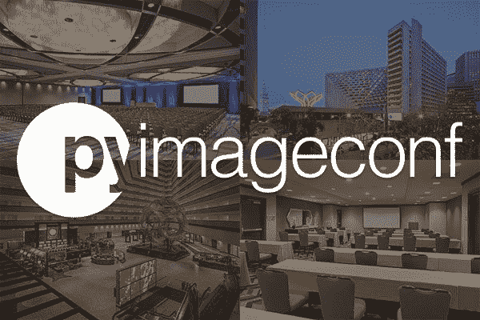
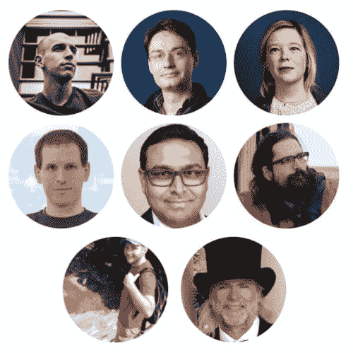

# PyImageConf 2018:实用、动手的计算机视觉和深度学习会议

> 原文：<https://pyimagesearch.com/2018/01/08/pyimageconf-2018-practical-hands-computer-vision-deep-learning-conference/>

今天，我很高兴地宣布我在幕后工作了很长时间的一个活动的最终细节:

[**PyImageConf 2018:实用、动手的计算机视觉大会**](https://www.pyimageconf.com/)

想象一下，采用 PyImageSearch 博客的实用、动手教学风格…

并将其转化为现场的面对面会议。

听起来有趣吗？

请继续阅读，了解为什么您应该参加 PyImageConf。

### 会议在何时何地举行？

PyImageConf 2018 将于 8 月 26 日至 28 日在加利福尼亚州旧金山的凯悦酒店举行。

*   会谈将在凯悦酒店精致的艺术级宴会厅举行
*   研讨会和分组会议将利用酒店的专用工作空间
*   每天提供餐饮、坐下来吃午餐(给你足够的时间来建立关系网和社交)
*   还将包括晚间活动，包括演示、演示、社交和开放酒吧

### 谁将发言？

**Figure 1:** PyImageConf 2018 speakers include Adrian Rosebrock, François Chollet, Katherine Scott, Davis King, Satya Mallick, Joseph Howse, Adam Geitgey, Jeff Bass, and more.

PyImageConf 汇集了计算机视觉、深度学习和 OpenCV 教育领域的知名人士，为您提供最好的现场实践培训和讲座。

每个演讲者分别以他们的写作、教学、在线课程和对开源项目的贡献而闻名。

目前已有八位确认的演讲者和研讨会主持人，稍后还会有更多人加入:

*   **Fran ois Chollet:**作者 [Keras 深度学习库](https://keras.io/)。[谷歌](https://research.google.com/pubs/105096.html)深度学习和人工智能研究员。作品在 CVPR、日本、ICLR 等地出版。
*   **Katherine Scott:**[行星实验室](https://www.planet.com/)的图像分析团队负责人。卫星图像分析专家。Tempo Automation 和 Sight Machine 的前联合创始人。《T4》的合著者。
*   **戴维斯·金:**作者 [dlib 库](http://dlib.net/)。物体探测专家。十多年来，开源开发者和从业者一直在构建行业 CV 系统。
*   Satya Mallick:[learn openv](https://www.learnopencv.com/)的作者和创作者。人脸专家的计算机视觉。在 CV 和 ML 工作的企业家。
*   **约瑟夫·豪斯:**帕克特出版社出版的[六部计算机视觉/OpenCV 书籍的作者](https://nummist.com/opencv/)。通过他的公司 [Nummist Media](https://nummist.com/) 进行计算机视觉和咨询。增强现实、虚拟现实和红外计算机视觉系统方面的专家。
*   **亚当·盖特吉:***的作者[机器学习很有趣！](https://medium.com/@ageitgey/machine-learning-is-fun-80ea3ec3c471)*博客系列，领英学习，和 Lynda.com。喜欢用机器学习和计算机视觉来构建产品。
*   **Jeff Bass:** Raspberry Pi 黑客，计算机视觉从业者，计量经济学精灵，35 年统计学经验。
*   **Adrian rose Brock:**PyImageSearch.com 的作者和创造者， *[实用 Python 和 OpenCV](https://pyimagesearch.com/practical-python-opencv/)* ， *[PyImageSearch 大师](https://pyimagesearch.com/pyimagesearch-gurus/)* ， *[用 Python 进行计算机视觉的深度学习](https://pyimagesearch.com/deep-learning-computer-vision-python-book/)* 。计算机视觉企业家。

### 谁应该参加？

您应该参加 PyImageConf，如果您:

*   是一名准备好驾驭计算机视觉和深度学习浪潮并开发新产品/应用的企业家
*   你是一名不确定你职业道路的学生，但准备探索计算机视觉、深度学习和人工智能吗
*   是一个计算机视觉爱好者，喜欢构建新的项目和工具
*   渴望向顶级计算机视觉和深度学习教育家学习
*   享受 PyImageSearch 的教学风格，想要个性化的现场培训

如果这听起来像你，请放心，这次会议将非常值得你投资的时间，资金和旅行。

### 会有多少张票？

PyImageConf 将是一个小型且私密的会议，最多可容纳 200 名与会者。

我*特意*将会议开得很小，以便您能够:

*   最好向演讲者和演示者学习
*   与计算机视觉和深度学习专家进行一对一的激光聚焦
*   更好地与你的同行和同事建立联系

一旦票卖完了，我不会(也不能)再加了。

### 门票多少钱？

门票价格:

*   **745 美元给[的 PyImageSearch 大师会员](https://pyimagesearch.com/pyimagesearch-gurus/)，他们也将获得门票的优先权**
***   845 美元面向早期读者和普通读者**

 **这可能看起来很多，但请记住，您的 PyImageConf 票证包括:

*   整整两天的会谈、研讨会和培训
*   每天供应午餐
*   三场晚间活动(包括一个开放的酒吧)

大多数会议对这类活动的收费都超过 1500-2500 美元。

我的目标是尽可能地降低成本，同时确保我们的活动规模小且私密。

现在花时间检查一下你的工作、配偶、孩子、保姆等。指定你的资金去买一张票。

### 票什么时候开始出售？

门票将开始发售:

*   1 月 19 日星期五获取 PyImageSearch 大师和早鸟名单(大师成员将提前几小时收到购票链接)
*   1 月 26 日星期五全面发售

在这一点上，我不确定大减价开始时是否还有剩余的票。

**如果您有兴趣参加 PyImageConf 并想要一张门票*，请*点击以下链接并加入早鸟名单:**

不要错过购买 PyImageConf 门票的机会，[点击此处报名参加早期投标列表](https://app.monstercampaigns.com/c/ecjnldox9dphdwckleif/)。

### 试验性时间表

为了让你们感受到 PyImageConf 所付出的努力和思考，我在下面附上了一份(暂定的)讲座和研讨会时间表:

**第一天:2018 年 8 月 26 日**

*   **下午 6:30-9:30:**注册-现场注册将于下午 6:30 在凯悦酒店中庭开始
*   **晚上 7:30-11:30:**开业酒会、社交、酒吧

**第二天:2018 年 8 月 27 日**

*   **上午 7:30-下午 5:30:**PyImageConf 讲座-大宴会厅的大门将于上午 8 点打开
*   **上午 7:30-11:00:**迟到登记
*   **上午 9:00:**亚当·盖特基——生成性对抗网络(GANs)的应用
*   **上午 10:00:**萨提亚·马利克——计算机人脸视觉
*   **上午 11:00:**戴维斯·金——培训和改进您的物体探测器
*   **中午 12:00-下午 1:30:**在专用用餐区供应午餐
*   **下午 1:30:**杰夫·巴斯——树莓派和计算机视觉
*   **下午 2:30:**Joseph Howse——虚拟现实和增强现实
*   **下午 3:30:**凯瑟琳·斯科特——卫星图像分析
*   **下午 4:30:**弗朗索瓦·乔莱——深度学习
*   **下午 5:30:**Adrian rose Brock——启动计算机视觉或深度学习初创公司的实用可行步骤
*   **晚上 8:30-11:30:**网络、社交、酒吧

**第三天:2018 年 8 月 28 日**

*   **上午 9:00-下午 4:30**PyImageConf 研讨会
*   **研讨会将包括:**
    *   实用深度学习和计算机视觉指南
    *   用于面部识别和其他面部应用的计算机视觉
    *   训练你自己的自定义物体探测器的完整指南(包括提示和技巧)
    *   增强现实和虚拟现实与计算机视觉
    *   Raspberry Pi +计算机视觉项目
    *   *…更多精彩即将到来！*
*   **上午 9:30-下午 12:00:**研讨会第一部分
*   **中午 12:00-下午 1:30:**在专用用餐区供应午餐
*   **下午 1:30-4:30:**工作坊第二部分
*   **下午 4:30-5:30:**PyImageConf 总结
*   **晚上 8:00-11:00:**网络、社交、酒吧

正如你所看到的，我已经花了很多心思来组织这次会议，并确保它将成为今年最好的计算机视觉+深度学习教育会议。

### 听起来很棒，接下来我该做什么？

门票可能会很快销售一空…问问任何一个长期阅读 PyImageSearch 的读者，他们会告诉你像这样的特别活动/销售会多快销售一空:

*   几年前，我在 Kickstarter 上为 PyImageSearch 大师课程发起了一场活动——所有早期特价商品都在 30 分钟内销售一空。
*   2017 年 1 月，我发起了第二次 Kickstarter 活动，这一次是为了我的新书，*用 Python 进行计算机视觉的深度学习*——所有早鸟特价**在不到 15 分钟内售罄*。***
*   去年 11 月，我向在黑色星期五购买我的书的前 30 名读者提供了免费的 NVIDA Jetson TX2s 和 Raspberry Pis 所有 30 本书都在 3 分钟多一点的时间内售罄。

我以前从未提供过像这样的现场、面对面的培训项目或会议，但鉴于只有**200 张门票可用**，我预计这些门票会很快售罄。

事实上，我不确定在 1 月 19 日**周五**的早鸟销售之后还会有*任何*票剩余(我不建议等到 1 月 26 日周五的大减价——你可能会错过票)。

**如果您有兴趣参加 PyImageConf 并想要一张门票，请务必点击以下链接并加入早鸟名单:**

[> >点击这里加入早鸟名单](https://app.monstercampaigns.com/c/ecjnldox9dphdwckleif/)

这将是一个爆炸！我希望你能按时到达。**