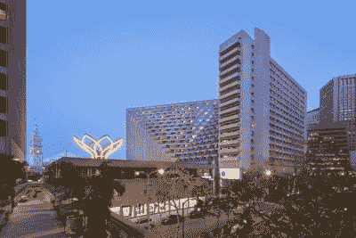
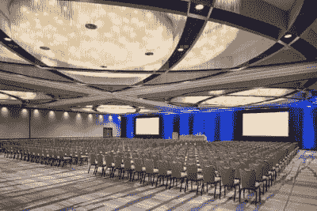
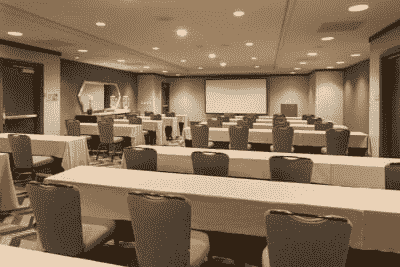
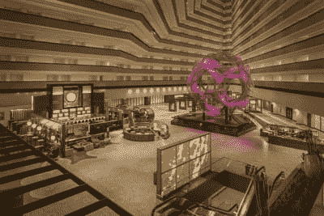

# 保存日期:PyImageConf 2018

> 原文：<https://pyimagesearch.com/2017/11/20/save-date-pyimageconf-2018/>

想象一下，采用 PyImageSearch 博客的实用、动手教学风格…

并将其转化为现场的面对面会议。

听起来有趣吗？

如果是这样，现在就在日历上标出日期:

[PyImageConf](https://www.pyimageconf.com/) 将于 2018 年 8 月 26 日至 28 日在**三藩市凯悦酒店**举行。****

确认的演讲者/研讨会主持人包括:

*   弗朗索瓦·乔莱(Keras 创始人，谷歌研究员)
*   凯瑟琳·斯科特(行星实验室 SimpleCV 的合著者)
*   戴维斯·金(dlib 的创建者)
*   萨提亚·马利克(LearnOpenCV 的作者)
*   Joseph Howse(六部计算机视觉/OpenCV 书籍的作者)
*   亚当·盖特基(*的作者机器学习很有趣！*中等级数)
*   杰夫·巴斯(树莓派黑客)
*   阿德里安·罗斯布鲁克(就是我！)
*   *…更多精彩即将到来！*

**要了解更多关于 PyImageConf 的信息(以及为什么您应该参加)，请*继续阅读。***

## 保存日期:PyImageConf 2018

PyImageConf 是一个实用的动手会议，以计算机视觉、深度学习和 OpenCV 专家为特色。

如果你想与领先的计算机视觉和深度学习专家交流、建立联系并向他们学习(并在旧金山与我们一起玩几天)……**[你现在就想加入等待名单。](https://www.pyimageconf.com/#claim_your_spot)**

### 谁在发言/发言？

**Figure 1:** [PyImageConf 2018](https://www.pyimageconf.com/) speakers include Adrian Rosebrock, François Chollet, Katherine Scott, Davis King, Satya Mallick, Joseph Howse, Adam Geitgey, Jeff Bass, and more.

PyImageConf 汇集了计算机视觉、深度学习和 OpenCV 教育领域的知名人士，为您提供最佳的现场实践培训和讲座。

每个演讲者分别以他们的写作、教学、在线课程和对开源项目的贡献而闻名。

目前有八位已确认的演讲者/研讨会主持人，稍后还会增加更多:

*   **弗朗索瓦·乔莱:**[谷歌](https://research.google.com/pubs/105096.html)人工智能研究员。 [Keras 深度学习库](https://keras.io/)的作者。作品在 CVPR、日本、ICLR 等地出版。
*   **Katherine Scott:**[行星实验室](https://www.planet.com/)的图像分析团队负责人。Tempo Automation 和 Sight Machine 的前联合创始人。《T4》的合著者。
*   **戴维斯·金:**作者 [dlib 库](http://dlib.net/)。机器学习，计算机视觉，自然语言处理。十多年来，开源开发者和从业者一直在构建行业 CV 系统。
*   Satya Mallick:[learn openv](https://www.learnopencv.com/)的作者和创作者。TAAZ 公司的联合创始人，在 CV 和 ML 工作的企业家。
*   **约瑟夫·豪斯:**帕克特出版社出版的[六部计算机视觉/OpenCV 书籍的作者](https://nummist.com/opencv/)。通过他的公司[nummit Media](https://nummist.com/)提供计算机视觉和咨询服务。
*   **亚当·盖特吉:***的作者[机器学习很有趣！](https://medium.com/@ageitgey/machine-learning-is-fun-80ea3ec3c471)*博客系列，领英学习，和 Lynda.com。喜欢用机器学习和计算机视觉来构建产品。
*   **Jeff Bass:** Raspberry Pi 黑客，计算机视觉从业者，计量经济学向导，35 年统计学、经济学和生物技术经验。
*   **Adrian rose Brock:**PyImageSearch.com 的作者和创造者， *[实用 Python 和 OpenCV](https://pyimagesearch.com/practical-python-opencv/)* ， *[PyImageSearch 大师](https://pyimagesearch.com/pyimagesearch-gurus/)* ， *[用 Python 进行计算机视觉的深度学习](https://pyimagesearch.com/deep-learning-computer-vision-python-book/)* 。

如果你正在寻找一个由最重要的教育家和演讲者参加的计算机视觉/深度学习会议，这就是它。

### 什么时候？

PyImageConf 将于 2018 年 8 月 26-28 日**举行。**

门票将于 2018 年 1 月**开始发售。**

如果你想要一张票，请确保你在队伍中占有一席之地。

### 在哪里？

会议将在新改建的 [**旧金山凯悦**](https://sanfrancisco.regency.hyatt.com/en/hotel/home.html) 酒店举行，就在美丽的旧金山湾水线上。

会谈将在他们精致的最先进的宴会厅举行，研讨会/分组会议将利用酒店的专用工作区。

看看下面的照片，感受一下这个空间——我相信你会同意这将是今年的**计算机视觉和深度学习事件:**

**

**Figure 1:** PyImageConf 2018 will be held at the newly renovated Hyatt Regency in San Francisco CA. The hotel is right on the San Francisco Bay waterline and walking distance to popular attractions, restaurants, and bars.

**Figure 2:** The conference itself will be held the Grand Ballroom with state-of-the-art visual/audio and reliable high-speed WiFi.

**Figure 3:** Along with the talks we’ll have a number of smaller, intimate workshops where you’ll learn techniques you can apply to your work and projects.

**Figure 4:** Registration and evening events will take place in the Hyatt Regency ballroom.

### 多少钱？

我正在和我的会议协调员敲定门票价格，但预计价格会在 700-900 美元之间。

这可能看起来很多，但请记住，这包括两整天的会谈、研讨会和培训——大多数会议对此类活动的收费远远超过 1，500-2，500 美元。

如果你是 PyImageSearch Gurus 的会员，你将享有优先购票权(以及折扣)。

现在花点时间和你的利益相关者(配偶、孩子等)确认一下。)并专款抢票。

### 会有多少张票？

这个会议将会很小而且很私密，最多 200 名与会者。

我*特意*将会议开得很小，以便您能够:

*   向演讲者和演示者学习
*   与计算机视觉和深度学习领域的专家进行一对一的交流
*   更好地与你的同行和同事建立联系

一旦 200 张票卖光，它们就都没了，我不会再增加了。

### 门票将销售一空… *所以赶快加入早鸟名单吧！*

如果你是一个长期的 PyImageSearch 读者，我不需要告诉你这些类型的销售销售有多快。

几年前，当我在 Kickstarter 上为 PyImageSearch 大师课程开展活动时，所有早期特价商品在 30 分钟内售罄**。**

今年 1 月，我用 Python Kickstarter 推出了用于计算机视觉的[*——所有早鸟特价商品都在 15 分钟内被认领 ***。****](https://www.kickstarter.com/projects/adrianrosebrock/deep-learning-for-computer-vision-with-python-eboo)

鉴于只有 200 张门票，我预计所有门票将在门票上线后 10 分钟内销售一空。

所以，如果你想要一张去 PyImageConf 的票…

***[……请务必点击这里，登上早鸟名单！](https://www.pyimageconf.com/#claim_your_spot)***

## **总结**

这是 TL。DR；

*   PyImageConf 将于 2018 年 8 月 26 日至 28 日在旧金山凯悦酒店举行。
*   我将会议人数控制在 200 人以内，以保持会议的小型、私密和亲历性。
*   已确认的演讲嘉宾包括弗朗索瓦·乔莱(Keras)、戴维斯·金(dlib)凯瑟琳·斯科特(SimpleCV/Planet Labs)、萨提亚·马里克(LearnOpenCV)、阿德里安·罗斯布洛克(就是我！)等。
*   门票将于 2018 年 1 月**开始发售。**
*   如果你想要一张 ***[的票，你需要排队](https://www.pyimageconf.com/#claim_your_spot)*** (票会很快卖光**)。****