# 阿德里安& # 183；罗斯布鲁克的一天:计算机视觉研究者、开发者和企业家。

> 原文：<https://pyimagesearch.com/2017/01/30/a-day-in-the-life-of-a-adrian-rosebrock-computer-vision-researcher-developer-and-entrepreneur/>

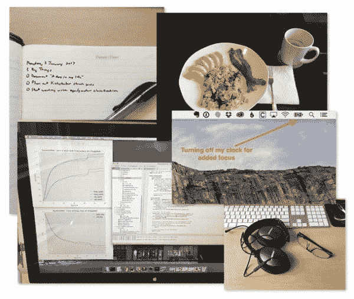

有没有想过作为一名计算机视觉研究人员或开发人员是什么感觉？

你并不孤单

在过去几年运行 PyImageSearch 的过程中，我收到了传统计算机视觉和 OpenCV 问题之外的电子邮件和询问。

相反，他们关注的是更加个人化的东西——我的日常生活。

PyImageSearch 读者 Jared 问道:

> “做计算机视觉研究者和开发者是什么感觉？你每天都在做些什么？”

另一位读者米格尔问道:

> “你写了一本计算机视觉的书和一门课程。现在你开始写一本关于深度学习的新书？你是如何做到这一切的？你的秘诀是什么？”

Saanvi 的建议是我个人最喜欢的建议之一:

> "阿德里安，你应该写下一本关于生产力的书."

现在，用 Python 进行计算机视觉深度学习的Kickstarter 活动已经上线，我收到的这些问题比以往任何时候都多。

正因为如此，我想我今天可以做一些稍微不同的事情——给你一个独家的幕后故事，请看的:

*   我如何度过我的一天。
*   在 PyImageSearch 上平衡我作为一名计算机视觉研究员/开发人员和一名 T2 作家的角色是什么感觉。
*   我花了几年时间完善的习惯和做法帮助我完成了任务。

**想看看站在我的立场过一天是什么感觉，*继续阅读。***

## 上午(上午 5:15-中午 12:00)

下面这篇博文记录了我 1 月 23 日星期一的日常活动。

### 起床

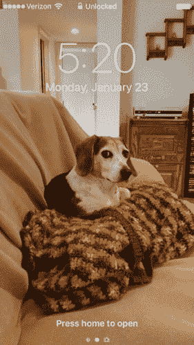

**Figure 1:** I wake up around 5:15AM-5:20 every morning.

凌晨 5 点 20 分。

我的 iPhone 闹铃响了。

我伸手过去，几秒钟后关掉它，重新调整意识。

该起床了。

我对此毫不犹豫。

我没有查看脸书的通知。我看起来不像推特。我甚至没有想过要检查电子邮件。

我坐起来

拉伸。

立刻喝掉我床头柜上 12 盎司的 Nalgene 水。

水有助于启动我的新陈代谢，冲走前一天晚上积累的毒素，最重要的是，*帮助我补充水分*——此时我已经 8 个小时没有喝水了，我需要补充水分。毕竟你的脑组织 75%是水。

这 12 盎司的水是我今天剩余时间里要喝的第一杯**~ 200 盎司**。

新的一天已经开始，我只有一个目标:把事情做完。

### 咖啡因(战略上)

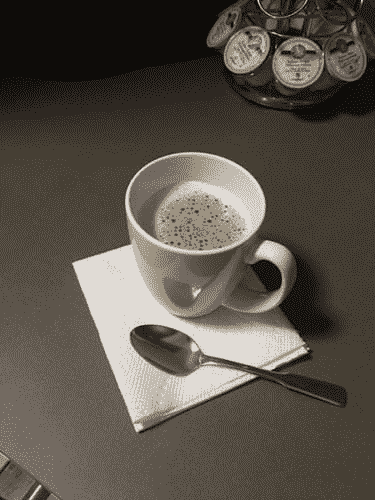

**Figure 2:** Every day starts off with a strong cup of coffee with a splash of heavy cream. This is my only caffeine intake for the entire day.

我的工作日马上开始。

我从卧室走到厨房，准备了一杯美味的热咖啡——这是我一整天唯一会喝的咖啡因。

不要误会我的意思:

我喜欢咖啡。

但我也坚信咖啡因的战略用途(无论是咖啡还是茶)。

回到研究生院，我会在早上喝一大杯咖啡，午饭后喝一大杯 Dunkin Donuts 的冰咖啡。到了下午，我感到筋疲力尽。我没有意识到我摄入的咖啡因实际上是在*伤害*我的生产力。

咖啡因可能会给你一个短期的能量冲击，但它也会在一天的晚些时候带来崩溃。因此，我们实际上可以把摄入咖啡因看作是在一天的晚些时候从 T2 那里借用能量。能量和注意力必须来自某个地方。不幸的是，这笔“贷款”必须在我们撞车的那个下午支付。

两年前，我停止摄入大量咖啡因。

现在我只吃了一份(非常)浓的黑烤肉，外加一点浓奶油。浓稠的奶油含有帮助大脑快速启动的脂肪。我尽可能避免吃糖。

### 神经网络训练检查

我目前正在 Kickstarter 上开展一项活动，为我的新书《用 Python 进行计算机视觉的深度学习的 T2》筹集资金。

为了这本书，我正在进行一系列的实验，在这些实验中我训练了各种网络架构(AlexNet、VGGNet、SqueezeNet、GoogLeNet、ResNet 等等)。)在*海量* ImageNet 数据集上。

我目前正在为 VGGNet 和 SqueezeNet 运行实验。这些网络已经训练了一夜，所以我需要:

*   检查它们的精度/损耗曲线。
*   确定网络是否过度拟合(或有过度拟合的风险)。
*   调整任何相关的超参数(即学习率、体重衰减)并重新开始训练。
*   估计我应该什么时候再次检查网络。

首先是 VGGNet:

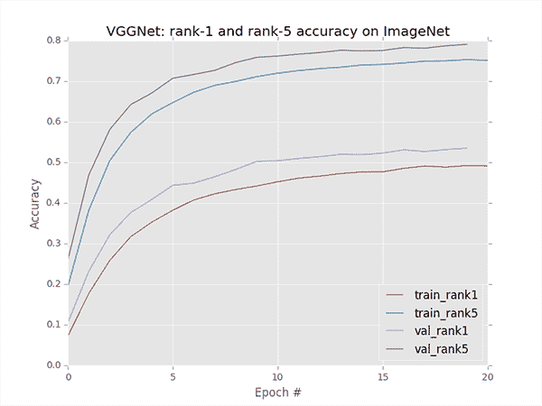

**Figure 3:** VGGNet is hitting 53.52% rank-1 accuracy after 20 epochs. Learning is starting to stagnate, but adjusting the learning rate now would be too early.

仅仅经过 20 个时期的训练，VGGNet 就达到了 53.52%的排名第一的准确率。

准确性(和损失，未图示)开始略微停滞——我可能不得不在接下来的 20 个时期内将学习率从 1e-2 降低到 1e-3。

然后是 SqueezeNet:

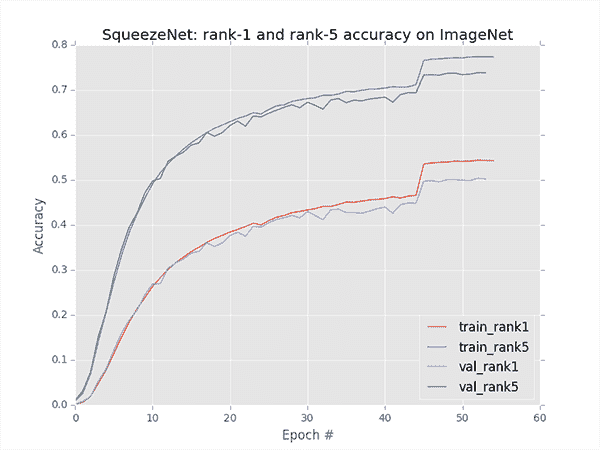

**Figure 4:** Learning has definitely stagnated for SqueezeNet. Time to update the learning rate.

用 1e-2 学习率训练 0-45 个时期。随着训练和验证精度/损失在第 45 个纪元开始出现分歧，我将学习率更新为 1e-3。

然而，我们现在可以看到学习相当停滞，无法超越 50.2%的 rank-1 驼峰。

我们也有一点过度拟合，但没有太可怕的担心。

我将把学习速率改为 1e-4，但我并不真的期望在这一点上从实验中获得更大的准确性。

未来的实验包括用一个泄漏的 ReLU 变体(如 eLU)替换默认激活函数(ReLU)。我还在考虑在架构中添加 BatchNorm 层，因为我不知道以前有任何 SqueezeNet 实验做到了这一点，但我以前见过它(成功地)与其他微架构一起工作，如 GoogLeNet 和 ResNet(毕竟，实验是一半的乐趣)。

我每天早上花前 10 分钟查看训练进度的原因是，我可以更新任何相关的超参数，并继续训练网络。

其中一些网络可能需要花费*长的*时间来训练(VGGNet 目前每个历元花费约 2.9 小时)，因此花时间查看准确性/损失、*然后继续你的一天*(并尝试不要再去想它们，直到你有*更多的*数据来做出明智的决定)。

当我第一次开始研究深度学习时，我犯了一个严重的错误:过于频繁地查看我的损失/准确性图表。

当训练深度神经网络时，你通常需要 10-15 个时期的*上下文*来做出关于更新学习速率和在哪个时期重新开始训练的*的明智决定。没有这个背景，你会发现自己在原地打转，*过度思考*训练过程。*

让你的网络训练。

结果会出来的。

然后你就能做出如何继续的明智决定。

### 电子邮件呢？

你可能想知道为什么我不打开我的收件箱，阅读我的电子邮件？

答案是因为早晨是我一天中最有效率和创造力的时间，因此我会非常小心地守护这段时间。一天中的这几个小时相当于生物的黄金时间，我在这段时间精力最充沛，也最有可能高效工作。

**简而言之，我每天这个时间的目标是尽快达到[流畅状态](https://en.wikipedia.org/wiki/Flow_(psychology))**尽可能长时间保持。****

 *我将电子邮件归类为*程序性任务*——阅读电子邮件、回复、重复，直到收件箱清空。这不是需要创造性能量的任务。

另一方面，我承担的许多任务本质上都是创造性的。例子包括:

*   写一篇新的博客文章/教程。
*   在我即将出版的深度学习书籍中概述一个章节。
*   研究一段复杂的代码。
*   研究新的算法。

所有这些任务都需要来自创造性方面的额外脑力。我早上都在做这类工作。电子邮件有它的位置，只是直到一天的晚些时候。

### 规划我的“三件大事”

一两年前，在一次会议上，我第一次从[罗布·沃林](http://www.softwarebyrob.com/)那里听到了*“无情的执行”*。这个想法的基础是我们都熟悉的东西:

1.  将一个复杂的项目分解成更小的部分/子部分。
2.  单独完成每件作品。
3.  把这些碎片结合起来，形成问题的解决方案。

*无情执行*的概念集中在第 2 步。一旦我们确定了组成整体的各个部分，我们就需要**坚持不懈地、持续不断地**每天完成它们。

这也与*增量改进—* **齐头并进，小的、持续的每日变化在一段时间内累积起来会产生大的增长。**

为了促进这个过程，我每个星期天早上都计划好下周要完成的任务。你可以把这个列表看作是开发人员使用的一个非正式的 sprint 任务列表，除了:

1.  这个列表结合了业务*和*软件任务。
2.  每周一次，而不是每 2-3 周一次。

每天早上，我从我的每周清单中选择三项任务，并把它们添加到我的 T2 3 件大事中，这三件事是我当天要完成的:

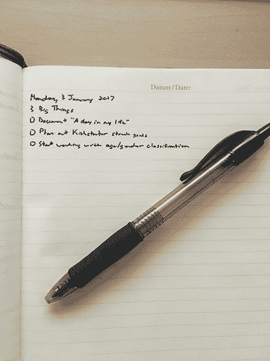

**Figure 5:** Setting my “3 Big Things” for the day. My goal will be to accomplish all three of these tasks before my day ends. (*Note:* Apparently I missed the “3” in “23” when writing in my notebook that day — I’m only human after all!)

今天我的三大任务是:

1.  文档*“我生命中的一天”*(这让我写了这篇博文)。
2.  为我的深度学习书籍([你可以在这里找到](https://www.kickstarter.com/projects/adrianrosebrock/deep-learning-for-computer-vision-with-python-eboo/posts/1790713))规划 Kickstarter 的延伸目标。
3.  开始研究年龄/性别分类(在我即将出版的深度学习书中，有一章将演示如何使用 CNN 从照片中对一个人的年龄和性别进行分类；在这篇文章的后面会有更多的介绍)。

再说一次，富有成效和解决挑战性的问题并不是一下子就能解决的。相反，把大而复杂的问题分解成小块，然后逐个解决。每天都这样做可以保证你获得越来越多的“胜利”,从长远来看。更不用说，在短期内瞄准较小的胜利可以让你创造动力，让你的大脑产生良好的内啡肽。

如果你还没有注意到，我是一个超级生产力极客，所以如果你有兴趣了解更多关于生产力黑客的知识，你可以把它应用到你自己的生活中，看看克里斯·贝利的 *[生产力项目:通过管理你的时间、注意力和精力](http://amzn.to/2ksN3Sa)* 取得更大成就。

我通常不推荐生产力书籍(因为它们倾向于重复相同的材料)，但克里斯的书是真的。

### 从项目#1 开始

在我计划好一天的“三件大事”后，我会立即开始第一件。

今天是一个特殊的案例，因为我已经*记录了我的一天，并将持续一整天。*

然后，我进入第二步，规划 Kickstarter 延伸目标。我会继续做这个任务直到早餐。

### 早餐

我妈妈总是告诉我，早餐是一天中最重要的一餐——我从来不相信她的话，但话说回来，那可能是因为我在大学时直到上午 10:30 才起床。

直到我开始每天早上 5 点左右起床，我的观点才转变，我意识到早餐(T2)是最重要的一餐(至少对我来说)。

吃一顿由蛋白质、脂肪和蔬菜组成的丰盛健康的早餐，可以确保我能够摆脱咖啡因的影响，继续保持高效，即使是在早上快结束的时候。此外，高蛋白、高脂肪的饮食可以确保脂肪在一天的剩余时间里提供更长时间、可持续的能量燃烧——当我下午去健身房时，这也是有益的。

对于那些健康爱好者(像我一样)，我指的是一种[古代风格的饮食](https://en.wikipedia.org/wiki/Paleolithic_diet)，一种主要由蔬菜、水果、坚果、根茎和肉类组成的饮食。乳制品(重奶油中没有乳糖)、谷物和加工食品都要避免。

旧石器时代的饮食有许多不同的解释，我花了几年时间才找到适合我的。例如，我已经能够在我的饮食中添加少量的乳制品(如奶酪),而没有负面影响。关于这些类型的饮食，有趣的部分是找到适合你个人的*。*

 *就我而言，我很幸运有一个每天早上准备早餐的未婚夫(是的，*每天早上*)。我非常幸运，也非常感激自己中了这样的大奖。

大约早上 7:45，在她去上班之前，我和她一起吃早餐。这样做可以确保我们每天早上都有美好的时光:

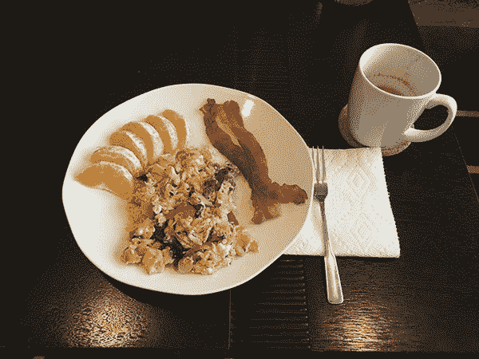

**Figure 7:** Between 7-7:30AM each morning I have a breakfast heavy in proteins and fats.

今天我有:

*   用香肠、洋葱、辣椒和菠菜炒的三个鸡蛋。
*   两片熏肉。
*   一把橘子片。

她和我一起吃早餐，然后大约 8:15 我回去工作。

### 关闭通知

早餐后，所有的通知都会消失，这样我就可以达到并保持心流状态。

我的 iPhone 静音了。

Slack 被关闭了。

我甚至没想过要去脸书、推特或 reddit 上看看。

接下来，我戴上贡纳眼睛眼镜(以减少眼睛疲劳；如果我在紧张的情况下眼睛疲劳太久，我会出现[眼部偏头痛](http://www.webmd.com/migraines-headaches/guide/ocular-migraine-basics)和取消噪音耳机以确保不受打扰的问题:

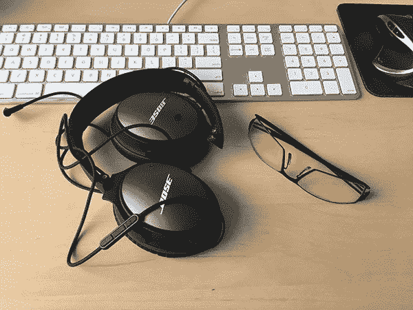

**Figure 8:** Noise canceling headphones and strain reducing glasses help me reach (and sustain) flow state.

最后，我甚至关闭了桌面上的实际时钟:

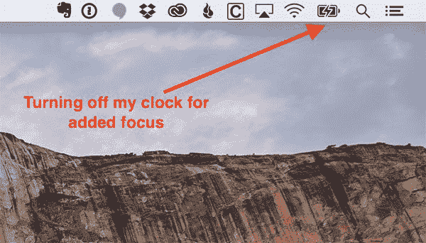

**Figure 9:** No distractions include turning off the clock on my desktop.

时间是持续的干扰。放下工作抬头想想*“伙计，我已经干了 40 分钟了”*然后让你的头脑去思考，这太容易了。简而言之，看钟打破心流状态。

相反，关掉你的时钟，停止关心——你会意识到时间是相对的，当你自然疲倦时，你就会脱离心流。

现在我已经“进入状态”，我的目标是完成 Kickstarter 延伸目标的规划，同时为谷歌网的*初始模块*和瑞思网的*剩余模块*创建可视化效果

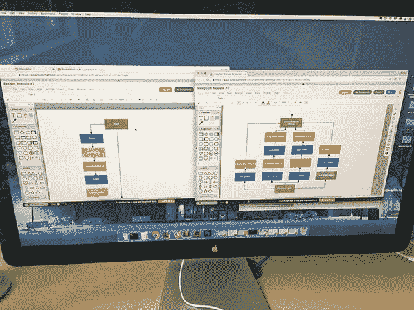

**Figure 10:** Tackling the first task on my list for the day — planning the stretch goals and designing images for them.

到上午 10 点 54 分，我已经完成了 Kickstarter 延伸目标和网络模块可视化的计划。

从那里我脱离了心流，这样我就可以在社交媒体上分享最新的 PyImageSearch 博客帖子(因为今天是周一，新帖子会在周一发布):

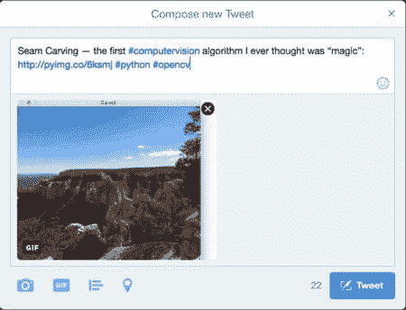

**Figure 11:** Since it’s a Monday I need to compose a tweet for the latest blog post that was just published on PyImageSearch.com.

午饭前，我再次在 SqueezeNet 上登记，发现损失和准确性已经达到顶点。我也看到过度拟合的威胁变得令人烦恼(但同样，并不可怕):

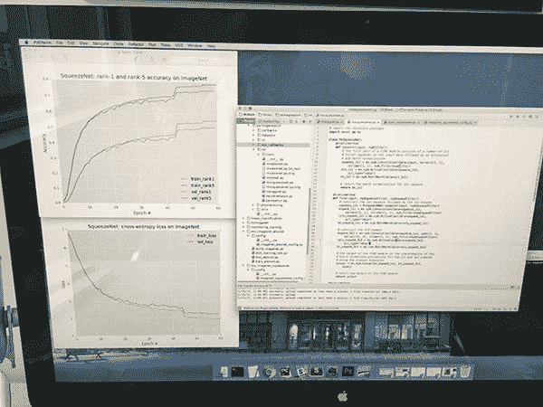

**Figure 12:** Maxing out SqueezeNet accuracy for my current experiment. Time to record the results in my lab journal and try something new.

我将结果记录到我的实验室日志中，然后更新代码来试验 BatchNorm。我开始实验——然后该吃午饭了。

### 午餐

我吃午饭的理想时间是上午 11:00-11:30。

我通常吃前一天晚上的剩饭或者街边商店的沙拉。因为我没有昨晚的剩菜，所以我选择了沙拉:

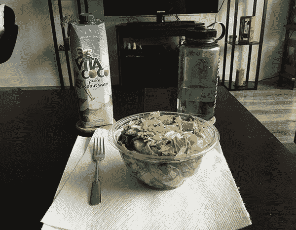

**Figure 13:** A lighter lunch, but still packed with good fats.

我的沙拉里有烤火鸡、西红柿、鳄梨(健康脂肪！)是的，还有一点点奶酪。正如我上面提到的，这些年来我调整了自己的个人饮食，发现我可以食用少量的乳制品，而不会影响我的能量水平或整体健康。

在这一点上，我开始消耗我每天的配额[椰子水](https://en.wikipedia.org/wiki/Coconut_water)(大约 300 毫升)以及我的常规水。椰子水有助于降低皮质醇水平，从而减少压力。它也是钾的良好来源。

### 冥想和正念

午饭后，我花 10-15 分钟沉思。我个人喜欢用[冷静 app](https://www.calm.com/) :

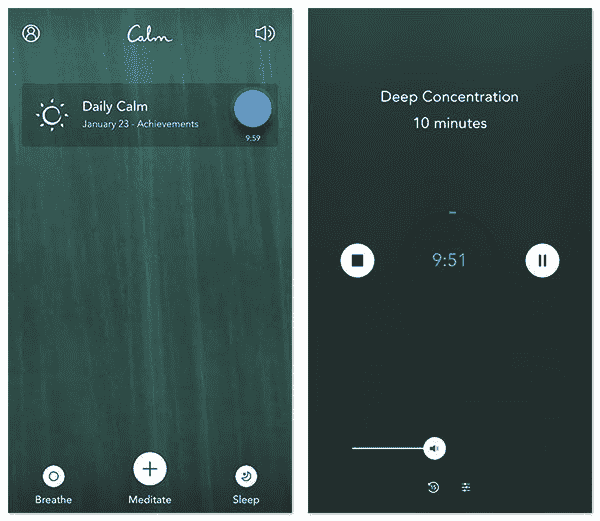

**Figure 14:** I like to use the Calm app for mindfulness and meditation.

一点点正念让我重新集中注意力，继续我的一天。

## 下午(中午 12 点至下午 5 点)

我从我的“三件大事”清单中挑出下一个未完成的任务，开始我的下午。我继续关闭通知，戴上我的降噪耳机。

如果我在概述一个教程或者写一篇博客，我倾向于器乐。*这会毁了你*、*天空中的爆炸*和*上帝是一个* *宇航员*是这类任务的个人最爱。缺少歌词让我不会分心(如果有歌词，我倾向于跟着唱)。

另一方面，如果我在写代码，我通常会默认带歌词的音乐 ska、朋克和硬核音乐是我的最爱。我这辈子花了无数时间给乐队编码，比如*小威胁*、*迪林杰四*和*强大的 Bosstones* 。

今天我开始为我即将出版的深度学习书籍的*年龄和性别*分类章节做一些实验。给定一张人的照片，目标是:

1.  检测图像中的人脸。
2.  确定此人的*年龄*。
3.  近似此人的*性别*。

深度学习算法在这一特定任务上非常成功，将成为本书中的一个精彩章节。

首先，我下载了 [IMDB-WIKI 人脸图像数据集](https://data.vision.ee.ethz.ch/cvl/rrothe/imdb-wiki/)并开始探索。

我的第一个任务是理解数据集包含的`.mat`注释文件。经过大约 45 分钟的破解，我能够提取出数据集中每张脸的出生日期、年龄和边界框:

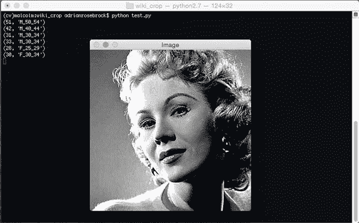

**Figure 15:** Exploring the IMBDB-WIKI dataset and unpacking the annotations file.

然后，我获取数据的一个子集，并尝试在数据上微调 VGG16，作为初始试运行:

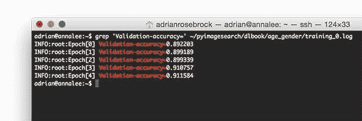

**Figure 16:** A simple “proof of concept” experiment demonstrating that VGG16 can be fine-tuned for gender classification. This simple approach is obtaining 91%+ accuracy after only 5 epochs.

正如上面的截图所展示的，仅仅过了 5 个时期，我就获得了 91%的性别分类准确率***+***。这个初步实验是成功的，并保证了对微调 VGG16 的更多探索。

大约下午 2:30-3 点，我去健身房锻炼 1-1.5 个小时。

健身是我生活中很重要的一部分。

我从小就喜欢运动——足球、棒球、篮球，应有尽有。

在我读研的第一年，我开始举重。我花了大约一年时间和一个朋友一起举重，然后当他毕业时，我又花了一年时间独自锻炼。

从那以后，我发现自己厌倦了常规的健身房锻炼，开始做交叉训练。这最终让我参加了奥运会举重比赛。我现在混合了奥林匹克举重(为了力量)和交叉体能训练(为了耐力)。

这里重要的一点是，体育锻炼是健康生活的关键。不需要太多——只是离开你的椅子(或者更好的是，使用站立式办公桌),在街区周围散散步就可以极大地提高你的工作效率(并让你远离心脏问题)。找出对*有效的方法，你*和*继续做下去。*但也要注意，五年前对你有效的方法现在可能对你无效。

一旦我回到健身房，我淋浴，并登录到我的电脑。

## 晚上(下午 5 点至 8 点)

在一天中的这个时候，我大脑的创造性部分已经耗尽。我已经起床大约 12 个小时了，我正在进入一天中的自然循环，我的能量越来越少。

也就是说，我仍然可以毫无问题地处理*程序性任务*，因此我花了很多时间阅读和回复电子邮件。

如果我没有电子邮件要回复，我可能会写一点代码。

## 晚上(晚上 8 点至 10 点半)

一到晚上 8 点，我就尽可能地断开连接。

我的笔记本电脑进入睡眠状态，我试着远离我的手机。

我通常喜欢在晚上结束时放松一下，玩一会儿我最喜欢的 RPG 游戏:

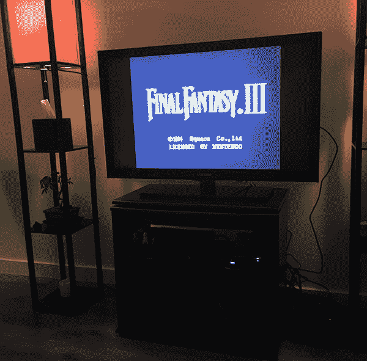

**Figure 17:** Spending the night unwinding and playing a bit of old school Final Fantasy on the SNES.

我刚刚击败了《巫师 III:疯狂猎杀》(一款已经进入我的“史上最受欢迎游戏排行榜”的游戏)，所以我目前正在 SNES 上玩《T2》最终幻想六(T3)(在北美被称为《T4》最终幻想三(T5))。

玩了一会儿游戏后，我可能会在收工前看一会儿电视。

然后，上床睡觉——准备第二天早上 ***【无情地执行】*** 。

**如果您喜欢这篇博文，并且希望在以后的教程发布时得到通知，*请在下表中输入您的电子邮件地址。*****