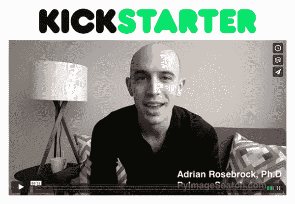

# 先睹为快:用 Python 实现计算机视觉的深度学习

> 原文：<https://pyimagesearch.com/2017/01/12/sneak-preview-deep-learning-for-computer-vision-with-python/>

哇，1 月 18 日的 Kickstarter 发布日期这么快就要到了！

我仍然有大量的工作要做，我深陷在 Kickstarter logistics 中，但我今天早些时候花了几分钟，用 Python 为你录制了这个关于计算机视觉的*深度学习的预览:*

这个视频相当短，只有 2m51s，绝对值得一看*，但是如果你没有足够的时间看，你可以看看下面的要点:*

 **   0m09s:我展示了在大规模 ImageNet 数据集上从头开始训练 **AlexNet 的输出结果——我将在我的书中向你展示*确切地说*如何做。**
*   0m37s:我讨论这本书如何有一个目标:**帮助开发者、研究人员和学生*就像你自己*成为深度学习计算机视觉的专家**。
*   0m44s:无论这是*你第一次*使用深度学习和神经网络，还是*已经是一名经验丰富的深度学习实践者*，这本书都是从头开始设计的，旨在帮助你成为专家。
*   0m58s:我提供了我的《计算机视觉深度学习》一书中将要涉及的主题的**高层次概述。**
*   1m11s:我揭示了编程语言(Python)和我们将用来构建深度学习网络的库(Keras 和 mxnet)。
*   1m24s:由于我们将涵盖*大量*主题，我将把这本书分成*卷*称为 ***【捆绑】*** 。你将能够根据你想要研究深度学习的深度以及你的特定预算来选择一个捆绑包。
*   1m38s:每个捆绑包将包括电子书文件、视频教程和演练、源代码列表、配套网站的访问权限以及可下载的预配置 Ubuntu VM。
*   **Kickstarter 活动将于 1 月 18 日*周三美国东部时间*** 上午 10 点开始——我希望能在 Kickstarter 支持者名单上看到你。

就像我说的，如果你有时间，先睹为快绝对值得一看。

我希望你支持 1 月 18 日美国东部时间**周三上午 10 点**举行的*用 Python 进行计算机视觉深度学习* Kickstarter 活动——如果你真的想成为*深度学习专家*，那么这本书将是你的不二之选！

要在更多 Kickstarter 公告发布时收到通知， **[请务必注册 Kickstarter 通知列表！](#)***