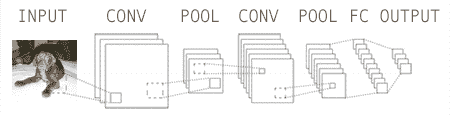

# 我最喜欢的 9 个 Python 深度学习库

> 原文：<https://pyimagesearch.com/2016/06/27/my-top-9-favorite-python-deep-learning-libraries/>

所以你对深度学习和卷积神经网络感兴趣。但是你从哪里开始呢？你使用哪个图书馆？有太多了！

在这篇博文中，**我详细介绍了我最喜欢的*9 个* Python 深度学习库。**

这个列表绝对不是 *详尽的*，它只是我在计算机视觉职业生涯中使用过的库的列表，并且在某个时候发现特别有用。

其中一些库我用得比其他的多——具体来说就是 *Keras* 、 *mxnet* 和 *sklearn-theano* 。

其他的，我用*间接*，比如 *Theano* 和 *TensorFlow* (像 *Keras* 、 *deepy* 和 *Blocks* 都是在这些库的基础上构建的)。

甚至还有一些，我只用于*非常具体的任务*(比如*诺勒*和他们的深度信念网络实现)。

这篇博文的目标是向您介绍这些库。我鼓励你仔细阅读每一个，以决定哪一个最适合你的特殊情况。

## 我最喜欢的 9 个 Python 深度学习库

再次重申，这个列表*绝不是穷举*。此外，由于我是一名计算机视觉研究人员，并且活跃在该领域，*这些库中的许多*都非常关注卷积神经网络(CNN)。

我把这个深度学习库的列表组织成了三个部分。

第一部分详细介绍了您可能已经熟悉的流行库。对于其中的每一个库，我都提供了一个非常一般的、高层次的概述。然后我详述了我对每个库的一些好恶，以及一些适当的用例。

第二部分深入到我个人最喜欢的深度学习库**，我经常使用*(提示:Keras、mxnet 和 sklearn-theano)。***

 ***最后，我提供了一个“额外奖励”部分，用于我(1)很长时间没有使用，但仍然认为您可能会发现有用的库，或者(2)我还没有尝试过，但看起来很有趣的库。

让我们开始吧！

### 首先:

#### 1.[咖啡](http://caffe.berkeleyvision.org/)

提到“深度学习库”而不提到 Caffe 几乎是不可能的。事实上，既然你现在正在阅读深度学习图书馆，我敢打赌你已经听说过 Caffe。

那么，咖啡到底是什么？

Caffe 是由伯克利视觉和学习中心(BVLC)开发的深度学习框架。它是模块化的。速度极快。*它被学术界和工业界用于尖端应用。*

事实上，如果你浏览最近的深度学习出版物(也提供源代码)，你将*更有可能*在它们相关的 GitHub 存储库中找到 Caffe 模型。

虽然 Caffe *本身*不是 Python 库，但它*确实*提供了到 Python 编程语言的绑定。当*在野外实际部署*我们的网络时，我们通常会使用这些绑定。

我把 Caffe 列入这个列表的原因是因为它几乎在所有地方都被使用*。您在一个名为`.prototxt`配置文件的类似 JSON 的纯文本文件中定义您的模型架构和求解器方法。Caffe 二进制文件获取这些`.prototxt`文件并训练你的网络。在 Caffe 完成训练后，您可以使用您的网络，通过 Caffe 二进制文件对新图像进行分类，或者更好的是，通过 Python 或 MATLAB APIs。*

 *虽然我喜欢 Caffe 的性能(它在 K40 GPU 上每天可以处理*6000 万张图像*，但我不像 Keras 或 mxnet 那样喜欢它。

主要原因是在`.prototxt`文件中构建一个架构会变得非常单调乏味。更重要的是，**用 Caffe *调优超参数不能*通过编程*！由于这两个原因，我倾向于使用允许我在基于 Python 的 API 中实现端到端网络(包括交叉验证和超参数调优)的库。***

#### 2.[theno](http://deeplearning.net/software/theano/)

我先说 ***Theano 很美。*** 没有 Theano，我们就不会有*接近*我们今天所做的深度学习库(特别是 Python)的数量。同样，如果没有 NumPy，我们就不会有 SciPy、scikit-learn 和 scikit-image，这同样适用于深度学习的 no 和更高级别的抽象。

最核心的是，Theano 是一个 Python 库，用于定义、优化和评估涉及*多维数组*的*数学表达式*。Theano 通过与 NumPy 的紧密集成和对 GPU 的透明使用实现了这一点。

虽然你可以在 ano 中建立深度学习网络，但我倾向于认为 ano 是神经网络的 T2 积木，就像 NumPy 是科学计算的积木一样。事实上，我在这篇博文中提到的大多数库都包装了 ano 以使其更加方便和易于访问。

不要误解我，我喜欢用 ano 写代码，我只是不喜欢用 ano 写代码。

虽然不是完美的比较，但在 Theano 中构建卷积神经网络就像用原生 Python 编写一个自定义的支持向量机(SVM ),只需要少量的 NumPy。

你能做到吗？

当然，绝对的。

值得你花费时间和精力吗？

呃，也许吧。这要看你想去多低级/你的应用要求。

就我个人而言，我更愿意使用像 Keras 这样的库，它将 Theano 封装到一个更加用户友好的 API 中，就像 scikit-learn 使机器学习算法更容易工作一样。

#### 3\. [TensorFlow](https://www.tensorflow.org/)

类似于 Theano， [TensorFlow](https://www.tensorflow.org/) 是一个使用数据流图进行数值计算的开源库(这就是神经网络的全部)。该库最初是由谷歌机器智能研究组织谷歌大脑团队的研究人员开发的，此后一直是开源的，可供公众使用。

TensorFlow 的一个主要优势(与 Theano 相比)是*分布式计算*，特别是在*多 GPU*之间(尽管这是 Theano 正在努力的方向)。

除了替换掉 Keras 后端以使用 TensorFlow(而不是 Theano)，我对 TensorFlow 库没有太多经验。然而，在接下来的几个月里，我预计这种情况会有所改变。

#### 4.千层面

Lasagne 是一个*轻量级*库，用于在 Theano 中构建和训练网络。这里的关键术语是*轻量级*——它不像 Keras 那样是一个沉重的包装。虽然这导致你的代码更加冗长，但它*确实*让你摆脱了任何束缚，同时仍然给你基于 ano 的模块化构建块。

简而言之:千层面的功能是作为茶餐厅的低级编程和 Keras 的高级抽象之间的中间媒介。

### 我的首选:

#### 5\. [Keras](http://keras.io/)

如果我必须选择一个最喜欢的深度学习 Python 库，我很难在 Keras 和 mxnet 之间做出选择——但最终，我认为 Keras 可能会胜出。

真的，对于 Keras 的好我说不尽。

Keras 是一个极简的模块化神经网络库，可以使用*the ano 或 TensorFlow 作为后端。Keras 背后的主要动机是，你应该能够快速试验*，并尽快从 ***想法*** 到 ***结果*** 。**

 **在喀拉斯构建网络感觉*简单*和*自然*。它包括优化器(Adam，RMSProp)，规范化(BatchNorm)和激活层(PReLU，eLU，LeakyReLU)的一些最新的算法。

Keras 还非常关注卷积神经网络，这是我非常感兴趣的东西。不管这是有意还是无意， ***我认为从计算机视觉的角度来看，这是非常有价值的。***

更重要的是，您可以轻松地构建基于序列的网络(其中输入在网络中线性流动)和基于图的网络(其中输入可以“跳过”某些层，只在以后连接)。这使得实现更复杂的网络架构，如 GoogLeNet 和 SqueezeNet *更加容易*。

我对 Keras 的唯一问题是，它不支持并行训练网络的多 GPU 环境。这对你来说可能是也可能不是一个交易破坏者。

如果我想尽可能快地训练一个网络，那么我可能会使用 mxnet。但是如果我正在调优超参数，我可能会用 Keras 设置四个独立的实验(在我的每一个 Titan X GPUs 上运行)并评估结果。

#### 6. [mxnet](https://github.com/dmlc/mxnet)

我第二喜欢的深度学习 Python 库(再次强调训练图像分类网络)，无疑是 mxnet。虽然在 mxnet 中建立一个网络可能需要更多的代码，但是它*确实给了你*大量的语言绑定(C++、Python、R、JavaScript 等等。)

mxnet 库确实为*分布式计算*大放异彩，允许你跨多个 CPU/GPU 机器，甚至在 AWS、Azure 和 YARN 集群中训练你的网络。

同样，在 mxnet 中启动并运行一个实验需要更多的代码(与 Keras 相比)，但是如果你希望 ***在多个 GPU 或系统*** 中分配训练，我会使用 mxnet。

#### 7.硬化-theano

有些时候你不需要训练一个端到端的卷积神经网络。相反，你需要把 CNN 当作一个*特征提取器*。这是*特别有用的*在你没有足够的数据从头开始训练一个完整的 CNN 的情况下。相反，只需通过流行的预训练架构(如 OverFeat、AlexNet、VGGNet 或 GoogLeNet)传递您的输入图像，并从 FC 层(或您决定使用的任何层)提取特征。

简而言之，这正是 sklearn-theano 允许你做的事情。你不能用它从零开始训练一个模型——但是把网络当作特征提取器是*奇妙的*。在评估某个特定问题是否适合深度学习时，我倾向于把这个库作为我的第一站。

#### 8.[无学习](https://github.com/dnouri/nolearn)

我已经在 PyImageSearch 博客上使用过几次 nolearn，主要是当[在我的 MacBook Pro](https://pyimagesearch.com/2014/10/06/experience-cudamat-deep-belief-networks-python/) 上执行一些初始 GPU 实验和[在亚马逊 EC2 GPU 实例](https://pyimagesearch.com/2014/10/13/deep-learning-amazon-ec2-gpu-python-nolearn/)上执行深度学习的时候。

虽然 Keras 将 Theano 和 TensorFlow 打包成一个更加用户友好的 API，但 nolearn 做了同样的事情——只针对千层面。此外，nolearn 中的所有代码都与 scikit-learn 兼容，这在我的书中是一个巨大的好处。

我个人不使用 nolearn 构建卷积神经网络(CNN)，尽管你当然可以(我更喜欢 Keras 和 mxnet 构建 CNN)——我主要使用 nolearn 构建深度信念网络(DBNs)。

#### 9.[位数](https://github.com/NVIDIA/DIGITS)

好吧，你抓到我了。

DIGITS 不是真正的深度学习库(虽然它*是用 Python 写的*)。DIGITS(深度学习 GPU 训练系统)实际上是一个用于在 Caffe 中训练深度学习模型的 *web 应用*(虽然我认为你可以破解源代码以与 Caffe 以外的后端一起工作，但这听起来像一个噩梦)。

如果你以前曾经使用过 Caffe，那么你应该知道定义你的`.prototxt`文件，生成你的图像数据集，运行你的网络，以及照看你的网络培训都是通过你的终端进行的，这是非常乏味的。DIGITS 旨在通过允许你在浏览器中完成(大部分)这些任务来解决这个问题。

此外，用户界面*非常出色*，为您的模型训练提供有价值的统计数据和图表。我还喜欢你可以很容易地为各种输入可视化网络的激活层。最后，如果您想要测试某个*特定图像*，您可以将该图像上传到您的 DIGITS 服务器，或者输入该图像的 URL，您的 Caffe 模型将自动对该图像进行分类，并在您的浏览器中显示结果。相当整洁！

### 奖金:

#### 10.[块](https://github.com/mila-udem/blocks)

老实说，我以前从未使用过 Blocks，尽管我确实想尝试一下(因此我把它包括在这个列表中)。像这个列表中的许多其他库一样，Blocks 构建在 ano 之上，公开了一个更加用户友好的 API。

#### 11.[深度](https://github.com/zomux/deepy)

如果让你猜 deepy 使用哪个库，你会猜是什么？

没错，就是 Theano。

我记得不久前用过 deepy(在第一次提交的时候)，但是我已经有 6-8 个月没碰它了。我计划在以后的博客中再试一次。

#### 12.[派拉恩 2](http://deeplearning.net/software/pylearn2/)

出于历史原因，我觉得必须将 pylearn2 包括在这个列表中，尽管我不再积极使用它。Pylearn2 不仅仅是一个通用的机器学习库(在 it 方面类似于 scikit-learn)，还包括深度学习算法的实现。

我对 pylearn2 最大的担心是(在撰写本文时)，*它没有一个活跃的开发者*。正因为如此，我不太愿意推荐 pylearn2，而推荐 Keras 和 mxnet 等维护性更强、更活跃的库。

#### 13.[深度学习 4j](http://deeplearning4j.org/)

这应该是一个基于 Python 的列表，但我想我会在这里包括 Deeplearning4j，主要是出于我对他们所做的事情的巨大尊重——为 JVM 构建一个开源的分布式深度学习库。

如果你在企业中工作，你可能有一个地下室，里面都是用于 Hadoop 和 MapReduce 的服务器。也许你还在用这些机器。也许你不是。

*但是如果你可以用这些*相同的机器*来应用深度学习会怎么样呢？*

事实证明你可以——你只需要深度学习。

## 摘要

在这篇博文中，我回顾了一些我最喜欢的深度学习和卷积神经网络库。这个列表绝不是详尽的，而且肯定偏向于专注于计算机视觉和卷积神经网络的深度学习库。

综上所述，我*确实*认为，如果你刚刚开始进入深度学习领域，并正在寻找一个可供尝试的库，这是一个很好的列表。

在我个人看来，我觉得很难打败**[mxnet](https://github.com/dmlc/mxnet)**。Keras 库位于 Theano 和 TensorFlow 等计算强国之上，允许您用非常少的几行 Python 代码构建深度学习架构。

虽然用 mxnet 构建和训练一个网络可能需要更多的代码，但是你*可以获得*在*多个 GPU*之间轻松有效地分配训练的能力。如果你在一个多 GPU 系统/环境中，并且想要充分利用这个环境，那么一定要试试 mxnet。

***在你去之前，一定要使用下面的表格注册 PyImageSearch 时事通讯，以便在新的深度学习帖子发布时得到通知(未来几个月将会有很多帖子！)*********