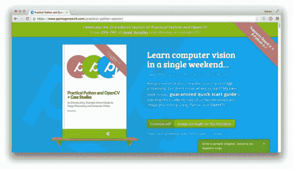
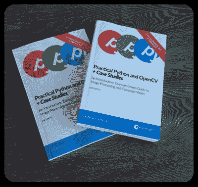
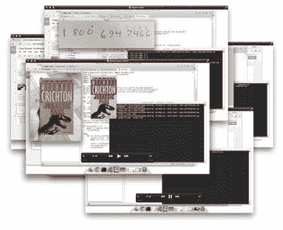
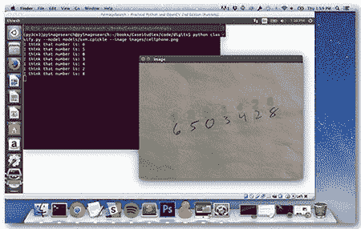

# 第二版+实用 Python 和 OpenCV 的硬拷贝现已上线！

> 原文：<https://pyimagesearch.com/2015/09/16/2nd-edition-hardcopies-of-practical-python-and-opencv-now-online/>

***实用 Python 与 OpenCV +案例分析*第二版正式上线！****

 *第二版是对该书的主要更新，包括:

## 纸质版本。

**Figure 1:** Hardcopy editions of *Practical Python and OpenCV + Case Studies* are ***[now available!](https://pyimagesearch.com/practical-python-opencv/)***

自从一年前我写了这本书，我就想提供*实用 Python 和 OpenCV* 的印刷版，但我很难找到出版商——现在一切都变了，*精装本已经准备好了*和 ***[现在可以购买了！](https://pyimagesearch.com/practical-python-opencv/)***

## **与 OpenCV 3 和 Python 3 完全兼容。**

在过去的几个月里，我一直在努力更新*实用 Python 和 OpenCV +案例研究*中的所有源代码和解释，以确保*与新发布的 OpenCV 3.0 库和 Python 3 编程语言完全兼容*。现在你将能够了解 OpenCV 2.4 和 OpenCV 3 之间的区别——*，并且也能够使用 Python 3！*

## **树莓 Pi 支持。**

**Figure 2:** All code examples in the 2nd edition of *Practical Python and OpenCV + Case Studie*s run on the Raspberry Pi out-of-the-box.

拥有一台 Raspberry Pi 并想用它来检测视频流中的人脸？跟踪视频中的对象？或者识别笔迹？没问题！*实用 Python 和 OpenCV +案例研究*中*所有*章节的新源代码下载将在树莓 Pi 上开箱即用，无需修改。

## **视频教程。**

**Figure 3:** Imagine having me at your side, helping you learn computer vision and OpenCV — that’s exactly what it’s like when you work through my 16 video tutorials covering 4+ hours of lessons.

和我一起编码吧——我已经录制了 **16 个视频教程**，涵盖了 **4 个多小时的内容**，来自*实用 Python 和 OpenCV* 。这些视频是帮助您学习 OpenCV 和计算机视觉的绝佳资产。

## **更新后的虚拟机。**

**Figure 4:** The 2nd edition Ubuntu VirtualBox virtual machine has been re-engineered from the ground-up to support ***both*** Python 2.7 and Python 3+ with OpenCV bindings.

这本书的第二版中我最喜欢的一个特点是全新的，刚刚重建的 Ubuntu VirtualBox 虚拟机。这个虚拟机已经被从头开始重新设计，包括安装了**Python 2.7*****和*** Python 3 和 OpenCV 3！

## 拿起你的那份。

准备好拿起自己的副本第二版副本*实用 Python 和 OpenCV +案例研究？*

***[只需点击此处了解更多信息并获取您的副本。](https://pyimagesearch.com/practical-python-opencv/)****