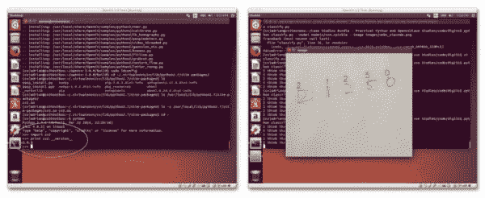
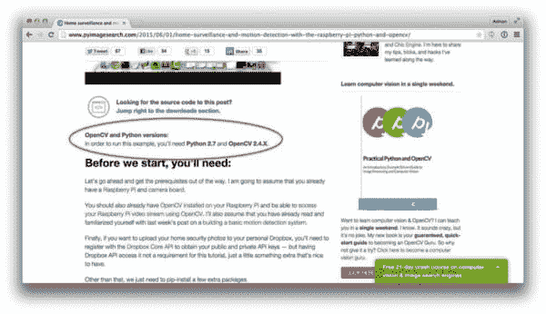

# OpenCV 3.0 发布——以及 PyImageSearch 博客即将发生的变化。

> 原文：<https://pyimagesearch.com/2015/06/08/opencv-3-0-released-and-the-coming-changes-to-the-pyimagesearch-blog/>

已经过去很久了，但是 [**OpenCV 3.0 终于发布了！**](http://opencv.org/opencv-3-0.html)

这次更新绝对是近年来对该库进行的最大范围的检修之一，并且拥有更高的稳定性、性能提升和 OpenCL 支持。

但是*到目前为止*，Python 世界中最激动人心的更新是:

***Python 3 支持！***

在 Python 2.7 中困了多年， ***我们现在终于可以在 Python 3.0 中使用 OpenCV 了！*** 确实劲爆的消息！

## **所以你可能会问*“这对 PyImageSearch 意味着什么？”***

我们是不是马上放弃 OpenCV 2.4.X，转到 OpenCV 3.0？Python 2.7 正式结束了吗？

简而言之就是 ***没有*** 。

OpenCV 3.0 的发布是一个令人振奋的消息，但对于计算机视觉社区来说，这也是一个 T2 的过渡期。我们中的一些人将依赖于以前的 OpenCV 2.4.X 版本。其他人会争先恐后地获取最新的 3.0 版本。也许我们中的其他人不会真的关心我们使用的是什么版本，只要我们的代码按预期执行和运行。

由于这些各种各样的原因，我将继续编写与*OpenCV 2.4 . x 和 OpenCV 3.0 相关的内容。*

 *我认为现在放弃在 OpenCV 2.4.X 上写内容将是一个巨大的错误。它比较老。更成立。而且用的更广。

然而，在 OpenCV 3.0 成熟并发布几个小版本之前忽视它将是一个同样巨大的错误。OpenCV 3.0 确实是未来——我们需要这样对待它。

正因为如此，我想出了以下计划:

## 我们将混合使用 OpenCV 2.4.X 和 OpenCV 3.0。

OpenCV 3.0 是全新的。它闪闪发光。很性感。我们肯定会拿掉包装纸，找点乐子。

但是我们仍然会在 OpenCV 2.4.X 中做大量的教程。记住，OpenCV 2.4.X 仍然是*计算机视觉和图像处理的*事实上的*库，并且*将继续如此，直到 v3.0 稍微成熟一点并获得实质性的采用率。**

## **所有*新*的博客帖子都将标上 OpenCV + Python 版本。**

PyImageSearch 上发布的所有*新*文章、教程和博客帖子都将包括假定的 ***OpenCV 版本*** 和 ***Python 版本*** ，以确保您知道我们使用的是哪种开发环境。

你也可以期待一些 OpenCV 3.0 在各种平台上的安装教程即将推出。

## **所有*旧的*博客帖子也将标上 OpenCV + Python 版本。**

就像所有的*新*帖子将列出 OpenCV 和 Python 的假定版本一样，我也将回去更新所有的*旧*博客帖子，以包括 OpenCV 和 Python 的必需版本。

**这种改变不会在一夜之间发生**，但我会每周更新几篇旧文章。

更新后的帖子将包括这样一个部分:

**Figure 1:** All blog posts on PyImageSearch will include a section that explicitly defines which Python and OpenCV versions are being used.

## **那么*实用 Python 和 OpenCV +案例分析*呢？**

你可能想知道我的书， *[实用 Python 和 OpenCV +案例分析](https://pyimagesearch.com/practical-python-opencv/)* —它们会更新到 OpenCV 3.0 吗？

***答案是肯定的，实用 Python 和 OpenCV +案例分析绝对会更新到覆盖 OpenCV 3.0。***

我已经从书中找到了示例代码，并且正在更新代码示例。

这本书的第一次更新将包括修订后的源代码，供那些希望使用 Python 3 和 OpenCV 3.0 运行所提供的示例的人使用。

第二次更新会将书中的实际代码解释转移到 OpenCV 3.0。

我很可能会提供《T2》《T3》的 2.4.X 和 3.0 版本。

**不管怎样，OpenCV 的更新绝对不会*损害*实用 Python 和 OpenCV +案例研究*的完整性。****如果你想在 OpenCV 上快速上手，一定要考虑 [购买一个副本](https://pyimagesearch.com/practical-python-opencv/) 。正如我在上面承诺的，这本书也将更新到 OpenCV 3.0。*

 *## T2 将会有一个过渡期。

正如我在上面提到的，我们将混合 OpenCV 2.4.X 和 OpenCV 3.0 的文章和教程。

**开始时，大多数教程将使用 2.4.X 版本。**

但是随着 OpenCV 3.0 的成熟，**我们将随着它的成熟而开始引入越来越多的 3.0 教程。**

过渡期到底需要多长时间？

很难确定过渡期的确切时间，因为它取决于多种因素:

*   这取决于开发人员和程序员是否愿意更新到 OpenCV 的新版本，以及是否愿意冒破坏遗留代码的风险(根据我最初的测试，这种风险非常高)。

*   要看 OpenCV 3.0 教程的实际*需求*。

*   这取决于你的反馈

我的 ***猜测*** 是，我们可能需要 6-12 个月才能在 PyImageSearch 上定期使用 OpenCV 3.0，但谁知道呢——我的估计可能会相差很远。它可以更短。可能会更久。

实际上，我的直觉告诉我，在 3.1 发布之前，我们不会*完全*过渡。请记住，PyImageSearch 是一个**教学博客**，因此所有代码示例都像宣传的那样工作非常重要。

**不管怎样，我对你们的承诺是，随着 OpenCV 的发展，我将发展 PyImageSearch 博客——我们将继续确保 PyImageSearch 是进入网站学习计算机视觉+ OpenCV 的*。***

## 如果有的话，你将看到的唯一真正的变化是我发了*更多*的帖子。

我认为你在 PyImageSearch 博客上看到的唯一大变化可能是更多的博客文章。

每周一我都会继续发表本周的 ***大*** 博文。然后你可能会在本周晚些时候看到另一篇简短的博客文章，详细介绍了 OpenCV 3.0 的一个特殊警告。正如我所说的，这将是一个过渡期，每篇发布的帖子将详细描述假定的 Python 和 OpenCV 版本。

## 那么你认为呢？

你喜欢这个计划吗？讨厌这个计划？

留下你的评论或给我发一条消息——你的输入和回应让这个博客成为可能！**