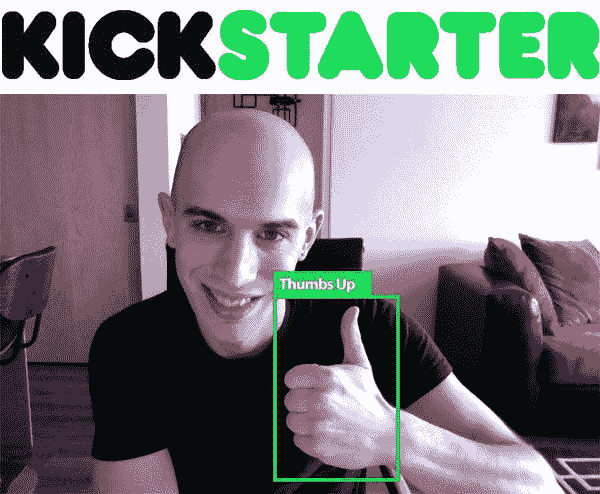

# 竖起大拇指:手势识别。

> 原文：<https://pyimagesearch.com/2015/02/05/thumbs-hand-gesture-recognition/>

我需要为这篇文章道歉——如果有一些明显的语法错误，我很抱歉。

你看，我熬了一个通宵。

我的眼睛布满血丝，呆滞无神，就像《行尸走肉》里的某样东西。我的大脑感觉像被大锤敲打的土豆泥。我真的真的需要洗个澡——出于某种原因，我认为在从健身房回来后立即开始黑客马拉松*是个好主意。*

但是在接下来的 10 个小时里，我想发布一个关于这个通宵黑客马拉松的目的的快速更新…

昨天，PyImageSearch 大师 Kickstarter 实现了它的第一个目标(为你的移动设备开发计算机视觉应用)。我需要想出第二个连续目标。经过几分钟的反复思考，我想到了:

***手势识别。***

手势识别是 PyImageSearch 博客上 ***点击率最高的教程*** 之一。每天我都会收到至少 2-3 封邮件，询问如何用 Python 和 OpenCV 进行手势识别。

让我告诉你，如果我们达到了 PyImageSearch 大师 Kickstarter 的第二个延伸目标，**我将在课程中介绍手势识别！**

因此，如果你对加入 PyImageSearch 大师计算机视觉课程犹豫不决，现在是时候了！在你们的帮助下，我们将能够在 PyImageSearch Gurus 中实现手势识别。

记住，PyImageSearch 大师们的大门将在**一周后**关闭，直到八月才会再次打开。

课程还有一些空位， ***所以不要等着错过！***

[现在就行动起来，在大门关闭之前，在 PyImageSearch 大师中获得自己的一席之地](https://www.kickstarter.com/projects/1186001332/pyimagesearch-gurus-become-a-computer-vision-openc)。