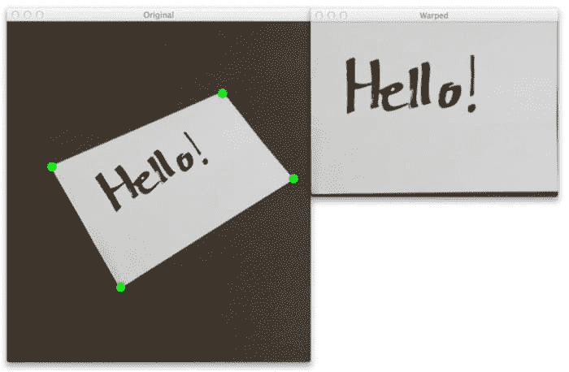
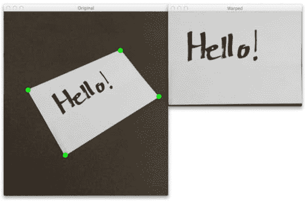

# 4 点 OpenCV getPerspective 转换示例

> 原文：<https://pyimagesearch.com/2014/08/25/4-point-opencv-getperspective-transform-example/>

最后更新于 2021 年 7 月 4 日。



凌晨 4 点 18 分。警报响了。外面还是漆黑一片。床很暖和。我光着脚会觉得地板很冷。

但是我起床了。我勇敢地面对清晨，像冠军一样站在冰冷的地板上。

为什么？

因为我很兴奋。

很高兴今天能和大家分享一些非常特别的东西…

你看，在过去的几周里，我收到了一些来自 PyImageSearch 读者朋友的非常棒的电子邮件。这些邮件简短、甜蜜、切中要害。他们只是简单的“谢谢”而已，因为他们贴出了真实的、真正的 Python 和 OpenCV 代码，你可以拿来用它们来解决你自己的计算机视觉和图像处理问题。

经过昨晚的反思，我意识到我在分享我为自己开发的日常使用的库、包和代码方面做得不够好——所以这正是我今天要做的。

在这篇博文中，我将向你展示我的`transform.py`模块中的功能。每当我需要用 OpenCV 做 4 点`cv2.getPerspectiveTransform`的时候，我都会用到这些函数。

我想你会发现这里的代码非常有趣 … ，你甚至可以在自己的项目中使用它。

所以请继续阅读。并检查我的 4 点 OpenCV `cv2.getPerspectiveTransform`的例子。

*   【2021 年 7 月更新:新增两个章节。第一部分介绍了如何自动找到透视转换的左上、右上、右下和左下坐标。第二部分讨论如何通过考虑输入 ROI 的纵横比来改善透视变换结果。

**OpenCV 和 Python 版本:**
这个例子将运行在 **Python 2.7/Python 3.4+** 和 **OpenCV 2.4.X/OpenCV 3.0+** 上。

# 4 点 OpenCV getPerspectiveTransform 示例

你可能还记得我关于构建现实生活中的 Pokedex 的帖子，特别是[我关于 OpenCV 和透视扭曲的帖子](https://pyimagesearch.com/2014/05/05/building-pokedex-python-opencv-perspective-warping-step-5-6/)。

在那篇文章中，我提到了如何使用透视变换来获得图像的自上而下的“鸟瞰图”——当然，前提是你能找到参考点。

这篇文章将继续讨论自上而下的图像“鸟瞰图”。但是这次我要和你分享我每次使用*的 ***个人代码****我需要做一个 4 点透视变换。

所以我们不要再浪费时间了。打开一个新文件，命名为`transform.py`，我们开始吧。

```py
# import the necessary packages
import numpy as np
import cv2

def order_points(pts):
	# initialzie a list of coordinates that will be ordered
	# such that the first entry in the list is the top-left,
	# the second entry is the top-right, the third is the
	# bottom-right, and the fourth is the bottom-left
	rect = np.zeros((4, 2), dtype = "float32")

	# the top-left point will have the smallest sum, whereas
	# the bottom-right point will have the largest sum
	s = pts.sum(axis = 1)
	rect[0] = pts[np.argmin(s)]
	rect[2] = pts[np.argmax(s)]

	# now, compute the difference between the points, the
	# top-right point will have the smallest difference,
	# whereas the bottom-left will have the largest difference
	diff = np.diff(pts, axis = 1)
	rect[1] = pts[np.argmin(diff)]
	rect[3] = pts[np.argmax(diff)]

	# return the ordered coordinates
	return rect

```

我们将从导入我们需要的包开始:NumPy 用于数值处理，而`cv2`用于 OpenCV 绑定。

接下来，让我们定义**线 5** 上的`order_points`函数。这个函数有一个参数`pts`，它是一个包含四个点的列表，指定了矩形中每个点的 *(x，y)* 坐标。

矩形中的点有一个*一致的顺序*是绝对重要的。实际的排序本身可以是任意的，*只要在整个实现过程中保持一致*。

就我个人而言，我喜欢按照左上、右上、右下和左下的顺序来说明我的观点。

我们将从为第 10 行上的四个有序点分配内存开始。

然后，我们将找到左上角的点，它将具有最小的 *x + y* 和，以及右下角的点，它将具有最大的 *x + y* 和。这在**14-16 行**处理。

当然，现在我们必须找到右上角和左下角的点。这里，我们将使用第 21 行**上的`np.diff`函数来计算点之间的差值(即*x–y*)。**

与最小差异相关的坐标将是右上角的点，而与最大差异相关的坐标将是左下角的点(**行 22 和 23** )。

最后，我们将有序函数返回给第 26 行上的调用函数。

***我再强调一次，保持点的一致排序是多么重要。***

在下一个函数中你会明白为什么:

```py
def four_point_transform(image, pts):
	# obtain a consistent order of the points and unpack them
	# individually
	rect = order_points(pts)
	(tl, tr, br, bl) = rect

	# compute the width of the new image, which will be the
	# maximum distance between bottom-right and bottom-left
	# x-coordiates or the top-right and top-left x-coordinates
	widthA = np.sqrt(((br[0] - bl[0]) ** 2) + ((br[1] - bl[1]) ** 2))
	widthB = np.sqrt(((tr[0] - tl[0]) ** 2) + ((tr[1] - tl[1]) ** 2))
	maxWidth = max(int(widthA), int(widthB))

	# compute the height of the new image, which will be the
	# maximum distance between the top-right and bottom-right
	# y-coordinates or the top-left and bottom-left y-coordinates
	heightA = np.sqrt(((tr[0] - br[0]) ** 2) + ((tr[1] - br[1]) ** 2))
	heightB = np.sqrt(((tl[0] - bl[0]) ** 2) + ((tl[1] - bl[1]) ** 2))
	maxHeight = max(int(heightA), int(heightB))

	# now that we have the dimensions of the new image, construct
	# the set of destination points to obtain a "birds eye view",
	# (i.e. top-down view) of the image, again specifying points
	# in the top-left, top-right, bottom-right, and bottom-left
	# order
	dst = np.array([
		[0, 0],
		[maxWidth - 1, 0],
		[maxWidth - 1, maxHeight - 1],
		[0, maxHeight - 1]], dtype = "float32")

	# compute the perspective transform matrix and then apply it
	M = cv2.getPerspectiveTransform(rect, dst)
	warped = cv2.warpPerspective(image, M, (maxWidth, maxHeight))

	# return the warped image
	return warped

```

我们首先在第 28 行的**上定义`four_point_transform`函数，它需要两个参数:`image`和`pts`。**

`image`变量是我们想要应用透视变换的图像。而`pts`列表是包含我们想要变换的图像的 ROI 的四个点的列表。

我们在第 31 行的**上调用了我们的`order_points`函数，这将我们的`pts`变量置于一个一致的顺序中。为了方便起见，我们将这些坐标放在第 32 行**的**上。**

现在我们需要确定新的扭曲图像的尺寸。

我们在第 37-39 行上确定新图像的宽度，其中宽度是右下角和左下角的 x 坐标或右上角和左上角的 x 坐标之间的最大距离。

以类似的方式，我们在第 44-46 行上确定新图像的高度，其中高度是右上和右下 y 坐标或左上和左下 y 坐标之间的最大距离。

***注:**非常感谢汤姆·洛厄尔发来邮件，确保我修正了宽度和高度的计算！*

***所以这里是你真正需要注意的地方。***

还记得我说过我们试图获得原始图像中 ROI 的自上而下的“鸟瞰图”吗？还记得我说过代表 ROI 的四个点的一致排序是至关重要的吗？

在**的第 53-57 行**你可以看到为什么。这里，我们定义了 4 个点来代表我们的“自上而下”的图像视图。列表中的第一个条目是指示左上角的`(0, 0)`。第二个条目是`(maxWidth - 1, 0)`，对应右上角。然后我们有右下角的`(maxWidth - 1, maxHeight - 1)`。最后，我们有`(0, maxHeight - 1)`，它是左下角。

这里的要点是，这些点是以一致的顺序表示定义的，这将允许我们获得图像的自上而下的视图。

为了实际获得自上而下的图像“鸟瞰图”,我们将利用第 60 行上的`cv2.getPerspectiveTransform`函数。这个函数需要两个参数，`rect`，它是原始图像中 4 个 ROI 点的列表，和`dst`，它是我们的变换点列表。`cv2.getPerspectiveTransform`函数返回`M`，这是实际的变换矩阵。

我们使用`cv2.warpPerspective`函数在**行 61** 上应用变换矩阵。我们传入`image`，我们的变换矩阵`M`，以及我们输出图像的宽度和高度。

`cv2.warpPerspective`的输出就是我们的`warped`图像，这是我们自顶向下的视图。

我们将第 64 行上的自顶向下视图返回给调用函数。

现在我们已经有了执行转换的代码，我们需要一些代码来驱动它并实际应用到图像上。

打开一个新文件，调用`transform_example.py`，让我们完成它:

```py
# import the necessary packages
from pyimagesearch.transform import four_point_transform
import numpy as np
import argparse
import cv2

# construct the argument parse and parse the arguments
ap = argparse.ArgumentParser()
ap.add_argument("-i", "--image", help = "path to the image file")
ap.add_argument("-c", "--coords",
	help = "comma seperated list of source points")
args = vars(ap.parse_args())

# load the image and grab the source coordinates (i.e. the list of
# of (x, y) points)
# NOTE: using the 'eval' function is bad form, but for this example
# let's just roll with it -- in future posts I'll show you how to
# automatically determine the coordinates without pre-supplying them
image = cv2.imread(args["image"])
pts = np.array(eval(args["coords"]), dtype = "float32")

# apply the four point tranform to obtain a "birds eye view" of
# the image
warped = four_point_transform(image, pts)

# show the original and warped images
cv2.imshow("Original", image)
cv2.imshow("Warped", warped)
cv2.waitKey(0)

```

我们要做的第一件事是在**行 2** 导入我们的`four_point_transform`函数。出于组织目的，我决定将它放在`pyimagesearch`子模块中。

然后，我们将使用 NumPy 实现数组功能，`argparse`用于解析命令行参数，而`cv2`用于 OpenCV 绑定。

我们在**的第 8-12 行**解析命令行参数。我们将使用两个开关，`--image`，它是我们想要应用变换的图像，和`--coords`，它是 4 个点的列表，代表我们想要获得自上而下的“鸟瞰图”的图像区域。

然后，我们将图像加载到第 19 行**上，并将这些点转换成第 20** 行**上的 NumPy 数组。**

现在，在你因为我使用了`eval`函数而生气之前，请记住，这只是一个例子。我不赞成以这种方式进行视角转换。

而且，正如你将在下周的帖子中看到的，*我将向你展示如何**自动**确定透视变换所需的四个点*——无需你手动操作！

接下来，我们可以在第 24 行应用我们的透视变换。

最后，让我们在第 27-29 行显示原始图像和扭曲的、自顶向下的图像视图。

# 获得图像的俯视图

好了，让我们看看这段代码的运行情况。

打开一个 shell 并执行以下命令:

```py
$ python transform_example.py --image images/example_01.png --coords "[(73, 239), (356, 117), (475, 265), (187, 443)]"

```

您应该会看到便笺的自上而下视图，如下所示:



**Figure 1:** Applying an OpenCV perspective transform to obtain a “top-down” view of an image.

让我们尝试另一个图像:

```py
$ python transform_example.py --image images/example_02.png --coords "[(101, 185), (393, 151), (479, 323), (187, 441)]"

```

第三个是好的措施:

```py
$ python transform_example.py --image images/example_03.png --coords "[(63, 242), (291, 110), (361, 252), (78, 386)]"

```

正如你所看到的，我们已经成功地获得了自上而下的笔记卡的“鸟瞰图”!

在某些情况下，便笺看起来有点翘——这是因为照片拍摄的角度非常严重。我们越接近便笺上“向下看”的 90 度角，结果就越好。

# 自动寻找转换的角点

为了获得输入图像的自顶向下变换，我们必须手动*提供/硬编码输入的左上、右上、右下和左下坐标。*

这就提出了一个问题:

> *有没有办法让***自动获取这些坐标？**

 *你打赌有。以下三个教程向您展示了如何做到这一点:

1.  [*用 OpenCV* 构建文档扫描仪](https://pyimagesearch.com/2014/09/01/build-kick-ass-mobile-document-scanner-just-5-minutes/)
2.  [*使用 OMR、Python 和 OpenCV*](https://pyimagesearch.com/2016/10/03/bubble-sheet-multiple-choice-scanner-and-test-grader-using-omr-python-and-opencv/) 进行气泡表多项选择扫描和测试评分
3.  [*OpenCV 数独求解器和 OCR*](https://pyimagesearch.com/2020/08/10/opencv-sudoku-solver-and-ocr/)

# 通过计算纵横比改善自上而下的变换结果

图像的纵横比定义为宽度与高度的比率。调整图像大小或执行透视变换时，考虑图像的纵横比很重要。

例如，如果您曾经看到过看起来“压扁”或“嘎吱嘎吱”的图像，那是因为纵横比关闭了:

左边的*是我们的原始图像。在右边的*，我们有两张图像由于没有保持长宽比而被扭曲。它们已经通过忽略图像的宽高比而被调整了大小。**

 *为了获得更好、更美观的透视变换，您应该考虑输入图像/ROI 的纵横比。StackOverflow 上的这个线程将告诉你如何去做。

# 摘要

在这篇博文中，我提供了一个使用 Python 的 OpenCV `cv2.getPerspectiveTransform`示例。

我甚至分享了我的个人库中关于如何做的代码！

但乐趣不止于此。

你知道那些 iPhone 和 Android 的“扫描仪”应用程序，可以让你给一份文件拍照，然后把它“扫描”到你的手机里吗？

没错——我将向您展示如何使用 4 点 OpenCV getPerspectiveTransform 示例代码来构建一个文档扫描仪应用程序！

我对此非常兴奋，希望你也是。

无论如何，一定要注册 PyImageSearch 时事通讯，以便在帖子发布时听到消息！**