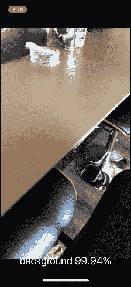

# 使用 CoreML 在 iOS 上运行 Keras 模型

> 原文：<https://pyimagesearch.com/2018/04/23/running-keras-models-on-ios-with-coreml/>

In last week’s blog post, you learned how to train a Convolutional Neural Network (CNN) with Keras.

今天，我们将把这个经过训练的 Keras 模型部署到 iPhone 和 iOS 应用程序中，使用苹果公司称为*“CoreML”、* **的苹果应用程序的易用机器学习框架:**

<https://www.youtube.com/embed/Qqv4qOJ3RnU?feature=oembed>