# 使用 NVIDIA DIGITS DevBox 进行深度学习

> 原文：<https://pyimagesearch.com/2016/06/06/hands-on-with-the-nvidia-digits-devbox-for-deep-learning/>

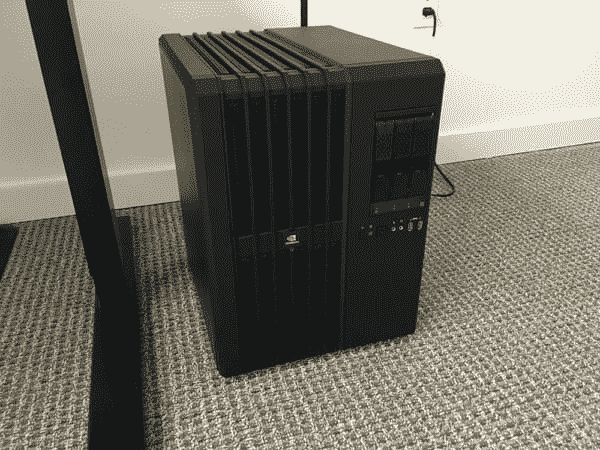

我今天有一个重要的宣布:

未来几个月，我将在 PyImageSearch 博客上做更多深度学习和卷积神经网络教程。

我对此非常认真——*并且我已经把我的钱用在了我的嘴上*和*投资了一些用于深度学习的真正硬件。*

要了解更多关于我的投资，NVIDIA DIGITS DevBox 和 PyImageSearch 博客的新教程，请继续阅读。

## 使用 NVIDIA DIGITS DevBox 进行深度学习

对于任何对 NVIDIA DIGITS DevBox for deep learning 感兴趣的人来说，也许更重要的是，*导致我购买预配置深度学习系统而不是构建自己的*的理性，我已经包括了我在决策过程中的工作经验，进行了购买，并打开了系统。在以后的博客文章中，我将回顾我是如何设置和配置系统来实现我自己的最佳设置的。

### NVIDIA DIGITS DevBox 规格

让我告诉你:NVIDIA DIGITS DevBox 是个 ***野兽。***

就系统规格而言，DevBox sports:

*   **4 个 Titan X GPU**(每块板 12GB 内存
**   64GB DDR4 内存*   华硕 X99-E WS 主板*   工作频率为 3.5GHz 的酷睿 i7-5930K 6 核处理器*   RAID5 中配置的三个 3TB SATA 3.5 英寸硬盘(适用于存储海量数据集)*   用于 RAID 的 512GB 固态硬盘高速缓存*   250GB SATA 内置固态硬盘(用于存储系统文件、源代码和其他“最常访问”的文件)*   1600W 电源*

 *但是是*而不是*仅仅是*硬件*让 NVIDIA DIGITS DevBox 变得令人敬畏。它还预配置了:

*   Ubuntu 14.04
*   NVIDIA 驱动程序
*   NVIDIA CUDA 工具包 6.0-7.5
*   cuDNN 4.0
*   咖啡，茶，托奇

这台机器可不是闹着玩的— ***而且也不便宜。***

在 ***称重，15000 美元*** ，这不是你的标准台式机——这个系统是为在深度学习领域做*实际工作*的研究人员、公司和大学设计的。

所以，你可能想知道…

“你不是深度学习研究者，阿德里安。虽然你拥有涉及计算机视觉+机器学习的公司，但你为什么需要这样一台糟糕的机器？”

问得好。

这让我想到了这篇博文的下一部分…

### 投资 PyImageSearch、我的公司和我自己的未来

表面上，你可能会看到阿德里安·罗斯布鲁克的两面:

1.  写每周博客和电子邮件公告的博主。
2.  著有 *[实用 Python 和 OpenCV](https://pyimagesearch.com/practical-python-opencv/)* 以及 *[PyImageSearch 大师课程](https://pyimagesearch.com/pyimagesearch-gurus/)* 的*语言大师*、*老师*和*教育家*。

但是还有一个*第三方*并不经常在 PyImageSearch 博客上被讨论(除了偶尔在这里或那里提到的): ***企业家和(偶尔的)顾问。***

我能承担新的咨询/承包工作的机会越来越少，但当我这样做的时候，我会对项目和预算非常挑剔。在过去的几年里，我注意到我越来越多地在我的项目中使用*深度学习(无论是承包工作还是个人/商业项目)。*

这可能与我关于[摆脱深度学习潮流](https://pyimagesearch.com/2014/06/09/get-deep-learning-bandwagon-get-perspective/)——*的博文形成鲜明对比(表面上看，可能有点虚伪)，但那篇文章的标题不是重点。*

**相反，这篇(有争议的)博文的目的是要说明一个细节:**

> “机器学习不是工具。这是一种具有理性思维过程的方法论，完全依赖于我们试图解决的问题。我们不应该盲目地应用算法，看看(除了抽查之外)还有什么可以坚持。我们需要坐下来，探索特征空间(根据经验和现实世界的影响)，然后考虑我们的最佳行动模式。”

深度学习，就像支持向量机、随机森林和其他机器学习算法一样，都有一个合理的过程和假设，以确定我们何时应该使用每个特定的模型。我们在某个时间和地点使用深度学习— *你只需要在为特定程序选择算法时*留心*。*

我在 PyImageSearch 博客上发布深度学习教程的希望是更好地阐明*何时*和*哪里*深度学习适合计算机视觉任务。

### 那么这和 PyImageSearch 博客有什么关系呢？

问得好。

我以前在其他博客中说过，今天我在这里再说一遍:

经营 PyImageSearch 博客让我*喜欢*的是写一些与读者你*想听的内容相关的教程。*

每天我都会收到越来越多的深度学习教程的请求。直到两个月前，*我还在写[视频搜索大师课程](https://pyimagesearch.com/pyimagesearch-gurus/)。*我根本没有时间、精力或注意力来开始计划深度学习教程——就其定义而言，我需要花费更多的时间和精力(在思维过程、计算工作和实验方面)来创建这些教程。

现在我已经写完了 PyImageSearch 大师课程，我已经收回了一些时间。

但是*更重要的是*，我已经回收了一堆我的**能量**和**注意力**——这两者都是创作高质量教程的*关键*。在我读研的这些年里，我写论文，运行 PyImageSearch 博客，创作 *[实用 Python 和 OpenCV](https://pyimagesearch.com/practical-python-opencv/)* ，并创建了 [PyImageSearch 大师课程](https://pyimagesearch.com/pyimagesearch-gurus/)，我已经掌握了*一口气写出 5000 多个单词的能力。对于写作来说，时间不是问题——真正重要的是我的精力和注意力。*

在接下来的一年里，你可以期待*更多的深度学习教程*发布在 PyImageSearch 博客上。这不会是一个*立即发生的变化*，但它会在接下来的 3-4 个月里慢慢增加，因为我开始创建积压的帖子。

重点是:

如果你对深度学习感兴趣，特别是深度学习和计算机视觉，PyImageSearch 是你应该去的地方。

### 计算数字

好的，我已经提到过我在 NVIDIA DIGITS DevBox 上投资了 15，000 美元——无论如何这都不是一笔小数目。

那么，我是如何证明这个*巨大的*数字的呢？

正如我上面提到的，我是一名企业家，一名科学家，本质上是一名商人——这意味着我的行为背后有(某种)逻辑。如果你给我看这些数字，它们就能算出来，*并且与我的目标*——**一致，我就能证明投资是合理的，并据此制定计划。**

我从事实开始评估:

*   **事实#1:** 我目前要么在亚马逊 ec2g 2.2x 大型实例上花费*每小时 0.65 美元*，要么在 g 2.8x 大型实例上花费*每小时 2.60 美元*。我的大部分 EC2 时间都是在使用 g2.8xlarge 实例上度过的。
*   **事实#2:** 这两个 EC2 实例的*内存*都比 NVIDIA DIGITS DevBox 少。根据 Amazon 计算虚拟 CPU 的方式，g2.8xlarge 的 CPU 仅略好于它(如果你信任 vCPU 分配的话)。
*   **事实#3:** 目前， [EC2 GPU 实例只有 4GB 内存，1536 个内核](https://aws.amazon.com/blogs/aws/new-g2-instance-type-with-4x-more-gpu-power/)(泰坦 X 有 12GB 内存，3072 个内核)。
*   **事实# 4:**NVIDIA DIGITS dev box 有 4 个 Titan X GPUs(总共 48GB 内存)。g2.8xlarge 有 4 个 K520 GPUs(总共 16GB 内存)。
*   **事实#5:** 如果不将计算分散到多个 GPU 上，4GB 无法满足大型数据集的需求。这很好，但从长远来看似乎不值得。理想情况下，我可以在 *并行运行*四个实验**或者*将计算分散到四个卡*上，从而减少训练给定模型所需的时间。泰坦 X 显然是这里的赢家。

接下来，我计算了这些数字，以确定一个 g2.8xlarge 实例的小时费率和 15，000 美元的前期投资之间的交集:

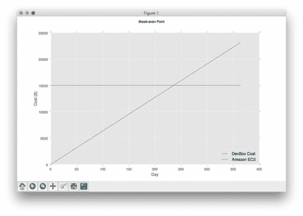

**Figure 1:** Plotting the intersection between the EC2 g2.8xlarge hourly rate and the upfront cost of $15,000 for the NVIDIA DIGITS DevBox. The break-even point is at approximately 240 days.

在一个 g2.8xlarge 实例上，这给了我大约 5，769 小时(约 240 天)的计算时间。

***注意:**这是在一个 g 2.2x 大型实例上的 23，076 小时(2.6 年)——再次重申，我主要使用 g 2.8x 大型实例。*

由于盈亏平衡点只有 *240 天*(单个模型的训练可能需要几天到几周)，决策开始变得更加清晰。

现在，我必须问自己的下一个问题是:

> “我订购硬件，自己组装，省钱吗？还是说，我要为一台预先配置好的机器支付一点加价？”

在这一点上，我会得到相当多的负面反馈，*，但在我看来*，我倾向于“为你完成解决方案”。

为什么？

三个原因:我限制了*时间*、*精力*、*注意力*。

每当我可以花钱请专业人士外包一项我(1)不擅长，(2)不喜欢做，或者(3)不值得我花费时间/精力的任务时，我都会倾向于把任务从我的盘子上移开——这正是让我能够更聪明地**工作**而不是更努力地**工作**的基本原理。

因此，让我们假设我可以用大约 8，000 美元购买硬件来创建一个与 NVIDIA DIGITS DevBox 相当的系统，这为我节省了 7，000 美元，对吗？

嗯，没那么快。

我不打算说我每小时的咨询费率是多少，但是让我们(为了这个论点)假设我对我的时间每小时收费 250 美元:*$ 7000/250 每小时= 28 小时。*

为了这种时间和金钱的权衡(更不用说它需要的*注意力*和*精力*)，在我自己的 28 小时时间内，我需要:

*   研究我需要的硬件。
*   购买它。
*   请到我的办公室来。
*   组装机器。
*   安装操作系统、软件、驱动程序等。

我能在 28 小时内用*最少*的上下文切换完成*所有这些*吗？

老实说，我不知道。我*可能*可以。

但是如果我错了呢？

更好的问题是:

如果东西坏了怎么办？

我不是一个硬件爱好者，我不喜欢与硬件打交道，这是我一贯的风格。

如果我建立自己的系统，我就是自己的支持人员。但如果我选择 NVIDIA，我会让整个 DevBox 团队帮助我排除故障，解决问题。

所以，假设我总共花了 15 个小时来订购硬件、组装硬件、安装所需的组件并确保其正常工作。

这样我就剩下*28–15 = 13 小时*的时间来处理*在机器寿命期间出现的任何*故障排除问题。

这现实吗？

不，不是的。

而且从这个角度(也就是我的角度)来看，这个投资是有意义的。你可能处于完全不同的情况——但是在我目前从事的项目、我运营的公司和 PyImageSearch 博客之间，我将在未来更多地利用深度学习*。*

 *考虑到我不仅重视自己的时间，还受到*****注意力*** 的影响，这进一步证明了前期成本的合理性。另外，这更好地使我能够为 PyImageSearch 博客创建令人敬畏的深度学习教程。**

 *****注意:**我没有考虑**将**发生的水电费增加，但从长远来看，这变得边缘化了，因为我有能力节省时间，提高效率，加快运输速度。*

### 订购 NVIDIA DIGITS DevBox

订购 NVIDIA DIGITS DevBox 并不像打开网页、输入您的信用卡信息并点击*“check out”*按钮那么简单。相反，我需要[联系 NVIDIA](http://info.nvidianews.com/early_access_nvidia_3_15.html) 并填写访问表格。

在 48 小时内，我与一名代表进行了会谈，并创建了 PO(采购订单)和发货。一旦条款达成一致，我就开了一张支票，连夜汇给了英伟达。总的来说，这是一个相当无痛的过程。

然而，我会注意到，如果你没有进行大量的发货/收货，DevBox 的实际发货可能会有点混乱。我个人没有太多的物流经验，*但幸运的是，我父亲有*。

我打电话给他，想弄清楚“运费条款”和“出厂价”。

从本质上讲，工厂交货可归结为:

> 工厂交货(EXW)是一个国际贸易术语，描述的是一项要求卖方准备好在自己的营业地提货的协议。所有其他运输费用和风险由买方承担。([来源](http://www.investopedia.com/terms/e/exw.asp))

归结起来很简单:

1.  NVIDIA 将会组装你的系统。
2.  但是一旦它被装箱，放到他们的装货区，责任就在你身上了。

我是怎么处理的？

我用我的联邦快递商业账户支付了额外的现金来购买货物保险。没什么大不了的。

我在博文中包含这一部分的唯一原因是为了帮助那些处于类似情况、可能不熟悉这些术语的人。

### 打开 NVIDIA DIGITS DevBox

DevBox 装在一个大约 55 磅的大箱子里，但是纸板非常厚而且构造良好:

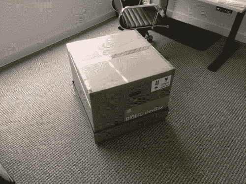

**Figure 2:** The box the NVIDIA Digits DevBox ships in.

DevBox 还非常安全地包装在聚苯乙烯泡沫容器中，以防止对您的机器造成任何损坏。

虽然打开 DevBox 可能没有第一次打开苹果新产品那么令人兴奋，但这仍然是一种乐趣。拆箱后，NVIDIA DIGITS DevBox 机器本身的尺寸为 18 英寸高、13 英寸宽、16.3 英寸深:

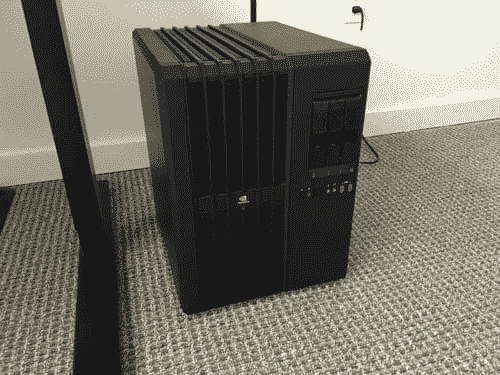

**Figure 3:** The NVIDIA DIGITS DevBox fully unboxed.

您会注意到机器前面有三个硬盘插槽:

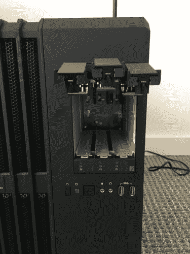

**Figure 4:** Three hard drive slots on the front of the DevBox.

在这里，您可以滑入 DevBox 附带的三个 3TB 硬盘:

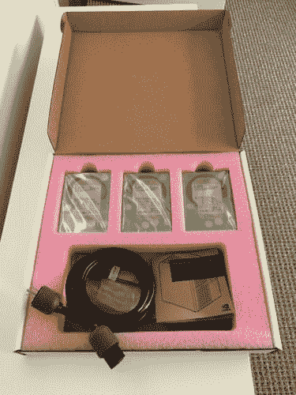

**Figure 5:** The DevBox ships with your 3TB hard drives. Luckily, you don’t need to purchase these separately.

插入驱动器再简单不过了:

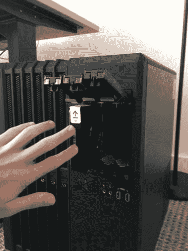

**Figure 6:** Slotting the drives into their respective bays is easy. After slotting, the drives are securely locked in place.

第一次启动时，您需要连接显示器、键盘和鼠标来配置机器:

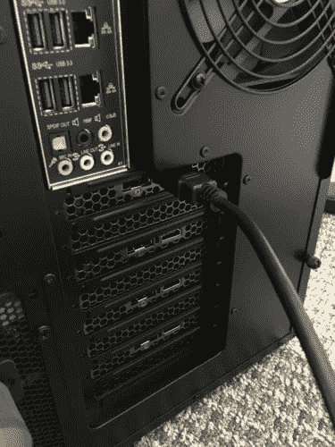

**Figure 7:** Make sure you connect your monitor to the first graphics card in the system.

按下电源按钮开始魔法:

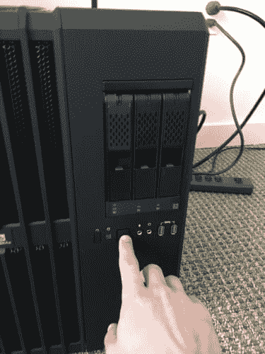

**Figure 8:** Booting the DevBox.

接下来，您将看到引导序列:

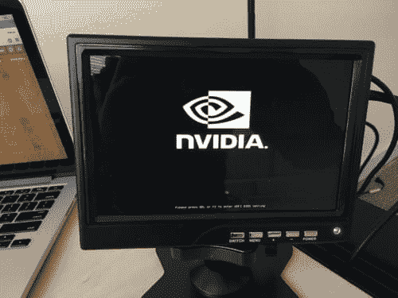

**Figure 9:** Going through the motions and booting the NVIDIA DIGITS DevBox.

机器完成启动后，您需要配置 Ubuntu(就像标准安装一样)。设置键盘布局、时区、用户名、密码等之后。，剩下的配置就自动完成了。

另外值得一提的是，BIOS 仪表板非常有用，非常漂亮:

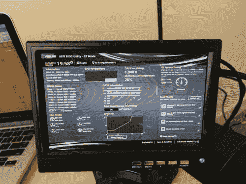

**Figure 10:** The BIOS dashboard on the NVIDIA DIGITS DevBox.

总的来说，我对设置过程很满意。不到 30 分钟，我就完成了整个系统的设置并准备就绪。

### 你不会把它直接插到墙上吧？

保护您的投资—获得优质的不间断电源(UPS)。我将在下一篇博文中详细介绍我选择的 UPS(和机架)。为这篇博文收集的图片主要是为了在初始拆箱时进行演示。

简而言之，我不会建议你将 DevBox 直接放在地毯上或者插在没有 UPS 的插座上——那只是自找麻烦。

## 摘要

诚然，这是一篇冗长的博文，所以如果你在寻找 TLDR，其实很简单:

1.  明年我会在 PyImageSearch 博客上做更多的深度学习教程**。它将在接下来的 3-4 个月内开始缓慢增长，并在年底前建立更多的一致性。**
***   为了促进更好的深度学习教程的创建(并用于我自己的项目)，我已经把我的钱用在了我的嘴上，投资了一个 [NVIDIA DIGITS DevBox](https://developer.nvidia.com/devbox) 。*   安装 DevBox 是一件令人愉快的事情……尽管有一些实用的技巧和窍门，我会在下周的博文中分享。*   如果你对深度学习的世界感兴趣，PyImageSearch 博客是你应该去的地方。**

 **值得注意的是，我已经在 **[PyImageSearch 大师课程](https://pyimagesearch.com/pyimagesearch-gurus/)** 中涵盖了深度学习，所以如果你有兴趣学习更多关于神经网络、深度信念网络和卷积神经网络的知识，请务必加入该课程。

否则，我会在 PyImageSearch 博客上慢慢增加深度学习教程的频率。

**最后，请务必使用下面的表格注册 PyImageSearch 时事通讯，以便在这些新的深度学习帖子发布时得到通知！********