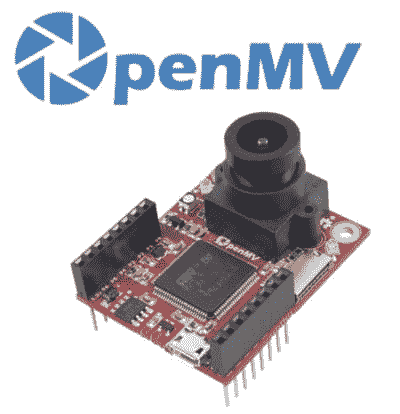
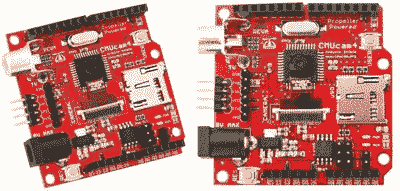
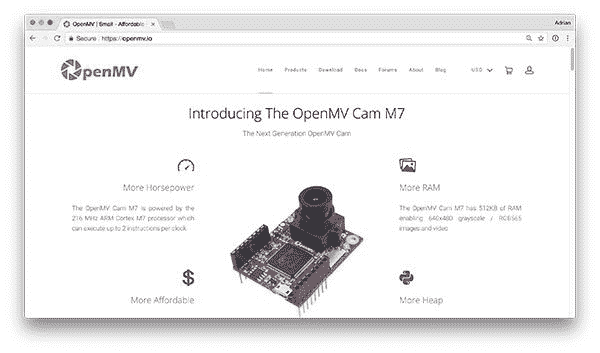
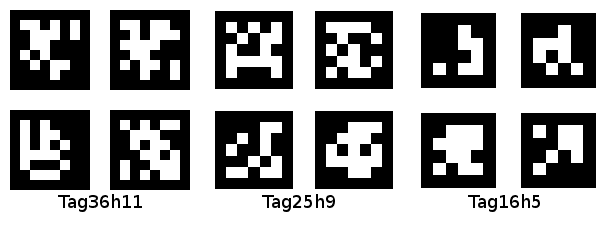

# 采访 OpenMV 的创始人之一、微控制器专家夸贝纳·阿杰曼

> 原文：<https://pyimagesearch.com/2018/03/28/an-interview-with-kwabena-agyeman-co-creator-of-openmv-and-microcontroller-expert/>

在上周发表了关于[用 Python 和 OpenMV](https://pyimagesearch.com/2018/03/19/reading-barcodes-with-python-and-openmv/) 读取条形码的博文后，我收到了*很多*来自读者的电子邮件，询问关于嵌入式计算机视觉以及微控制器如何用于计算机视觉的问题。

与其试图自己解决这些问题，我认为最好请一位真正的专家来——夸贝纳·阿杰曼，他是 OpenMV 的联合创始人，OpenMV 是一种小型、廉价、可扩展的嵌入式计算机视觉设备。

Kwabena 在这次采访中很谦虚，否认自己是专家(这是他善良性格和风度的真实证明)，但相信我，与他见面和聊天是一次令人谦卑的经历。他在嵌入式编程和微控制器设计方面的知识令人难以置信。我可以整天听他谈论嵌入式计算机视觉。

我不经常在 PyImageSearch 上讨论嵌入式设备，所以今天有 Kwabena 在这里真是一种享受。

和我一起欢迎夸贝纳·阿杰曼来到图片搜索博客。要了解更多关于嵌入式计算机视觉的知识，请继续阅读。

## 采访 OpenMV 的创始人之一、微控制器专家夸贝纳·阿杰曼

**Figure 1:** The OpenMV camera is a powerful embedded camera board that runs MicroPython.

阿德里安:嘿，夸贝纳，谢谢你接受采访！很高兴有你在 PyImageSearch 博客上。对于不了解你和 OpenMV 的人来说，你是谁，你是做什么的？

**Kwabena:** 嗨，Adrian，谢谢你今天邀请我。我和我的联合创始人 Ibrahim 创建了 [OpenMV Cam 并运行 OpenMV 项目](https://openmv.io/)。

OpenMV 致力于使嵌入式计算机/机器视觉更容易实现。该项目的最终目标是在比现在更多的嵌入式设备中实现机器视觉。

例如，假设您想在烤面包机上安装一个面部检测传感器。对于任何应用程序来说，这可能都是多余的，但是，请原谅我。

首先，你不能今天就出去买一个 50 美元的面部检测传感器。相反，您至少需要设置一个运行 OpenCV 的单板计算机(SBC) Linux 系统。这意味着给你的烤面包机添加人脸检测功能现在已经成为一个全新的项目。

如果你的目标只是检测视野中是否有人脸，然后在你看着烤面包机的时候拨动一根线来释放面包片，你就不一定想走 SBC 这条路了。

相反，你真正想要的是一个微控制器，它可以通过最少的设置来实现开箱检测人脸和切换电线的目标。

因此，OpenMV 项目基本上是为那些希望在项目中添加强大功能而不必关注所有细节的开发人员提供开箱即用的高级机器视觉功能，以完成各种任务。

* * *

**Figure 2:** The CMUcam4 is a fully programmable embedded computer vision sensor developed by Kwabena Agyeman while at Carnegie Mellon University.

**Adrian:** 对于必须设置一个 SBC Linux 系统、安装 OpenCV 并编写代码来实现一点点功能来说，这是一个很好的观点。我在嵌入式设备方面做的不多，所以从不同的角度来看很有见地。是什么激励你开始从事计算机视觉、机器学习和嵌入式领域的工作？

**Kwabena:** 感谢 Adrian 的提问，我回到卡耐基梅隆大学开始研究机器视觉，在 Anthony Rowe 手下工作，他创造了 [CMUcam 1、2 和 3](http://www.cmucam.org/) 。当我在那里上学的时候，我为简单的颜色跟踪应用程序开发了 [CMUcam 4](http://www.cmucam.org/projects/cmucam4) 。

虽然受到限制，但 CMUcams 能够很好地完成跟踪颜色的工作(如果部署在恒定的照明环境中)。我真的很喜欢在 CMUcam4 上工作，因为它在一个项目中融合了电路板设计、微控制器编程、GUI 开发和数据可视化。

* * *

**Figure 3:** A small, affordable, and expandable embedded computer vision device.

Adrian: 让我们更详细地了解 OpenMV 和 OpenMV Cam。OpenMV Cam 到底是什么，是用来做什么的？

**Kwabena:** 所以，OpenMV Cam 是一个低功率的机器视觉相机。我们当前的型号是 OpenMV Cam M7，它由 216 MHz Cortex-M7 处理器提供支持，每时钟可以执行两条指令，计算速度大约是 Raspberry Pi zero 的一半(单线程无 SIMD)。

OpenMV Cam 也是一个 MicroPython 板。这意味着你用 Python 3 编程。注意，这并不意味着桌面 python 库是可用的。但是，如果你会用 Python 编程，你就可以对 OpenMV Cam 编程，你会觉得用起来很舒服。

不过最酷的是，我们在 OpenMV Cam 的固件中内置了许多高级机器视觉算法(它是用 C 语言编写的——python 只是为了让你像使用 OpenCV 的 python 库绑定一样将视觉逻辑粘在一起)。

特别是，我们有:

*   多色斑点跟踪
*   人脸检测
*   AprilTag 跟踪
*   QR 码、条形码、数据矩阵检测和解码
*   模板匹配
*   相位相关
*   光流
*   帧差分
*   *更内置。*

基本上，它就像低功耗微控制器上的 OpenCV(通过 USB 端口运行)和 Python 绑定

无论如何，我们的目标是将尽可能多的功能包装到一个易于使用的函数调用中。例如，我们有一个“find_blobs()”方法，它返回图像中颜色 blobs 对象的列表。每个斑点对象都有一个质心、边界框、像素数、旋转角度等。因此，该函数调用通过颜色阈值列表自动分割图像(RGB 或灰度),找到所有斑点(连接的组件),基于它们的边界框合并重叠的斑点，并另外计算每个斑点的质心、旋转角度等。主观上，如果你是初学者，使用我们的“find_blobs()”比用 OpenCV 寻找彩色斑点要简单得多。也就是说，如果你需要做一些我们没有想到的事情，我们的算法也不太灵活。所以，有一个权衡。

继续，感知只是问题的一部分。一旦你察觉到什么，你就需要采取行动。因为 OpenMV Cam 是一个微控制器，所以您可以切换 I/O 引脚、控制 SPI/I2C 总线、发送 UART 数据、控制伺服系统等，所有这些都可以从您的视觉逻辑所在的同一个脚本中完成。使用 OpenMV Cam，您可以从一个简短的 python 脚本中感知、计划和行动。

* * *

**阿德里安:**伟大的解释。你能详细说明 OpenMV 的目标市场吗？如果你必须描述你理想的最终用户，他们必须有一个 OpenMV，他们会是谁？

**Kwabena:** 现在，我们的目标市场是业余爱好者。到目前为止，业余爱好者是我们最大的买家，去年帮助我们卖出了 5000 多台 OpenMV Cam M7s。我们也有一些公司购买相机。

无论如何，随着我们的固件变得越来越成熟，我们希望向更多生产产品的公司出售更多的相机。

目前，我们仍在快速构建我们的固件功能，以或多或少地补充 OpenCV 的基本图像处理功能。我们已经有了很多东西，但我们试图确保你有任何你需要的工具，如阴影去除和修复，以创建一个无阴影的背景帧差分应用程序。

* * *

**Figure 4:** An example of AprilTags.

**阿德里安:**阴影去除，真好玩。那么，在组装 OpenMV 时，你不得不争论的最困难的特性或方面是什么？

**Kwabena:** 将 AprilTags 移植到 OpenMV Cam 是在船上运行的最具挑战性的算法。

我从针对 PC 的 AprilTag 2 源代码开始。让它在 OpenMV Cam M7 上运行，与台式机相比，OpenMV Cam M7 只有 512 KB 的内存。我已经检查了所有 15K+行代码，并重做了内存分配如何更有效地工作。

有时这就像将大型数组分配从 malloc 转移到专用堆栈一样简单。有时我不得不改变一些算法的工作方式，以提高效率。

例如，AprilTags 用 0、1、2 等计算每个可能的汉明码字的查找表。尝试将检测到的标签位模式与标签字典匹配时出现位错误。这个查找表(LUT)对于一些标签字典可以超过 30 MBs！当然，索引 LUT 很快，但是，在标签字典中线性搜索匹配的标签也可以。

无论如何，在将算法移植到 OpenMV Cam M7 之后，它可以以 12 FPS 的速度运行 160×120 的 AprilTags。这让你可以用一个可以从你的 USB 端口运行的微控制器，从大约 8 英寸远的地方检测打印在 8 英寸 x11 英寸纸上的标签。

* * *

阿德里安:哇！不得不手动检查所有 15K 行代码*和*重新实现某些功能肯定是一项艰巨的任务。我听说在下一个版本中会有一些非常棒的 OpenMV 新特性。你能给我们讲讲他们吗？

是的，我们的下一款产品，由 STM32H7 处理器驱动的 OpenMV Cam H7 将使我们的性能翻倍。事实上，它的 coremark 得分与 1 GHz 的 Raspberry Pi zero 相当(2020.55 对 2060.98)。也就是说，Cortex-M7 内核没有 NEON 或 GPU。但是，我们应该能够跟上 CPU 有限的算法。

然而，最大的特点是增加了可移动的摄像头模块支持。这使得我们能够像现在一样为 OpenMV Cam H7 提供廉价的卷帘快门相机模块。但是，对于更专业的用户，我们将为那些试图在高速应用中进行机器视觉的人提供全局快门选项，如拍摄传送带上移动的产品。更好的是，我们还计划为机器视觉支持 [FLIR 轻子热](http://www.flir.co.uk/cores/lepton/)传感器。最重要的是，每个相机模块将使用相同的“sensor.snapshot()”构造，我们现在使用它来拍照，允许您在不更改代码的情况下将一个模块切换到另一个模块。

最后，多亏了 ARM，你现在可以在 Cortex-M7 上构建神经网络。以下是 OpenMV Cam 在船上运行 CIFAR-10 网络的视频:

<https://www.youtube.com/embed/PdWi_fvY9Og?feature=oembed>