# 更好、更快、更强的物体探测器(YOLOv2)

> 原文：<https://pyimagesearch.com/2022/04/18/a-better-faster-and-stronger-object-detector-yolov2/>

* * *

* * *

## [**更好、更快、更强的物体探测器(YOLOv2)**](#TOC)

检测框架已经变得越来越快速和准确，正如我们在 [YOLOv1](https://pyimg.co/3cpmz) 上的上一篇文章中所看到的；然而，大多数检测方法仍然局限于一小组对象，如 PASCAL VOC 中的 20 个类和 Microsoft COCO 中的 80 个类。

图像分类数据集具有许多对象标签，并且注释起来比检测容易得多，也便宜得多。但是希望将检测扩展到物体分类的水平。

这也是[雷德蒙和法尔哈迪(2017)](https://openaccess.thecvf.com/content_cvpr_2017/papers/Redmon_YOLO9000_Better_Faster_CVPR_2017_paper.pdf) 发表这篇论文的部分动机。

另一个主要动机是解决 YOLOv1 的问题:

*   成组检测小物体
*   本地化错误
*   锚箱的使用(先验)
*   介绍精确高效的新型 Darknet-19 架构

在本教程中，您将了解 YOLOv2 对象检测模型的所有内容，以及为什么它被称为更好、更快、更强。然后，我们将详细讨论[论文](https://openaccess.thecvf.com/content_cvpr_2017/papers/Redmon_YOLO9000_Better_Faster_CVPR_2017_paper.pdf)中提到的所有基本概念。最后，在图像和视频上运行预训练的 YOLOv2 模型，看看它比它的前身 YOLOv1 表现得更好。

如果你还没有阅读我们之前在 YOLOv1 上的博文，我们强烈建议你先阅读这篇博文，因为理解这篇博文会变得更容易，并增强你的学习体验。

这一课是我们关于 YOLO 的七集系列的第三集:

1.  [*YOLO 家族简介*](https://pyimg.co/dgbvi)
2.  [*了解一个实时物体检测网络:你只看一次(YOLOv1)*](https://pyimg.co/3cpmz)
3.  [*更好、更快、更强的天体探测器(YOLOv2)*](https://pyimg.co/ehaox) **(今日教程)**
4.  [*使用 COCO 评估器*](https://pyimg.co/nwoka) 平均精度(mAP)
5.  [*用 Darknet-53 和多尺度预测的增量改进(YOLOv3)*](https://pyimg.co/8xfpg)
6.  [*【yolov 4】*](https://pyimg.co/c6kiu)
7.  [***在自定义数据集上训练 YOLOv5 物体检测器***](https://pyimg.co/fq0a3)

今天的帖子将讨论 YOLO9000，更普遍的说法是 YOLOv2，它检测物体的速度比已经很快的 YOLOv1 快得多，并在 mAP 中实现了 13-16%的增益。

**要学习 YOLOv2 物体探测器的理论概念，并观看实时探测物体的演示，*继续阅读。***

* * *

## [**更好、更快、更强的物体探测器(YOLOv2)**](#TOC)

在 YOLO 系列的第三部分中，我们将首先介绍 YOLOv2。

我们将讨论 YOLOv2 的**更好的**部分:

*   高分辨率分类器
*   批量标准化
*   锚箱的使用
*   维度群
*   直接位置预测
*   精细特征
*   多尺度分辨率训练
*   定量基准，将 YOLOv2 与 YOLOv1、更快的 R-CNN 和 SSD 进行比较

从那里，我们将讨论 YOLOv2 的**更快的**方面:

*   Darknet-19 网络架构
*   侦查训练
*   分类培训

我们还将讨论构成 YOLO9000 基础的更强大的方面:

*   分层训练
*   将 imagenes 和 ms coco 与单词树相结合
*   分类和检测联合培训

最后，我们将通过在 Tesla V100 GPU 上安装 darknet 框架并使用 YOLOv2 预训练模型在图像和视频上运行推理来结束本教程。

* * *

### [**配置您的开发环境**](#TOC)

要遵循这个指南，您需要在您的系统上编译并安装 Darknet 框架。在本教程中，我们将使用 [AlexeyAB 的 Darknet 库](https://github.com/AlexeyAB/darknet)。

我们将逐步介绍如何在 Google Colab 上安装 darknet 框架。但是，如果您想现在配置您的开发环境，可以考虑前往[配置 Darknet 框架并使用预训练的 YOLOv2 模型运行推理](#h3ConfigDarknet)部分。

* * *

### [**在配置开发环境时遇到了问题？**](#TOC)

说了这么多，你是:

*   时间紧迫？
*   了解你雇主的行政锁定系统？
*   想要跳过与命令行、包管理器和虚拟环境斗争的麻烦吗？
*   **准备好在您的 Windows、macOS 或 Linux 系统上运行代码*****？***

 *那今天就加入 [PyImageSearch 大学](https://pyimagesearch.com/pyimagesearch-university/)吧！

**获得本教程的 Jupyter 笔记本和其他 PyImageSearch 指南，这些指南是** ***预先配置的*** **，可以在您的网络浏览器中运行在 Google Colab 的生态系统上！**无需安装。

最棒的是，这些 Jupyter 笔记本可以在 Windows、macOS 和 Linux 上运行！

* * *

### [**约洛夫 2** 简介](#TOC)

2017 年，约瑟夫·雷德蒙(华盛顿大学研究生)和阿里·法尔哈迪(艾伦人工智能研究所前团队负责人)在 CVPR 会议上发表了 [YOLO9000:更好、更快、更强](https://openaccess.thecvf.com/content_cvpr_2017/papers/Redmon_YOLO9000_Better_Faster_CVPR_2017_paper.pdf)论文。作者在本文中提出了两种*最先进的* YOLO 变种:YOLOv2 和 YOLO9000 两者完全相同，但训练策略不同。

YOLOv2 在标准检测数据集上接受训练，如 [PASCAL VOC](http://host.robots.ox.ac.uk/pascal/VOC/) 和 [MS COCO](https://cocodataset.org/#home) 。同时，YOLO9000 被设计成通过在 MS COCO 和 [ImageNet](https://www.image-net.org/index.php) 数据集上联合训练来预测 9000 多种不同的物体类别。

**图 2** 显示了 YOLO9000 模型的输出，该模型可以实时检测 9000 多个对象类。下面的输出显示模型已经学会检测不在 MS COCO 数据集中的对象。

YOLOv2 是 YOLO 家族的第二个版本，显著提高了精确度，速度更快。

改进的 YOLOv2 模型使用了各种新技术，在速度和准确性方面都优于 Faster-RCNN 和 SSD 等最先进的方法。一种这样的技术是多尺度训练，它允许网络在不同的输入规模下进行预测，从而允许在速度和准确性之间进行权衡。

在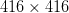

input resolution, YOLOv2 achieved 76.8 mAP on VOC 2007 dataset and 67 FPS on Titan X GPU. On the same dataset with 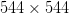input, YOLOv2 attained 78.6 mAP and 40 FPS.

他们还提出了在 COCO 检测数据集和 ImageNet 分类数据集上训练的 YOLO9000 模型。这种类型的训练背后的想法是检测不具有用于对象检测的基础真值的对象类，但是使用来自具有基础真值的对象类的监督。这种训练的领域被称为**弱监督**学习。这种方法帮助他们在 156 个没有探测地面真相的班级上实现了 16 个 mAP。是不是很棒！

* * *

### [**更好的**](#TOC)

在我们之前的文章中，我们了解到 YOLOv1 有一些限制。然而，与两阶段对象检测器相比，它主要受到定位误差的影响，导致低召回率。我们还在推理部分观察到，该模型检测到了置信度分数不是很高的对象。

YOLOv2 的目标是减少定位错误，从而提高召回率，同时保持并超越分类准确性。雷德蒙和法尔哈迪的想法是开发一种比其前辈更精确、更快速的物体探测器。因此，建立像 ResNet 这样更大、更深入的网络或者整合各种网络并不符合要求。相反，通过一种简化的网络架构方法，他们将注意力集中在将过去工作中的许多想法与他们的新技术结合起来。结果，他们提高了 YOLO 在速度和准确性方面的表现。

现在让我们来看看让 YOLO 表现更好的因素:

* * *

#### [](#TOC)**批量归一化**

 ***   在 YOLO 的所有卷积层中添加一个批量归一化层将 mAP 提高了 **2%** 。
*   它有助于改善网络训练的收敛性，并消除了对其他正则化技术的需要，如放弃，而不会使网络在训练数据上过度拟合。

* * *

#### [**高分辨率分类器**](#TOC)

*   在 YOLOv1 中，在 ImageNet 数据集上以输入分辨率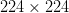执行图像分类任务作为预训练步骤，之后升级到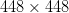用于对象检测。因此，网络必须同时切换到学习对象检测并适应新的输入分辨率。对于网络权重来说，在学习检测任务时适应这个新的分辨率可能是一个问题。
*   在 YOLOv2 中，[雷德蒙和法尔哈迪](https://openaccess.thecvf.com/content_cvpr_2017/papers/Redmon_YOLO9000_Better_Faster_CVPR_2017_paper.pdf)用执行预训练分类步骤。尽管如此，他们在相同的 ImageNet 数据上以升级的分辨率对分类网络进行了微调。通过这样做，网络获得了时间。由于在微调分类步骤中已经观察到该分辨率(图 3**图 3** )，因此它调整了其滤波器，以更好地处理升级后的分辨率。

*   最后，我们针对检测任务对网络进行了微调，高分辨率分类器方法将 mAP 增加了接近 **4%** 。相信我，地图增加 4%是一个相当大的提升。

* * *

#### [**与锚框**卷积](#TOC)

*   YOLOv1 是一个无锚模型，它直接使用每个网格单元中完全连接的层来预测 B 盒的坐标。
*   受 fast-RCNN 的启发，YOLOv2 也基于相同的原理工作，fast-RCNN 使用被称为锚盒的精选先验来预测 B 盒。
*   YOLOv2 移除完全连接的层，并使用锚定框来预测边界框。因此，使其完全卷积。
*   但是什么是锚盒呢？锚定框是一组具有特定高度和宽度的预定义框；它们充当数据集中对象的猜测或先验，有助于快速优化网络。它们是以每个像素为中心的具有不同纵横比和大小的多个边界框(先验)。目标检测网络的目标是预测包围盒及其类别标签。边界框通常以规范化的 xmin、ymin、xmax、ymax 格式表示。

    例如，0.5 xmin 和 0.5 ymin 表示框的左上角在图像的中间。因此，直观地说，我们正在处理一个回归问题，以获得一个像 0.5 这样的数值。

    我们可能有网络预测四个值，用均方差来比较地面真实情况。然而，由于盒子的比例和纵横比的显著差异，研究人员发现，如果我们使用这种“暴力”的方式来获得边界框，网络很难收敛。因此，在 fast-RCNN 论文中，提出了锚盒的概念。

*   在 YOLOv1 中，输出特征图的大小为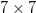，并对图像进行 32 倍的下采样。在 YOLOv2 中， [Redmon 和](https://openaccess.thecvf.com/content_cvpr_2017/papers/Redmon_YOLO9000_Better_Faster_CVPR_2017_paper.pdf)选择作为输出。这种输出大小主要有两个原因:
    *   允许每幅图像检测到更多的对象
    *   奇数个位置将只有一个中心单元，这将有助于捕捉倾向于占据图像中心的大对象

*   为了实现的输出尺寸，将输入分辨率从改变为，并且消除一个最大池层以产生更高分辨率的输出特征图。

*   与 YOLOv1(其中每个网格单元)不同，该模型预测每个网格单元的一组类别概率，忽略框 B 的数量，YOLOv2 预测每个锚框的类别和对象。

*   锚框略微降低了 mAP，从 69.5mAP 降低到 69.2mAP，但是将召回率从 81%提高到 88%，这意味着该模型有更大的改进空间。

*   YOLOv1 对每幅图像预测了 98 个框，但是带有锚框的 YOLOv2 可以根据网格大小对每幅图像预测 845 个框(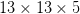)甚至超过一千个。

* * *

#### [**维度星团**](#TOC)

*   与使用手工挑选锚盒的 Faster-RCNN 不同，YOLOv2 使用一种智能技术来为 PASCAL VOC 和 MS COCO 数据集找到锚盒。
*   雷德蒙和法尔哈迪认为，我们不使用手工挑选的锚盒，而是挑选更好的先验知识来更好地反映数据。这将是网络的一个很好的起点，并且网络预测检测和更快地优化将变得容易得多。
*   使用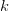-意味着在训练集边界框上聚类，以找到好的锚框或先验。
*   一种标准的-均值聚类技术使用欧几里德距离作为距离度量来寻找聚类中心。然而，在对象检测中，与较小的盒子相比，较大的盒子可能会产生更多的错误(YOLOv1 loss 讨论过类似的问题)，检测的最终目标是最大化 IOU 分数，而与盒子的大小无关。于是，作者将距离度量改为: = 1 -  \text{IOU}(\text{box}, \text{centroid})")。
*   **图 4** 显示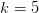被选为模型复杂度和高召回率之间的良好权衡。模型的复杂度会随着锚点数量的增加而增加。该图还显示了具有各种纵横比的锚定框(蓝色),并且该比例非常适合地面实况框。

*   作者观察到，与手工挑选的相比，簇质心或锚明显不同。这种新方法有更多又高又薄的盒子。
*   **表 1** 表示三种类型的前一代策略:聚类平方和、聚类 IOU、锚盒(手工挑选的先验)。我们可以看到，具有 5 个锚的集群 IOU 做得很好，平均 IOU 为 61.0，并且表现类似于手挑选的锚。此外，如果我们增加先验，我们会看到平均 IOU 的跳跃。这项研究的结论是，使用-手段来生成包围盒启动了具有更好表示的模型，并使网络的工作更容易。

* * *

#### [**直接位置预测**](#TOC)

在 YOLOv1 中，我们直接预测了中心")

locations for the bounding box, which caused model instability, especially during the early iterations. Furthermore, since in YOLOv1, there was no concept of priors, directly predicting box locations led to a more significant loss as the model had no idea about the objects in the dataset.

然而，在 YOLOv2 中，由于锚的概念，我们仍然遵循 YOLOv1 的方法，并预测相对于网格单元位置的位置坐标，但是模型输出偏移。这些偏移告诉我们先验距离真实边界框有多远。这个公式允许模型不偏离中心位置太多。因此，代替预测直接坐标![[\text{xmin}, \text{ymin}, \text{xmax}, \text{ymax}]](img/c4e4a7cc3bf75019e4916fd9387fc974.png "[\text{xmin}, \text{ymin}, \text{xmax}, \text{ymax}]")

, we predict offsets to these bounding boxes during the training. This works because our ground-truth box should look like the anchor box we pick with -means clustering, and only subtle adjustment is needed, which gives us a good head start in training.

由于它们限制了相对于格网单元位置的预测坐标，这将地面实况限制在`0`和`1`之间。他们使用逻辑(sigmoid)激活函数来限制网络的预测落在`[0, 1]`中，以匹配地面真实范围。

**图 5** 显示了预测边界框(蓝色)和定位框(黑色虚线)。负责预测这个蓝框的单元/网格是第二行中的单元，因为边界框的中心落在这个特定的单元中。

该模型预测输出要素地图中每个像元处的五个边界框(每个像元五个锚点)。对于每个边界框，网络预测五个值(如图 6 中的**所示):偏移量和比例")**

and the confidence score .

对应的预测包围盒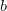

has center ")and width and height "). At each grid cell, the anchor/prior box has size ")with its top-left corner at "). The confidence score is the sigmoid of the predicted output .

更具体地说，

and are the -coordinate and -coordinate of the centroid relative to the top-left corner of that cell. ")are the width and height of the anchor box, 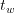and 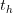are the offsets for anchor adjustment predicted by the network.

取的指数

and helps make them positive if the network predicts them as negative since width and height cannot be negative. To get the real width and height of the bounding box, we multiply the offsets with the anchor box width 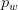and height 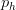.

像在 YOLOv1 中一样，这里，盒子置信度得分应该等于预测盒子和实际盒子之间的 IOU。

通过约束位置预测，网络的学习变得容易，使得网络更加稳定。

将维度聚类与直接预测边界框中心位置相结合，比带有锚框的版本提高了 yolov 2`~5%`。

* * *

#### [**细粒度特征**](#TOC)

*   YOLOv2 预测在特征图上的检测，这对于大的物体很有效，但是检测较小的物体可以受益于细粒度的特征。细粒度特征指的是网络早期层的特征映射。
*   虽然速度更快的 R-CNN 和 SSD(单次检测器)都在网络中的不同层(特征地图)运行区域建议网络以实现多分辨率，但 YOLOv2 增加了一个**直通**层。
*   直通层的部分灵感来自于 [U-Net 论文](https://arxiv.org/pdf/1505.04597.pdf)，其中跳过连接用于连接编码器和解码器层之间的特性。
*   类似地，YOLOv2 通过将相邻的特征堆叠到不同的通道来将高分辨率特征与低分辨率特征连接起来(**图 7** )。这也可以被认为是 [ResNet](https://arxiv.org/pdf/1512.03385.pdf) 架构中的身份映射。

*   由于高分辨率特征图的空间尺寸与低分辨率特征图不匹配，高分辨率图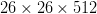变成了，然后与原来的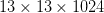特征串接在一起。
*   这种串联将特征映射空间扩展到了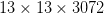，提供了对细粒度特征的访问。
*   细粒度特性的使用帮助 YOLOv2 模型提高了 1%。

* * *

#### [**多尺度训练**](#TOC)

*   YOLOv1 模型使用输入分辨率进行训练，并使用完全连接的层来预测边界框和类标签。但在 YOLOv2 中，增加了锚框，分辨率改为；此外，网络没有完全连接的层。这是一个完全卷积的网络，只有卷积层和池层。因此，在训练模型时，网络的输入可以动态地调整大小。
*   网络输入每几次迭代都会发生变化。每十批之后，网络随机选择一个新的输入分辨率。回想一下，在与锚定框的卷积中，我们讨论了网络以因子 32 对图像进行下采样，因此它从以下分辨率中进行选择: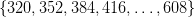。
*   这种类型的训练允许网络以不同的图像分辨率进行预测。该网络在较小尺寸的输入下预测更快，提供了速度和准确性之间的折衷。与最小的输入相比，较大的输入预测相对较慢，但达到最大的准确性。**图 8** 显示了当我们改变网络输入时，端到端工作流程的情况——输入越小，检测头的网格数越少。

*   多尺度训练也有助于避免过度拟合，因为我们强制用不同的模态来训练模型。
*   在测试时，我们可以在不修改训练好的权重的情况下，将图像调整到许多不同的大小。
*   在低分辨率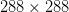下，YOLOv2 以 69.0 的地图运行速度超过 90 FPS，接近快速 R-CNN。当然，在 FPS 方面没有可比性。您可以在具有较少 CUDA 内核或较旧架构的 GPU 上使用低分辨率版本，甚至可以在嵌入式设备上部署优化版本，如 Jetson Nano、Xavier NX、英特尔神经计算棒。
*   高分辨率(即)优于所有其他检测框架，成为 78.6 mAP 的最先进检测器，同时仍实现超过实时的速度。
*   多尺度训练方法使平均动脉压提高了 1.5%。
*   **表 2** 显示了 YOLOv2 在 Titan X GPU 上不同分辨率下的综合性能指标评测，以及其他检测架构，如更快的 R-CNN、YOLOv1、SSD。我们可以观察到，几乎所有的 YOLOv2 变体在速度或准确性方面都比其他检测框架表现得更好。PASCAL VOC 上检测基准的图形表示如图**图 9** 所示。

* * *

### [**更快**](#TOC)

到目前为止，我们讨论了 YOLOv2 如何通过使用各种技术，如锚盒、批量标准化、高分辨率分类器、维度聚类等，使对象检测变得准确。但是速度呢？这就是我们将在文章的这一部分讨论的内容。

许多涉及物体检测的应用，如自动驾驶、机器人、视频监控，都需要实时性能，并依赖于低延迟预测。为了最大限度地提高速度，YOLOv2 被设计成从地面快速起飞。

[雷德蒙和法尔哈迪](https://openaccess.thecvf.com/content_cvpr_2017/papers/Redmon_YOLO9000_Better_Faster_CVPR_2017_paper.pdf)在**表 3** 所示的速度、精度和 FLOPs(浮点运算)方面，对 Darknet-19(yolov 2 使用的)和其他分类架构进行了详细的比较研究，并展示了他们的架构在速度和精度方面做得最好。

VGG-16 是大多数检测框架的常用特征提取器；这是一个稳健而精确的图像分类网络，但在处进行单次前向传递需要大量浮点运算(309.5 亿次浮点运算)

image resolution. The YOLOv1 architecture used a custom architecture inspired by the GoogLeNet network. As we can see from **Table 3**, the YOLOv1 extraction module is much faster and more accurate than VGG-16 and only uses 8.52 billion operations for a single pass.

ResNet-50 是最慢的，但达到了最好的前 1 和前 5 精度；人们热爱雷斯内特一家。需要注意的重要一点是，与 VGG-16 相比，ResNet 使用的 FLOPs 不到三分之一，但仍然实现了更低的 FPS，这意味着 FLOPs 与 FPS 不成正比。此外，ResNet-50 的层数比 VGG-16 多得多，每层的过滤器更少，不会使 GPU 饱和，而且你最终要在层间传输数据，这增加了时间，使 ResNet 更慢。因此，速度不仅仅是一败涂地。

* * *

#### [**暗网-19**](#TOC)

Darknet-19 是一种新的分类架构，被提出作为目标检测的基础，其概要如图**图 10** 所示。

*   它主要是受先前工作的启发；与 VGG-16 类似，它使用过滤器，并在每个汇集步骤后利用总共 5 个汇集层将通道数量加倍。
*   他们没有使用完全连接的层，而是使用全局平均池进行预测，并使用过滤器来压缩卷积之间的特征表示。
*   如前所述，我们使用批量标准化来稳定训练、调整模型并加快收敛速度。
*   设计了具有 19 个卷积层和 5 个最大池层的全卷积模型。

* * *

#### [**分类训练**](#TOC)

如前所述，我们以高分辨率分类器的方式训练了 Darknet-19 网络。在时，网络最初在 ImageNet 1000 类数据集上被训练了 160 个时期

image resolution using stochastic gradient descent with a learning rate of 0.1\. Then, various data augmentation techniques like random crops, exposure shifts, hue, and saturation were applied. As a result, the network achieved Top-1 accuracy of 72.9% and Top-5 accuracy of 91.2% with only 5.58 billion FLOPs.

同样的网络在更大的分辨率下被微调(

) with the same parameters for only ten epochs with a learning rate of 0.001\. Again, the model performed better than the 224 resolution achieving Top-1 accuracy of 76.5% and Top-5 accuracy of 93.3%.

* * *

#### [**检测训练**](#TOC)

[雷德蒙和法尔哈迪](https://openaccess.thecvf.com/content_cvpr_2017/papers/Redmon_YOLO9000_Better_Faster_CVPR_2017_paper.pdf)为目标探测任务修改了 Darknet-19 网络。他们删除了最后一个卷积层以及平均池和 softmax，并用三个替换了卷积层

convolutional layers with 1024 filters. Followed by a convolutional layer to convert (input resolution of downsampled to ) with the number of outputs required for detection, that is, 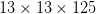(five boxes predicted at each grid with each box having four box coordinates, one objectness score, and 20 conditional class probabilities per box so 125 filters).

网络被训练了 160 个时期，学习率为 0.001。这使得学习率在 60 和 90 年代下降了 10 倍。相同的训练策略用于在 MS COCO 和 PASCAL VOC 数据集上的训练。

**图 11** 显示了目标检测架构，基础网络用虚线表示，用 imagenet 权重进行了预训练。如前所述，我们从 Darknet-19 的块 5 向倒数第二个卷积层添加了一个直通层，以便该模型学习细粒度的特征，并在较小的对象上表现良好。

祝贺你成功来到这里！您了解了本文对构建最先进的实时对象检测器 YOLOv2 的所有重要贡献。下一个也是最后一个理论部分是可选的，因为它本身没有讨论太多的对象检测，所以可以随意跳过它，直接进入推理部分。

* * *

### [**变强**](#TOC)

这个最后部分的动机来自于图像分类数据集中的标签比对象检测数据集中的标签多得多的事实，因为在图像上绘制用于对象检测的框比标记用于分类的图像要昂贵得多。

**图 12** 显示 MS COCO 对象检测数据集只有 100K 个图像和 80 个类别，而 ImageNet 数据集有 1400 万个图像和超过 22K 个类别。这是一个巨大的差异。这不仅仅是利用分类数据集来解决对象检测问题的原因。

COCO 数据集包含带有粗粒度标签的普通对象，如猫、狗、汽车、自行车等。另一方面，ImageNet 数据集是巨大的，并且具有像波斯猫、空中客车和美国双花这样的细粒度标签。

因此，该论文提出了一种方法来组合对象检测和分类数据集，并联合学习比仅仅 80 个类别大得多的类别(在 MS COCO 中)。雷德蒙和法尔哈迪称这个模型为 YOLO9000，因为它被训练成可以检测 9000 多种物体。想法是对象检测标签将学习特定于检测的特征，如边界框坐标、对象性分数和对常见对象的分类(在 MS COCO 中)。相比之下，只有类别标签的图像(来自 ImageNet)将有助于扩大它可以检测的类别数量。

**图 13** 以树形格式显示了 MS COCO 和 ImageNet 类表示，我们通常对所有这些类应用 softmax 函数来计算最终概率。softmax 函数假设数据集的类是互斥的；例如，不能将 softmax 应用于既有猫又有波斯猫的类的输出概率，因为波斯猫属于父类 cat。波斯猫图像也可以归类为猫。

最初，作者认为他们可以合并两个数据集(如图**图 14** 所示)并进行联合训练。当网络被馈送标记用于检测的图像时，它用完整的 YOLOv2 损失函数反向传播。当它被馈送标记用于分类的图像时，只有来自分类特定部分的损失被反向传播。

然而，[雷德蒙和法尔哈迪](https://openaccess.thecvf.com/content_cvpr_2017/papers/Redmon_YOLO9000_Better_Faster_CVPR_2017_paper.pdf)认为上述方法带来了一些挑战:简单地合并两个数据集将违背使用 softmax 图层进行分类的目的，因为类将不再保持互斥。例如，给定一个熊的图像，网络将会混淆是给该图像分配“熊”的 COCO 标签还是“美国黑熊”的 ImageNet 标签

* * *

#### [**分级分类**](#TOC)

为了解决 ImageNet 标签与 COCO 女士的合并问题， [Redmon 和法尔哈迪](https://openaccess.thecvf.com/content_cvpr_2017/papers/Redmon_YOLO9000_Better_Faster_CVPR_2017_paper.pdf)参照形成 ImageNet 标签的[WordNet](https://wordnet.princeton.edu/)(**图 15** )利用层次树结构。例如，在 WordNet 中，“诺福克梗”和“约克夏梗”都是“梗”的下位词，“梗”是“猎狗”的一种，“狗”是“犬科动物”的一种，等等。

WordNet 是单词之间语义关系的数据库。它将单词链接成语义关系，包括同义词、下位词和部分词。名词、动词、形容词和副词被分组为同义词，称为**同义词集**(也称为一组同义词)，每个同义词表达一个不同的概念。下位词是一个词或短语，它的语义场比它的上位词更具体。上位词的语义场比下位词的语义场更广。比如*鸽子*、*乌鸦*、*老鹰*、*海鸥*都是*鸟*的下位词，它们的上位词。

大多数分类方法假设标签是平面结构；然而，对于组合数据集，这种结构正是我们所需要的。但是 WordNet 的结构是一个有向图，而不是一棵树，而且图比树更容易连接和复杂。例如，“狗”既是“犬科动物”的一种，也是“家畜”的一种因此，不使用完整的图形结构，而是根据 ImageNet 中的概念构建一个简化的层次树。

通过考虑图像在数据集中出现的单词，WordNet 被清理并转换成树结构，这产生了描述物理对象的单词树。

更具体地说，执行以下步骤来构建树:

*   观察 ImageNet 中的视觉名词，我们沿着它们的路径通过 WordNet 图到达根节点。这里的根节点是“物理对象”
*   在图中只有一条路径的 Synsets 首先被添加到树中。
*   然后，我们迭代地观察我们留下的概念，并添加尽可能小的增长树的路径(如果一个概念有两条到根的路径，一条有五条边，另一条有三条边，我们将选择后者)。

这就产生了一个单词树，一个视觉概念的层次模型。分类是在单词树层次结构中进行的。我们预测给定同义词集的每个下位词的每个节点的条件概率。例如，在“梗”节点，我们预测:

Pr(诺福克梗|梗)
Pr(艾尔代尔梗|梗)
Pr(西利汉梗|梗)
Pr(莱克兰梗|梗)
…

在使用来自 ImageNet 的 1000 个类构建的单词树上训练 Darknet-19 模型。单词树具有 1000 个叶节点，对应于原始的 1K 标签加上 369 个节点用于它们的父类。

该模型预测 1369 个值的向量，并计算作为同一概念的下位词的所有同义词集的 softmax(参见**图 16** )。大多数 ImageNet 模型使用一个大的 softmax 层来预测超过 1000 个类别的概率分布。但是，在 WordTree 中，对头、头发、静脉、嘴等共下位词执行多个 softmax 操作，因此 synset body 的所有下位词都是一个 softmax 计算。

使用具有相同参数但具有分级训练的相同 Darknet-19 模型，该模型实现了 71.9%的前 1 准确率和 90.4%的前 5 准确率。现在同样的想法被应用于对象检测。检测器预测包围盒和概率树，在每次分割时使用最高置信度的同义词集，直到我们达到一个阈值并预测该节点为对象类。

**图 17** 显示了一个使用 WordTree 来组合来自 ImageNet(具体概念:较低节点和叶子)和 COCO(一般概念:较高节点)的标签的例子。WordNet 是高度多样化的，所以我们可以对大多数数据集使用这种技术。蓝色节点是 COCO 标签，红色节点是 ImageNet 标签。

* * *

### [**联合分类检测**](#TOC)

现在我们已经组合了两个数据集(包含 9418 个类)，我们可以在分类和检测上联合训练 YOLO9000 模型。

对于联合训练，只有 3 个先验而不是 5 个先验被考虑来限制输出大小。此外，还添加了 ImageNet 检测挑战数据集，用于评估 YOLO9000 型号。

YOLO9000 的培训以两种方式进行:

*   当网络看到**检测图像**时，完整的 YOLOv2 丢失被反向传播(即，包围盒坐标、对象性得分、分类误差)(**图 18** )。

*   对于**分类图像**，网络反向传播分类和目标损失(**图 19)** 。通过假设预测的边界框与基本事实框重叠至少 0.3 IOU 来计算客观性损失。为了反向传播分类损失，找到对于该类具有最高概率的包围盒，并且仅在它的预测树上计算损失。

* * *

#### [**评测 YOLO9000**](#TOC)

在 ImageNet 检测任务上对该模型进行了评估。评估数据集与 COCO 女士有 44 个共同的对象类别，这意味着它看到的用于检测的对象类别非常少，因为大多数测试图像都是用于图像分类的。尽管如此，YOLO9000 模型总体上实现了 19.7 的 mAP，在 156 个对象类别上实现了 16.0 的 mAP，该网络在训练期间从未见过这些对象类别的标记检测数据。

雷德蒙和法尔哈迪发现，联合 YOLO9000 模型在新物种动物上表现良好，但在服装和设备等学习类别上表现不佳。原因是相对于服装和装备，COCO 有很多动物的标签数据；事实上，它没有任何服装类别的边界框标签，因此性能下降是显而易见的。

现在，我们已经介绍了 YOLOv2 和 YOLO9000 的许多基础知识，让我们继续在 darknet 框架中运行 YOLOv2 模型的推理，该框架是在 PASCAL VOC 数据集上预先训练的。

* * *

### [**配置暗网框架，用预先训练好的 YOLOv2 模型运行推理**](#TOC)

在我们上一篇关于 YOLOv1 的文章中，我们已经学习了如何配置 darknet 框架，并使用预先训练的 YOLOv1 模型进行推理；我们将按照之前相同的步骤来配置 darknet 框架。然后，最后，用 YOLOv2 预训练模型运行推理，看它比 YOLOv1 执行得更好。

配置 darknet 框架并使用 YOLOv2 在图像和视频上运行推理分为七个易于遵循的步骤。所以，让我们开始吧！

***注意*** *:请确保您的机器上安装了匹配的 CUDA、CUDNN 和 NVIDIA 驱动程序。对于这个实验，我们使用 CUDA-10.2，CUDNN-8.0.3。但是如果你计划在 Google Colab 上运行这个实验，不要担心，因为所有这些库都预装了它。*

**步骤#1:** 我们将在本实验中使用 GPU，因此请确保 GPU 已启动并正在运行。

```py
# Sanity check for GPU as runtime
$ nvidia-smi
```

**图 20** 显示了机器中可用的 GPU(即 V100)以及驱动程序和 CUDA 版本。

第二步:我们将安装一些库，比如 OpenCV，FFmpeg 等等。，这在编译和安装 Darknet 之前是必需的。

```py
# Install OpenCV, ffmpeg modules
$ apt install libopencv-dev python-opencv ffmpeg
```

**步骤#3:** 接下来，我们从 AlexyAB 存储库中克隆 darknet 框架的修改版本。如前所述，Darknet 是由 Joseph Redmon 编写的开源神经网络。用 C 和 CUDA 编写，同时支持 CPU 和 GPU 计算。暗网的官方实现可在:【https://pjreddie.com/darknet/；我们会下载官网提供的 YOLOv2 砝码。

```py
# Clone AlexeyAB darknet repository
$ git clone https://github.com/AlexeyAB/darknet/
$ cd darknet/
```

确保将目录更改为 darknet，因为在下一步，我们将配置`Makefile`并编译它。此外，使用`!pwd`进行健全性检查；我们应该在`/content/darknet`目录里。

**步骤#4:** 使用流编辑器(`sed`)，我们将编辑 make 文件并启用标志:`GPU`、`CUDNN`、`OPENCV`和`LIBSO`。

**图 21** 显示了`Makefile`内容的一个片段，稍后将讨论:

*   我们让`GPU=1`和`CUDNN=1`与`CUDA`一起构建暗网来执行和加速对`GPU`的推理。注意`CUDA`应该在`/usr/local/cuda`；否则，编译将导致错误，但如果您正在 Google Colab 上编译，请不要担心。
*   如果你的`GPU`有张量核，使`CUDNN_HALF=1`获得最多`3X`推理和`2X`训练加速。由于我们使用带张量内核的 Tesla V100 GPU，因此我们将启用此标志。
*   我们使`OPENCV=1`能够与`OpenCV`一起构建暗网。这将允许我们检测视频文件、IP 摄像头和其他 OpenCV 现成的功能，如读取、写入和在帧上绘制边界框。
*   最后，我们让`LIBSO=1`构建`darknet.so`库和使用这个库的二进制可运行文件`uselib`。启用此标志将允许我们使用 Python 脚本对图像和视频进行推理，并且我们将能够在其中导入`darknet`。

现在让我们编辑`Makefile`并编译它。

```py
# Enable the OpenCV, CUDA, CUDNN, CUDNN_HALF & LIBSO Flags and Compile Darknet
$ sed -i 's/OPENCV=0/OPENCV=1/g' Makefile
$ sed -i 's/GPU=0/GPU=1/g' Makefile
$ sed -i 's/CUDNN=0/CUDNN=1/g' Makefile
$ sed -i 's/CUDNN_HALF=0/CUDNN_HALF=1/g' Makefile
$ sed -i 's/LIBSO=0/LIBSO=1/g' Makefile
$ make
```

`make`命令将需要大约 90 秒来完成执行。既然编译已经完成，我们就可以下载 YOLOv2 权重并运行推理了。

你不兴奋吗？

**步骤#4:** 我们现在将从官方 [YOLOv2 文档中下载 YOLOv2-VOC 砝码](https://pjreddie.com/darknet/yolov2/)。

```py
# Download YOLOv2 Weights
$ wget https://pjreddie.com/media/files/yolov2-voc.weights
```

**步骤#5:** 现在，我们将运行`darknet_images.py`脚本来推断图像。

```py
# Run the darknet image inference script
$ python3 darknet_images.py --input data --weights \ 
yolov2-voc.weights --config_file cfg/yolov2-voc.cfg \
--data_file cfg/voc.data --dont_show
```

让我们来看看传递给`darknet_images.py`的命令行参数:

*   `--input`:图像目录或文本文件的路径，带有图像路径或单个图像名称。支持`jpg`、`jpeg`和`png`图像格式。在本例中，我们将路径传递给名为`data`的图像文件夹。
*   `--weights` : YOLOv2 重量路径。
*   `--config_file`:yolo v2 的配置文件路径。在抽象层次上，该文件存储神经网络模型架构和一些其他参数，如`batch_size`、`classes`、`input_size`等。我们建议您通过在文本编辑器中打开该文件来快速阅读它。
*   这里，我们传递 PASCAL VOC 标签文件。
*   这将禁止 OpenCV 显示推理结果，我们使用它是因为我们正在与 Google Colab 合作。

在对下面的图像运行 YOLOv2 PASCAL VOC 预训练模型后，我们了解到，与 YOLOv1 相比，该模型检测物体的可信度更高，并且几乎接近零错误否定。但是，您会看到一些误报。

我们可以从**图 22** 中看到，该模型检测到一只狗、一辆自行车和一辆汽车，并且置信度非常高。

在**图 23** 中，模型正确检测到所有三个对象(即狗、人和马)；然而，它将马检测为羊，但是具有低得多的置信度得分。回想一下在 YOLOv1 中，网络同样犯了把马预测为羊的错误，但至少 YOLOv2 也把它预测为马！由于绵羊的置信度得分较小，您可以通过增加`--thresh`参数来过滤检测结果！

在**图 24** 中，模型很好地检测了所有的马。然而，它也预测右边的一匹马是一头牛。但与 YOLOv1 不同，它不会错过检测对象。

**图 25** 是一只鹰的图像，类似于 YOLOv1 模型预测了 75%的鸟。然而，YOLOv2 也检测到了一只置信度高达 95%的鸟。

**步骤#6:** 现在，我们将在电影《天降》的视频上运行预训练的 YOLOv2 模型；这是作者在他们的一个实验中使用的同一段视频。

在运行`darknet_video.py`演示脚本之前，我们将首先使用 Pytube 库从 YouTube 下载视频，并使用 moviepy 库裁剪视频。所以让我们快速安装这些模块并下载视频。

```py
# Install pytube and moviepy for downloading and cropping the video
$ pip install git+https://github.com/rishabh3354/pytube@master
$ pip install moviepy
```

```py
# Import the necessary packages
$ from pytube import YouTube
$ from moviepy.video.io.ffmpeg_tools import ffmpeg_extract_subclip

# Download the video in 720p and Extract a subclip
$ YouTube('https://www.youtube.com/watch?v=tHRLX8jRjq8'). \ streams.filter(res="720p").first().download()
$ ffmpeg_extract_subclip("/content/darknet/Skyfall.mp4", \ 
0, 30, targetname="/content/darknet/Skyfall-Sample.mp4")
```

**步骤#7:** 最后，我们将运行`darknet_video.py`脚本来为天崩地裂的视频生成预测。我们打印输出视频每一帧的 FPS 信息。

如果使用 mp4 视频文件，请务必在`darknet_video.py`的**第 57 行**将`set_saved_video`功能中的视频编解码器从`MJPG`更改为`mp4v`；否则，播放推理视频时会出现解码错误。

```py
# Change the VideoWriter Codec
fourcc = cv2.VideoWriter_fourcc(*"mp4v")
```

既然所有必要的安装和修改都已完成，我们将运行`darknet_video.py`脚本:

```py
# Run the darknet video inference script
$ python darknet_video.py --input \ 
/content/darknet/Skyfall-Sample.mp4 \ 
--weights yolov2-voc.weights --config_file \ 
cfg/yolov2-voc.cfg --data_file ./cfg/voc.data \
--dont_show --out_filename pred-skyfall.mp4
```

让我们看看传递给`darknet_video.py`的命令行参数:

*   `--input`:视频文件的路径，如果使用网络摄像头，则为`0`
*   `--weights` : YOLOv2 重量路径
*   `--config_file`:配置文件路径
*   在这里，我们传递 PASCAL VOC 标签文件
*   `--dont_show`:这将禁止 OpenCV 显示推理结果
*   `--out_filename`:推理结果输出视频名称，如果为空则输出视频不保存

下面是天降行动场景视频上的推断结果，预测似乎比 YOLOv1 好了很多。YOLOv2 网络在混合精度的特斯拉 V100 GPU 上实现了平均 **84 FPS** 。

<https://www.youtube.com/embed/p2dt4lljyLc>***