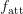
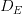
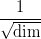
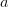
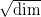

# 使用 TensorFlow 和 Keras 深入了解变形金刚:第 1 部分

> 原文：<https://pyimagesearch.com/2022/09/05/a-deep-dive-into-transformers-with-tensorflow-and-keras-part-1/>

* * *

## **目录**

* * *

## [**用 TensorFlow 和 Keras 深入了解变形金刚:第 1 部分**](#TOC)

当我们看着人工智能生成的华丽的未来景观或使用大规模模型写我们自己的推文时，记住这一切从哪里开始是很重要的。

数据，矩阵乘法，用非线性开关重复和缩放。也许这简化了很多事情，但即使在今天，大多数架构都可以归结为这些原则。即使是最复杂的系统、想法和论文也可以归结为:

> **数据，矩阵乘法，用非线性开关重复和缩放。**

在过去的几个月里，我们已经通过教程介绍了*自然语言处理(NLP)* 。我们从 NLP 的**历史**和**基础**出发，用**注意力**讨论神经机器翻译。

以下是按时间顺序排列的所有教程。

*   [**自然语言处理入门**](https://pyimagesearch.com/2022/06/27/introduction-to-natural-language-processing-nlp/)
*   **[**介绍词袋(BoW)模型**](https://pyimagesearch.com/2022/07/04/introduction-to-the-bag-of-words-bow-model/)**
*   **[**Word2Vec:嵌入 NLP 的研究**](https://pyimagesearch.com/2022/07/11/word2vec-a-study-of-embeddings-in-nlp/)**
*   **[**BagofWords 和 Word2Vec** 的比较](https://pyimagesearch.com/2022/07/18/comparison-between-bagofwords-and-word2vec/)**
*   **[**带 Keras 和 TensorFlow 的递归神经网络简介**](https://pyimagesearch.com/2022/07/25/introduction-to-recurrent-neural-networks-with-keras-and-tensorflow/)**
*   **[**长短期记忆网络**](https://pyimagesearch.com/2022/08/01/long-short-term-memory-networks/)**
*   **[**神经机器翻译**](https://pyimagesearch.com/2022/08/15/neural-machine-translation/)**
*   **[**神经机器翻译用 Bahdanau 的注意力使用 TensorFlow 和 Keras**](https://pyimagesearch.com/2022/08/22/neural-machine-translation-with-bahdanaus-attention-using-tensorflow-and-keras/)**
*   **[**神经机器翻译用 Luong 的注意力使用 TensorFlow 和 Keras**](https://pyimagesearch.com/2022/08/29/neural-machine-translation-with-luongs-attention-using-tensorflow-and-keras/)**

 **现在，正如所讨论的，NLP 的进展讲述了一个故事。我们从**记号**开始，然后构建这些记号的**表示**。我们使用这些表示来寻找记号之间的相似之处，并将它们嵌入到高维空间中。同样的嵌入也被传递到能够处理顺序数据的**顺序模型**中。这些模型用于构建上下文，并通过一种巧妙的方式，关注输入句子中对翻译中的输出句子有用的部分。

唷！做了很多研究。我们自己也差不多是一名科学家。

但是前方是什么呢？一群真正的科学家聚集在一起回答这个问题，并制定了一个天才计划(如图**图 1** 所示)，这将从根本上动摇深度学习领域。

在本教程中，你将了解导致变形金刚开创性架构的注意力机制的演变。

本课是关于 NLP 104 的三部分系列的第一部分:

1.  [***用 TensorFlow 和 Keras 深度潜入变形金刚:第一部***](https://pyimg.co/8kdj1) **(今日教程)**
2.  *用 TensorFlow 和 Keras 深入了解变形金刚:第二部分*
3.  *使用 TensorFlow 和 Keras 深入了解变形金刚:第 3 部分*

**要了解注意力机制是如何进化成变压器架构的，** ***就继续阅读吧。***

* * *

## [**用 TensorFlow 和 Keras 深入了解变形金刚:第 1 部分**](#TOC)

* * *

### [**简介**](#TOC)

在我们的[前一篇博文](https://pyimagesearch.com/2022/08/22/neural-machine-translation-with-bahdanaus-attention-using-tensorflow-and-keras/)中，我们介绍了基于递归神经网络架构的神经机器翻译模型，其中包括一个**编码器**和一个**解码器**。另外，为了便于更好的学习，我们还引入了**注意力模块**。

[Vaswani 等人](https://arxiv.org/abs/1706.03762)对神经机器翻译模型提出了一个简单而有效的改变。这篇论文的摘录最好地描述了他们的建议。

> 我们提出了一种新的简单网络架构，即**转换器**，它完全基于注意力机制，完全不需要递归和卷积。

在今天的教程中，我们将讲述这个被称为变压器的神经网络架构背后的理论。在本教程中，我们将重点介绍以下内容:

*   变压器架构
    *   编码器
    *   解码器
*   注意力的进化
    *   版本 0
    *   版本 1
    *   版本 2
    *   版本 3
    *   版本 4(交叉关注)
    *   版本 5(自我关注)
    *   版本 6(多头关注)

* * *

### [**变压器架构**](#TOC)

我们采用自顶向下的方法来构建 Transformer 架构背后的直觉。让我们先看看整个架构，然后再分解各个组件。

变压器由两个独立模块组成，分别是**编码器**和**解码器**，如图**图 2** 所示。

* * *

#### [**编码器**](#TOC)

如**图 3** 所示，**编码器**是一堆

identical layers. Each layer is composed of *two* sub-layers.

> 第一个是**多头自我关注机制**，第二个是简单的**位置式全连接前馈网络**。

作者还在两个子层周围使用了剩余连接(红线)和标准化操作。

源令牌首先被**嵌入**到高维空间中。输入嵌入添加了**位置编码**(我们将在后面的系列教程中深入讨论位置编码)。求和后的嵌入值随后被送入编码器。

* * *

#### [**解码器**](#TOC)

如**图 4** 所示，**解码器**是一堆

identical layers. Each layer is composed of *three* sub-layers.

> 除了每个编码器层中的两个子层之外，解码器还插入了第三个子层，该子层对编码器堆栈的输出执行多头关注。

解码器还具有围绕三个子层的残差连接和归一化操作。

注意，解码器的第一个子层是一个**屏蔽的**多头关注层，而不是多头关注层。

目标令牌偏移 1。像编码器一样，令牌首先被**嵌入**到一个高维空间中。然后嵌入被加上**位置编码**。求和后的嵌入值随后被送入解码器。

> 这个**屏蔽**，结合目标标记偏移一个位置的事实，确保了对位置的预测
> 
> can depend only on the known outputs at positions less than .

* * *

### [**注意力的进化**](#TOC)

编码器和解码器是围绕一个叫做多头注意力模块的核心部件构建的。架构的这一部分是将变形金刚置于深度学习食物链顶端的 formula X。但是多头注意力(MHA)并不总是以现在的形式存在。

我们在之前的博客文章中研究了一种非常基本的注意力形式，包括 Bahdanau 和 Luong 的注意力。然而，从早期的关注形式到变形金刚架构中实际使用的关注形式的旅程是漫长的，充满了可怕的符号。

但是不要害怕。我们的探索将是导航不同版本的注意力，并对抗我们可能面临的任何问题。在我们旅程的最后，我们将对注意力如何在变压器架构中工作有一个直观的理解。

* * *

#### [**版本 0**](#TOC)

为了理解注意力的直觉，我们从一个**输入**和一个**查询**开始。然后，我们关注基于查询的部分输入。因此，如果你有一幅风景的图像，有人要求你解读那里的天气，你会首先注意天空。图像是输入，而查询是“那里的天气怎么样？”

在计算方面，关注于**输入矩阵**的部分，其类似于**查询向量**。我们计算输入矩阵和查询向量之间的相似度。在我们获得**相似性得分**之后，我们将输入矩阵转换成输出向量。输出向量是输入矩阵的**加权求和(或平均)**。

直观上，加权求和(或平均)在表示上应该比原始输入矩阵更丰富。它包括“去哪里和做什么”该基线版本(版本 0)的图表如**图 5** 所示。

**输入:**

**相似度函数:** 

, which is a **feed-forward network**. The feed-forward network takes the query and input, and projects both of them to dimension .

**输出:**

* * *

#### [**版本 1**](#TOC)

> 两个最常用的注意力函数是**加法注意力**和**点积(乘法)注意力**。附加注意使用前馈网络计算兼容性函数。

我们对该机制所做的第一个改变是用点积运算替换掉前馈网络。事实证明，这是非常高效的，结果相当好。当我们使用点积时，请注意输入向量的形状是如何变化的，以包含点积。版本 1 的示意图如图**图 6** 所示。

**输入:**

**相似度函数:**点积

**输出:**

* * *

#### [**第二版**](#TOC)

在本节中，我们将讨论论文中实现的一个非常重要的概念。作者提出用“**比例点积**代替“**正常点积**作为相似度函数。缩放后的点积与点积完全相同，但缩放系数为

.

在这里，让我们提出一些问题，并自己设计解决方案。比例因子将隐藏在解决方案中。

* * *

##### [**问题**](#TOC)

*   **消失梯度问题:**神经网络的权重与损失的梯度成比例地更新。问题是，在某些情况下，梯度会很小，有效地防止权重改变其值。这反过来又阻止了网络的进一步学习。这通常被称为消失梯度问题。
*   **非正态化 softmax:** 考虑正态分布。分布的 softmax 严重依赖于它的**标准差**。由于存在巨大的标准差，softmax 将导致峰值周围全是零。**图 7-10** 有助于将问题形象化。

*   **非规格化 softmax 导致渐变消失:**考虑如果你的 logits 经过 softmax 然后我们有损失(交叉熵)。反向传播的误差将取决于 softmax 输出。

    现在假设你有一个非规格化的 softmax 函数，如上所述。对应于**峰值**的误差肯定会反向传播，而其他误差(对应于 softmax 中的零)则根本不会流动。这就产生了消失梯度问题。

* * *

##### [**解**](#TOC)

为了解决由于非标准化 softmax 导致的渐变消失问题，我们需要找到一种方法来获得更好的 softmax 输出。

结果表明，分布的标准差在很大程度上影响 softmax 输出。让我们创建一个标准差为 100 的正态分布。我们还缩放分布，使标准偏差为 1。创建分布并对其进行缩放的代码可在图 11 的**中找到。**图 12** 显示了分布的直方图。**

两种分布的直方图看起来很相似。一个是另一个的缩小版(看*x*-轴)。

让我们计算两者的 softmax，并将其可视化，如图**图 13 和图 14** 所示。

**缩放**单位标准偏差的分布提供了一个分布的 softmax 输出。这个 softmax 允许渐变反向传播，保护我们的模型免于**崩溃**。

**点积的缩放**

我们遇到了*消失梯度问题*、*非标准化的 softmax 输出*，以及一种我们可以*对抗*它的方法。我们尚未理解上述问题与作者提出的缩放点积的解决方案之间的关系。

注意层由一个相似性函数组成，该函数采用两个向量并执行点积。这个点积然后通过 softmax 来创建注意力权重。这个食谱非常适合解决渐变消失的问题。解决问题的方法是将点积结果转换为单位标准差分布。

让我们假设我们有两个独立的随机分布的变量:

and , as shown in **Figure 15**. Both vectors have a mean of 0 and a standard deviation of 1\.

有趣的是，无论随机变量的大小如何，这种点积的平均值仍然是 0，但是方差和标准差与随机变量的大小成正比。具体来说，方差与因子成线性比例，而标准差与因子成比例

.

为了防止点积出现渐变消失的问题，作者用来缩放点积

factor. This, in turn, is the scaled dot product that the authors have suggested in the paper. The visualization of Version 2 is shown in **Figure 16**.

**输入:**

**相似度函数:**点积

**输出:**

* * *

#### [**第三版**](#TOC)

之前我们看了一个**单个**查询向量。让我们将这个实现扩展到**多个**查询向量。我们计算输入矩阵与所有查询向量(查询矩阵)的相似度。版本 3 的可视化如图**图 17** 所示。

**输入:**

**相似度函数:**点积

**输出:**

* * *

#### [**第四版**【交叉关注】](#TOC)

为了建立交叉注意力，我们做了一些改变。这些更改特定于输入矩阵。我们已经知道，注意力需要一个输入矩阵和一个查询矩阵。假设我们将输入矩阵投影成一对矩阵，即**键**和**值**矩阵。

相对于查询矩阵关注关键矩阵。这导致了注意力权重。如前所述，与输入矩阵转换相反，这里用注意力权重来转换值矩阵。

这样做是为了**解耦**复杂性。输入矩阵现在可以有一个更好的投影来建立注意力权重和更好的输出矩阵。交叉注意的可视化如图**图 18** 所示。

**输入:**

**相似度函数:**点积

**输出:**

* * *

#### [**第五版**【自我关注】](#TOC)

通过交叉注意，我们了解到在注意模块中有三个矩阵:键、值和查询。键和值矩阵是输入矩阵的投影版本。如果查询矩阵也是从输入中投影出来的呢？

这导致了我们所说的自我关注。这里的主要动机是在自我方面建立一个更丰富的自我实现。这听起来很有趣，但是它非常重要，并且构成了 Transformer 架构的基础。自我注意的可视化如图**图 19** 所示。

**输入:**

**相似度函数:**点积

**输出:**

* * *

#### [**第六版(多头关注)**](#TOC)

这是进化的最后阶段。我们已经走了很长的路。我们从建立注意力的直觉开始，现在我们将讨论多头(自我)注意力。

作者希望通过引入多种注意力来进一步分离关系。这意味着键矩阵、值矩阵和查询矩阵现在被拆分成许多标题并进行投影。然后，个体分裂被传递到(自我)注意模块(如上所述)。

所有的分割然后被连接成一个单一的表现。多头注意力的可视化如图**图 20** 所示。

如果你已经走了这么远，停下来祝贺自己。这个旅程是漫长的，充满了可怕的符号和无数的矩阵乘法。但正如承诺的那样，我们现在对多头注意力是如何进化的有了直观的认识。概括一下:

*   版本 0 从基线开始，使用前馈网络在输入和查询之间计算相似性函数。
*   在版本 1 中，我们用一个简单点积代替了前馈网络。
*   由于消失梯度和非标准化概率分布等问题，我们在版本 2 中使用了缩放的点积。
*   在版本 3 中，我们使用多个查询向量，而不是一个。
*   在版本 4 中，我们通过将输入向量分解为键和值矩阵来构建交叉关注层。
*   *在外面找到的东西在里面也能找到*。因此，在版本 5 中，我们也从输入中获得查询向量，称之为自我关注层。
*   版本 6 是最后一种形式，其中我们看到查询、键和值之间的所有关系通过使用多个头被进一步解耦。

变形金刚可能有多个脑袋，但我们只有一个，如果它现在正在旋转，我们不会怪你。这是一个交互式演示，直观地总结了我们目前所学的内容。

<about:blank>**