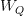
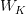
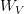
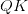
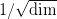
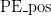

# 使用 TensorFlow 和 Keras 深入了解变形金刚:第 2 部分

> 原文：<https://pyimagesearch.com/2022/09/26/a-deep-dive-into-transformers-with-tensorflow-and-keras-part-2/>

* * *

## **目录**

* * *

## [**用 TensorFlow 和 Keras 深入了解变形金刚:第二部**](#TOC)

在本教程中，您将了解将编码器和解码器连接在一起的变压器架构的连接部分。

本课是关于 NLP 104 的三部分系列的第二部分:

1.  [*用 TensorFlow 和 Keras 深入了解变形金刚:第 1 部分*](https://pyimg.co/8kdj1)
2.  [***用 TensorFlow 和 Keras 深度潜入变形金刚:第二部***](https://pyimg.co/pzu1j) **(今日教程)**
3.  *使用 TensorFlow 和 Keras 深入了解变形金刚:第 3 部分*

**要了解变形金刚架构如何将多头注意力层与其他组件缝合在一起，** ***继续阅读。***

* * *

## [**用 TensorFlow 和 Keras 深入了解变形金刚:第二部**](#TOC)

* * *

### [**简述**](#TOC)

在[之前的教程](https://pyimg.co/8kdj1)中，我们研究了注意力从最简单的形式到我们今天看到的多头注意力的演变。在**视频 1** 中，我们展示了**输入**矩阵是如何投射到**查询**、**键**和**值**矩阵中的。

**视频 1:** 将输入矩阵投影到查询、键和值矩阵中。

这里输入矩阵通过初始灰度矩阵表示

. The matrix placed below matrix is our weight matrix (i.e., (red), (green), and (blue), respectively). As the Input is multiplied by these three weight matrices, the Input is projected to produce the Query, Key, and Value matrices, shown with red, green, and blue colors, respectively.

* * *

### [**注意力之地**](#TOC)

我们的三个朋友，**查询**、**键**、**值**，是让变形金刚活起来的核心演员。在**视频 2** 中，我们构建了一个动画，展示了如何从查询、键和值矩阵中计算*关注分数*。

****视频二:**** 注意力模块的动画。

首先，将查询矩阵和键矩阵相乘，得到乘积项。让我们称这个术语为

Product. Next, we scale the product term with ; this was done to prevent the vanishing gradient problem, as explained in our [previous blog post](https://pyimagesearch.com/2022/09/05/a-deep-dive-into-transformers-with-tensorflow-and-keras-part-1/#h5Solution). Finally, the scaled Product term is passed through a softmax layer. The resultant output is multiplied by the value matrix to arrive at the final attention layer.

整个动画被巧妙地封装在注意力等式中，如**等式 1** 所示。

现在用上面的模块来说一个*问题*。正如我们之前[看到的](https://pyimagesearch.com/2022/09/05/a-deep-dive-into-transformers-with-tensorflow-and-keras-part-1/#h4V5)，注意力模块可以很容易地扩展到自我关注。在自关注块中，查询、键和值矩阵来自**相同的源**。

直观上，注意块将关注输入的每个标记*。花点时间想想这里可能会出什么问题。*

在 NMT(神经机器翻译)中，给定一组先前解码的目标标记和输入标记，我们预测解码器中的目标标记。

如果解码器已经可以访问所有目标令牌(之前的和未来的)，它将不会学习解码。我们需要屏蔽掉尚未被解码器解码的目标令牌。这个过程对于拥有一个**自回归**解码器是必要的。

[Vaswani 等人](https://arxiv.org/abs/1706.03762)对这条注意力管道做了一个*分钟*的修改，完成屏蔽。在通过缩放后的之前

product through a softmax layer, they would mask certain parts of the product with a large number (e.g., negative infinity).

这种变化在**视频 3** 中被可视化，并被称为掩蔽多头注意力或 MMHA。

**视频三:**蒙版多头注意力模块动画。

* * *

### [**连接线**](#TOC)

至此，我们已经介绍了变压器架构中最重要的**，**注意**。但是，尽管论文标题是这么说的([注意力是你所需要的全部](https://arxiv.org/abs/1706.03762))，但是只有注意力并不能创造整个模型。我们需要连接线将每一块连接在一起，如图**图 1** 所示。**

 **将体系结构连接在一起的连接线有:

*   跳过连接
*   图层规范化
*   前馈网络
*   位置编码

* * *

### [**跳过连接**](#TOC)

直观上，跳过连接将前一阶段的表示引入后一阶段。这允许将子层之前的原始表示与子层的输出一起注入。在**图 2** 中，变压器架构中的跳过连接用红色箭头突出显示。

现在，这提出了一个问题，**为什么它很重要？**

你注意到了吗，在这个博客文章系列中，每次提到架构的一部分时，我们都会提到整个架构的原始图，就在**开始**的时候。这是因为当我们将信息与在更早的**阶段**接收到的信息进行参照时，我们能更好地处理信息。

原来变压器也是这样工作的。创建一种机制来将过去阶段的表示添加到体系结构的后面阶段，这允许模型更好地处理信息。

* * *

### [**图层归一化**](#TOC)

[图层归一化](https://www.tensorflow.org/api_docs/python/tf/keras/layers/LayerNormalization)的官方 TensorFlow 文档说:

> 请注意，使用层规范化时，规范化发生在每个示例内的轴上，而不是批处理中的不同示例上。

这里的输入是一个矩阵

with rows where is the number of words in the input sentence. The normalization layer is a row-wise operation that normalizes each row with the same weights.

在 NLP 任务中，以及在 transformer 架构中，要求能够独立地计算每个特征维度和实例的统计数据。因此，层标准化比批标准化更有直观意义。图 3 中突出显示的部分显示了图层归一化。

我们还想提出一个[栈交换讨论](https://stats.stackexchange.com/a/505349)线程，讨论为什么层规范化在 Transformer 架构中有效。

* * *

### [**前馈网络**](#TOC)

每个编码器和解码器层由一个完全连接的前馈网络组成。这一层的目的很简单，如**等式 2** 所示。

这个想法是将注意力层输出投射到一个更高维的空间。这实质上意味着制图表达被扩展到更高的维度，因此它们的细节在下一个图层中会被放大。这些层在变压器架构中的应用如图**图 4** 所示。

让我们在这里停下来，回头看看这个架构。

*   我们研究了编码器和解码器
*   注意力的进化，正如我们在[中看到的瓦斯瓦尼等人](https://arxiv.org/abs/1706.03762)
*   跳过上下文相关的连接
*   图层规范化
*   最后，前馈网络

但是仍然缺少整个架构的一部分。我们能从**图 5** 中猜出是什么吗？

* * *

### [**位置编码**](#TOC)

现在，在我们理解位置编码以及为什么在架构中引入它之前，让我们先看看我们的架构与 RNN 和 LSTM 等顺序模型相比实现了什么。

转换器可以处理部分输入令牌。编码器和解码器单元由这些关注块以及非线性层、层标准化和跳过连接构建而成。

但是 RNNs 和其他顺序模型有一些体系结构仍然缺乏的东西。就是了解数据的**顺序**。那么我们如何引入数据的顺序呢？

1.  我们可以将注意力添加到顺序模型中，但这将类似于我们已经研究过的 [Bahdanau 的](https://pyimg.co/kf8ma)或 [Luong 的](https://pyimg.co/tpf3l)注意力。此外，增加一个顺序模型将打破使用*只注意单元*来完成手头任务的目的。
2.  我们还可以将数据顺序与输入和目标标记一起注入到模型中。

[瓦斯瓦尼等人](https://arxiv.org/abs/1706.03762)选择了第二种方案。这意味着对每个标记的位置进行编码，并将其与输入一起注入。现在有几种方法可以实现位置编码。

第一种是简单地用**二进制编码方案**对所有东西进行编码，如图**图 6** 所示。考虑下面的代码片段，其中我们可视化了一系列数字的二进制编码。

*   `n`对应于`0-n`位置的范围
*   `dims`对应于每个位置编码的维度

图 6 中**代码片段的输出如图 7** 中**所示。**

[然而，Vaswani 等人](https://arxiv.org/abs/1706.03762)引入了正弦和余弦函数，根据**方程 3 和 4** 对序列位置进行编码:

这里，`pos`是指位置，`i`是尺寸。**图 8** 是实现方程式的代码。

**图 8** 中的代码输出如图**图 9** 所示。

这两种编码看起来很相似，不是吗？位置编码是一种将每个位置编码成一个向量的系统。这里需要注意的一点是，每个向量都应该是唯一的。

二进制编码似乎是位置编码的完美候选。二进制系统的问题在于`0` s。这意味着二进制在本质上是离散的。另一方面，深度学习模型喜欢处理连续数据。

因此，使用正弦编码的原因有三。

*   编码系统不仅密集，而且在 0 和 1 的范围内连续(正弦曲线被限制在这个范围内)。
*   它提供了一个几何级数，如**图 10** 所示。几何级数很容易学习，因为它在特定的间隔后会重复出现。学习间隔率和幅度将允许任何模型学习模式本身。
*   [Vaswani 等人](https://arxiv.org/abs/1706.03762)假设这样做将允许模型更好地学习相对位置，因为任何位置偏移一个值")可以通过的线性函数来估计。

* * *

* * *

## [**汇总**](#TOC)

至此，几乎所有关于变形金刚的事情我们都知道了。但是停下来思考这样一个架构的必要性也很重要。

2017 年，答案就在他们的论文里。 [Vaswani 等人](https://arxiv.org/abs/1706.03762)提到他们选择当时发表的其他转导模型的更简单版本的原因。但自 2017 年以来，我们已经走过了漫长的道路。

在过去的 5 年里，变形金刚绝对接管了深度学习。没有任何任务、角落或角落可以避开注意力应用程序。那么是什么让这个模型如此优秀呢？这在一个简单的机器翻译任务中是如何概念化的呢？

首先，深度学习研究人员不是预言家，所以没有办法知道变形金刚会在每项任务上都如此出色。但是架构直观上很简单。它通过关注与部分目标标记相关的部分输入标记来工作。这种方法为机器翻译创造了奇迹。但是它在其他任务上不会起作用吗？图像分类、视频分类、文本到图像生成、分割或体绘制？

任何可以表示为被映射到标记化输出集的标记化输入的东西都属于转换器的范畴。

这就结束了变形金刚的理论。在本系列的下一部分中，我们将重点介绍如何在 TensorFlow 和 Keras 中创建这种架构。

* * *

### [**引用信息**](#TOC)

A. R. Gosthipaty 和 R. Raha。“用 TensorFlow 和 Keras 深入研究变形金刚:第二部分”， *PyImageSearch* ，P. Chugh，S. Huot，K. Kidriavsteva，A. Thanki 编辑。，2022 年，【https://pyimg.co/pzu1j 

```py
@incollection{ARG-RR_2022_DDTFK2,
  author = {Aritra Roy Gosthipaty and Ritwik Raha},
  title = {A Deep Dive into Transformers with {TensorFlow} and {K}eras: Part 2},
  booktitle = {PyImageSearch},
  editor = {Puneet Chugh and Susan Huot and Kseniia Kidriavsteva and Abhishek Thanki},
  year = {2022},
  note = {https://pyimg.co/pzu1j},
}
```

* * *

* * ***