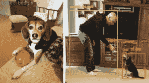
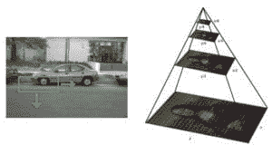
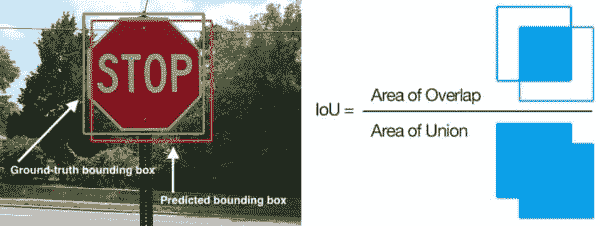

# 深度学习对象检测的温和指南

> 原文：<https://pyimagesearch.com/2018/05/14/a-gentle-guide-to-deep-learning-object-detection/>

[](https://pyimagesearch.com/wp-content/uploads/2018/05/gentle_guide_obj_det_demo.gif)

今天的博客帖子是受 PyImageSearch 读者 Ezekiel 的启发，他上周给我发了一封电子邮件，问我:

> 嘿阿德里安，
> 
> 我浏览了你之前关于[深度学习对象检测](https://pyimagesearch.com/2017/09/11/object-detection-with-deep-learning-and-opencv/)和
> 的博文，以及[实时深度学习对象检测](https://pyimagesearch.com/2017/09/18/real-time-object-detection-with-deep-learning-and-opencv/)的后续教程。谢谢你。
> 
> 我一直在我的示例项目中使用您的源代码，但是我有两个问题:
> 
> 1.  如何过滤/忽略我不感兴趣的课程？
> 2.  如何向我的对象检测器添加新的类？这可能吗？
> 
> 如果你能在博客中对此进行报道，我将不胜感激。
> 
> 谢了。

以西结不是唯一有这些问题的读者。事实上，如果你浏览我最近两篇关于深度学习对象检测的帖子的评论部分(链接如上)，你会发现最常见的问题之一通常是(转述):

> 我如何修改你的源代码来包含我自己的对象类？

由于这似乎是一个如此常见的问题，**最终是对神经网络/深度学习对象检测器实际工作方式的误解**，我决定在今天的博客帖子中重新讨论深度学习对象检测的话题。

具体来说，在这篇文章中，你将学到:

*   **图像分类**和**物体检测**的区别
*   **深度学习对象检测器的组成**包括 *n 对象检测框架*和*基础模型*本身的区别
*   如何用**预训练模型**进行深度学习物体检测
*   如何**从深度学习模型中过滤并忽略预测类**
*   **在深度神经网络中添加或删除类别时的常见误解和误会**

**要了解更多关于深度学习对象检测的信息，甚至可能揭穿你对基于深度学习的对象检测可能存在的一些误解或误会，*请继续阅读。***

## 深度学习对象检测的温和指南

今天的博客旨在温和地介绍基于深度学习的对象检测。

我已经尽了最大努力来提供深度学习对象检测器的组件的评论，包括使用预训练的对象检测器执行深度学习的 OpenCV + Python 源代码。

使用本指南来帮助你开始深度学习对象检测，但也要认识到*对象检测是高度细致入微的*——我不可能在一篇博客文章中包括*深度学习对象检测的每个*细节。

也就是说，我们将从讨论图像分类和对象检测之间的基本差异开始今天的博客文章，**包括为图像分类训练的网络是否可以用于对象检测**(以及在什么情况下)。

一旦我们理解了什么是对象检测，我们将回顾深度学习对象检测器的核心组件，包括**对象检测框架**以及**基础模型**，这两个关键组件是对象检测新手容易误解的。

从那里，我们将使用 OpenCV 实现实时深度学习对象检测。

我还将演示如何**忽略和过滤你不感兴趣的对象类** *而*不必修改网络架构或重新训练模型。

最后，我们将通过讨论如何**从深度学习对象检测器**添加或删除类来结束今天的博客帖子，包括我推荐的帮助您入门的资源。

让我们继续深入学习对象检测！

### 图像分类和目标检测的区别

[](https://pyimagesearch.com/wp-content/uploads/2018/05/gentle_guide_obj_det_cls_vs_det.jpg)

**Figure 1:** The difference between **classification** (*left*) and **object detection** (*right*) is intuitive and straightforward. For image classification, the *entire* image is classified with a *single label*. In the case of object detection, our neural network *localizes* (potentially multiple) objects within the image.

当执行标准的**图像分类**时，给定一个输入图像，我们将其呈现给我们的神经网络，并且我们获得一个**单个类别标签**，并且可能还获得与类别标签相关联的概率。

这个类标签用来描述整个图像的内容，或者至少是图像中最主要的可见内容。

例如，给定上面**图 1**(*左*)中的输入图像，我们的 CNN 将该图像标记为*【小猎犬】*。

**因此我们可以把图像分类看作:**

*   *在*中的一个图像
*   并且*一个类标签出*

**物体检测**，无论是通过深度学习还是其他计算机视觉技术执行，都建立在图像分类的基础上，并寻求*准确定位*每个物体在图像中出现的位置。

**当执行对象检测时，给定输入图像，我们希望获得:**

*   一个**边界框列表**，或 *(x，y)*-图像中每个对象的坐标
*   与每个边界框相关联的**类标签**
*   与每个边界框和类别标签相关联的**概率/置信度得分**

**图 1** ( *右*)演示了执行深度学习对象检测的示例。注意人和狗是如何被定位的，它们的边界框和类别标签是被预测的。

因此，物体检测使我们能够:

*   *向网络展示一幅图像*
*   并且*获得多个包围盒和类别标签出*

### 深度学习图像分类器可以用于物体检测吗？

[](https://pyimagesearch.com/wp-content/uploads/2018/05/gentle_guide_obj_det_sliding_window_image_pyramid.jpg)

**Figure 2:** A non-end-to-end deep learning object detector uses a sliding window (*left*) + image pyramid (*right*) approach combined with classification.

好了，至此你明白了*图像分类*和*物体检测*之间的根本区别:

*   当执行*图像分类*时，我们将一幅输入图像呈现给网络，并获得一个类别标签输出。
*   但是当执行*对象检测*时，我们可以呈现一个输入图像并获得多个包围盒和类别标签。

这引发了一个问题:

> 我们能不能用一个已经训练好的网络来进行分类，然后用它来进行物体检测呢？

这个答案有点棘手，因为从技术上来说它是*“是”*，但原因并不那么明显。

解决方案包括:

1.  应用标准的基于计算机视觉的物体检测方法(即非深度学习方法)，如**滑动窗口和图像金字塔**——这种方法通常用于您的 [HOG +基于线性 SVM 的物体检测器](https://pyimagesearch.com/2014/11/10/histogram-oriented-gradients-object-detection/)。
2.  取预先训练好的网络**作为深度学习对象检测框架**(即更快的 R-CNN、SSD、YOLO)中的基网络。

#### 方法#1:传统的对象检测管道

第一种方法是*而不是*一个纯端到端的深度学习对象检测器。

相反，我们利用:

1.  固定大小的 [**滑动窗口**](https://pyimagesearch.com/2015/03/23/sliding-windows-for-object-detection-with-python-and-opencv/) ，从左到右和从上到下滑动以定位不同位置的对象
2.  一个 [**图像金字塔**](https://pyimagesearch.com/2015/03/16/image-pyramids-with-python-and-opencv/) 以不同的比例检测物体
3.  通过预训练(分类)卷积神经网络的分类

在滑动窗口+图像金字塔的每一站，我们提取 ROI，将其输入 CNN，并获得 ROI 的输出分类。

如果标签 *L* 的分类概率高于某个阈值 *T* ，我们将感兴趣区域的包围盒标记为标签( *L* )。对滑动窗口和图像金字塔的每次停止重复这个过程，我们获得输出对象检测器。最后，我们将非最大值抑制应用于边界框，产生我们的最终输出检测:


**Figure 3:** Applying non-maxima suppression will suppress overlapping, less confident bounding boxes.

这种方法可以在一些特定的用例中工作，但是一般来说它很慢，很乏味，并且有点容易出错。

然而，值得学习如何应用这种方法，因为它可以将任意图像分类网络变成对象检测器，*避免了显式训练端到端深度学习对象检测器的需要。*根据您的使用情况，这种方法可以节省您大量的时间和精力。

如果你对这种物体检测方法感兴趣，并想了解更多关于滑动窗口+图像金字塔+图像分类的物体检测方法，请参考我的书， [*用 Python 进行计算机视觉的深度学习*](https://pyimagesearch.com/deep-learning-computer-vision-python-book/) 。

#### 方法#2:对象检测框架的基础网络

深度学习对象检测的第二种方法允许你将你预先训练的分类网络视为一个**深度学习对象检测框架**中的**基础网络**(例如更快的 R-CNN、SSD 或 YOLO)。

这里的好处是，你可以创建一个完整的端到端的基于深度学习的对象检测器。

缺点是，它需要一些关于深度学习对象检测器如何工作的深入知识——我们将在下一节中对此进行更多讨论。

### 深度学习对象检测器的组件

[](https://pyimagesearch.com/wp-content/uploads/2018/05/gentle_guide_obj_det_ssd.jpg)

**Figure 4:** The VGG16 base network is a component of the SSD deep learning object detection framework.

深度学习对象检测器有许多*组件、子组件和子子组件，但我们今天要关注的两个是大多数深度学习对象检测新手经常混淆的两个组件:*

1.  **对象检测框架**(例如。更快的 R-CNN，SSD，YOLO)。
2.  适合目标检测框架的**基础网络**。

你可能已经熟悉的**基础网络**(你只是以前没有听说过它被称为“基础网络”)。

基本网络是您常见的(分类)CNN 架构，包括:

*   VGGNet
*   ResNet
*   MobileNet
*   DenseNet

通常，这些网络经过预先训练，可以在大型图像数据集(如 ImageNet)上执行分类，以学习一组丰富的辨别、鉴别过滤器。

对象检测框架由许多组件和子组件组成。

例如，**更快的 R-CNN 框架**包括:

*   区域提案网络
*   一套锚
*   感兴趣区域(ROI)汇集模块
*   最终基于区域的卷积神经网络

使用**单触发探测器(SSD)**时，您有组件和子组件，例如:

*   多框
*   传道者
*   固定前科

请记住，基础网络只是适合整体深度学习对象检测框架的*众多*组件之一——**本节顶部的图 4** 描绘了 SSD 框架内的 VGG16 基础网络。

通常，“网络手术”是在基础网络上进行的。这一修改:

*   形成完全卷积(即，接受任意输入维度)。
*   消除基础网络架构中更深层的 conv/池层，代之以一系列新层(SSD)、新模块(更快的 R-CNN)或两者的某种组合。

术语“网络手术”是一种通俗的说法，意思是我们移除基础网络架构中的一些原始层，并用新层取而代之。

你可能看过一些低成本的恐怖电影，在这些电影中，凶手可能拿着一把斧头或大刀，袭击受害者，并毫不客气地攻击他们。

网络手术比典型的 B 级恐怖片杀手更加精确和苛刻。

网络手术也是战术性的——我们移除网络中我们不需要的部分，并用一组新的组件替换它。

然后，当我们去训练我们的框架来执行对象检测时，修改(1)新的层/模块和(2)基础网络的权重。

同样，对各种深度学习对象检测框架如何工作(包括基础网络扮演的角色)的完整回顾不在这篇博文的范围之内。

如果你对深度学习对象检测的**完整回顾**感兴趣，包括理论和实现，请参考我的书， [*用 Python 进行计算机视觉的深度学习*](https://pyimagesearch.com/deep-learning-computer-vision-python-book/) 。

### 我如何衡量深度学习对象检测器的准确性？

在评估对象检测器性能时，我们使用一个名为**平均精度** (mAP)的评估指标，该指标基于我们数据集中所有类的 [**交集与**](https://pyimagesearch.com/2016/11/07/intersection-over-union-iou-for-object-detection/) (IoU)。

#### 并集上的交集

[](https://pyimagesearch.com/wp-content/uploads/2018/05/gentle_guide_obj_det_iou.jpg)

**Figure 5:** In this visual example of **Intersection over Union** (IoU), the ground-truth bounding box (*green*) can be compared to the predicted bounding box (*red*). IoU is used with mean Average Precision (mAP) to evaluate the accuracy of a deep learning object detector. The simple equation to calculate IoU is shown on the *right*.

您通常会发现 IoU 和 mAP 用于评估 HOG +线性 SVM 检测器、Haar 级联和基于深度学习的方法的性能；但是，请记住，用于生成预测边界框的实际算法并不重要。

任何提供预测边界框(以及可选的类标签)作为输出的算法都可以使用 IoU 进行评估。更正式地说，为了应用 IoU 来评估任意对象检测器，我们需要:

1.  真实边界框(即，我们的测试集中的手绘边界框，它指定了我们的对象在图像中的位置)。
2.  我们模型中的预测边界框。
3.  如果您想计算召回率和精确度，您还需要基本事实类标签和预测类标签。

在**图 5** ( *左*)中，我包含了一个真实边界框(*绿色*)与预测边界框(*红色*)的可视化示例。计算 IoU 可以通过**图 5** ( *右*)中的等式图示来确定。

检查这个等式，你会发现, **IoU 仅仅是一个比率。**

在分子中，我们计算预测边界框和真实边界框之间的重叠区域。

分母是并集的面积，或者更简单地说，是由预测边界框和实际边界框包围的面积。

将重叠面积除以并集面积得到最终分数，即并集上的交集。

#### 平均精度

***注:**我决定编辑这一节的原貌。我想让对地图的讨论保持在更高的水平，避免一些更令人困惑的回忆计算，但正如一些评论者指出的，这一部分在技术上是不正确的。因此，我决定更新帖子。*

因为这是对基于深度学习的对象检测的温和介绍，所以我将保持对 mAP 的简化解释，以便您理解基本原理。

不熟悉对象检测的读者和从业者可能会被地图计算弄糊涂。这部分是因为 mAP 是一个更复杂的评估指标。它也是 mAP 计算的定义，甚至可以从一个对象检测挑战变化到另一个(当我说“对象检测挑战”时，我指的是诸如 COCO、PASCAL VOC 等竞赛。).

计算特定对象检测流水线的平均精度(AP)基本上是一个三步过程:

1.  计算**精度**，它是真阳性的比例。
2.  计算**召回**，这是所有可能的阳性中真正阳性的比例。
3.  以 *s.* 为步长，对所有召回级别的*最大*精度值进行平均

为了计算**精度**，我们首先将我们的对象检测算法应用于输入图像。然后，边界框分数按照置信度降序排列。

我们从*先验*知识中得知(即，这是一个验证/测试示例，因此我们知道图像中对象的总数)该图像中有 4 个对象。我们试图确定我们的网络进行了多少次“正确的”检测。这里的“正确”预测是指 IoU 最小值为 0.5(该值可根据挑战进行调整，但 0.5 是标准值)。

这就是计算开始变得有点复杂的地方。我们需要计算不同**召回值**(也称为“召回级别”或“召回步骤”)的精确度。

例如，假设我们正在计算前 3 个预测的精度和召回值。在深度学习对象检测器的前 3 个预测中，我们做出了 2 个正确的预测。那么我们的精度就是真阳性的比例:2/3 = 0.667。我们的回忆是图像中所有可能的阳性中真正的阳性的比例:2 / 4 = 0.5。我们对(通常)前 1 到前 10 个预测重复这个过程。这个过程产生一个*精度*值的*列表*。

下一步是计算所有 top- *N* 值的平均值，因此有术语*平均精度(AP)* 。我们循环所有的召回值 *r* ，找到我们可以用召回值*r*获得的最大精度 *p* ，然后计算平均值。我们现在有了单个评估图像的平均精度。

一旦我们计算了测试/验证集中所有图像的平均精度，我们将执行另外两个计算:

1.  计算每个类别的平均 AP，为每个单独的类别提供一个地图(对于许多数据集/挑战，您将需要按类别检查地图，以便您可以发现您的深度学习对象检测器是否正在处理特定的类别)
2.  获取每个单独类的地图，然后将它们平均在一起，得到数据集的最终地图

同样，地图比传统的准确性更复杂，所以如果你第一次看不懂也不要沮丧。这是一个评估指标，在你完全理解它之前，你需要多次研究。**好消息是深度学习对象检测实现为你处理计算地图。**

### 基于深度学习的 OpenCV 物体检测

在之前的帖子中，我们已经在这个博客上讨论了深度学习和对象检测；然而，为了完整起见，让我们回顾一下本帖中的实际源代码。

我们的示例包括带有 MobileNet 基本模型的单次检测器(框架)。该模型由 GitHub 用户 [chuanqi305](https://github.com/chuanqi305/MobileNet-SSD) 在[上下文通用对象(COCO)数据集](http://cocodataset.org)上进行训练。

要了解更多细节，请查看我的 **[上一篇文章](https://pyimagesearch.com/2017/09/11/object-detection-with-deep-learning-and-opencv/)** ，在那里我介绍了传祺 305 的模型和相关的背景信息。

让我们从这篇文章的顶部回到以西结的第一个问题:

> 1.  How do I filter/ignore classes that I am not interested in?

我将在下面的示例脚本中回答这个问题。

但是首先你需要**准备你的系统:**

*   您需要在您的 Python 虚拟环境中安装最低*的 OpenCV 3.3(假设您使用的是 Python 虚拟环境)。OpenCV 3.3+包括运行以下代码所需的 DNN 模块。确保使用下页的 [OpenCV 安装教程](https://pyimagesearch.com/opencv-tutorials-resources-guides/)，同时特别注意你下载并安装的是哪个版本的 OpenCV。*
*   你也应该安装我的 [imutils 包](https://github.com/jrosebr1/imutils)。要在 Python 虚拟环境中安装/更新 imutils，只需使用 pip: `pip install --upgrade imutils`。

当你准备好了，继续创建一个名为`filter_object_detection.py`的新文件，让我们开始吧:

```py
# import the necessary packages
from imutils.video import VideoStream
from imutils.video import FPS
import numpy as np
import argparse
import imutils
import time
import cv2

```

在**的第 2-8 行**，我们导入我们需要的包和模块，特别是`imutils`和 OpenCV。我们将使用我的`VideoStream`类来处理从网络摄像头捕捉帧。

我们配备了必要的工具，所以让我们继续解析命令行参数:

```py
# construct the argument parse and parse the arguments
ap = argparse.ArgumentParser()
ap.add_argument("-p", "--prototxt", required=True,
	help="path to Caffe 'deploy' prototxt file")
ap.add_argument("-m", "--model", required=True,
	help="path to Caffe pre-trained model")
ap.add_argument("-c", "--confidence", type=float, default=0.2,
	help="minimum probability to filter weak detections")
args = vars(ap.parse_args())

```

我们的脚本在运行时需要两个[命令行参数](https://pyimagesearch.com/2018/03/12/python-argparse-command-line-arguments/):

*   `--prototxt`:定义模型定义的 Caffe prototxt 文件的路径。
*   `--model`:我们的 CNN 模型权重文件路径。

您可以选择指定一个阈值`--confidence`，用于过滤弱检测。

我们的模型可以预测 21 个对象类别:

```py
# initialize the list of class labels MobileNet SSD was trained to
# detect, then generate a set of bounding box colors for each class
CLASSES = ["background", "aeroplane", "bicycle", "bird", "boat",
	"bottle", "bus", "car", "cat", "chair", "cow", "diningtable",
	"dog", "horse", "motorbike", "person", "pottedplant", "sheep",
	"sofa", "train", "tvmonitor"]

```

`CLASSES`列表包含网络被训练的所有类别标签(即 COCO 标签)。

对`CLASSES`列表的一个常见误解是，您可以:

1.  向列表中添加一个新的类别标签
2.  或者*从列表中删除*一个类别标签

…让网络自动“知道”您想要完成的任务。

事实并非如此。

**你*不能*简单地修改一列文本标签，让网络自动修改自己，以学习、添加或删除它从未训练过的数据模式。*这不是神经网络的工作方式。***

也就是说，有一个**快速技巧**可以用来过滤和忽略你不感兴趣的预测。

解决方案是:

1.  定义一组`IGNORE`标签(即训练网络时要过滤和忽略的类别标签列表)。
2.  对输入图像/视频帧进行预测。
3.  忽略类别标签存在于`IGNORE`集合中的任何预测。

用 Python 实现的`IGNORE`集合如下所示:

```py
IGNORE = set(["person"])

```

这里我们将忽略所有带有类标签`"person"`的预测对象(用于过滤的`if`语句将在后面的代码审查中讨论)。

您可以轻松地向集合中添加要忽略的附加元素(来自`CLASSES`列表的类标签)。

接下来，我们将生成随机标签/盒子颜色，加载我们的模型，并开始视频流:

```py
COLORS = np.random.uniform(0, 255, size=(len(CLASSES), 3))

# load our serialized model from disk
print("[INFO] loading model...")
net = cv2.dnn.readNetFromCaffe(args["prototxt"], args["model"])

# initialize the video stream, allow the cammera sensor to warmup,
# and initialize the FPS counter
print("[INFO] starting video stream...")
vs = VideoStream(src=0).start()
time.sleep(2.0)
fps = FPS().start()

```

在**线 27** 上，生成随机数组`COLORS`以对应 21 个`CLASSES`中的每一个。我们稍后将使用这些颜色进行显示。

我们的 Caffe 模型通过使用`cv2.dnn.readNetFromCaffe`函数和作为参数传递的两个必需的命令行参数在**行 31** 上加载。

然后我们将`VideoStream`对象实例化为`vs`，并启动我们的`fps`计数器(**第 36-38 行**)。2 秒钟的`sleep`让我们的相机有足够的时间预热。

在这一点上，我们准备好循环从摄像机传入的帧，并通过我们的 CNN 对象检测器发送它们:

```py
# loop over the frames from the video stream
while True:
	# grab the frame from the threaded video stream and resize it
	# to have a maximum width of 400 pixels
	frame = vs.read()
	frame = imutils.resize(frame, width=400)

	# grab the frame dimensions and convert it to a blob
	(h, w) = frame.shape[:2]
	blob = cv2.dnn.blobFromImage(cv2.resize(frame, (300, 300)),
		0.007843, (300, 300), 127.5)

	# pass the blob through the network and obtain the detections and
	# predictions
	net.setInput(blob)
	detections = net.forward()

```

在**第 44 行**上，我们抓取一个`frame`然后`resize`，同时保留显示的纵横比(**第 45 行**)。

从那里，我们提取高度和宽度，因为我们稍后需要这些值( **Line 48** )。

**第 48 和 49 行**从我们的帧生成一个`blob`。要了解更多关于一个`blob`以及如何使用`cv2.dnn.blobFromImage`函数构造它的信息，[请参考上一篇文章了解所有细节](https://pyimagesearch.com/2017/11/06/deep-learning-opencvs-blobfromimage-works/)。

接下来，我们通过我们的神经`net`发送那个`blob`来检测物体(**线 54 和 55** )。

让我们循环一下检测结果:

```py
	# loop over the detections
	for i in np.arange(0, detections.shape[2]):
		# extract the confidence (i.e., probability) associated with
		# the prediction
		confidence = detections[0, 0, i, 2]

		# filter out weak detections by ensuring the `confidence` is
		# greater than the minimum confidence
		if confidence > args["confidence"]:
			# extract the index of the class label from the
			# `detections`
			idx = int(detections[0, 0, i, 1])

			# if the predicted class label is in the set of classes
			# we want to ignore then skip the detection
			if CLASSES[idx] in IGNORE:
				continue

```

在第 58 条线上，我们开始了我们的`detections`循环。

对于每个检测，我们提取`confidence` ( **行 61** )，然后将其与我们的置信度阈值(**行 65** )进行比较。

在我们的`confidence`超过最小值的情况下(默认值 0.2 可以通过可选的命令行参数来更改)，我们将认为检测是积极的、有效的检测，并继续处理它。

首先，我们从`detections` ( **第 68 行**)中提取类标签的索引。

然后，**回到以西结的第一个问题**，我们可以**忽略第 72 行和第 73 行**的`IGNORE`集合中的类。如果要忽略该类，我们只需`continue`返回到检测循环的顶部(并且我们不显示该类的标签或框)。这实现了我们的“快速破解”解决方案。

否则，我们在白名单中检测到一个对象，我们需要在框架上显示类别标签和矩形:

```py
			# compute the (x, y)-coordinates of the bounding box for
			# the object
			box = detections[0, 0, i, 3:7] * np.array([w, h, w, h])
			(startX, startY, endX, endY) = box.astype("int")

			# draw the prediction on the frame
			label = "{}: {:.2f}%".format(CLASSES[idx],
				confidence * 100)
			cv2.rectangle(frame, (startX, startY), (endX, endY),
				COLORS[idx], 2)
			y = startY - 15 if startY - 15 > 15 else startY + 15
			cv2.putText(frame, label, (startX, y),
				cv2.FONT_HERSHEY_SIMPLEX, 0.5, COLORS[idx], 2)

```

在这个代码块中，我们提取边界框坐标(**行 77 和 78** )，然后在框架上绘制一个标签和矩形(**行 81-87** )。

对于每个唯一的类，标签+矩形的颜色将是相同的；相同类别的对象将具有相同的颜色(即视频中的所有`"boats"`将具有相同的颜色标签和框)。

最后，仍在我们的`while`循环中，我们将在屏幕上显示我们的辛勤工作:

```py
	# show the output frame
	cv2.imshow("Frame", frame)
	key = cv2.waitKey(1) & 0xFF

	# if the `q` key was pressed, break from the loop
	if key == ord("q"):
		break

	# update the FPS counter
	fps.update()

# stop the timer and display FPS information
fps.stop()
print("[INFO] elapsed time: {:.2f}".format(fps.elapsed()))
print("[INFO] approx. FPS: {:.2f}".format(fps.fps()))

# do a bit of cleanup
cv2.destroyAllWindows()
vs.stop()

```

我们在第 90 和 91 行上显示`frame`并捕捉按键。

如果按下`"q"`键，我们通过中断循环退出(**行 94 和 95** )。

否则，我们继续更新我们的`fps`计数器(**行 98** )并继续抓取和处理帧。

在剩余的行中，当循环中断时，我们显示时间+每秒帧数指标和清理。

### 运行深度学习对象检测器

为了运行今天的脚本，您需要通过滚动到下面的 ***【下载】*** 部分来获取文件。

提取文件后，打开终端并导航到下载的代码+模型。在那里，执行以下命令:

```py
$ python filter_object_detection.py --prototxt MobileNetSSD_deploy.prototxt.txt \
	--model MobileNetSSD_deploy.caffemodel
[INFO] loading model...
[INFO] starting video stream...
[INFO] elapsed time: 24.05
[INFO] approx. FPS: 13.18

```

[](https://pyimagesearch.com/wp-content/uploads/2018/05/gentle_guide_obj_det_demo.gif)

**Figure 6:** A real-time deep learning object detection demonstration of using the same model — in the *right* video I’ve ignored certain object classes programmatically.

在上面的 GIF 中，你可以看到在*的左边*检测到了*“人”*类——这是因为我有一个空的`IGNORE`。在右边的*中*您可以看到我没有被检测到——这种行为是由于将*“person”*类添加到了`IGNORE`集合中。

当我们的深度学习对象检测器仍然在技术上检测*“person”*类时，我们的后处理代码能够将其过滤掉。

#### 也许你在运行深度学习对象检测器时遇到了错误？

故障诊断的第一步是验证您是否连接了网络摄像头。如果这不是问题所在，您可能会在终端中看到以下错误消息:

```py
$ python filter_object_detection.py 
usage: filter_object_detection.py [-h] -p PROTOTXT -m MODEL [-c CONFIDENCE]
filter_object_detection.py: error: the following arguments are required: -p/--prototxt, -m/--model

```

如果你看到这个消息，那么你没有传递“命令行参数”给程序。如果 PyImageSearch 读者不熟悉 *[Python、argparse 和命令行参数](https://pyimagesearch.com/2018/03/12/python-argparse-command-line-arguments/)* ，这是一个常见问题。如果你有问题，请查看链接。

以下是带评论的完整视频:

<https://www.youtube.com/embed/5cwFBUQb6_w?feature=oembed>