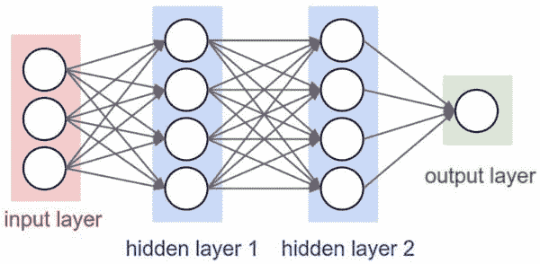
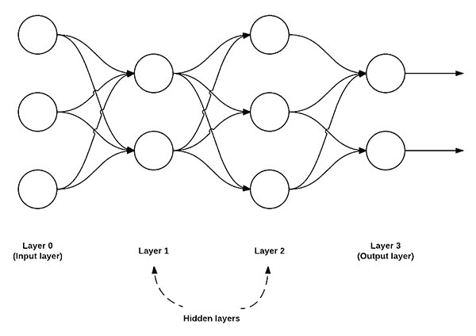
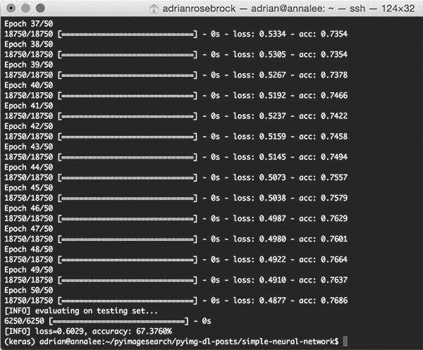
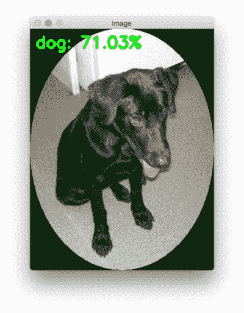
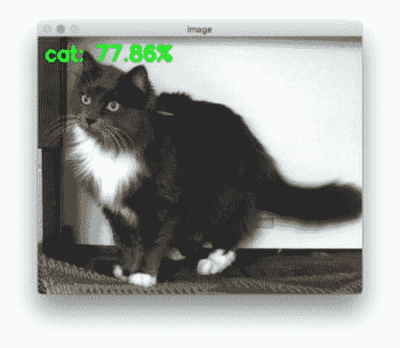
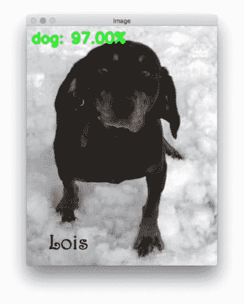
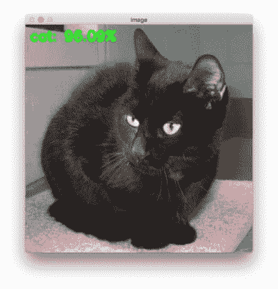
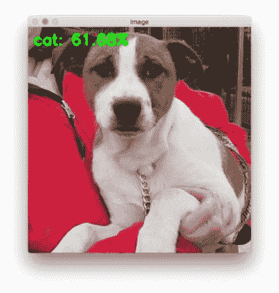
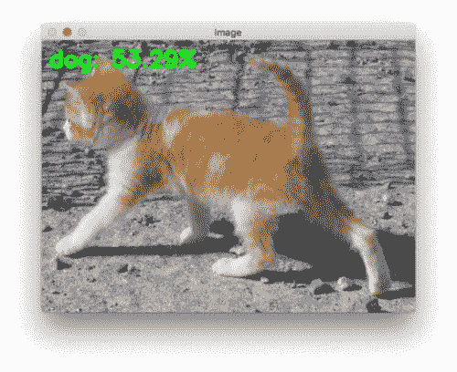

# 用 Python 和 Keras 实现的简单神经网络

> 原文：<https://pyimagesearch.com/2016/09/26/a-simple-neural-network-with-python-and-keras/>



[Image Source](http://cs231n.github.io/neural-networks-1/)

如果你一直在关注这一系列的博客文章，那么你已经知道我是 [Keras](https://keras.io/) 的超级粉丝。

Keras 是一个超级强大、易于使用的 Python 库，用于构建神经网络和深度学习网络。

在这篇博文的剩余部分，我将演示如何使用 Python 和 Keras 构建一个简单的神经网络，然后将其应用于图像分类任务。

## 用 Python 和 Keras 实现的简单神经网络

为了开始这篇文章，我们将快速回顾一下最常见的神经网络架构——前馈网络。

然后，我们将讨论我们的项目结构，然后编写一些 Python 代码来定义我们的前馈神经网络，并将其具体应用于 [Kaggle Dogs vs. Cats](https://www.kaggle.com/c/dogs-vs-cats/data) 分类挑战。这个挑战的目标是正确分类给定的图像是包含一只*狗*还是一只*猫*。

我们将回顾我们简单的神经网络结构的结果，并讨论改进它的方法。

我们的最后一步将是构建一个测试脚本，它将加载图像并用 OpenCV、Keras 和我们训练好的模型对它们进行分类。

### 前馈神经网络

虽然有许多*许多*不同的神经网络架构，但最常见的架构是 ***前馈网络:***



**Figure 1:** An example of a feedforward neural network with 3 input nodes, a hidden layer with 2 nodes, a second hidden layer with 3 nodes, and a final output layer with 2 nodes.

在这种类型的架构中，两个节点之间的连接*仅允许*从层 *i* 中的节点到层 *i + 1* 中的节点(因此术语*前馈*；不允许向后或层间连接)。

此外，层 *i* 中的节点**完全连接到层 *i + 1* 中的节点**。这意味着层 *i* 中的每个节点都连接到层 *i + 1* 中的每个节点。例如，在上图中，第 0 层和第 1 层之间总共有 *2 x 3 = 6* 个连接，这就是术语“完全连接”或简称“FC”的来源。

我们通常使用一个整数序列来快速简洁地描述每一层中节点的数量。

例如，上面的网络是 3-2-3-2 前馈神经网络:

*   **层 0** 包含 3 个输入，我们的值。这些可以是原始像素亮度或来自特征向量的条目。
*   **层 1 和 2** 为 ***隐藏层*** ，分别包含 2 和 3 个节点。
*   **层 3** 是 ***输出层*** 或 ***可见层***——这是我们从我们的网络中获得整体输出分类的地方。输出层通常具有与类标签一样多的节点；每个潜在输出一个节点。在我们的 Kaggle Dogs vs. Cats 示例中，我们有两个输出节点——一个用于“dog ”,另一个用于“cat”。

### 项目目录结构

[](https://pyimagesearch.com/wp-content/uploads/2016/09/simple_neural_network_kaggle_dogscats.jpg)

**Figure 2:** The Kaggle Dogs vs. Cats dataset is used in our simple neural network with Keras.

在我们开始之前，前往这篇博文的 ***【下载】*** 部分，下载文件和数据。从这里开始，你将能够跟随我们学习今天的例子。

一旦你的压缩文件被下载，解压文件。

在目录中，让我们运行带有两个[命令行参数](https://pyimagesearch.com/2018/03/12/python-argparse-command-line-arguments/)的`tree`命令来列出我们的项目结构:

```py
$ tree --filelimit 10 --dirsfirst
.
├── kaggle_dogs_vs_cats
│ └── train [25000 entries exceeds filelimit, not opening dir]
├── test_images [50 entries exceeds filelimit, not opening dir]
├── output
│ └── simple_neural_network.hdf5
├── simple_neural_network.py
└── test_network.py

4 directories, 4 files

```

第一个命令行参数很重要，因为它可以防止`tree`显示所有的图像文件，使我们的终端变得混乱。

Kaggle Dogs vs. Cats 数据集在相关目录(`kaggle_dogs_vs_cats`)中。所有 25，000 张图像都包含在`train`子目录中。这些数据来自 Kaggle 上的`train.zip` [数据集。](https://www.kaggle.com/c/dogs-vs-cats/data)

我还在他们的网站上放了 50 个 Kaggle `test1.zip`的样品。

`output`目录包含我们的序列化模型，我们将在第一个脚本的底部用 Keras 生成该模型。

在接下来的章节中，我们将回顾两个 Python 脚本，`simple_neural_network.py`和`test_network.py`。

### 用 Python 和 Keras 实现我们自己的神经网络

既然我们已经了解了前馈神经网络的基础，让我们使用 Python 和 Keras 实现一个用于图像分类的前馈神经网络。

首先，您需要遵循适用于您的系统的教程来安装 TensorFlow 和 Keras:

*   [用 Python 为深度学习配置 Ubuntu](https://pyimagesearch.com/2017/09/25/configuring-ubuntu-for-deep-learning-with-python/)
*   [用 Python 设置 Ubuntu 16.04 + CUDA + GPU 进行深度学习](https://pyimagesearch.com/2017/09/27/setting-up-ubuntu-16-04-cuda-gpu-for-deep-learning-with-python/)
*   [用 Python 配置 macOS 进行深度学习](https://pyimagesearch.com/2017/09/29/macos-for-deep-learning-with-python-tensorflow-and-keras/)

***注意:**一个 GPU 是**而不是今天的博文所需要的**——你的笔记本电脑可以轻松运行这个非常基本的网络。也就是说，一般来说，我不建议使用笔记本电脑进行深度学习。笔记本电脑是为了提高工作效率，而不是处理许多深度学习活动所需的 TB 级数据集。我推荐[亚马逊 AWS 用我预配置的 AMI](https://pyimagesearch.com/2017/09/20/pre-configured-amazon-aws-deep-learning-ami-with-python/) 或者[微软的 DSVM](https://pyimagesearch.com/2018/03/21/my-review-of-microsofts-deep-learning-virtual-machine/) 。这两个环境都在不到 5 分钟的时间内准备就绪。*

从那里，打开一个新文件，命名为`simple_neural_network.py`，我们将得到编码:

```py
# import the necessary packages
from sklearn.preprocessing import LabelEncoder
from sklearn.model_selection import train_test_split
from keras.models import Sequential
from keras.layers import Activation
from keras.optimizers import SGD
from keras.layers import Dense
from keras.utils import np_utils
from imutils import paths
import numpy as np
import argparse
import cv2
import os

```

我们从导入所需的 Python 包开始。我们将使用大量 scikit-learn 实现以及 Keras 层和激活函数。如果您还没有为 Keras 配置开发环境，[请参见这篇博文](https://pyimagesearch.com/2016/07/18/installing-keras-for-deep-learning/)。

我们还将使用 [imutils](https://github.com/jrosebr1/imutils) ，这是我个人的 OpenCV 便利函数库。如果您的系统上尚未安装`imutils`，您可以通过`pip`进行安装:

```py
$ pip install imutils

```

接下来，让我们定义一个方法来接受和成像并描述它。在[之前的教程](https://pyimagesearch.com/2016/08/08/k-nn-classifier-for-image-classification/)中，我们已经从图像中提取了颜色直方图，并使用这些分布来表征图像的内容。

这一次，让我们使用原始像素强度。为了实现这一点，我们定义了`image_to_feature_vector`函数，该函数接受一个输入`image`，并将其大小调整为一个固定的`size`，忽略纵横比:

```py
def image_to_feature_vector(image, size=(32, 32)):
	# resize the image to a fixed size, then flatten the image into
	# a list of raw pixel intensities
	return cv2.resize(image, size).flatten()

```

我们将`image`的大小调整为固定的空间维度，以确保输入数据集中的每个图像都具有相同的“特征向量”大小。这是利用我们的神经网络时的一个要求——每个图像必须用一个向量来表示。

在这种情况下，我们将图像的大小调整为 32 x 32 像素，然后将 32 x 32 x 3 像素的 T2 图像(其中我们有三个通道，分别用于红色、绿色和蓝色通道)展平成一个 3072-d 特征向量。

下一个代码块处理对命令行参数的解析，并负责一些初始化工作:

```py
# construct the argument parse and parse the arguments
ap = argparse.ArgumentParser()
ap.add_argument("-d", "--dataset", required=True,
	help="path to input dataset")
ap.add_argument("-m", "--model", required=True,
	help="path to output model file")
args = vars(ap.parse_args())

# grab the list of images that we'll be describing
print("[INFO] describing images...")
imagePaths = list(paths.list_images(args["dataset"]))

# initialize the data matrix and labels list
data = []
labels = []

```

这里我们只需要一个开关`--dataset`，它是包含 Kaggle Dogs vs. Cats 图片的输入目录的路径。这个数据集可以从官方的[卡格狗对猫比赛页面](https://www.kaggle.com/c/dogs-vs-cats/data)下载。

**第 30 行**获取驻留在磁盘上的图像的路径。然后，我们分别在第 33 行**和第 34 行**初始化`data`和`labels`列表。

现在我们有了`imagePaths`，我们可以逐个循环它们，从磁盘加载它们，将图像转换成特征向量，并更新`data`和`labels`列表:

```py
# loop over the input images
for (i, imagePath) in enumerate(imagePaths):
	# load the image and extract the class label (assuming that our
	# path as the format: /path/to/dataset/{class}.{image_num}.jpg
	image = cv2.imread(imagePath)
	label = imagePath.split(os.path.sep)[-1].split(".")[0]

	# construct a feature vector raw pixel intensities, then update
	# the data matrix and labels list
	features = image_to_feature_vector(image)
	data.append(features)
	labels.append(label)

	# show an update every 1,000 images
	if i > 0 and i % 1000 == 0:
		print("[INFO] processed {}/{}".format(i, len(imagePaths)))

```

`data`列表现在包含我们数据集中每个图像的展平的 *32 x 32 x 3 = 3，072-d* 表示。然而，在我们可以训练我们的神经网络之前，我们首先需要执行一些预处理:

```py
# encode the labels, converting them from strings to integers
le = LabelEncoder()
labels = le.fit_transform(labels)

# scale the input image pixels to the range [0, 1], then transform
# the labels into vectors in the range [0, num_classes] -- this
# generates a vector for each label where the index of the label
# is set to `1` and all other entries to `0`
data = np.array(data) / 255.0
labels = np_utils.to_categorical(labels, 2)

# partition the data into training and testing splits, using 75%
# of the data for training and the remaining 25% for testing
print("[INFO] constructing training/testing split...")
(trainData, testData, trainLabels, testLabels) = train_test_split(
	data, labels, test_size=0.25, random_state=42)

```

**第 61 行和第 62 行**处理将输入数据缩放到范围*【0，1】*，随后将`labels`从一组整数转换为一组向量(这是我们在训练神经网络时将应用的交叉熵损失函数的要求)。

然后，我们在第 67 行**和第 68 行**构建我们的训练和测试分割，使用 75%的数据进行训练，剩余的 25%用于测试。

关于数据预处理阶段更详细的回顾，[请看这篇博文](https://pyimagesearch.com/2016/08/01/lenet-convolutional-neural-network-in-python/)。

我们现在准备使用 Keras 定义我们的神经网络:

```py
# define the architecture of the network
model = Sequential()
model.add(Dense(768, input_dim=3072, init="uniform",
	activation="relu"))
model.add(Dense(384, activation="relu", kernel_initializer="uniform"))
model.add(Dense(2))
model.add(Activation("softmax"))

```

在第 71-76 行上，我们构建了我们的神经网络架构——3072-768-384-2 前馈神经网络。

我们的输入层有 3072 个节点，每个节点对应展平输入图像中的 32 x 32 x 3 = 3,072 个原始像素强度。

然后我们有两个隐藏层，分别有 768 和 384 个节点。这些节点数是通过交叉验证和离线执行的[超参数调整](https://pyimagesearch.com/2016/08/15/how-to-tune-hyperparameters-with-python-and-scikit-learn/)实验确定的。

输出层有两个节点，分别对应“狗”和“猫”标签。

然后我们在网络上应用一个`softmax`激活函数——这将给出我们实际的输出类标签概率。

下一步是使用[随机梯度下降](https://en.wikipedia.org/wiki/Stochastic_gradient_descent) (SGD)来训练我们的模型:

```py
# train the model using SGD
print("[INFO] compiling model...")
sgd = SGD(lr=0.01)
model.compile(loss="binary_crossentropy", optimizer=sgd,
	metrics=["accuracy"])
model.fit(trainData, trainLabels, epochs=50, batch_size=128,
	verbose=1)

```

为了训练我们的模型，我们将 SGD 的学习率参数设置为 *0.01* 。我们也将对网络使用`binary_crossentropy`损失函数。

在大多数情况下，你会希望只使用`crossentropy`，但是因为只有*两个*类标签，我们使用`binary_crossentropy`。对于 *> 2* 类标签，确保使用`crossentropy`。

然后，允许网络训练总共 50 个时期，这意味着模型“看到”每个单独的训练示例 50 次，以试图学习潜在的模式。

最后的代码块根据测试数据评估我们的 Keras 神经网络:

```py
# show the accuracy on the testing set
print("[INFO] evaluating on testing set...")
(loss, accuracy) = model.evaluate(testData, testLabels,
	batch_size=128, verbose=1)
print("[INFO] loss={:.4f}, accuracy: {:.4f}%".format(loss,
	accuracy * 100))

# dump the network architecture and weights to file
print("[INFO] dumping architecture and weights to file...")
model.save(args["model"])

```

### 基于 Python 和 Keras 的神经网络图像分类

要执行我们的`simple_neural_network.py`脚本，请确保您已经使用本教程底部的 ***“下载”*** 部分下载了这篇文章的源代码和数据。

以下命令可用于使用 Python 和 Keras 训练我们的神经网络:

```py
$ python simple_neural_network.py --dataset kaggle_dogs_vs_cats \
    --model output/simple_neural_network.hdf5

```

我们脚本的输出可以在下面的截图中看到:



**Figure 3:** Training a simple neural network using the Keras deep learning library and the Python programming language.

在我的 Titan X GPU 上，特征提取、训练神经网络和评估的整个过程总共花费了 **1m 15s** 的时间，每个历元不到 0 秒就完成了。

在第 50 个纪元结束时，我们看到我们在训练数据上获得了 **~76%的准确度，在测试数据**上获得了 **67%的准确度。**

这大约 9%的精度差异意味着我们的网络有点过度拟合；然而，在训练和测试的准确性之间有 10%的差距是很常见的，尤其是当你的训练数据有限的时候。

当你的训练准确率达到 90%以上，而你的测试准确率远低于这个数字时，你应该开始担心过度拟合。

无论是哪种情况，这个 **67.376%** 都是我们目前为止在这一系列教程中获得的最高精度**。正如我们稍后将会发现的，通过利用卷积神经网络，我们可以很容易地获得 95%的准确性。**

 **### 使用我们的 Keras 模型对图像进行分类

我们将构建一个测试脚本来直观地验证我们的结果。

因此，让我们在您最喜欢的编辑器中创建一个名为`test_network.py`的新文件，并输入以下代码:

```py
# import the necessary packages
from __future__ import print_function
from keras.models import load_model
from imutils import paths
import numpy as np
import argparse
import imutils
import cv2

def image_to_feature_vector(image, size=(32, 32)):
	# resize the image to a fixed size, then flatten the image into
	# a list of raw pixel intensities
	return cv2.resize(image, size).flatten()

# construct the argument parse and parse the arguments
ap = argparse.ArgumentParser()
ap.add_argument("-m", "--model", required=True,
	help="path to output model file")
ap.add_argument("-t", "--test-images", required=True,
	help="path to the directory of testing images")
ap.add_argument("-b", "--batch-size", type=int, default=32,
	help="size of mini-batches passed to network")
args = vars(ap.parse_args())

```

在**2-8 线**，我们装载必要的包裹。除了来自`keras.models`的`load_model`之外，我们在上面使用它们时应该很熟悉。`load_model`模块只是从磁盘加载序列化的 Keras 模型，这样我们就可以通过网络发送图像并获得预测。

`image_to_feature_vector`函数是相同的，我们将它包含在测试脚本中，因为我们希望以与训练相同的方式预处理我们的图像。

我们的脚本有三个命令行参数，可以在运行时提供(**第 16-23 行**):

*   `--model`:我们序列化模型文件的路径。
*   `--test-images`:测试图像目录的路径。
*   `--batch-size`:可选地，可以指定小批量的大小，默认值为`32`。

你不需要修改**的第 16-23 行**——如果你不熟悉`argparse`和命令行参数，只需给[读一下这篇博文](https://pyimagesearch.com/2018/03/12/python-argparse-command-line-arguments/)。

接下来，让我们定义我们的类并从磁盘加载我们的序列化模型:

```py
# initialize the class labels for the Kaggle dogs vs cats dataset
CLASSES = ["cat", "dog"]

# load the network
print("[INFO] loading network architecture and weights...")
model = load_model(args["model"])
print("[INFO] testing on images in {}".format(args["test_images"]))

```

第 26 行创建了一个我们今天要学习的类的列表——一只猫和一只狗。

从那里，我们将模型加载到内存中，以便我们可以根据需要轻松地对图像进行分类。

让我们开始循环测试图像，并预测每个图像是猫科动物还是犬科动物:

```py
# loop over our testing images
for imagePath in paths.list_images(args["test_images"]):
	# load the image, resize it to a fixed 32 x 32 pixels (ignoring
	# aspect ratio), and then extract features from it
	print("[INFO] classifying {}".format(
		imagePath[imagePath.rfind("/") + 1:]))
	image = cv2.imread(imagePath)
	features = image_to_feature_vector(image) / 255.0
	features = np.array([features])

```

我们开始循环测试目录中第 34 行的所有图像。

首先，我们加载图像并对其进行预处理(**第 39-41 行**)。

从那里，让我们通过神经网络发送图像:

```py
	# classify the image using our extracted features and pre-trained
	# neural network
	probs = model.predict(features)[0]
	prediction = probs.argmax(axis=0)

	# draw the class and probability on the test image and display it
	# to our screen
	label = "{}: {:.2f}%".format(CLASSES[prediction],
		probs[prediction] * 100)
	cv2.putText(image, label, (10, 35), cv2.FONT_HERSHEY_SIMPLEX,
		1.0, (0, 255, 0), 3)
	cv2.imshow("Image", image)
	cv2.waitKey(0)

```

在**行 45 和 46** 上进行预测。

剩余的行构建一个包含类名和概率分数的显示标签，并将其覆盖在图像上(**行 50-54** )。在循环的每一次迭代中，我们等待一个按键，这样我们就可以一次检查一个图像(**第 55 行**)。

### 用 Keras 测试我们的神经网络

现在我们已经完成了测试脚本的实现，让我们运行它，看看我们的努力工作是如何进行的。要获取代码和图像，请务必向下滚动到这篇博文的 ***“下载”*** 部分。

当您提取文件后，要运行我们的`test_network.py`,我们只需在终端中执行它，并提供两个命令行参数:

```py
$ python test_network.py --model output/simple_neural_network.hdf5 \
	--test-images test_images
Using TensorFlow backend.
[INFO] loading network architecture and weights...
[INFO] testing on images in test_images
[INFO] classifying 48.jpg
[INFO] classifying 49.jpg
[INFO] classifying 8.jpg
[INFO] classifying 9.jpg
[INFO] classifying 14.jpg
[INFO] classifying 28.jpg

```

您是否看到了以下错误消息？

```py
Using TensorFlow backend.
usage: test_network.py [-h] -m MODEL -t TEST_IMAGES [-b BATCH_SIZE]
test_network.py: error: the following arguments are required: -m/--model, -t/--test-images

```

此消息描述了如何使用带有命令行参数的脚本。

你对命令行参数和 argparse 不熟悉吗？不用担心——只需快速阅读一下[这篇关于命令行参数的博客文章。](https://pyimagesearch.com/2018/03/12/python-argparse-command-line-arguments/)

如果一切正常，在模型加载并运行第一个推理后，我们会看到一张狗的图片:

[](https://pyimagesearch.com/wp-content/uploads/2016/09/simple_neural_network_kaggle_dogscats_result01.jpg)

**Figure 4:** A dog from the Kaggle Dogs vs. Cats competition test dataset is correctly classified using our simple neural network with Keras script.

网络以 71%的预测准确率对狗进行了分类。到目前为止一切顺利！

准备好后，按一个键循环到下一个图像(窗口必须是活跃的)。

[](https://pyimagesearch.com/wp-content/uploads/2016/09/simple_neural_network_kaggle_dogscats_result02.jpg)

**Figure 5:** Even a simple neural network with Keras can achieve relatively good accuracy and distinguish between dogs and cats.

我们可爱的、令人想抱抱的白胸毛猫以 77%的准确率通过了测试！

露易丝，一只狗:

[](https://pyimagesearch.com/wp-content/uploads/2016/09/simple_neural_network_kaggle_dogscats_result03.jpg)

**Figure 6:** Lois likes the snow. He also likes when a simple deep learning neural network correctly classifies him as a dog!

露易丝绝对是一只狗——我们的模特对此有 97%的把握。

让我们试试另一只猫:

[](https://pyimagesearch.com/wp-content/uploads/2016/09/simple_neural_network_kaggle_dogscats_result04.jpg)

**Figure 7:** Deep learning classification allows us to do just that — to classify the image contents. Using the Kaggle Dogs vs. Cats dataset, we have built an elementary model to classify dog and cat images.

雅虎！这个毛球被正确地预测为一只猫。

让我们试试另一只狗:

[](https://pyimagesearch.com/wp-content/uploads/2016/09/simple_neural_network_kaggle_dogscats_result05.jpg)

**Figure 8:** This is an example of a misclassification. Our elementary neural network built with Keras has room for improvement as it is only 67% accurate. To learn how to improve the model, check out [*DL4CV*](https://pyimagesearch.com/deep-learning-computer-vision-python-book/).

多。我们网认为这只狗是猫有 61%的把握。显然这是一个**错误分类**。

怎么可能呢？嗯，我们的网络只有 **67%** 的准确性，就像我们上面演示的那样。经常会看到一些错误的分类。

我们的最后一张照片是 test_images 文件夹中最可爱的小猫之一。我给这只小猫取名为辛巴。但是根据我们的模型，辛巴是猫吗？

[](https://pyimagesearch.com/wp-content/uploads/2016/09/simple_neural_network_kaggle_dogscats_result06.jpg)

**Figure 9:** Our simple neural network built with Keras (TensorFlow backend), misclassifies a number of images such as of this cat (it predicted the image contains a dog). Deep learning requires experimentation and iterative development to improve accuracy.

唉，我们的网络辜负了我们，但仅仅是 3.29%。我几乎可以肯定我们的网络会把辛巴分类正确，但是我错了。

别担心——我们可以做出一些改进，在**狗狗大战猫咪挑战赛的**前 25 名**排行榜上排名。**

在我的新书《用 Python 进行计算机视觉的深度学习[](https://pyimagesearch.com/deep-learning-computer-vision-python-book/)*中，我演示了如何做到这一点。事实上，我甚至可以说，凭借你在书中学到的东西，你很可能会获得**前 5 名**的位置。*

 *要拿起你的文案，只需使用这个链接: [***深度学习用 Python 进行计算机视觉***](https://pyimagesearch.com/deep-learning-computer-vision-python-book/) 。

## 摘要

在今天的博文中，我演示了如何使用 Python 和 Keras 训练一个简单的神经网络。

然后，我们将我们的神经网络应用于 Kaggle Dogs vs. Cats 数据集，并仅利用图像的*原始像素强度*获得了 **67.376%的准确度**。

从下周开始，我将开始讨论优化方法，如梯度下降和随机梯度下降(SGD)。我还将包括一个关于反向传播的教程，来帮助你理解这个重要算法的内部工作原理。

在你离开之前，请务必在下面的表格中输入你的电子邮件地址，以便在未来的博客文章发表时得到通知——你不会想错过它们的！***