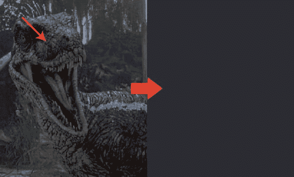
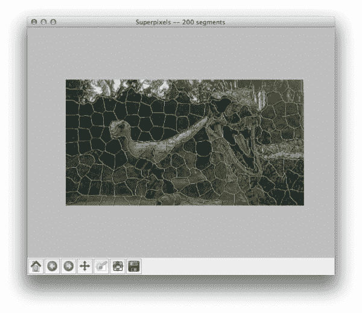
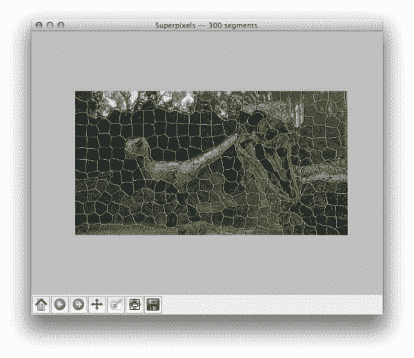

# 分段:使用 Python 的 SLIC 超像素教程

> 原文：<https://pyimagesearch.com/2014/07/28/a-slic-superpixel-tutorial-using-python/>

[](https://pyimagesearch.com/wp-content/uploads/2014/07/slic_100_segments.jpg)

你有过眼皮抽搐的可怕经历吗？无论你做什么，你的眼皮都不会停止跳动？

这就是我目前的状况——已经持续了两个多星期了。你可以想象，我并不快乐。

然而，为了对抗这种持续的、经常分散注意力的麻烦，我开始更规律地睡觉，喝更少的咖啡因(开始时我每天只喝两杯咖啡)，几乎不喝酒。当你像我一样喜欢泡沫啤酒时，这是一个真正的挑战。

更多的睡眠当然有所帮助。我也不怀念偶尔的啤酒。

但是男人，这些咖啡因头痛 ***是最糟糕的*** 。

幸运的是，我今天早上醒来时收到了一封邮件，这封邮件几乎治愈了我的无咖啡因烦恼和无休止的眼皮抽搐。

打开我的收件箱，我发现了一个非常好的问题，来自专门的 PyImageSearch 读者 Sriharsha Annamaneni，她写道:

> 嗨阿德里安，
> 
> 在 Jitendra Malik 的一个 YouTube 视频中，他解释了超像素。我没有完全理解它。你能在你的网站上解释一下吗？
> 
> 谢谢你，
> 
> 斯里哈尔莎·安纳马涅尼

问得好 Sriharsha。我很乐意讨论超像素，我相信很多其他 PyImageSearch 的读者也会感兴趣。

但在我们深入研究一些代码之前，让我们讨论一下超像素到底是什么，以及为什么它在计算机视觉领域有着重要的应用。

**OpenCV 和 Python 版本:**
这个例子将运行在 **Python 2.7/Python 3.4+** 和 **OpenCV 2.4.X/OpenCV 3.0+** 上。

# 那么，什么是超像素呢？

花一点时间，理清你的思绪，想想我们是如何表现图像的。

在单通道或多通道中，图像被表示为像素网格。

我们采用这些 *M x N* 像素网格，然后对它们应用算法，例如人脸检测和识别、模板匹配，甚至直接应用于原始像素强度的深度学习。

问题是，我们的像素网格决不是*图像的自然表示。*

 *例如，考虑下图:

[](https://pyimagesearch.com/wp-content/uploads/2014/07/slic_example_pixel.jpg)

**Figure 1:** If I were to take the *single pixel* pointed to by the red arrow *(left)* and show it to you on the *right* at an obviously zoomed-in scale, would you be able to tell me anything about the image based solely on that pixel? Anything descriptive? Or of semantic value?

如果我从左边的*(用红色箭头突出显示)的图像中提取一个像素，然后在右边的*展示给你看，你能合理地告诉我(1)那个像素来自迅猛龙，以及(2)那个像素实际上拥有某种语义意义吗？**

 **除非你真的真的想玩“魔鬼代言人”游戏，否则答案是一个响亮的“不”——一个单独的像素本身并不是图像的自然表现。

总的来说，这种作为像素网格的像素分组只是图像的一个伪像，是捕捉和创建数字图像过程的一部分。

这让我们想到了超像素。

直觉上，探索由局部分组像素形成的图像的感知和语义意义更有意义。

当我们在我们的像素网格上执行这种类型的像素局部分组时，我们得到了 ***超像素*** 。

这些超像素比它们的简单像素网格对应物具有更多的感知和语义意义。

# 超级像素的优势

总结一下[Xiaofeng Ren](http://ttic.uchicago.edu/~xren/research/superpixel/)博士的工作，我们可以看到，从像素网格到超像素的映射(理想情况下)具有以下理想特性:

1.  **计算效率:**虽然计算实际的超像素分组可能(在某种程度上)计算成本很高，但它允许我们将图像本身的复杂性从数十万像素减少到仅数百个超像素。这些超像素中的每一个都将包含某种感知的、理想的语义值。
2.  **感知意义:**属于超像素组的像素共享某种共性，例如相似的颜色或纹理分布，而不是只检查像素网格中的单个像素，这几乎没有感知意义。
3.  **过度分割:**大多数超像素算法*过度分割*图像。这意味着图像中的大多数重要边界被找到；然而，代价是产生许多无关紧要的边界。虽然这听起来像是使用超级像素的一个问题或障碍，但它实际上是一个积极因素——这种过度分割的最终产品是，从像素网格到超级像素映射中很少(或没有)像素丢失。
4.  **超像素上的图形:**任博士把这个概念称为“表象效率”。为了更具体，想象在一个 *50，000 x 50，000* 像素网格上构建一个图形，其中每个像素代表图形中的一个节点——这导致了非常大的表示。然而，假设我们将超像素应用于像素网格空间，留给我们(任意)200 个超像素。在这种表示中，在 200 个超像素上构建图形要有效得多。

# 示例:简单线性迭代聚类(SLIC)

和往常一样，如果没有例子和一些代码，PyImageSearch 博客文章是不完整的。

准备好了吗？

打开您最喜欢的编辑器，创建`slic.py`，让我们开始编码:

```py
# import the necessary packages
from skimage.segmentation import slic
from skimage.segmentation import mark_boundaries
from skimage.util import img_as_float
from skimage import io
import matplotlib.pyplot as plt
import argparse

# construct the argument parser and parse the arguments
ap = argparse.ArgumentParser()
ap.add_argument("-i", "--image", required = True, help = "Path to the image")
args = vars(ap.parse_args())

# load the image and convert it to a floating point data type
image = img_as_float(io.imread(args["image"]))

# loop over the number of segments
for numSegments in (100, 200, 300):
	# apply SLIC and extract (approximately) the supplied number
	# of segments
	segments = slic(image, n_segments = numSegments, sigma = 5)

	# show the output of SLIC
	fig = plt.figure("Superpixels -- %d segments" % (numSegments))
	ax = fig.add_subplot(1, 1, 1)
	ax.imshow(mark_boundaries(image, segments))
	plt.axis("off")

# show the plots
plt.show()

```

在**的第 2-7 行**，我们导入了将在这个例子中使用的包。为了执行 SLIC 超像素分割，我们将使用 [sckit-image 实现](http://scikit-image.org/docs/dev/api/skimage.segmentation.html#skimage.segmentation.slic)，它是我们在**行 2** 导入的。为了绘制实际的超像素分割，scikit-image 为我们提供了一个`mark_boundaries`函数，我们在**行 3** 导入该函数。

从那里，我们导入一个实用函数，**行 4** 上的`img_as_float`，顾名思义，它将图像从无符号 8 位整数转换为浮点数据，所有像素值都被调用到范围*【0，1】*。

**第 5 行**导入 scikit-image 的`io`子包，用于加载和保存图像。

我们还将利用 matplotlib 来绘制我们的结果，并利用`argparse`来解析我们的命令行参数。

**第 10-12 行**处理解析我们的命令行参数。我们只需要一个开关`--image`，它是我们的映像驻留在磁盘上的路径。

然后，我们加载这个图像，并在第 15 行上将其从无符号 8 位整数转换为浮点数据类型。

有趣的事情发生了。

我们开始在第 18 行**上循环我们的超像素段数量。在这种情况下，我们将分别检查三个逐渐增大的数据段:100、200 和 300。**

我们在**行 21** 上执行 SLIC 超像素分割。`slic`函数只接受一个*必需的*参数，这是我们想要对其执行超像素分割的图像。

然而，`slic`函数也提供了许多可选参数，这里我只介绍一个例子。

第一个是`n_segments`参数，它定义了我们想要生成多少个超像素段。该值默认为 100 段。

然后我们提供`sigma`，它是在分割之前应用的平滑高斯核。

在该函数中可以利用其他可选参数，例如`max_iter`，其为 k-means 的最大迭代次数，`compactness`，其平衡色彩空间接近度与图像空间接近度，以及`convert2lab`，其确定在形成超像素之前是否应该将输入图像转换到 L*a*b*色彩空间(在几乎所有*情况下，将`convert2lab`设置为`True`是个好主意)。*

 *现在我们有了我们的分段，我们使用 matplotlib 在第 24-27 行中显示它们。

为了绘制分段，我们使用了`mark_boundaries`函数，它简单地获取我们的原始图像并覆盖我们的超像素分段。

最后，我们的结果显示在第 30 行的**上。**

现在我们的代码完成了，让我们看看我们的结果是什么样的。

启动一个 shell 并执行以下命令:

```py
$ python superpixel.py --image raptors.png

```

如果一切顺利，您应该会看到下图:

[](https://pyimagesearch.com/wp-content/uploads/2014/07/slic_100_segments.jpg)

**Figure 2:** Applying SLIC superpixel segmentation to generate 100 superpixels using Python.

在这幅图像中，我们发现了(大约)100 个超像素分割。请注意图像中局部相似的区域，如迅猛龙和灌木的鳞片，是如何在相似的超像素中分组的。

现在，让我们增加到 200 个超像素段:

[](https://pyimagesearch.com/wp-content/uploads/2014/07/slic_200_segments.jpg)

**Figure 3:** Applying SLIC superpixel segmentation to generate 200 superpixels using Python.

这里的情况相同——具有相似颜色和纹理分布的局部区域是同一个超像素组的一部分。

最后，让我们使用 300 个超级像素生成一个非常生动的图像过度分割:

[](https://pyimagesearch.com/wp-content/uploads/2014/07/slic_300_segments.jpg)

**Figure 4:** Applying SLIC superpixel segmentation to generate 300 superpixels using Python.

请注意，随着分段数量的增加，分段也变得更像矩形和网格。这不是巧合，可以通过`slic`的可选`compactness`参数进一步控制。

# 摘要

在这篇博文中，我解释了什么是超像素分割，以及它如何在计算机视觉领域带来诸多好处。

例如，使用超像素而不是标准像素网格空间为我们带来了**计算效率**、**感知意义**、**过度分割**，以及跨图像区域的高效**图形表示**。

最后，我向您展示了如何利用简单的线性迭代聚类(SLIC)算法对您自己的图像应用超像素分割。

这当然不会是我们最后一次在这个博客上讨论超像素，所以期待未来更多的帖子！****