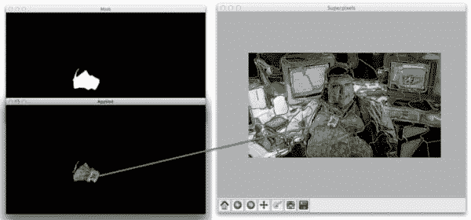
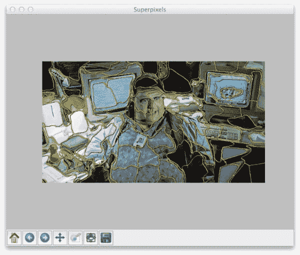
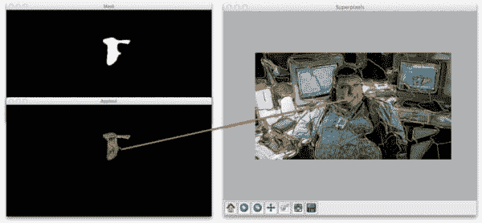
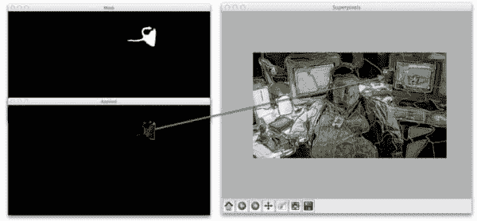

# 使用 Python 访问单个超像素分割

> 原文：<https://pyimagesearch.com/2014/12/29/accessing-individual-superpixel-segmentations-python/>

[](https://pyimagesearch.com/wp-content/uploads/2014/10/nedry_example_segment_03.jpg)

在我的生活中有三个巨大的影响使我想成为一名科学家。

第一位是大卫·a·约翰斯顿，美国地质勘探局的火山学家，于 1980 年 5 月 18 日，华盛顿州圣海伦斯火山灾难性爆发的那一天去世。他是第一个报道火山爆发的人，喊着*“温哥华！温哥华！就是这个！”*在他死于火山侧向喷发的前一刻。我被他的话所鼓舞。在那一刻，他知道自己就要死了——*，但他为这项科学感到兴奋，因为他如此单调乏味地研究和预测的东西已经变成了现实。他死于研究他所热爱的东西。如果我们都这么幸运。*

第二个灵感实际上是我童年爱好的融合。我喜欢用塑料和纸板做东西。我喜欢用卷起的纸和透明胶带制作建筑——起初，我以为我想成为一名建筑师。

但是几年后我发现了另一个爱好。写作。我把时间花在写虚构的短篇小说上，卖给我父母，卖 25 美分。估计也是发现创业基因挺年轻的。在之后的几年里，我确信我长大后会成为一名作家。

我最后的灵感是*侏罗纪公园*。是的。想笑就笑吧。但是爱伦·格兰特和伊恩·马尔科姆科学家之间的二分法在我年轻的时候给了我难以置信的启发。一方面，你有爱伦·格兰特脚踏实地、不修边幅的风度。另一方面，你有杰出的数学家(呃，不好意思，*)摇滚明星。他们代表了两种科学家。我确信我会像他们一样死去。*

从我的童年到现在。受戴维·约翰斯顿的启发，我的确是一名科学家。我也算是一名 T2 建筑师。我在虚拟世界中创建复杂的计算机系统，而不是用实物来构建。我也设法在*作者*方面工作。我已经写了两本书， [*实用 Python 和 OpenCV +案例研究*](https://pyimagesearch.com/practical-python-opencv/) (实际上是三本书，如果算上我的论文的话)，许多论文和一堆技术报告。

但真正的问题是，我像哪个侏罗纪公园的科学家？脚踏实地的爱伦·格兰特？讽刺而现实的伊恩·马尔孔？或者两者都不是。我可能是丹尼斯·内德里，就等着看不见，恶心，被一头异特龙锋利的牙齿咬得浑身湿透。

无论如何，当我思考这个存在危机时，我将向你展示如何使用超像素算法访问[scikit-image](http://scikit-image.org/)…中的*个体分割，当然是用*侏罗纪公园*示例图像。*

 ***OpenCV 和 Python 版本:**
这个例子将运行在 **Python 2.7** 和 **OpenCV 2.4.X/OpenCV 3.0+** 上。

# 使用 Python、OpenCV 和 scikit-image 访问单个超像素分割

几个月前，我写了一篇关于[分割和使用 scikit-image 库中实现的简单线性迭代聚类算法](https://pyimagesearch.com/2014/07/28/a-slic-superpixel-tutorial-using-python/ "Segmentation: A SLIC Superpixel Tutorial using Python")的文章。

虽然我不打算在这里重复整篇文章，但使用超像素分割算法的好处包括****感知意义******过分割*** ，以及超像素 上的 ***图形。****

 *要更详细地了解超像素算法及其优势，[请务必阅读本文](https://pyimagesearch.com/2014/07/28/a-slic-superpixel-tutorial-using-python/ "Segmentation: A SLIC Superpixel Tutorial using Python")。

将 SLIC 应用于图像的典型结果如下所示:

[](https://pyimagesearch.com/wp-content/uploads/2014/10/nedry_slic_segmentations.jpg)

**Figure 1:** Applying SLIC to find superpixel segmentations and then marking the segment boundaries.

请注意，具有相似颜色和纹理分布的局部区域是同一个超像素组的一部分。

这是一个很好的开始。

但是我们如何访问每个 ***个体*** 超像素分割呢？

很高兴你问了。

打开编辑器，创建一个名为`superpixel_segments.py`的文件，让我们开始吧:

```py
# import the necessary packages
from skimage.segmentation import slic
from skimage.segmentation import mark_boundaries
from skimage.util import img_as_float
import matplotlib.pyplot as plt
import numpy as np
import argparse
import cv2

# construct the argument parser and parse the arguments
ap = argparse.ArgumentParser()
ap.add_argument("-i", "--image", required = True, help = "Path to the image")
args = vars(ap.parse_args())

```

**第 1-8 行**处理导入我们需要的包。我们将在这里大量使用 scikit-image，特别是对于 SLIC 实现。我们还将使用`mark_boundaries`，这是一个方便的函数，可以让我们轻松地可视化分割的边界。

从那里，我们导入`matplotlib`进行绘图，导入 NumPy 进行数值处理，导入`argparse`解析命令行参数，导入`cv2`进行 OpenCV 绑定。

接下来，让我们继续解析第 10-13 行的命令行参数。我们只需要一个开关`--image`，它是我们的映像驻留在磁盘上的路径。

现在，让我们执行实际的分段:

```py
# load the image and apply SLIC and extract (approximately)
# the supplied number of segments
image = cv2.imread(args["image"])
segments = slic(img_as_float(image), n_segments = 100, sigma = 5)

# show the output of SLIC
fig = plt.figure("Superpixels")
ax = fig.add_subplot(1, 1, 1)
ax.imshow(mark_boundaries(img_as_float(cv2.cvtColor(image, cv2.COLOR_BGR2RGB)), segments))
plt.axis("off")
plt.show()

```

我们首先在磁盘的第 17 行加载我们的映像。

通过调用`slic`函数，实际的超像素分割发生在**行 18** 上。该函数的第一个参数是我们的图像，表示为浮点数据类型，而不是 OpenCV 使用的默认 8 位无符号整数。第二个参数是我们希望从`slic`中得到的(大约)分段数。最后一个参数是`sigma`，它是分割之前应用的高斯核的大小。

现在我们有了我们的分割，我们使用`matplotlib`在**行的 20-25** 显示它们。

如果您按原样执行这段代码，您的结果将类似于上面的**图 1** 。

注意`slic`是如何在我们的图像中构建超像素的。而且我们可以清楚地看到这些超像素中每一个的“边界”。

但是真正的问题是*“我们如何访问每个单独的细分？”*

如果你知道面具是如何工作的，这其实很简单:

```py
# loop over the unique segment values
for (i, segVal) in enumerate(np.unique(segments)):
	# construct a mask for the segment
	print "[x] inspecting segment %d" % (i)
	mask = np.zeros(image.shape[:2], dtype = "uint8")
	mask[segments == segVal] = 255

	# show the masked region
	cv2.imshow("Mask", mask)
	cv2.imshow("Applied", cv2.bitwise_and(image, image, mask = mask))
	cv2.waitKey(0)

```

你看，`slic`函数返回一个 2D NumPy 数组`segments`，其宽度和高度与原始图像相同。此外，每个分段由一个唯一的整数表示，这意味着属于特定分段的像素在`segments`数组中将具有相同的值。

为了演示这一点，让我们开始循环第 28 行**上的 ***唯一值*** `segments`。**

从那里，我们在第 31 行和第 32 行上构造一个遮罩。这个遮罩与原始图像具有相同的宽度和高度，默认值为 0(黑色)。

然而， **Line 32** 为我们做了一些相当重要的工作。通过声明`segments == segVal`，我们在`segments`列表中找到具有当前段 ID 或`segVal`的所有索引，或 *(x，y)* 坐标。然后，我们将这个索引列表传递到掩码中，并将所有这些索引设置为值 255(白色)。

然后我们可以在第 35-37 行的**中看到我们的工作结果**，这里我们显示了应用于我们图像的`mask`和`mask`。

# 超像素分割正在发挥作用

要查看我们的工作结果，请打开一个 shell 并执行以下命令:

```py
$ python superpixel_segments.py --image nedry.png

```

首先，你会看到超像素分割边界，就像上面一样:

[](https://pyimagesearch.com/wp-content/uploads/2014/10/nedry_slic_segmentations.jpg)

但是当你关闭那个窗口时，我们将开始循环每个单独的片段。以下是我们访问每个细分市场的一些示例:

[](https://pyimagesearch.com/wp-content/uploads/2014/10/nedry_example_segment_01.jpg)

**Figure 2:** Exploring a “face” segment of Dennis Nedry using superpixel segmentation.

[](https://pyimagesearch.com/wp-content/uploads/2014/10/nedry_example_segment_02.jpg)

**Figure 3:** Jurassic Park trivia time. Do you know who the person is in that picture frame? Bonus points to the first correct answer in the comments!

[](https://pyimagesearch.com/wp-content/uploads/2014/10/nedry_example_segment_03.jpg)

**Figure 4:** Applying superpixel segmentation and exploring the shirt and ID badge segment.

没什么，对吧？现在您知道使用 Python、SLIC 和 scikit-image 访问单个超像素段是多么容易了。

# 摘要

在这篇博文中，我向您展示了如何利用简单的线性迭代聚类(SLIC)算法来执行超像素分割。

从那里，我提供了允许你访问每个 ***个体*** 分割算法产生的代码。

现在你有了这些细分，你会怎么做呢？

首先，您可以查看跨图像区域的图形表示。另一种选择是从每个分段中提取特征，您可以稍后利用这些特征来构建视觉单词包。这种视觉单词袋模型对于训练机器学习分类器或构建基于内容的图像检索系统是有用的。但稍后会有更多内容…

无论如何，我希望你喜欢这篇文章！这当然不会是我们最后一次讨论超像素分割。

如果你有兴趣下载这篇博文的代码，只需在下面的表格中输入你的电子邮件地址，我会把代码和示例图片通过电子邮件发给你。当新的精彩的 PyImageSearch 内容发布时，我一定会通知您！**