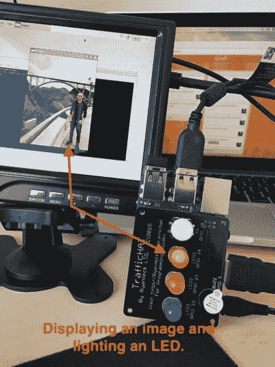
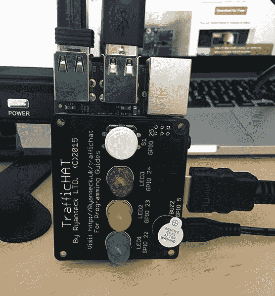
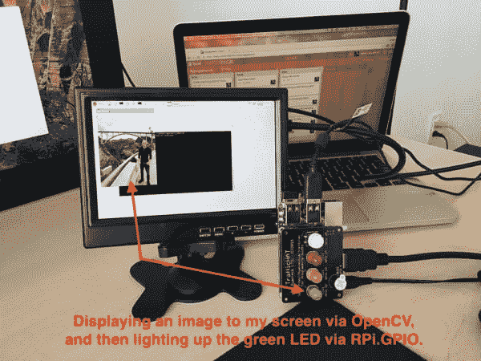
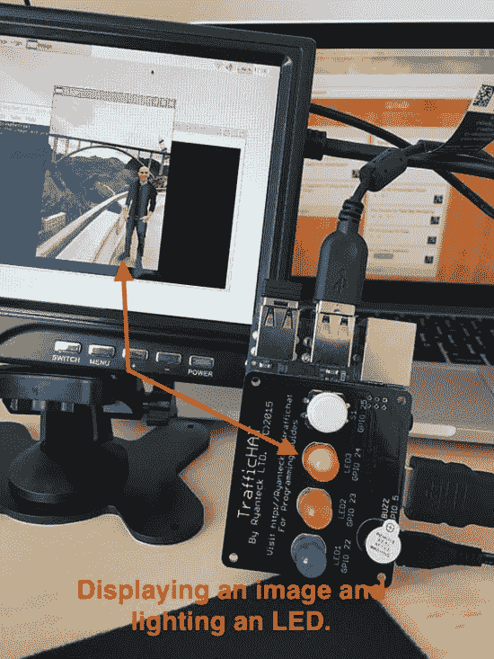

# 正在访问 RPi。GPIO 和 GPIO Zero 与 OpenCV + Python

> 原文：<https://pyimagesearch.com/2016/05/02/accessing-rpi-gpio-and-gpio-zero-with-opencv-python/>



我不敢相信这是我第一次在 GPIO 和树莓派上写博客。对我来说这是一个相当大的错误。我应该早点写这篇文章。

**你看，平均来说，我每周会收到 1-3 封电子邮件，大致如下:**

> 当我使用“cv”虚拟环境时，我可以访问我的 OpenCV 绑定。但是之后我就不能导入 RPi.GPIO 了，当我切换出虚拟环境(并且使用系统 Python)的时候，我就可以使用 RPi 了。GPIO，但是我不能导入 OpenCV。怎么回事？

这个问题的原因是 RPi.GPIO/GPIO Zero*没有*安装到你的 Python 虚拟环境中！要解决这个问题，您需要做的就是使用`pip`将它们安装到您的虚拟环境中——从那里，您就可以开始了。

但是说实话，我不认为这是真正的问题！

真正的问题是对*什么是* Python 虚拟环境以及*为什么*我们使用它们没有足够的理解。利用 Python 虚拟环境是一种*最佳实践*，你*需要*去适应它。

在这篇博文的剩余部分，我将*慢慢介绍 Python 虚拟环境*的概念。从那里，我们将学习如何安装 RPi。GPIO 和 GPIO Zero 与我们的 OpenCV 绑定在同一个 Python 虚拟环境中，允许我们同时访问 OpenCV 和 RPi.GPIO/GPIO Zero*！*

**继续阅读，了解如何……**

## 正在访问 RPi。GPIO 和 GPIO Zero 与 OpenCV + Python

在我们学习如何(正确地)安装 RPi 之前。GPIO 和 GPIO Zero 在我们的 Raspberry Pi 上，我们首先需要回顾一下 Python 虚拟环境的概念。

如果你曾经关注过 PyImageSearch 博客上的 [Raspberry Pi + OpenCV 安装教程，你会知道我是 Python 虚拟环境的*超级粉丝*，并且向几乎每个项目的*推荐它们。*](https://pyimagesearch.com/opencv-tutorials-resources-guides/)

然而，我似乎没有很好地解释 ***什么是*** Python 虚拟环境以及 ***我们为什么要使用*** 。以下部分应该有助于澄清任何问题。

### 什么是 Python 虚拟环境？

最核心的是，Python 虚拟环境允许我们为每个 Python 项目的*创建*隔离的、独立的*环境。这意味着**每个项目可以有自己的依赖关系集**、*而不管另一个项目有哪些依赖关系。**

那么，我们为什么要为我们的每个项目创建一个虚拟环境呢？

考虑一下这个:假设我们是软件承包商，受雇于一家公司开发*项目 A* 。但是在我们完成*项目 A* 之前，第二家公司雇佣我们开发*项目 B* 。我们注意到*项目 A* 和*项目 B* 都依赖于*库 A* … ***但问题是*** **项目 A** ***需要*** **库 A** ***而*** **项目 B** ***需要***

这对 Python 来说是一个真正的问题，因为我们*不能*将*同一个库*的两个不同版本安装到同一个`site-packages`目录中(即 Python 存储第三方库的地方，比如你从`pip`、GitHub 等下载并安装的库)。).

那么，我们该怎么办？

我们是不是应该跑到最近的苹果商店去买一台新的 MacBook Pro，这样我们就可以用一台笔记本电脑开发 *ProjectA* ，用另一台开发 *ProjectB* ？**我真的希望不会。那会很快变得昂贵。**

一定要使用 Linode、Digital Ocean 或 Amazon EC2 这样的网络主机，并为每个项目创建一个新实例。这是一个更好的解决方案，在某些情况下非常适用，但在我们的*特定实例*中，这有点矫枉过正。

或者我们使用 Python 虚拟环境？

你猜对了— **我们使用 Python 虚拟环境。**

在这种情况下，我们需要做的就是为每个项目创建一个虚拟环境，这样所有项目都有一个单独、隔离和独立的环境:


**Figure 1:** Each Python environment we create is separate and independent from the others.

这允许我们为*项目 A* 和*项目 B* 安装完全不同的依赖项，确保我们可以在同一台计算机上完成两个项目的开发。

很漂亮，对吧？

当然，使用 Python 虚拟环境还有很多好处，但与其一一列举， ***[请参考 RealPython 博客](https://realpython.com/blog/python/python-virtual-environments-a-primer/)** 上这篇优秀的 Python 虚拟环境入门。*

### 但是阿德里安，我已经在使用 Python 虚拟环境了！

如果你遵循了 PyImageSearch 博客上的任何 [OpenCV 安装教程，那么你已经在使用 Python 虚拟环境了。](https://pyimagesearch.com/opencv-tutorials-resources-guides/)

那么你怎么能确定呢？

如果你需要在执行你的 Python 脚本来导入 OpenCV 之前执行`workon <virtual environment name>` *，那么你猜怎么着，你正在使用 Python 虚拟环境。*

*但真正的问题来了……*

### 你*大概*装了 RPi。GPIO 和 GPIO 零位不正确

“不正确”这个词用在这里是不恰当的，但我需要引起你的注意。你去装 RPi 的时候。GPIO 还是 GPIO Zero，我敢打赌你用的是`apt-get`。您的命令可能是这样的:

```py
$ sudo apt-get install python-rpi.gpio python-gpiozero

```

此命令将下载 RPi。GPIO 和 GPIO Zero，并将它们安装到您的系统上。

*问题*是`apt-get`将安装包放入*系统安装*Python 和*而不是*你的 Python 虚拟环境。

**这就是*为什么*会遇到这样的问题:**

> 我可以在‘cv’虚拟环境中导入 OpenCV，但是不能导入 RPi.GPIO，另一方面，我可以导入 RPi。“cv”环境之外的 GPIO，但是我不能导入 cv2。

你如何解决这个问题？

你只需要将你的库安装到你的*虚拟环境*中，而不是 Python 的系统版本，这可以通过`workon`和`pip`轻松完成。

这就引出了我的下一个观点:

**我*不*推荐用`apt-get`安装 Python 库。**

你可能在想，*“但是 Adrian，使用`apt-get`太简单了！只是一个命令，然后我就完事了！”*

我要告诉你一个消息——使用`pip`也是一个命令。**同样简单。**

回到我的观点，不仅是`apt-get`将这些库安装到系统 Python(而不是你的虚拟环境)中，还有一个问题是`apt-get`包通常有点过时。

猜猜当你想安装给定库的最新版本时会发生什么？

**提示:**您遇到了上面详述的问题——您将试图将两个不同版本的*同一个库*安装到*同一个`site-packages`* 目录中，这根本不可能发生(由于 Python 的工作方式)。

相反，您应该使用 Python 包管理器， [pip](https://pip.pypa.io/en/stable/) ，将您的 Python 包安装到虚拟环境中。关于`pip`，它是如何工作的，以及我们为什么使用它， **[的更多信息，请参考这篇文章](https://www.dabapps.com/blog/introduction-to-pip-and-virtualenv-python/)** 。

### 正在安装 RPi。GPIO 和 GPIO 零点“正确”

我们去拿 RPi 吧。GPIO 和 GPIO zero 安装在我们的 Python 虚拟环境中。首先，使用`workon`命令进入 Python 虚拟环境:

```py
$ workon <virtual environment name>

```

***注意:**您可能需要在运行`workon`命令之前执行`source ~/.profile`，以便加载虚拟环境启动脚本。*

如果环境名称出现在提示符前的括号中，则可以判断您处于 Python 虚拟环境中:


**Figure 2:** I can tell I am in the “cv” virtual environment because I can see the text “(cv)” before my prompt.

在这种情况下，我已经进入了`cv`虚拟环境，我可以验证这一点，因为我在我的提示前看到了文本*(cv)*。

从那里，我们可以让`pip`安装 RPi。我们的 GPIO 和 GPIO Zero:

```py
$ pip install RPi.GPIO
$ pip install gpiozero

```

最后，让我们测试安装并确保我们可以导入 RPi。GPIO、GPIO Zero 和 OpenCV 一起:

```py
$ python
>>> import RPi.GPIO
>>> import gpiozero
>>> import cv2
>>>

```

***注意:**我假设你正在使用的虚拟环境*已经*安装了 OpenCV。我的`cv`虚拟环境已经安装了 OpenCV，所以通过使用`pip`安装`RPi.GPIO`和`gpiozero`安装各自的 GPIO 包，我能够从同一个环境中访问所有三个库。*

一旦您可以在同一个环境中导入这些库，我们就可以继续了。

### 五金器具

在这篇博文中，我使用了我的 **[Raspberry Pi 3](http://amzn.to/1Nz3AaP)** 和 **TrafficHAT** 板，这是一个非常酷的 Raspberry Pi 模块，可以让你快速轻松地开始 GPIO 编程:



**Figure 3:** The TrafficHAT module for the Raspberry Pi, which includes 3 LED lights, a buzzer, and push button, all of which are programmable via GPIO.

正如你所看到的，TrafficHAT 包括 3 个大 LED 灯、一个按钮和一个蜂鸣器。

***注意:**之所以称之为“帽子”，是因为我们只需要将它放在 GPIO 引脚的顶部——不需要分线板、额外的电缆或焊接。*

一旦我们在 Raspberry Pi 上安装了 TrafficHAT，我们就可以使用几乎任何编程语言对其进行编程(只要该语言可以访问 GPIO 引脚)，但是出于这篇博客文章的目的，我们将使用 Python + [RPi。GPIO](https://pypi.python.org/pypi/RPi.GPIO) 和 [GPIO 零](https://gpiozero.readthedocs.org/en/v1.2.0/)。

### 使用 RPi。GPIO + OpenCV

让我们继续编写一些代码，使用 RPi 访问 TrafficHAT 板。GPIO 库。我们还将利用 OpenCV 从文件中加载一幅图像，并将其显示在屏幕上。

打开一个新文件，将其命名为`gpio_demo.py`，并插入以下代码:

```py
# import the necessary packages
import RPi.GPIO as GPIO
import time
import cv2

# load the input image and display it to our screen
print("click on the image and press any key to continue...")
image = cv2.imread("hoover_dam.jpg")
cv2.imshow("Image", image)
cv2.waitKey(0)
print("moving on...")

# set the GPIO mode
GPIO.setmode(GPIO.BCM)

# loop over the LEDs on the TrafficHat and light each one
# individually
for i in (22, 23, 24):
	GPIO.setup(i, GPIO.OUT)
	GPIO.output(i, GPIO.HIGH)
	time.sleep(3.0)
	GPIO.output(i, GPIO.LOW)

# perform a bit of cleanup
GPIO.cleanup()

```

**第 2-4 行**处理导入我们需要的 Python 包。然后，我们从磁盘加载输入图像，并在**的第 8-10 行**将它显示到我们的屏幕上。我们的脚本将暂停执行，直到我们点击活动图像窗口并按下键盘上的任意键。

从那里，我们循环遍历 TrafficHAT 上的每个 led(**行 18** )。对于每一盏灯，我们:

1.  打开 LED 灯。
2.  等待 3 秒钟。
3.  关灯继续循环。

要执行`gpio_demo.py`，使用`workon`命令确保您在`cv`虚拟环境中(或者您用来存储 OpenCV 绑定+ GPIO 库的任何虚拟环境中):

```py
$ workon cv

```

然后我们可以运行`gpio_demo.py`脚本:

```py
$ python gpio_demo.py

```

如输出图像所示，我们可以看到我们的`hoover_dam.jpg`图像显示在屏幕上*和*交通上的绿色 LED 灯明亮地闪烁着:



**Figure 4:** Loading an image to my screen using OpenCV and then lighting up the green LED using GPIO.

### root 呢？

但是如果我们想作为根用户执行`gpio_demo.py`呢？那我们该怎么办？

我们有两个选择。

第一种选择是在我们的 Python 虚拟环境中使用`sudo`命令*，就像这样:*

```py
$ sudo python gpio_demo.py

```

***注意:**在*用`sudo`执行你的脚本之前，确保你在你的 Python 虚拟环境*；否则，您将无法访问虚拟环境中安装的库。*

第二个选项是启动一个根 shell，访问我们的 Python 虚拟环境，然后执行脚本:

```py
$ sudo /bin/bash
$ source /home/pi/.profile
$ workon cv
$ python gpio_demo.py

```

哪个最好？

说实话，这真的不重要。

有些情况下使用`sudo`更容易。还有一些地方，只需拔出根壳就很好。使用您更喜欢的选项— **以 root 用户身份执行命令时要小心！**

### 使用 RPI Zero + OpenCV

既然我们已经研究了 RPi。GPIO，让我们重新创建同一个 Python 脚本，但是这次使用 GPIO Zero 库。打开一个不同的文件，将其命名为`gpiozero_demo.py`，并插入以下代码:

```py
# import the necessary packages
from gpiozero import TrafficHat
import time
import cv2

# load the input image and display it to our screen
print("click on the image and press any key to continue...")
image = cv2.imread("hoover_dam.jpg")
cv2.imshow("Image", image)
cv2.waitKey(0)
print("moving on...")

# initialize the TrafficHAT, then create the list of lights
th = TrafficHat()
lights = (th.lights.green, th.lights.amber, th.lights.red)

# loop over the lights and turn them on one-by-one
for light in lights:
	light.on()
	time.sleep(3.0)
	light.off()

```

**2-4 线**再次处理导入我们需要的包。这里真正有趣的是,`gpiozero`库有一个`TrafficHat`类，它使我们能够轻松地与 TrafficHAT 模块接口。

**第 8-10 行**处理将我们的输入图像加载并显示到 sour 屏幕。

然后我们可以初始化`TrafficHat`对象，并在**的第 14 行和第 15 行**上构建`lights`的列表。

最后，**第 18-21 行**处理每一个`lights`的循环，分别打开每一个，等待 3 秒，然后在移动到下一个之前关闭`light`。

就像 RPi 一样。GPIO 示例，我们首先需要访问我们的 Python 虚拟环境，然后执行我们的脚本:

```py
$ workon cv
$ python gpiozero_demo.py

```

随着脚本的执行，我们可以看到屏幕上显示了一幅图像，led 灯亮起:



**Figure 5:** A second example of using OpenCV to display an image and then utilizing GPIO to illuminate an LED.

***注意:**要以 root 用户身份执行这个脚本，请按照上一节中的说明进行操作。*

## 摘要

在这篇博文中，我首先回顾了什么是 Python 虚拟环境以及为什么我们使用 Python 虚拟环境的原因。简而言之，Python 虚拟环境允许我们为我们从事的每个项目*创建独立、隔离的开发环境，确保我们不会遇到版本依赖问题。此外，虚拟环境允许我们保持 Python 系统安装的整洁。*

一旦我们理解了 Python 虚拟环境的基础，我详细说明了如何(正确地)安装 RPi。GPIO 和 GPIO 清零，这样我们可以同时访问 GPIO 库*和* OpenCV。

然后，我们开发了一个简单的 Python 脚本，它使用 OpenCV 从磁盘加载图像，将其显示在我们的屏幕上，然后点亮[traffic that](https://ryanteck.uk/hats/1-traffichat-0635648607122.html)上的各种 led。

在下一篇博文中，我们将创建一个更高级的 GPIO + OpenCV 脚本，这一次，每当*预定义的视觉动作*发生时，就会点亮 led 并发出蜂鸣声。

**请务必在下面的表格中输入您的电子邮件地址，以便在下一篇博文发布时得到通知，*您不会想错过它的！【T2***