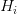
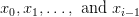
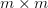
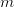
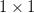
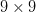
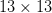
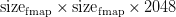
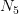
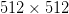

# 实现物体检测的最佳速度和精度(YOLOv4)

> 原文：<https://pyimagesearch.com/2022/05/16/achieving-optimal-speed-and-accuracy-in-object-detection-yolov4/>

* * *

## 目录

* * *

## [**【yolov 4】**](#TOC)

在本教程中，您将从研究的角度了解 YOLOv4，因为我们将更深入地研究这一精确而快速的对象检测网络的工作原理。我们将通过将这个网络与之前的目标检测工作进行比较来建立直觉。

我们相信 YOLOv4 是许多实验和研究的结果，这些实验和研究结合了各种提高卷积神经网络准确性和速度的小的新技术。但最具挑战性的部分是将这些互补的不同特征结合起来，从而提供一个最佳和准确的对象检测模型。而这正是这篇论文做的最好的方式！

[Bochkovskiy 等人(2020)](https://arxiv.org/pdf/2004.10934v1.pdf) 在不同的 GPU 架构上进行了广泛的实验，并表明 YOLOv4 在速度和准确性方面优于所有其他对象检测网络架构。这个实验的目的是激励人们利用 YOLOv4 模型的能力，而不要过多考虑 GPU 的类型，因为它即使在传统的 GPU 上也能发挥最佳性能，这使得本文更加令人兴奋和独特。

这节课是我们关于 **YOLO** 的 7 集系列的第 6 集:

1.  [*YOLO 家族简介*](https://pyimg.co/dgbvi)
2.  [*了解一个实时物体检测网络:你只看一次(YOLOv1)*](https://pyimg.co/3cpmz)
3.  [*更好、更快、更强的物体探测器(YOLOv2)*](https://pyimg.co/ehaox)
4.  [*使用 COCO 评估器*](https://pyimg.co/nwoka) 平均精度(mAP)
5.  [*用 Darknet-53 和多尺度预测的增量改进(YOLOv3)*](https://pyimg.co/8xfpg)
6.  [*【yolov 4】*](https://pyimg.co/c6kiu)***【今日教程】***
7.  *[***在自定义数据集上训练 YOLOv5 物体检测器***](https://pyimg.co/fq0a3)*

 ***要了解使用的新技术和执行的各种实验，以构建一个快速准确的实用 YOLOv4 对象检测器，并使用 YOLOv4 运行推理以实时检测对象** ***，请继续阅读。***

* * *

## [**【yolov 4】**](#TOC)

在 YOLO 系列的第 6 部分中，我们将首先介绍 YOLOv4，并讨论 YOLOv4 的目标和贡献以及量化基准。然后，我们将讨论对象检测器中涉及的不同组件。

然后，我们将讨论“免费赠品包”,它有助于在不影响推理成本的情况下改进训练策略。我们还将讨论提高检测器精度所需的后处理方法和称为“特殊包”的插件模块，这些方法和模块只增加了少量的推理成本。最后，我们还将讨论 YOLOv4 架构的选择策略:主干、带有附加模块的瓶颈和头部。

接下来，我们将讨论 YOLOv4 模型为实现最先进的准确性和速度而利用的“一袋免费赠品”和“一袋特价商品”:

*   剪切混合和镶嵌数据扩充
*   类别标签平滑
*   自我对抗训练
*   丢弃块正则化
*   跨级部分连接
*   空间金字塔池
*   空间注意模块
*   路径聚合网络

我们还将讨论受各种实验相互作用影响的 YOLOv4 的定量基准:

*   主干上的 BoF 和 Mish 激活
*   探测器上的 BoF
*   探测器上的 BoS
*   探测器上的主干

最后，我们将通过在 Tesla V100 GPU 上运行两幅图像和一个预训练模型视频的推理来查看 YOLOv4 的运行情况。

* * *

### [**配置您的开发环境**](#TOC)

要遵循这个指南，您需要在您的系统上编译并安装 Darknet 框架。在本教程中，我们将使用 [AlexeyAB 的 Darknet 库](https://github.com/AlexeyAB/darknet)。

我们将逐步介绍如何在 Google Colab 上安装 darknet 框架。但是，如果您现在想配置您的开发环境，可以考虑前往[配置 Darknet 框架并使用预训练的 YOLOv4 COCO 模型运行推理](#h3-Configuring-Darknet)部分。

* * *

### [**在配置开发环境时遇到了问题？**](#TOC)

说了这么多，你是:

*   时间紧迫？
*   了解你雇主的行政锁定系统？
*   想要跳过与命令行、包管理器和虚拟环境斗争的麻烦吗？
*   **准备好在您的 Windows、macOS 或 Linux 系统上运行代码*****？***

 *那今天就加入 [PyImageSearch 大学](https://www.pyimagesearch.com/pyimagesearch-university/)吧！

**获得本教程的 Jupyter 笔记本和其他 PyImageSearch 指南，这些指南是** ***预先配置的*** **，可以在您的网络浏览器中运行在 Google Colab 的生态系统上！**无需安装。

最棒的是，这些 Jupyter 笔记本可以在 Windows、macOS 和 Linux 上运行！

* * *

### [**约洛夫 4** 简介](#TOC)

YOLOv3 发布后，《YOLO》的原作者(Joseph Redmon)因为伦理原因，停止了对 YOLO 的进一步开发，甚至退出了计算机视觉领域。

2020 年，Alexey Bochkovskiy 等人(著名 GitHub 知识库:Darknet 的作者)在 arXiv 上发表了 [YOLOv4:物体检测的最佳速度和精度](https://arxiv.org/pdf/2004.10934v1.pdf)论文。如图**图 2** 所示，作者最大限度地利用了现有的新技术和新功能，通过这种方式将它们结合起来，产生了一种速度和精度都达到最佳水平的物体检测器，优于其他最先进的物体检测器。我们可以从下图中观察到，YOLOv4 的运行速度是 EfficientDet 的两倍，性能相当，并且在 MS COCO 数据集上，YOLOv3 的 mAP 和 FPS 分别提高了 10%和 12%。

在对象检测模型中，我们总是看到准确性和速度之间的权衡。例如，通过运行对象检测模型的摄像机来搜索商场中的空闲停车位是由慢速精确模型来执行的。相反，由快速不准确的模型来执行坑洞检测警告。因此，提高实时物体检测器的准确性对于准确的驾驶员警报、独立的过程管理和减少人工输入是至关重要的。

但通常，开发实时对象检测器的挑战是将它们部署在传统的 GPU 和边缘设备上。构建一个在这些低端传统 GPU 上运行的解决方案，可以让它们以可承受的价格得到广泛使用。

我们知道，最精确的神经网络模型不会实时运行，并且需要许多 GPU 来进行大批量的训练。不幸的是，这也意味着很难在边缘设备上部署它们。在 YOLOv4 中，作者试图通过创建一个在传统 GPU 上实时运行的 CNN 来解决这个问题，并且训练只需要一个传统 GPU。因此，任何拥有 1080 Ti 或 2080 Ti GPU 的人都可以训练这种超级快速准确的对象检测器。为了验证他们的模型，作者在各种 GPU 架构上测试了 YOLOv4。

卷积神经网络(CNN)的性能在很大程度上取决于我们使用和组合的功能。例如，某些功能仅适用于特定的模型、问题陈述和数据集。但是批量规范化和残差连接等功能适用于大多数模型、任务和数据集。因此，这些特征可以被称为普遍性的。

作者利用了这一思想，并假设了一些普遍特征，包括

*   加权剩余连接(WRC)
*   跨阶段部分连接
*   交叉小批量标准化(CmBN)
*   自我对抗训练
*   误激活
*   镶嵌数据增强
*   丢弃块正则化
*   CIoU 损失

上述功能相结合，实现了最先进的结果:在特斯拉 V100 GPU 上以 65 FPS 的实时速度在 MS COCO 数据集上实现了 43.5%的 mAP (65.7% mAP50)。

YOLOv4 模型结合了上述和更多的特征，形成了用于改进模型训练的“免费赠品包”和用于改进物体检测器精度的“特殊包”。我们将在后面详细讨论这一点。

* * *

### [**物体探测器中的组件**](#TOC)

对象检测器的端到端架构通常由两部分组成:

1.  毅力
2.  头

正如我们在以前的 YOLO 帖子中了解到的，一个*主干*被用作特征提取器，在 ImageNet 数据集上进行分类任务的预训练。在 GPU 上训练和测试的对象检测器使用较重的主干(例如，VGG、ResNet、DenseNet 和 Darknet-19/53)，而对于 CPU，使用较轻的主干(例如，SqueezeNet、MobileNet 等)。)被使用。在速度和准确性之间总是有一个折衷。较轻的脊椎比较重的脊椎更快，但准确性较低。

一个*头*用于预测对象的边界框坐标和类别标签。头部可以进一步分为两级(即一级和两级物体检测器)。RCNN 系列就是两级检波器的一个很好的例子。最能代表一级检测器的是 YOLO 系列、SSD 和 RetinaNet。

**图 3** 显示了一级和两级检测器的目标检测工作流程，由几个部分组成:输入、脊柱、颈部和头部。

近年来，物体探测器开始使用一个*颈*，即在脊柱和头部之间增加几层，用于收集脊柱不同阶段的特征图。例如，在 YOLOv3 中，主链由 53 层组成。有 53 个附加层(包括头部),其中来自后面层的特征被上采样并与来自前面层的特征连接。

通常，一个颈部由几个自底向上的路径组成，几个自顶向下的路径使用跳过连接进行连接。像特征金字塔网络(FPN)和路径聚合网络(PAN)这样的网络基于这种机制工作，并且经常被用作对象检测网络中的瓶颈(例如，YOLOv4 使用 PANet 作为瓶颈)。

* * *

### [**【BoF】**](#TOC)

在几乎所有情况下，对象检测器都是离线训练的，这使得研究人员可以自由地开发训练方法，使对象检测器更加准确，而不会影响推理成本。因此，这些仅改变培训策略或提高培训成本的方法被称为**图 4** 所示的“免费赠品包”。

我们最常用的训练策略是数据扩充，如图**图 5** 所示。数据扩充的目的是增加输入图像的可变性，使得设计的目标检测模型对从不同环境获得的图像具有更高的鲁棒性。

有各种数据扩充类别(例如，单图像、多图像等。).正如我们所看到的，在一幅图像中有两种失真:光度失真和几何失真。在光度失真中，您可以通过对图像应用亮度、噪波和色调来更改图像属性，而在几何失真中，我们可以旋转、裁剪或平移图像。

然后，一些研究人员提出使用多幅图像一起执行数据增强，如 Mixup 和 CutMix。Mixup 使用两幅图像以不同的系数比率相乘并叠加，然后用这些叠加的比率调整标签。至于 CutMix，它将裁剪后的图像覆盖到其他图像的矩形区域，并根据混合区域的大小调整标签。

YOLOv4 提出了一种新的多图像数据增强技术，称为马赛克，将四幅不同的图像缝合在一起。在后面的部分会有更多的介绍。

研究人员还提出了对象遮挡作为在图像分类和对象检测中成功的另一种数据增强。例如,“随机擦除”和“剪切”可以随机选择图像中的矩形区域，并填充零的随机 or 值。这有助于网络避免过度拟合；例如，给定一幅猫的图像，网络将被迫学习它身体的其他部分，并将它归类为猫，因为剪切器会随机移除它的头部或尾巴。

* * *

### [**【BoS】**](#TOC)

“特价包”是仅少量增加推理成本但能显著提高物体检测准确度的后处理方法和插件模块，称为“特价包”这些模块和方法有计算负荷，但有助于提高准确性。

这些插件模块用于增强模型中的特定属性，如使用空间金字塔池(SPP)扩大感受野，使用空间注意模块(SAM)引入注意机制，或使用 FPN 或 PAN 增强特征整合能力等。、以及用于筛选模型预测结果的类似非最大值抑制的后处理方法。

如图**图 6** 所示，我们可以对每个插件模块和后处理方法有无数的选择。当您设计对象检测网络或在数据集上从头开始训练时，下图应该是一个很好的参考。在 YOLOv4 中，作者使用改进的 PAN 进行特征整合，使用改进的空间注意模块(SAM)作为注意模块，使用 SPP 扩展感受野。在后处理方法上，检测器采用了欧弟-NMS 法。

在下一节中，我们将讨论使用哪些模块和方法来训练主干和检测器。我们还将详细讨论这些特定的方法。

* * *

### [**YOLOv4 架构选择**](#TOC)

主要目的是为生产系统建立一个快速运行的神经网络。要开发这样一个模型，目标是在

*   输入网络分辨率
*   卷积层数
*   网络中的参数数量
*   输出层数(过滤器)

以上四点很有道理，请记住，我们希望构建一个合理的低成本部署模型。例如，输入网络分辨率(图像尺寸)是必不可少的；图像尺寸越大，拥有的上下文信息就越多，有助于网络轻松检测更小的物体。但是更大的图像尺寸的缺点是，你将需要更多的内存带宽，尤其是在 GPU 上，更多的网络计算(FLOPs)，并且可能设计更深的网络。因此，在这些参数之间取得平衡对于构建一个快速且最优的网络至关重要。

* * *

#### [**骨干**](#TOC)

YOLOv4 使用 CSPDarknet53 模型作为主干。回想一下 YOLOv3 使用的是 Darknet53 型号，和 Darknet53 一样，CSPDarknet53 也是基于 DenseNet 的。现在，它前面的这个 CSP 前缀是什么？CSP 代表跨阶段部分连接。我们将在后面的部分研究 CSP。

根据之前的研究，CSPResNeXt50 模型在 ImageNet 数据集上的基准影像分类任务上明显优于 CSPDarknet53 模型。但是，在 MS COCO 数据集上检测对象方面，CSPDarknet53 模型比 CSPResNext50 要好。

**表 1** 显示了 CSPDarknet53 与其他骨干架构在图像分类任务上的网络信息比较，具有精确的输入网络分辨率。我们可以观察到 CSPDarknet53 是 RTX 2070 GPU 上最快的。

EfficientNet-B3 具有最大的感受野，但具有最低的 FPS，而 CSPDarknet53 是最快的，具有相当好的感受野。基于所进行的大量实验，CSPDarknet53 神经网络是作为检测器主干的两个模型中的最佳模型。

* * *

#### [**脖子上带附加挡**](#TOC)

接下来，我们需要为不同的检测器水平(多尺度)从不同的主干水平选择用于增加感受野的附加块和参数聚集的最佳方法。我们可以选择、PAN、和 BiFPN 进行参数聚合。

随着感受野大小的增加，我们在物体周围和图像内获得了更多的上下文信息。作者在论文中很好地总结了感受野大小的作用，如下:

*   **最大对象尺寸:**允许查看整个对象
*   **最大网络尺寸:**允许查看对象周围的环境
*   **超过网络大小:**增加图像点和最终激活之间的连接数

要了解更多关于感受野的信息，我们推荐你参考 Adaloglou (2020) 的这篇文章。

因此，要构建声音检测器，您需要:

*   用于检测多个小型物体的更高输入网络分辨率
*   更多的层用于更大的感受野，以覆盖输入网络增加的尺寸
*   和更多的参数，以使模型具有更大的能力来在单个图像中检测不同尺寸的多个对象

* * *

#### [**最终架构**](#TOC)

最终架构 YOLOv4 使用 CSPDarknet53 主干、SPP 附加模块、PANet 路径聚合颈部和 YOLOv3(基于锚点)头部，如**图 7** 中的高级概述所示。

* * *

### [**选择 BoF 和 BoS**](#TOC)

到目前为止，我们已经讨论了主干体系结构的选择以及带有颈部结构和头部的附加模块。在本节中，我们将讨论 YOLOv4 利用的 BoF 和 BoS 的选择。**图 8 和图 9** 显示了主干和探测器的 BoF 和 bo 列表。既然 YOLOv4 中使用了这么多模块和方法，我们就讨论几个。

* * *

#### [**【CutMix 数据增强(主干→ BoF)**](#TOC)

CutMix 的工作方式类似于图像增强的“剪切”方法，而不是裁剪图像的一部分并用 0 值替换它。相反，CutMix 方法用不同图像的一部分替换它。

图像的剪切迫使模型基于大量特征进行预测。在没有剪切的情况下，该模型专门依靠狗的头部来进行预测。如果我们想准确地识别一只头藏起来的狗(可能藏在灌木丛后面)，这是有问题的。**表 2** 显示了 ImageNet 分类、ImageNet 定位和 Pascal VOC 07 检测(SSD 微调迁移学习)任务的 Mixup、Cutout 和 CutMix 结果。

在 CutMix 中，剪切部分被替换为另一个图像的一部分以及第二个图像的基本事实标签。在图像生成过程中设置每个图像的比率(例如，0.4/0.6)。**图 10** 显示了剪切和剪切混合增强之间的差异。

* * *

#### [**【马赛克数据增强(主干→ BoF)**](#TOC)

镶嵌数据增强的想法来自 Glenn Jocher 的 [YOLOv3 PyTorch](https://github.com/ultralytics/yolov3) GitHub 知识库。马赛克增强以特定的比率将四个训练图像缝合成一个图像(而不是在 CutMix 中只有两个)。使用镶嵌数据增强的好处在于

*   网络在一个图像中看到更多的上下文信息，甚至在它们的正常上下文之外。
*   允许模型学习如何在比通常更小的尺度上识别对象。
*   批量标准化将减少 4 倍，因为它将在每层计算 4 个不同图像的激活统计数据。这将减少在训练期间对大的小批量的需求。

我们建议您观看[该视频](https://www.youtube.com/watch?v=V6uj-eGmE7g)以深入了解镶嵌数据增强。

**图 11** 展示了几幅镶嵌数据增强的图像，我们可以看到，与单幅图像相比，每幅图像都有如此多的上下文。例如，在一张图片中，我们有一列火车，一辆自行车，一辆自行车，一艘船，等等。

* * *

#### [**【类标签平滑(骨干→ BoF)**](#TOC)

类别标签平滑是一种正则化技术，用于修改类别标签的多类别分类问题。通常，对于涉及三个类别的问题陈述:猫、狗、大象，边界框的正确分类将表示类别`[0,0,1]`的独热向量，并且基于该表示计算损失函数。

然而，粗略的标注会迫使模型对最后一个元素 1 达到正无穷大，对 0 达到负无穷大。这将使模型过度拟合训练数据，因为它将学习变得超级好，并且对接近 1.0 的预测过于确定。然而，在现实中，它往往是错误的，过度拟合，并忽略了其他预测的复杂性。

根据这种直觉，对类标签表示进行编码以在某种程度上评估这种不确定性是更合理的。自然，作者选择 0.9，所以`[0,0,0.9]`代表正确的类。而现在，模型的目标并不是 100%准确地预测类猫。这同样适用于为零的类，并且可以修改为 0.05/0.1。

* * *

#### [**【探测器→BoF】**](#TOC)

众所周知，即使在输入图像中存在最小扰动时，神经网络也往往表现不佳。例如，给定一幅干扰最小的猫图像作为输入，即使两幅图像在视觉上看起来相同，网络也可以将其分类为交通灯，如图**图 12** 所示。人类的视觉不会受到扰动的影响，但神经网络会受到这种攻击，你需要强制网络学习两幅图像是相同的。

自我对抗训练分向前和向后两个阶段进行。在第一阶段，它对训练样本执行正向传递。通常，我们在反向传播中调整模型权重，以改进该模型在该图像中检测对象。但是在这里，它是反方向的，就像梯度上升。因此，它会干扰图像，最大程度地降低检测机的性能。它创建了一个针对当前模型的对抗性攻击，即使新图像在视觉上可能看起来相似。在第二阶段，用具有原始边界框和类别标签的这个新的扰动图像来训练模型。这有助于创建一个健壮的模型，该模型能够很好地概括并减少过度拟合。

* * *

#### [**CSP:跨级部分连接(主干→ BoS)**](#TOC)

Darknet53 主干采用跨级部分连接。在 [2016 年，黄高等人](https://arxiv.org/pdf/1608.06993.pdf)提出了 DenseNet，如前所述，Darknet53 基于 DenseNet 架构，但进行了修改(即跨级部分连接)。

在我们了解主干网的 CSP 部分之前，让我们快速了解一下什么是 DenseNet？

致密网由许多致密嵌段组成。每个**密集块**(如图**图十三**所示)包含多个褶积层，每层

composed of batch normalization, ReLU, and followed by convolution. Instead of using the output of the last layer only, takes the output of all previous layers as well as the original as its input (i.e., ). Each below outputs four feature maps. Therefore, at each layer, the number of feature maps is increased by four (the growth rate ). As each layer is connected with every other layer in a dense block, the authors believed this improved the gradient flow.

通过堆叠多个这样的致密块，可以形成致密网。正如我们在**图 13** 中看到的，在块的末端有一个过渡层。该过渡层有助于从一个密集块过渡到另一个密集块。它由卷积层和汇集层组成，如图**图 14** 所示。

回到 Darknet53 的 CSP 部分，原始 DenseNet 具有重复的梯度流信息，并且计算量也更大。YOLOv4 的作者受到了 [CSPNet 论文](http://export.arxiv.org/pdf/1911.11929)的启发，该论文表明，向 ResNet、ResNext 和 DenseNet 添加跨阶段部分连接降低了这些网络的计算成本和内存使用，并有利于推理速度和准确性。

CSPNet 将输入要素地图或 DenseBlock 的基本图层分成两部分。第一部分绕过 DenseBlock，直接作为过渡层的输入。第二部分穿过密集块，如图**图 15** 所示。

**图 16** 显示了密集区块的更详细视图。卷积层应用于输入要素图，卷积输出与输入连接在一起，并按顺序贯穿整个密集块。然而，CSP 仅将输入特征图的一部分放入密集块，其余部分直接作为过渡层的输入。这种新设计通过将输入分成两部分来降低计算复杂度，其中只有一部分通过密集块。

* * *

#### [**修改的 SPP:空间金字塔池(探测器→ BoS)**](#TOC)

[何等(2015)](https://arxiv.org/pdf/1406.4729.pdf) 提出空间金字塔池；想法是进行多尺度输入图像训练。现有的卷积神经网络需要固定大小的输入图像，因为全连接层中需要指定固定的输入大小。

假设您的网络有许多卷积层和最大池层，一个完全连接的层。全连接层的输入将是展平的一维向量。如果网络的输入不断变化，则展平的一维向量大小也会变化，这将导致错误，因为完全连接的图层需要固定大小的输入。当感兴趣区域的尺寸可变时，在目标检测中也会出现同样的问题。这就是 SPP 层有帮助的地方。

SPP 层(见**图 17** )有助于检测不同比例的物体。它将最后一个池图层替换为空间金字塔池图层。首先，将特征地图在空间上划分为

bins with , say, equals 1, 2, and 4\. Then a maximum pool is applied to each bin for each channel. This forms a fixed-length representation that can be further analyzed with fully connected layers. This solves the problem because now you can pass arbitrary size input to the SPP layer, and the output would always be a fixed-length representation.

在 YOLO，SPP 被修改以保留输出空间维度。图 18 显示了一个具有三个最大汇集层的空间金字塔汇集块。SPP 层添加在 CSPDarknet53 的最后一个卷积层之后。特征地图以不同的比例汇集；最大池适用于大小可变的内核，比如说

, , , . The spatial dimension is preserved, unlike traditional SPP, where the feature maps are resized into feature vectors with a fixed size.

然后，来自不同内核大小的特征映射与 SPP 块的输入特征映射连接在一起，以获得输出特征映射。这样我们就得到了

feature maps that extract and converge the multi-scale local region features as the output for object detection.

作者声称，修饰的 SPP 具有更大的感受野，这有利于检测器。

* * *

#### [**【路径聚合网络(检测器→ BoS)**](#TOC)

PANet 用于模特的颈部。PAN 是对特征金字塔网络的改进。PAN 在 FPN 的顶部添加了一个自下而上的路径(如图**图 19(b)** 所示)，用于确保使用每个特征级别的最有用信息。在 FPN 中，信息是在自下而上和自上而下的流中从相邻层组合而成的。

**图 19** 显示了用于物体检测的平移。增加了一条自下而上的路径 **(b)** ，使低层信息容易流向高层。在 FPN，局部空间信息向上传播，用红色箭头表示。虽然图中没有清楚地展示，但红色路径穿过大约 100+层。潘介绍了一条捷径(绿色路径)，只需要 10 层左右就可以到达顶端

layer. These short-circuit concepts make fine-grain localized information available to top layers.

在 FPN，物体在不同的尺度水平上被分别和独立地探测。根据 PANet 作者的说法，这可能会产生重复的预测，并且不会利用来自其他比例特征地图的信息。相反，PAN 融合来自所有层的数据，如图**图 19 (c)** 所示。要了解这方面的更多信息，请[查阅论文](https://arxiv.org/pdf/1803.01534.pdf)。

图 20 显示了 FPN 和帕内特的对比。

YOLOv4 作者稍微修改了 PAN 他们没有将相邻层加在一起，而是将快捷连接改为串联(**图 21** )。

* * *

#### [**【空间注意模块(探测器→ BoS)**](#TOC)

空间注意模块来自于 [Woo et al. (2018)](https://arxiv.org/pdf/1807.06521.pdf) 发表的关于卷积块注意模块(CBAM)的工作，如图**图 22** 所示。这篇论文的思想是，给定一个中间特征图，该模块沿着两个独立的维度，通道和空间，顺序地推断注意力图。两个注意力图掩码都与输入特征图相乘，以输出细化的特征图。

但回到注意力模型的历史，甚至在 2017 年 CBAM 之前，挤压和激发(SE)网络就被引入了，这是一种通道式的注意力模型。SE 允许网络通过抑制不太有用的信息和强调信息特征来执行特征重新校准。压缩部分将在特征图上应用平均池，产生矢量输出，而激励部分是多层感知器。最后，将激励输出与输入特征图相乘，得到精确的特征。

YOLOv4 仅使用来自图 23 所示**CBAM 的空间注意力模块(SAM ),因为 GPU 的通道式注意力模块效率低下。在 SAM 中，最大池和平均池分别应用于沿通道的输入特征地图，以创建两组特征地图。**

然后，所有输入通道被压缩到一个通道中，最大池和平均池输出被连接起来。连接的结果被送入卷积层，然后是 sigmoid 函数，以创建空间注意力掩模。为了得到最终的输出，使用空间注意来执行逐元素乘法。

在 YOLOv4 中，SAM 从空间方式的注意修改为点方式的注意。此外，最大和平均池层替换为卷积层，如图**图 24** 所示。

* * *

#### [**【骨干→BoF】**](#TOC)

丢弃块正则化技术类似于用于防止过拟合的丢弃正则化。然而，在丢弃块正则化中，丢弃的特征点不再随机分布，而是组合成块，并且丢弃整个块。如图**图 25(b)** 所示，随机退出激活对于去除语义信息是无效的，因为附近的激活包含密切相关的信息。相反，放下连续区域可以移除某些语义信息(例如，头或脚)(如图**图 25(c)** 所示)，并因此强制剩余单元学习用于分类输入图像的特征。

* * *

### [](#TOC)**量化基准**

 **作者在 ImageNet 数据集上对主干进行了分类任务的预处理，并在 MS COCO 2017 数据集上对对象检测任务的检测器进行了预处理。

* * *

#### [**BoF 和 Mish 激活对骨干网的影响**](#TOC)

BoF 和激活功能对 CSPResNeXt-50 分级机的影响如**表 3** 所示。从表中可以明显看出，作者进行了消融研究。基于所进行的研究和实验，作者发现，使用剪切混合、镶嵌、标签平滑和 Mish 激活函数(在**表 3** 的最后一行)，CSPResNeXt-50 分类器表现最佳。它实现了 79.8%的前 1 名准确率和 95.2%的前 5 名准确率。

作者对 CSPDarknet-53 主干进行了类似的实验。他们发现，使用相同的设置(即剪切混合、镶嵌、标签平滑和 Mish)，他们实现了 78.7%的前 1 名准确性和 94.8%的前 5 名准确性(如**表 4** 所示)。

基于上述实验，作者得出结论，CSPResNeXt-50 在分类任务中的性能优于 CSPDarknet-53。

* * *

#### [**BoF 对探测器的影响**](#TOC)

进一步的研究涉及不同的赠品袋对探测器训练精度的影响，如**表 5** 所示。从该表中可以明显看出，利用网格灵敏度、镶嵌增强、IoU 阈值、遗传算法和 GIoU/CIoU 损耗，CSPResNeXt50-PANet-SPP 检波器实现了最佳的平均精度。此外，将损耗从 GIoU 更改为 CIoU 对检测精度没有影响。

* * *

#### [**BoS 对探测器的影响**](#TOC)

通过将空间注意力模块添加到 CSPResNeXt50-PANet-SPP，作为 PANet 和 SPP 的一个特殊包，我们可以在**表 6** 中看到检测器的平均精度有所提高。

* * *

#### [**骨干对探测器的影响**](#TOC)

这是令人兴奋的，因为我们比较了两个带检测器的主干:CSPResNeXt-50 和 CSPDarknet-53。我们之前从**表 3 和表 4** 中了解到，CSPResNeXt-50 在图像分类任务上的表现优于 CSPDarknet-53。

然而，当我们将这两个主干与检测器一起使用时，我们可以从**表 7** 中看到，CSPDarknet53-PANet-SPP 在平均精度和 0.5 和 0.75 IoU 的平均精度方面明显胜出。因此，结论是 Darknet-53 适合于检测任务，所以作者选择 Darknet 作为检测器。

* * *

### [**配置暗网框架，用预先训练好的 YOLOv4 COCO 模型运行推理**](#TOC)

在我们之前关于[约洛夫 1](https://pyimg.co/3cpmz) 、[约洛夫 2](https://pyimg.co/ehaox) 和[约洛夫 3](https://pyimg.co/8xfpg) 的帖子中，我们学习了配置暗网框架，并用预先训练好的 YOLO 模型进行推理；我们将遵循与配置 darknet 框架之前相同的步骤。然后，最后，使用 YOLOv4 预训练模型运行推理，并将结果与以前的 YOLO 版本进行比较。

配置 darknet 框架并使用 YOLOv4 在图像和视频上运行推理分为七个易于遵循的步骤。所以，让我们开始吧！

***注意:*** *请确保您的机器上安装了匹配的 CUDA、CUDNN 和 NVIDIA 驱动程序。对于这个实验，我们使用 CUDA-10.2 和 CUDNN-8.0.3。但是如果你计划在 Google Colab 上运行这个实验，不要担心，因为所有这些库都预装了它。*

**步骤#1:** 我们将在本实验中使用 GPU，因此请确保使用以下命令启动并运行 GPU:

```py
# Sanity check for GPU as runtime
$ nvidia-smi
```

**图 26** 显示了机器(即 V100)、驱动程序和 CUDA 版本中可用的 GPU。

第二步:我们将安装一些库，比如 OpenCV，FFmpeg 等等。，这在编译和安装 darknet 之前是必需的。

```py
# Install OpenCV, ffmpeg modules
$ apt install libopencv-dev python-opencv ffmpeg
```

**步骤#3:** 接下来，我们从 AlexyAB 存储库中克隆 darknet 框架的修改版本。如前所述，Darknet 是由 Joseph Redmon 编写的开源神经网络。用 C 和 CUDA 编写，同时支持 CPU 和 GPU 计算。然而，与之前的 YOLO 版本不同，这一次，YOLOv4 的创造者是 [AlexyAB](https://github.com/AlexeyAB) 本身。

```py
# Clone AlexeyAB darknet repository
$ git clone https://github.com/AlexeyAB/darknet/
$ cd darknet/
```

确保将目录更改为 darknet，因为在下一步中，我们将配置`Makefile`并编译它。此外，使用`!pwd`进行健全性检查；我们应该在`/content/darknet`目录里。

**步骤#4:** 使用流编辑器(sed)，我们将编辑 make 文件并启用标志:GPU、CUDNN、OPENCV 和 LIBSO。

**图 27** 显示了`Makefile`的一个片段，其内容将在后面讨论:

*   我们让`GPU=1`和`CUDNN=1`与`CUDA`一起构建暗网来执行和加速对`GPU`的推理。注意`CUDA`应该在`/usr/local/cuda`；否则，编译将导致错误，但如果您在 Google Colab 上编译，请不要担心。
*   如果你的`GPU`有张量核，使`CUDNN_HALF=1`获得最多`3X`推理和`2X`训练加速。由于我们使用具有张量内核的 Tesla V100 GPU，因此我们将启用此标志。
*   我们使`OPENCV=1`能够与`OpenCV`一起构建暗网。这将允许我们检测视频文件、IP 摄像头和其他 OpenCV 现成的功能，如读取、写入和在帧上绘制边界框。
*   最后，我们让`LIBSO=1`构建`darknet.so`库和一个使用这个库的二进制可运行的`uselib`文件。启用此标志允许我们使用 Python 脚本对图像和视频进行推理，并且我们将能够在其中导入`darknet`。

现在，让我们编辑`Makefile`并编译它。

```py
# Enable the OpenCV, CUDA, CUDNN, CUDNN_HALF & LIBSO Flags and Compile Darknet
$ sed -i 's/OPENCV=0/OPENCV=1/g' Makefile
$ sed -i 's/GPU=0/GPU=1/g' Makefile
$ sed -i 's/CUDNN=0/CUDNN=1/g' Makefile
$ sed -i 's/CUDNN_HALF=0/CUDNN_HALF=1/g' Makefile
$ sed -i 's/LIBSO=0/LIBSO=1/g' Makefile
$ make
```

make 命令将需要大约 90 秒来完成执行。既然编译已经完成，我们就可以下载 YOLOv4 权重并运行推理了。

**步骤#4:** 我们现在将下载 YOLOv4 COCO 砝码。由于 Alexey Bochkovskiy 是 YOLOv4 的第一作者，这个模型的权重可以在他的 Darknet GitHub 知识库中找到，也可以从[这里](https://github.com/AlexeyAB/darknet/wiki/YOLOv4-model-zoo)下载。有各种配置和重量文件可用(例如，YOLOv4、YOLOv4-Leaky 和 YOLOv4-SAM-Leaky)。我们将下载输入分辨率为的原始 YOLOv4 模型权重

.

```py
# Download YOLOv4 Weights
$ wget https://github.com/AlexeyAB/darknet/releases/download/
darknet_yolo_v3_optimal/yolov4.weights
```

**步骤#5:** 现在，我们将运行`darknet_images.py`脚本来推断图像。

```py
# Run the darknet image inference script
$ python3 darknet_images.py --input data --weights \ 
yolov4.weights --config_file cfg/yolov4.cfg \
--dont_show
```

让我们来看看传递给`darknet_images.py`的命令行参数:

*   `--input`:图像目录或文本文件的路径，带有图像路径或单个图像名称。支持`jpg`、`jpeg`和`png`图像格式。在本例中，我们将路径传递给名为`data`的图像文件夹。
*   `--weights` : YOLOv4 重量路径。
*   `--config_file`:yolov 4 的配置文件路径。在抽象层次上，该文件存储神经网络模型架构和一些其他参数(例如，`batch_size`、`classes`、`input_size`等)。).我们建议您通过在文本编辑器中打开该文件来快速阅读它。
*   这将禁止 OpenCV 显示推理结果，我们使用它是因为我们正在与 Google Colab 合作。

在对下面的图像运行 YOLOv4 预训练 COCO 模型后，我们了解到该模型没有任何错误，并且可以完美地检测到所有图像中的对象。与漏掉一匹马的 YOLOv3 相比，YOLOv4 检测到了所有五匹马。此外，我们观察到 YOLOv3 中的置信度得分提高；我们在 YOLOv4 中看到了类似的趋势，因为它比 YOLOv3 更有信心检测对象。

我们可以从**图 28** 中看到，该模型正确地预测了一只狗、一辆自行车和一辆卡车，并且置信度非常高。

在**图 29** 中，该模型以几乎 100%的置信度正确检测到所有三个对象，与 YOLOv3 网络非常相似。

回想一下，YOLOv3 没有检测到一匹马，但 YOLOv4 模型没有留下任何出错的余地，并且通过正确地检测所有的马，表现得非常好，并且具有非常高的可信度(**图 30** )。这是一个有点复杂的图像，因为它有一组重叠的马。尽管如此，我们都可以花点时间来欣赏 YOLO 版本是如何发展的，在准确性和速度上都变得更好。

最后，在**图 31** 中，一个所有变体都能检测到的简单得多的图，YOLOv4 模型也能正确地检测到它。

**步骤#6:** 现在，我们将在电影《天降》的一个小片段上运行预先训练好的 YOLOv4 模型。

在运行`darknet_video.py`演示脚本之前，我们将首先使用`pytube`库从 YouTube 下载视频，并使用`moviepy`库裁剪视频。所以让我们快速安装这些模块并下载视频。

```py
# Install pytube and moviepy for downloading and cropping the video
$ pip install git+https://github.com/rishabh3354/pytube@master
$ pip install moviepy
```

```py
# Import the necessary packages
$ from pytube import YouTube
$ from moviepy.video.io.ffmpeg_tools import ffmpeg_extract_subclip

# Download the video in 720p and Extract a subclip
$ YouTube('https://www.youtube.com/watch?v=tHRLX8jRjq8'). \ streams.filter(res="720p").first().download()
$ ffmpeg_extract_subclip("/content/darknet/Skyfall.mp4", \ 
0, 30, targetname="/content/darknet/Skyfall-Sample.mp4")
```

**步骤#7:** 最后，我们将运行`darknet_video.py`脚本来为天崩地裂的视频生成预测。我们打印输出视频每一帧的 FPS 信息。

如果使用 mp4 视频文件，请务必在 darknet_video.py 的**第 57 行**将`set_saved_video`功能中的视频编解码器从`MJPG`更改为`mp4v`；否则，播放推理视频时会出现解码错误。

```py
# Change the VideoWriter Codec
fourcc = cv2.VideoWriter_fourcc(*"mp4v")
```

既然所有必要的安装和修改都已完成，我们将运行`darknet_video.py`脚本:

```py
# Run the darknet video inference script
$ python darknet_video.py --input \ 
/content/darknet/Skyfall-Sample.mp4 \ 
--weights yolov4.weights --config_file \ 
cfg/yolov4.cfg --dont_show --out_filename \
pred-skyfall.mp4
```

让我们看看传递给`darknet_video.py`的命令行参数:

*   `--input`:视频文件的路径，如果使用网络摄像头，则为 0
*   `--weights` : YOLOv4 重量路径
*   `--config_file`:yolov 4 的配置文件路径
*   `--dont_show`:这将禁止 OpenCV 显示推理结果
*   `--out_filename`:推理结果输出视频名称，如果为空，则输出视频不保存。

下面是对天崩地裂动作场景视频的推断结果。检测是密集的，毫无疑问，是所有 YOLO 变种中最好的。YOLOv4 网络在混合精度的 Tesla V100 GPU 上实现了平均 **81 FPS** (作者报道的 83 FPS)。

<https://www.youtube.com/embed/p2dt4lljyLc>****