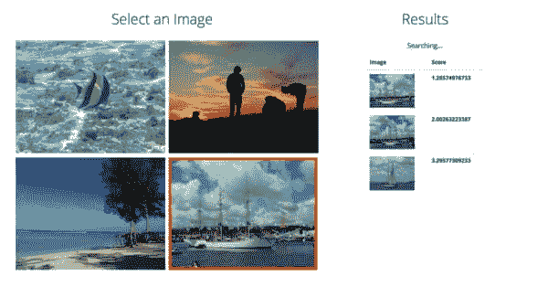
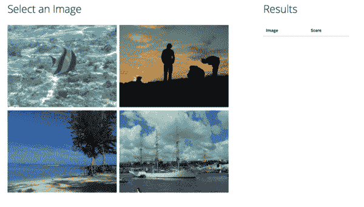
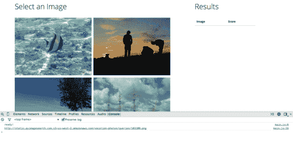
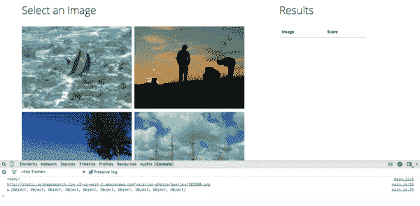
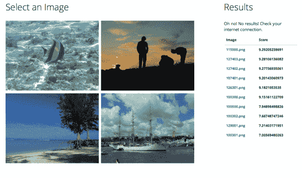
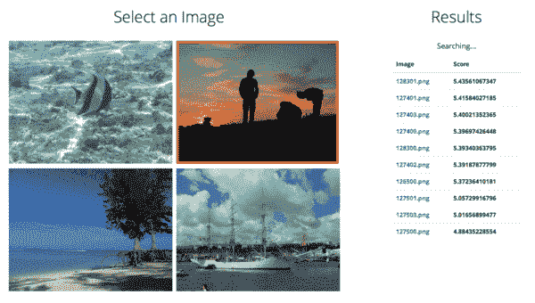

# 用 Flask 为我们的图像搜索引擎添加一个 web 界面

> 原文：<https://pyimagesearch.com/2014/12/08/adding-web-interface-image-search-engine-flask/>

***这是来自[真实 Python](http://www.realpython.com) 的 Michael Herman 的客座博文——通过实用有趣的实例来学习 Python 编程和 web 开发！***

在本教程中，我们将从[之前的教程](https://pyimagesearch.com/2014/12/01/complete-guide-building-image-search-engine-python-opencv/)中获取命令行图像搜索引擎，并使用 Python 和 Flask 将其转化为成熟的 web 应用程序。更具体地说，我们将创建一个[单页面应用程序](http://en.wikipedia.org/wiki/Single-page_application) (SPA)，它通过 AJAX(在前端)从内部类似 REST 的 API 通过 Python/Flask(在后端)消费数据。

最终产品将如下所示:

[](https://pyimagesearch.com/wp-content/uploads/2014/12/7_sixth-iteration.jpg)

***新来的烧瓶？*** 从[官方快速入门指南](http://flask.pocoo.org/docs/0.10/quickstart/)或者[第二期真正的 Python 课程](https://realpython.com/courses/#course-2-web-development-with-python)中的“Flask: QuickStart”章节开始。

# 设置

你可以在有或没有 [Docker](https://www.docker.com/) 的情况下设置你的开发。

**与 Docker:**

如果你没有安装 Docker，按照官方 Docker 文档安装 Docker 和 boot2docker。然后启动并运行 boot2docker，运行`docker version`来测试 docker 安装。

创建一个目录来存放你的项目“flask-image-search”。

从[库](https://github.com/realpython/flask-image-search)中抓取 *_setup.zip* ，解压缩文件，并将它们添加到您的项目目录中。

现在构建 Docker 映像:

```py
$ docker build --rm -t opencv-docker .

```

构建完成后，运行 Docker 容器:

```py
$ docker run -p 80:5000 opencv-docker

```

打开您的 web 浏览器，导航到与 DOCKER_HOST 变量相关联的 IP 地址——应该是[http://192 . 168 . 59 . 103/](http://192.168.59.103/)；如果没有，运行`boot2docker ip`获得正确的地址——您应该看到文本“欢迎！”在您的浏览器中。

**不带 Docker:**

创建一个目录来存放你的项目“flask-image-search”。

从[库](https://github.com/realpython/flask-image-search)中抓取 *_setup.zip* ，解压缩文件，并将它们添加到您的项目目录中。创建并激活一个 virtualenv，然后通过 Pip 安装需求:

```py
$ pip install flask numpy scipy matplotlib scikit-image gunicorn
$ pip freeze > requirements.txt

```

# 基础

既然你已经构建了搜索引擎，我们只需要将*相关的*代码转移到 Flask。本质上，我们只是将图像搜索引擎包装在 Flask 中。

现在，您的项目目录应该如下所示:

```py
├── Dockerfile
├── app
│   ├── app.py
│   ├── index.csv
│   ├── pyimagesearch
│   │   ├── __init__.py
│   │   ├── colordescriptor.py
│   │   └── searcher.py
│   ├── static
│   │   ├── main.css
│   │   └── main.js
│   └── templates
│       ├── _base.html
│       └── index.html
├── config
│   ├── app.ini
│   ├── nginx.conf
│   └── supervisor.conf
└── requirements.txt

```

*Dockerfile* 和带有“config”目录的文件专门用于让我们的应用程序在 Docker 容器中运行(当然，如果你使用 Docker 的话)。不要太担心这些是如何工作的，但是如果你好奇，你可以参考 *Dockerfile* 中的行内注释。在“app”目录中， *index.csv* 文件以及“pyimagesearch”目录中的文件是图像搜索引擎所特有的。更多信息请参考[之前的教程](https://pyimagesearch.com/2014/12/01/complete-guide-building-image-search-engine-python-opencv/)。

现在，让我们仔细看看“app”目录中特定于 Flask 的文件和文件夹:

1.  *app.py* 文件是我们的 Flask 应用程序。一定要参考文件中的行内注释，以充分理解发生了什么。需要注意的是，在大多数情况下，你应该把你的应用分成更小的部分。然而，由于这个应用程序(以及我们完成的应用程序)很小，我们可以将所有功能存储在一个文件中。
2.  “静态”目录存放静态文件，如样式表、JavaScript 文件、图像等。
3.  “模板”目录存放了我们应用程序的模板。看看 *_base.html* 和【base.html】模板*模板*之间的关系。这叫做模板继承。想了解更多，请看[的这篇博文](https://realpython.com/blog/python/primer-on-jinja-templating/#inheritance)。

这就是我们目前的项目结构。就这样，让我们开始建设吧！

# 工作流程

简而言之，我们将关注两个路由/端点:

1.  主路由('/'):该路由处理主用户交互。用户可以选择一个图像(向搜索路径发送 POST 请求),然后显示相似的图像。
2.  搜索路由('/search '):此路由处理 POST 请求。它将采取一个图像(名称)，然后使用大多数搜索引擎代码返回类似的图像(网址)。

# 后端

## 干线

后端代码已经设置好了。没错——我们只需要在用户请求`/`时呈现一个模板。然而，我们确实需要更新模板，*index.html*，以及添加 HTML、CSS 和 Javascript/jQuery 代码。这将在**前端**部分处理。

## 搜索路线

同样，这条路线旨在:

*   处理发布请求，
*   拍摄一张图片并搜索相似的图片(使用已经完成的搜索引擎代码)，以及
*   以 JSON 格式返回相似的图片(以 URL 的形式)

将下面的代码添加到 *app.py* 中，就在主路由的下面。

```py
# search route
@app.route('/search', methods=['POST'])
def search():

    if request.method == "POST":

        RESULTS_ARRAY = []

        # get url
        image_url = request.form.get('img')

        try:

            # initialize the image descriptor
            cd = ColorDescriptor((8, 12, 3))

            # load the query image and describe it
            from skimage import io
            import cv2
            query = io.imread(image_url)
            query = (query * 255).astype("uint8")
            (r, g, b) = cv2.split(query)
            query = cv2.merge([b, g, r])
            features = cd.describe(query)

            # perform the search
            searcher = Searcher(INDEX)
            results = searcher.search(features)

            # loop over the results, displaying the score and image name
            for (score, resultID) in results:
                RESULTS_ARRAY.append(
                    {"image": str(resultID), "score": str(score)})

            # return success
            return jsonify(results=(RESULTS_ARRAY[:3]))

        except:

            # return error
            jsonify({"sorry": "Sorry, no results! Please try again."}), 500

```

发生了什么事？

1.  我们定义端点`/search'`，以及允许的 HTTP 请求方法`methods=['POST']`。快速跳回`/`主端点。请注意，我们没有指定允许的请求方法。为什么？这是因为默认情况下，所有端点都响应 GET 请求。
2.  我们抓取图像，然后使用 try/except 搜索相似的图像。
3.  将上面代码中的循环与之前教程中的 *search.py* 中的循环进行比较。这里，我们不是输出结果，而是简单地获取它们并将其添加到一个列表中。然后，这个列表被传递到一个名为`jsonify`的特殊 Flask 函数中，该函数返回一个 JSON 响应。

请务必更新导入-

```py
import os

from flask import Flask, render_template, request, jsonify

from pyimagesearch.colordescriptor import ColorDescriptor
from pyimagesearch.searcher import Searcher

```

-并在创建 Flask 实例的下面添加以下变量，该变量指定图像搜索中使用的 *index.csv* 文件的路径-

```py
INDEX = os.path.join(os.path.dirname(__file__), 'index.csv')

```

我们将在下一节中查看它的确切输出。

# 前端

因此，后端代码完成后，我们只需要更新结构和感觉(通过 HTML 和 CSS)以及添加用户交互(通过 JavaScript/jQuery)。为此，我们将使用 [Bootstrap](http://getbootstrap.com/) 前端框架。

打开 *_base.html* 模板。

我们已经包含了 Bootstrap 样式表(通过一个 [CDN](http://en.wikipedia.org/wiki/Content_delivery_network) )以及 jQuery 和 Bootstrap JavaScript 库以及一个定制样式表和 JavaScript 文件(两者都位于“static”文件夹中):

```py
<!-- stylesheets -->
<link href="//maxcdn.bootstrapcdn.com/bootswatch/3.2.0/yeti/bootstrap.min.css" rel="stylesheet" media="screen">
<link href="{{ url_for('static', filename='main.css') }}" rel="stylesheet">

... snip ...

<!-- Scripts -->
<script src="//code.jquery.com/jquery-2.1.1.min.js" type="text/javascript"></script>
<script src="//maxcdn.bootstrapcdn.com/bootstrap/3.2.0/js/bootstrap.min.js" type="text/javascript"></script>
<script src="{{ url_for('static', filename='main.js') }}" type="text/javascript"></script>

```

## 模板

首先，让我们更新一下*index.html*模板:

```py




<div class="row">

  <div class="col-md-7">
    <h2>Select an Image</h2>
    <br>
    <div class="row">
      <div class="col-md-6">
        <p></p>
        <p></p>
      </div>
      <div class="col-md-6">
        <p></p>
        <p></p>
      </div>
    </div>
  </div>

  <div class="col-md-3 col-md-offset-1">
    <h2>Results</h2>
    <br>
    <table class="table" id="results-table">
      <thead>b
        <tr>
          <th>Image</th>
          <th>Score</th>
        </tr>
      </thead>
      <tbody id="results">
      </tbody>
    </table>
  </div>

</div>

<br>



```

现在我们来测试一下…

**与 Docker:**

重建 Docker 映像，然后运行新容器:

```py
$ docker build --rm -t opencv-docker .
$ docker run -p 80:5000 opencv-docker

```

**不带 Docker:**

```py
$ python app/app.py

```

在浏览器中导航至您的应用，您应该会看到:

[](https://pyimagesearch.com/wp-content/uploads/2014/11/1_first-iteration.png)

正如您所看到的，我们在左侧添加了四个图像，在右侧添加了一个结果表。注意上面 HTML 代码中的 [CSS 选择器](http://www.w3schools.com/css/css_selectors.asp) ( `id` s 和`class` es)。`row`和`col-md-x`类与[引导网格系统](http://getbootstrap.com/css/#grid)相关联。剩下的`id`和`class` es 用于添加 CSS 样式和/或通过 JavaScript/jQuery 进行交互。

## JavaScript/jQuery

***注:*** 如果你不熟悉 JavaScript 和 jQuery 基础知识，请查阅 [Madlibs 教程](https://realpython.com/resources/#front-end)。

让我们将用户交互分解为每一个单独的交互。

### 图像点击

互动从图像点击开始。换句话说，最终用户单击页面左侧四个图像中的一个，最终目标是找到相似的图像。

更新 *main.js* 文件:

```py
// ----- custom js ----- //

$(function() {

  // sanity check
  console.log( "ready!" );

  // image click
  $(".img").click(function() {

    // add active class to clicked picture
    $(this).addClass("active")

    // grab image url
    var image = $(this).attr("src")
    console.log(image)

  });

});

```

运行您的应用程序。要么:

*   重建 Docker 映像，并运行新容器。
*   运行`python app/app.py`

然后在浏览器中导航至您的应用程序。打开您的 JavaScript 控制台，然后单击其中一个图像。您应该看到:

[](https://pyimagesearch.com/wp-content/uploads/2014/11/2_second-iteration.png)所以，jQuery 代码通过抓取被点击的特定图片的 URL，并添加一个 CSS 类(这个类我们还需要添加到 CSS 文件中)来处理点击事件。jQuery 代码和 HTML 之间的链接分别是`img`类—`$(".img").click(function()`和`class="img"`。这一点应该是清楚的。

### AJAX 请求

有了图像 URL，我们现在可以通过一个 [AJAX](http://en.wikipedia.org/wiki/Ajax_(programming)) 请求将它发送到后端，这是一种客户端技术，用于发出不会导致整个页面刷新的异步请求。大多数 spa 在请求数据时使用某种异步技术来防止页面刷新，因为这可以增强整体用户体验。

更新 *main.js* 这样:

```py
// ----- custom js ----- //

$(function() {

  // sanity check
  console.log( "ready!" );

  // image click
  $(".img").click(function() {

    // add active class to clicked picture
    $(this).addClass("active")

    // grab image url
    var image = $(this).attr("src")
    console.log(image)

    // ajax request
    $.ajax({
      type: "POST",
      url: "/search",
      data : { img : image },
      // handle success
      success: function(result) {
        console.log(result.results);
      },
      // handle error
      error: function(error) {
        console.log(error);
      }
    });

  });

});

```

你知道该怎么做:运行应用程序，然后刷新浏览器。再次点按图像，几秒钟后您应该会看到:

[](https://pyimagesearch.com/wp-content/uploads/2014/11/3_third-iteration.png)***注意:*** 这个请求相当慢，因为我们搜索的是 CSV 而不是**实际的**数据库，即 SQLite、Postgres、MySQL。将数据转换成数据库是一件相当简单的工作。自己试试这个。如果您有问题和/或希望我们查看的解决方案，请随时在下面发表评论。干杯！

这一次，在用户点击之后，我们向`/search`端点发送一个 POST 请求，其中包括图像 URL。后端执行它的魔法(抓取图像，运行搜索代码)，然后以 JSON 格式返回结果。AJAX 请求有两个处理程序——一个用于成功，一个用于失败。跳回到后端，`/search`路由或者返回 200 响应(成功)或者 500 响应(失败)以及数据或错误消息:

```py
    # return success
    return jsonify(results=(RESULTS_ARRAY[::-1]))

except:

    # return error
    jsonify({"sorry": "Sorry, no results! Please try again."}), 500

```

回到前端…由于结果是成功的，您可以在 JavaScript 控制台中看到数据:

```py
[Object, Object, Object, Object, Object, Object, Object, Object, Object, Object]

```

这只是一个 JSON 对象的数组。继续展开数组并打开单个对象:

[](https://pyimagesearch.com/wp-content/uploads/2014/11/4_json-data.png)所以，每个对象都有一个图像和一个表示查询图像和结果图像之间“相似度”的分数。分数越小，查询与结果越“相似”。相似度为零表示“完全相似”。这就是我们想要呈现给最终用户的确切数据。

### 更新 DOM

我们在最后冲刺阶段！让我们更新成功和错误处理程序，以便一旦其中一个从后端接收到数据，我们就将该数据追加到 DOM:

```py
<a href="'+url+data[i][" data-mce-href="'+url+data[i][">'+data[i]["image"]+'</a>'+data[i]['score']+'')   }; }, // handle error error: function(error) {   console.log(error);   // show error   $("#error").show(); }" >// handle success
success: function(result) {
  console.log(result.results);
  var data = result.results
  // loop through results, append to dom
  for (i = 0; i < data.length; i++) {
    $("#results").append('<tr><th><a href="'+url+data[i]["image"]+'">'+data[i]["image"]+'</a></th><th>'+data[i]['score']+'</th></tr>')
  };
},
// handle error
error: function(error) {
  console.log(error);
  // show error
  $("#error").show();
}

```

在成功处理程序中，我们遍历结果，添加一些 HTML(用于表格)，然后将数据附加到 id`results`(它已经是 HTML 模板的一部分)。错误处理程序实际上并没有用返回的*确切的*错误来更新 DOM。相反，我们将确切的错误记录到控制台，供我们查看，然后“取消隐藏”一个 id 为`error`的 HTML 元素(同样，我们需要将其添加到 HTML 模板中)。

我们还需要在文件 JavaScript 文件的顶部添加一些全局变量:

```py
// ----- custom js ----- //

// global
var url = 'http://static.pyimagesearch.com.s3-us-west-2.amazonaws.com/vacation-photos/dataset/';
var data = [];

... snip ...

```

浏览文件，看看能否找到这些变量的用法。

最后，在我们测试之前，让我们更新一下*index.html*模板…

添加:

```py
<p id="error">Oh no! No results! Check your internet connection.</p>

```

正上方:

```py
<table class="table" id="results-table">

```

好吧。想想我们测试的时候会发生什么。如果一切顺利，您应该会看到:

[](https://pyimagesearch.com/wp-content/uploads/2014/11/5_fourth-iteration.png)

嘣！您甚至可以点击图像 URL 来查看*实际的*结果(例如，相似的图像)。请注意您是如何看到错误的。我们还有一些清理工作要做。

### DOM 清理

主要功能完成后，我们只需要做一些日常工作。更新 *main.js* 这样:

```py
// ----- custom js ----- //

// hide initial
$("#searching").hide();
$("#results-table").hide();
$("#error").hide();

// global
var url = 'http://static.pyimagesearch.com.s3-us-west-2.amazonaws.com/vacation-photos/dataset/';
var data = [];

$(function() {

  // sanity check
  console.log( "ready!" );

  // image click
  $(".img").click(function() {

    // empty/hide results
    $("#results").empty();
    $("#results-table").hide();
    $("#error").hide();

    // add active class to clicked picture
    $(this).addClass("active")

    // grab image url
    var image = $(this).attr("src")
    console.log(image)

    // show searching text
    $("#searching").show();
    console.log("searching...")

    // ajax request
    $.ajax({
      type: "POST",
      url: "/search",
      data : { img : image },
      // handle success
      success: function(result) {
        console.log(result.results);
        var data = result.results
        // loop through results, append to dom
        for (i = 0; i < data.length; i++) {
          $("#results").append('<tr><th><a href="'+url+data[i]["image"]+'">'+data[i]["image"]+'</a></th><th>'+data[i]['score']+'</th></tr>')
        };
      },
      // handle error
      error: function(error) {
        console.log(error);
        // append to dom
        $("#error").append()
      }
    });

  });

});

```

看一看添加的代码…

```py
// hide initial
$("#searching").hide();
$("#results-table").hide();
$("#error").hide();

```

和

```py
// empty/hide results
$("#results").empty();
$("#results-table").hide();
$("#error").hide();

```

和

```py
// remove active class
$(".img").removeClass("active")

```

和

```py
// show searching text
$("#searching").show();
console.log("searching...")

```

和

```py
// show table
$("#results-table").show();

```

我们只是根据用户交互以及 AJAX 请求的结果是成功还是失败来隐藏和显示不同的 HTML 元素。如果你真的很注意，你可能会看到有一个你以前没有见过的新的 CSS 选择器—`#searching`。这是什么意思？首先，我们需要更新模板…

添加:

```py
<p id="searching">Searching...</p>

```

正上方:

```py
<p id="error">Oh no! No results! Check your internet connection.</p>

```

现在，我们来测试一下！有什么不同？当最终用户点击一个图像时，文本`Searching...`出现，当结果被添加时，文本消失。然后，如果用户单击另一个图像，以前的结果会消失，`Searching...`文本会重新出现，最后新的结果会添加到 DOM 中。

深呼吸。或者两个。我们现在已经完成了 JavaScript 部分。在继续之前，最好先回顾一下。

## 半铸钢ˌ钢性铸铁(Cast Semi-Steel)

在风格方面，我们可以做很多事情，但让我们保持简单。将以下代码添加到 *main.css* 中:

```py
.center-container {
  text-align: center;
  padding-top: 20px;
  padding-bottom: 20px;
}

.active {
  border: 5px solid red;
}

```

运行应用程序，它现在应该看起来像这样:

[](https://pyimagesearch.com/wp-content/uploads/2014/11/6_fifth-iteration.png)最大的变化是现在当用户点击一个图像时，它的周围会出现一个红色的边框，只是提醒最终用户她/他点击了哪个图像。请尝试单击另一个图像。红色边框现在应该出现在图像周围。返回 JavaScript 文件，查看代码，了解这是如何工作的。

## 重构

我们可以在这里停下来，但是让我们稍微重构一下代码，以显示前三个结果的缩略图。毕竟，这是一个图片搜索引擎——我们应该展示一些真实的图片！

从后端开始，更新`search()`视图函数，以便它只返回前三个结果:

```py
return jsonify(results=(RESULTS_ARRAY[::-1][:3]))

```

接下来更新成功处理程序 *main.js* 中的 for 循环:

```py
// loop through results, append to dom
for (i = 0; i < data.length; i++) {
  $("#results").append('<tr><th><a href="'+url+data[i]["image"]+'"></a></th><th>'+data[i]['score']+'</th></tr>')
};

```

最后，添加以下 CSS 样式:

```py
.result-img {
  max-width: 100px;
  max-height: 100px;
}

```

您现在应该已经:

[](https://pyimagesearch.com/wp-content/uploads/2014/12/7_sixth-iteration.jpg)

嘣！

# 结论和下一步措施

概括地说，我们从第一篇教程中提取了搜索引擎代码，并将其封装在 Flask 中，以创建一个全功能的 web 应用程序。如果您想继续从事 Flask 和 web 开发，请尝试:

*   用关系数据库替换静态 CSV 文件；
*   通过允许用户上传图像来更新整体用户体验，而不是限制用户仅通过四个图像进行搜索；
*   添加单元和集成测试；
*   部署到赫罗库。

请务必查看[真正的 Python](http://www.realpython.com) 课程，学习如何做所有这些以及更多。

干杯！