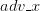
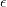
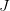

# 使用 FGSM(快速梯度符号法)的对抗性攻击

> 原文：<https://pyimagesearch.com/2021/03/01/adversarial-attacks-with-fgsm-fast-gradient-sign-method/>

在本教程中，您将学习如何使用快速梯度符号法(FGSM)进行对抗性攻击。我们将使用 Keras 和 TensorFlow 实现 FGSM。


之前，我们学习了如何实施两种形式的对抗性图像攻击:

1.  [*无针对性*对抗性攻击](https://pyimagesearch.com/2020/10/19/adversarial-images-and-attacks-with-keras-and-tensorflow/)，我们*无法*控制对抗性图像的输出标签。
2.  [*有针对性的*对抗性攻击](https://pyimagesearch.com/2020/10/26/targeted-adversarial-attacks-with-keras-and-tensorflow/)，这里我们*可以*控制图像的输出标签。

今天我们来看看另一种无针对性的对抗性图像生成方法，叫做快速梯度符号法(FGSM)。正如您将看到的，这个方法非常容易实现。

然后，在接下来的两周内，您将学习如何通过更新您的训练程序以利用 FGSM 来防御敌对攻击，从而提高您的模型的准确性和健壮性。

**学习如何用快速梯度符号法进行对抗性攻击，*继续阅读。***

## **利用 FGSM(快速梯度符号法)的对抗性攻击**

在本教程的第一部分，你将了解快速梯度符号方法及其在敌对图像生成中的应用。

从那里，我们将配置我们的开发环境，并审查我们的项目目录结构。

然后，我们将实现三个 Python 脚本:

1.  第一个将包含`SimpleCNN`，我们将在 MNIST 数据集上训练的基本 CNN 的实现。
2.  我们的第二个 Python 脚本将包含我们用于对抗性图像生成的 FGSM 实现。
3.  最后，我们的第三个脚本将训练我们的 CNN 了解 MNIST，然后演示如何使用 FGSM 来欺骗我们训练过的 CNN 做出不正确的预测。

如果你还没有，我推荐你阅读我之前的两篇关于对抗性图像生成的教程:

1.  [*用 Keras 和 TensorFlow* 攻击对抗性图像和 ](https://pyimagesearch.com/2020/10/19/adversarial-images-and-attacks-with-keras-and-tensorflow/)
2.  [*用 Keras 和 TensorFlow 进行针对性的对抗性攻击*](https://pyimagesearch.com/2020/10/26/targeted-adversarial-attacks-with-keras-and-tensorflow/)

**这两个指南被认为是*必读书目*，因为我假设你已经知道了对抗性图像生成的基础知识。**如果你还没有看过那些教程，我建议你现在就停下来，先看看。

### **快速梯度符号法**

快速梯度符号法是一种简单而有效的生成对抗图像的方法。Goodfellow 等人在他们的论文 [*中首次介绍了解释和利用对立范例*](https://arxiv.org/abs/1412.6572) ，FGSM 的工作原理是:

1.  拍摄输入图像
2.  使用经过训练的 CNN 对图像进行预测
3.  基于*真*类标签计算预测的损失
4.  计算损失相对于输入图像的梯度
5.  计算梯度的符号
6.  使用带符号的梯度来构造输出对抗图像

这个过程听起来可能很复杂，但是正如您将看到的，我们将能够用不到 30 行代码(包括注释)实现整个 FGSM 功能。

### **快速梯度符号法是如何工作的？**

FGSM 利用神经网络的梯度来构建对抗图像，类似于我们在[无目标对抗攻击](https://pyimagesearch.com/2020/10/19/adversarial-images-and-attacks-with-keras-and-tensorflow/)和[有目标对抗攻击](https://pyimagesearch.com/2020/10/26/targeted-adversarial-attacks-with-keras-and-tensorflow/)教程中所做的。

本质上，FGSM 计算损失函数(例如，均方误差或分类交叉熵)相对于输入图像的梯度，然后使用梯度的符号来创建一个新图像*(即，对手图像)*最大化*损失。*

 ***结果是输出图像，根据人眼，看起来*与原始图像相同*，但是使神经网络做出*不正确的预测！***

引用 FGSM 上的 [TensorFlow 文档，我们可以使用以下等式表达快速梯度符号法:](https://www.tensorflow.org/tutorials/generative/adversarial_fgsm)

其中:

*   *:* 我方输出对抗性图像
*   *:* 原始输入图像
*   :输入图像的地面实况标签
*   :小值我们将带符号的梯度乘以，以确保扰动*足够小*以至于人眼无法检测到它们，但是*足够大*以至于它们愚弄了神经网络
*   :我们的神经网络模型
*   :损失功能

如果你很难理解围绕 FGSM 的数学，不要担心，一旦我们在本指南后面开始看一些代码，理解起来会容易得多。

### **配置您的开发环境**

这篇关于 FGSM 的对立图像的教程使用了 Keras 和 TensorFlow。如果你打算遵循这个教程，我建议你花时间配置你的深度学习开发环境。

您可以利用这两个指南中的任何一个在您的系统上安装 TensorFlow 和 Keras:

*   [*如何在 Ubuntu 上安装 tensor flow 2.0*](https://pyimagesearch.com/2019/12/09/how-to-install-tensorflow-2-0-on-ubuntu/)
*   [*如何在 macOS 上安装 tensor flow 2.0*](https://pyimagesearch.com/2019/12/09/how-to-install-tensorflow-2-0-on-macos/)

这两个教程都有助于在一个方便的 Python 虚拟环境中为您的系统配置这篇博客文章所需的所有软件。

### **在配置开发环境时遇到了问题？**

说了这么多，你是:

*   时间紧迫？
*   了解你雇主的行政锁定系统？
*   想要跳过与命令行、包管理器和虚拟环境斗争的麻烦吗？
*   准备好在您的 Windows、macOS 或 Linux 系统上运行代码*了吗*？

那今天就加入 [PyImageSearch 加](https://pyimagesearch.com/pyimagesearch-plus/)吧！

**获得本教程的 Jupyter 笔记本和其他 PyImageSearch 指南，这些指南已经过*预配置*，可以在您的网络浏览器中运行在 Google Colab 的生态系统上！**无需安装。

最棒的是，这些 Jupyter 笔记本可以在 Windows、macOS 和 Linux 上运行！

### **项目结构**

让我们从回顾我们的项目目录结构开始。请务必访问本教程的 ***【下载】*** 部分以检索源代码:

```py
$ tree . --dirsfirst
.
├── pyimagesearch
│   ├── __init__.py
│   ├── fgsm.py
│   └── simplecnn.py
└── fgsm_adversarial.py

1 directory, 4 files
```

在`pyimagesearch`模块中，我们有两个将要实现的 Python 脚本:

1.  `simplecnn.py`:一个基本的 CNN 架构
2.  `fgsm.py`:我们实施的快速梯度标志法对抗性攻击

`fgsm_adversarial.py`文件是我们的驱动脚本。它将:

1.  实例化`SimpleCNN`的一个实例
2.  在 MNIST 数据集上训练它
3.  演示如何将 FGSM 对抗性攻击应用于训练好的模型

### **为对抗训练创建一个简单的 CNN 架构**

在我们能够执行对抗性攻击之前，我们首先需要实现我们的 CNN 架构。

一旦我们的架构实现，我们将在 MNIST 数据集上训练它，评估它，使用 FGSM 生成一组对立图像，并重新评估它，从而证明对立图像对准确性的影响。

在下周和下一周的教程中，你将会学到一些训练技巧，你可以用这些技巧来抵御这些对抗性攻击。

但是这一切都是从实现 CNN 架构开始的——打开我们项目目录结构的`pyimagesearch`模块中的`simplecnn.py`,让我们开始工作:

```py
# import the necessary packages
from tensorflow.keras.models import Sequential
from tensorflow.keras.layers import BatchNormalization
from tensorflow.keras.layers import Conv2D
from tensorflow.keras.layers import Activation
from tensorflow.keras.layers import Flatten
from tensorflow.keras.layers import Dropout
from tensorflow.keras.layers import Dense
```

我们从第 2-8 行的**开始，**导入我们需要的 Keras/TensorFlow 类。当训练 CNN 时，这些都是相当标准的输入。

如果你是 Keras 和 TensorFlow 的新手，我建议你阅读我的[入门 Keras 教程](https://pyimagesearch.com/2018/09/10/keras-tutorial-how-to-get-started-with-keras-deep-learning-and-python/)以及我的书 [*用 Python 进行计算机视觉的深度学习*](https://pyimagesearch.com/deep-learning-computer-vision-python-book/) ，其中详细介绍了深度学习。

考虑到我们的导入，我们可以定义我们的 CNN 架构:

```py
class SimpleCNN:
	@staticmethod
	def build(width, height, depth, classes):
		# initialize the model along with the input shape
		model = Sequential()
		inputShape = (height, width, depth)
		chanDim = -1

		# first CONV => RELU => BN layer set
		model.add(Conv2D(32, (3, 3), strides=(2, 2), padding="same",
			input_shape=inputShape))
		model.add(Activation("relu"))
		model.add(BatchNormalization(axis=chanDim))

		# second CONV => RELU => BN layer set
		model.add(Conv2D(64, (3, 3), strides=(2, 2), padding="same"))
		model.add(Activation("relu"))
		model.add(BatchNormalization(axis=chanDim))

		# first (and only) set of FC => RELU layers
		model.add(Flatten())
		model.add(Dense(128))
		model.add(Activation("relu"))
		model.add(BatchNormalization())
		model.add(Dropout(0.5))

		# softmax classifier
		model.add(Dense(classes))
		model.add(Activation("softmax"))

		# return the constructed network architecture
		return model
```

我们的`SimpleCNN`类的`build`方法接受四个参数:

1.  `width`:数据集中输入图像的宽度
2.  `height`:数据集中输入图像的高度
3.  `channels`:图像中的通道数
4.  `classes`:数据集中唯一类的总数

在此基础上，我们定义了一个由以下部分组成的`Sequential`网络:

1.  **第一套`CONV => RELU => BN`图层。**`CONV`层学习总共 32 个 *3×3* 滤波器，用 *2×2* 步进卷积减少体积大小。
2.  **第二套`CONV => RELU => BN`图层。**同上，但这次`CONV`层学习 64 个滤镜。
3.  一组密集/完全连接的层。其输出是我们的 softmax 分类器，用于返回每个类别标签的概率。

现在，我们的架构已经实现，我们可以继续快速梯度符号方法。

### **用 Keras 和 TensorFlow 实现快速梯度符号法**

我们将实现的对抗性攻击方法称为**快速梯度符号方法(FGSM)。**之所以称之为这种方法是因为:

1.  很快(名字里就有)
2.  我们通过计算损失的梯度、*计算梯度的符号*来构建图像对手，然后使用该符号来构建图像对手

让我们现在实现 FGSM。打开项目目录结构中的`fgsm.py`文件，插入以下代码:

```py
# import the necessary packages
from tensorflow.keras.losses import MSE
import tensorflow as tf

def generate_image_adversary(model, image, label, eps=2 / 255.0):
	# cast the image
	image = tf.cast(image, tf.float32)
```

**第 2 行和第 3 行**导入我们需要的 Python 包。我们将使用均方误差(`MSE`)损失函数来计算我们的对抗性攻击，但您也可以使用任何其他合适的损失函数来完成任务，包括分类交叉熵、二元交叉熵等。

**第 5 行**开始定义我们的 FGSM 攻击，`generate_image_adversary`。该函数接受四个参数:

1.  我们试图愚弄的人
2.  我们想要错误分类的输入`image`
3.  输入图像的地面实况类`label`
4.  对梯度更新进行加权的小`eps`值——这里应该使用一个小一点的值，使得梯度更新的*足够大到*导致输入图像被错误分类，但*不会大到*到人眼可以看出图像被操纵

让我们现在开始实施 FGSM 攻击:

```py
	# record our gradients
	with tf.GradientTape() as tape:
		# explicitly indicate that our image should be tacked for
		# gradient updates
		tape.watch(image)

		# use our model to make predictions on the input image and
		# then compute the loss
		pred = model(image)
		loss = MSE(label, pred)
```

**第 10 行**指示 TensorFlow 记录我们的梯度，而**第 13 行**明确告诉 TensorFlow 我们想要跟踪输入`image`上的梯度更新。

从那里，我们使用我们的`model`对图像进行预测，然后使用均方误差计算我们的损失(同样，你可以用另一个损失函数代替你的任务，但 MSE 是一个相当标准的选择)。

接下来，让我们实现 FGSM 攻击的“带符号梯度”部分:

```py
	# calculate the gradients of loss with respect to the image, then
	# compute the sign of the gradient
	gradient = tape.gradient(loss, image)
	signedGrad = tf.sign(gradient)

	# construct the image adversary
	adversary = (image + (signedGrad * eps)).numpy()

	# return the image adversary to the calling function
	return adversary
```

**第 22 行**计算相对于图像的损失梯度。

然后我们在**线 23** 上取渐变的符号(因此有了这个术语，*快速* ***渐变符号*** *方法*)。这行代码的输出是一个填充了三个值的向量——或者是`1`(正值)、`0`或者是`-1`(负值)。

利用这些信息， **Line 26** 通过以下方式创建我们的形象对手:

1.  取带符号的梯度并乘以一个小的ε因子。这里的目标是使我们的梯度更新大到足以对输入图像进行错误分类，但又不会大到人眼可以看出图像已经被篡改。
2.  然后，我们将这个小增量值添加到我们的图像中，这*稍微改变了图像中的像素亮度值。*

**这些像素更新后会被*****人眼察觉不到，但据我们 CNN 报道，图像会出现*****的巨大差异，从而导致误分类。****

 **### **创建我们的对抗性训练脚本**

随着 CNN 架构和 FGSM 的实现，我们可以继续创建我们的训练脚本。

在我们的目录结构中打开`fgsm_adversarial.py`脚本，我们可以开始工作了:

```py
# import the necessary packages
from pyimagesearch.simplecnn import SimpleCNN
from pyimagesearch.fgsm import generate_image_adversary
from tensorflow.keras.optimizers import Adam
from tensorflow.keras.utils import to_categorical
from tensorflow.keras.datasets import mnist
import numpy as np
import cv2
```

**第 2-8 行**导入我们需要的 Python 包。我们值得注意的导入包括`SimpleCNN`(我们在本指南前面实现的基本 CNN 架构)和`generate_image_adversary`(我们执行 FGSM 攻击的辅助函数)。

我们将在`mnist`数据集上训练我们的`SimpleCNN`架构。该模型将通过分类交叉熵损失和`Adam`优化器进行训练。

导入工作完成后，我们现在可以从磁盘加载 MNIST 数据集了:

```py
# load MNIST dataset and scale the pixel values to the range [0, 1]
print("[INFO] loading MNIST dataset...")
(trainX, trainY), (testX, testY) = mnist.load_data()
trainX = trainX / 255.0
testX = testX / 255.0

# add a channel dimension to the images
trainX = np.expand_dims(trainX, axis=-1)
testX = np.expand_dims(testX, axis=-1)

# one-hot encode our labels
trainY = to_categorical(trainY, 10)
testY = to_categorical(testY, 10)
```

**第 12 行**从磁盘加载预分割的 MNIST 数据集。我们通过以下方式预处理 MNIST 数据集:

1.  将像素强度从范围*【0，255】*缩放到*【0，1】*
2.  向图像添加批次维度
3.  一键编码标签

从那里，我们可以初始化我们的`SimpleCNN`模型:

```py
# initialize our optimizer and model
print("[INFO] compiling model...")
opt = Adam(lr=1e-3)
model = SimpleCNN.build(width=28, height=28, depth=1, classes=10)
model.compile(loss="categorical_crossentropy", optimizer=opt,
	metrics=["accuracy"])

# train the simple CNN on MNIST
print("[INFO] training network...")
model.fit(trainX, trainY,
	validation_data=(testX, testY),
	batch_size=64,
	epochs=10,
	verbose=1)

# make predictions on the testing set for the model trained on
# non-adversarial images
(loss, acc) = model.evaluate(x=testX, y=testY, verbose=0)
print("[INFO] loss: {:.4f}, acc: {:.4f}".format(loss, acc))
```

第 26-29 行初始化我们的 CNN。然后我们在**33-37 行训练它。**

评估发生在第**行的第 41 行和第 42 行的第**行，显示我们在测试集上计算的损失和准确度。我们展示这些信息是为了证明我们的 CNN 在对测试集进行预测方面做得很好

 *…直到产生敌对形象的时候。那时我们将会看到我们的准确性分崩离析。

说到这里，现在让我们使用 FGSM 生成一些敌对的图像:

```py
# loop over a sample of our testing images
for i in np.random.choice(np.arange(0, len(testX)), size=(10,)):
	# grab the current image and label
	image = testX[i]
	label = testY[i]

	# generate an image adversary for the current image and make
	# a prediction on the adversary
	adversary = generate_image_adversary(model,
		image.reshape(1, 28, 28, 1), label, eps=0.1)
	pred = model.predict(adversary)
```

在**的第 45 行，**我们遍历了一个随机选择的 10 个测试图像的样本。**第 47 和 48 行**抓取当前图像的`image`和地面实况`label`。

从那里，我们可以使用我们的`generate_image_adversary`函数来创建图像`adversary`，使用快速梯度符号方法(**行 52 和 53** )。

具体来说，注意`image.reshape`调用，其中我们确保图像的形状为`(1, 28, 28, 1`。这些值是:

*   `1`:批量维度；我们在这里使用的是一个*单个图像*，所以这个值被设置为 1。
*   `28`:图像的高度
*   `28`:图像的宽度
*   `1`:图像中的通道数(MNIST 图像是灰度的，因此只有一个通道)

随着我们的图像`adversary`生成，我们要求我们的`model`通过**线 54** 对其进行预测。

现在让我们为可视化准备`image`和`adversary`:

```py
	# scale both the original image and adversary to the range
	# [0, 255] and convert them to an unsigned 8-bit integers
	adversary = adversary.reshape((28, 28)) * 255
	adversary = np.clip(adversary, 0, 255).astype("uint8")
	image = image.reshape((28, 28)) * 255
	image = image.astype("uint8")

	# convert the image and adversarial image from grayscale to three
	# channel (so we can draw on them)
	image = np.dstack([image] * 3)
	adversary = np.dstack([adversary] * 3)

	# resize the images so we can better visualize them
	image = cv2.resize(image, (96, 96))
	adversary = cv2.resize(adversary, (96, 96))
```

请记住，我们的预处理步骤包括将我们的训练/测试图像从范围*【0，255】*缩放到*【0，1】*—**为了用 OpenCV 可视化我们的图像，我们现在需要*撤销*这些预处理操作。**

**第 58-61 行**缩放我们的`image`和`adversary`，确保它们都是无符号的 8 位整数数据类型。

我们希望用绿色(正确)或红色(不正确)来绘制原始图像和敌对图像的预测。为此，我们必须将我们的图像从灰度转换为灰度图像的 RGB 表示(**行 65 和 66** )。

MNIST 的图像只有 *28×28* ，很难看清，尤其是在高分辨率的屏幕上，所以我们在**的第 69 行和第 70 行将图像尺寸增加到 *96×96* 。**

我们的最后一个代码块完成了可视化过程:

```py
	# determine the predicted label for both the original image and
	# adversarial image
	imagePred = label.argmax()
	adversaryPred = pred[0].argmax()
	color = (0, 255, 0)

	# if the image prediction does not match the adversarial
	# prediction then update the color
	if imagePred != adversaryPred:
		color = (0, 0, 255)

	# draw the predictions on the respective output images
	cv2.putText(image, str(imagePred), (2, 25),
		cv2.FONT_HERSHEY_SIMPLEX, 0.95, (0, 255, 0), 2)
	cv2.putText(adversary, str(adversaryPred), (2, 25),
		cv2.FONT_HERSHEY_SIMPLEX, 0.95, color, 2)

	# stack the two images horizontally and then show the original
	# image and adversarial image
	output = np.hstack([image, adversary])
	cv2.imshow("FGSM Adversarial Images", output)
	cv2.waitKey(0)
```

**第 74 和 75 行**抓取 MNIST 数字预测。

如果*`imagePred`和`adversaryPred`相等，我们将标签的`color`初始化为“绿色”(**第 76 行**)。如果我们的模型能够正确标记敌对的图像，这将会发生。否则，我们将把预测颜色更新为红色(**第 80 行和第 81 行**)。*

 *然后我们在它们各自的图像上画出`imagePred`和`adversaryPred`(**第 84-87 行**)。

最后一步是将彼此相邻的`image`和`adversary`可视化，这样我们就可以看到我们的对抗性攻击是否成功。

### **FGSM 培训结果**

我们现在可以看到快速梯度符号方法的实际应用了！

首先访问本教程的 ***【下载】*** 部分来检索源代码。从那里，打开一个终端并执行`fgsm_adversarial.py`脚本:

```py
$ python fgsm_adversarial.py
[INFO] loading MNIST dataset...
[INFO] compiling model...
[INFO] training network...
Epoch 1/10
938/938 [==============================] - 12s 13ms/step - loss: 0.1945 - accuracy: 0.9407 - val_loss: 0.0574 - val_accuracy: 0.9810
Epoch 2/10
938/938 [==============================] - 12s 13ms/step - loss: 0.0782 - accuracy: 0.9761 - val_loss: 0.0584 - val_accuracy: 0.9814
Epoch 3/10
938/938 [==============================] - 13s 13ms/step - loss: 0.0594 - accuracy: 0.9817 - val_loss: 0.0624 - val_accuracy: 0.9808
Epoch 4/10
938/938 [==============================] - 13s 14ms/step - loss: 0.0479 - accuracy: 0.9852 - val_loss: 0.0411 - val_accuracy: 0.9867
Epoch 5/10
938/938 [==============================] - 12s 13ms/step - loss: 0.0403 - accuracy: 0.9870 - val_loss: 0.0357 - val_accuracy: 0.9875
Epoch 6/10
938/938 [==============================] - 12s 13ms/step - loss: 0.0365 - accuracy: 0.9884 - val_loss: 0.0405 - val_accuracy: 0.9863
Epoch 7/10
938/938 [==============================] - 12s 13ms/step - loss: 0.0310 - accuracy: 0.9898 - val_loss: 0.0341 - val_accuracy: 0.9889
Epoch 8/10
938/938 [==============================] - 12s 13ms/step - loss: 0.0289 - accuracy: 0.9905 - val_loss: 0.0388 - val_accuracy: 0.9873
Epoch 9/10
938/938 [==============================] - 12s 13ms/step - loss: 0.0217 - accuracy: 0.9928 - val_loss: 0.0652 - val_accuracy: 0.9811
Epoch 10/10
938/938 [==============================] - 11s 12ms/step - loss: 0.0216 - accuracy: 0.9925 - val_loss: 0.0396 - val_accuracy: 0.9877
[INFO] loss: 0.0396, acc: 0.9877
```

正如你所看到的，我们的脚本在我们的训练集上获得了 **99.25%** 的准确性，在测试集上获得了 **98.77%** 的准确性，这意味着我们的模型在进行数字预测方面做得很好。

然而，让我们看看当我们使用 FGSM 生成敌对图像时会发生什么:

**图 4** 显示了十幅图像的蒙太奇，包括来自测试集*(左)*的*原始* MNIST 图像和*输出 FGSM 图像* *(右)*。

视觉上，对立的 FGSM 图像与原始数字图像相同；然而，我们的 CNN*完全被*愚弄了，对每张图片都做出了错误的预测。

### **有什么大不了的？**

用敌对的图像愚弄 CNN，让它在 MNIST 数据集上做出不正确的预测，看起来后果很轻。

但是，如果这种模型被训练成能够检测过马路的行人，并被部署到自动驾驶汽车上，会发生什么呢？将会有*巨大的*后果，因为现在人们的生命危在旦夕。

这就提出了一个问题:

> 如果愚弄 CNN 这么容易，我们能做些什么来抵御对抗性攻击呢？

在接下来的两篇博文中，我将向你展示如何通过更新我们的训练程序来加入对抗性图片，从而抵御对抗性攻击。

### **演职员表和参考资料**

FGSM 的实现受到了塞巴斯蒂安·蒂勒关于对抗性攻击和防御的精彩文章的启发。非常感谢 Sebastian 分享他的知识。

## **总结**

在本教程中，您学习了如何实现快速梯度符号方法(FGSM)来生成对抗性图像。我们使用 Keras 和 TensorFlow 实现了 FGSM，但是您当然可以将代码翻译成您选择的深度学习库。

FGSM 通过以下方式开展工作:

1.  拍摄输入图像
2.  使用经过训练的 CNN 对图像进行预测
3.  基于真实类别标签计算预测的损失
4.  计算损失相对于输入图像的梯度
5.  计算梯度的符号
6.  使用带符号的梯度来构造输出对抗图像

这听起来可能很复杂，但正如我们所见，我们能够用不到 30 行代码实现 FGSM，这要感谢 TensorFlow 神奇的`GradientTape`函数，它使梯度计算变得轻而易举。

既然你已经学会了如何使用 FGSM***构建*** 对抗性图像，你将在下周的训练过程中学习如何通过将对抗性图像融入 ***来防御这些攻击*** 。

敬请关注。你不会想错过这个教程！

**要下载这篇文章的源代码(并在未来教程在 PyImageSearch 上发布时得到通知)，*只需在下面的表格中输入您的电子邮件地址！********