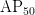
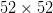
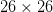
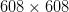

# Darknet-53 和多尺度预测的增量改进(YOLOv3)

> 原文：<https://pyimagesearch.com/2022/05/09/an-incremental-improvement-with-darknet-53-and-multi-scale-predictions-yolov3/>

* * *

* * *

## [**用 Darknet-53 和多尺度预测的增量改进(YOLOv3)**](#TOC)

在本教程中，您将了解 YOLOv2 中所做的改进；更具体地说，我们将看看设计的变化，大大提高了 YOLO 的性能，产生了一个新版本的 YOLO 称为 YOLOv3。YOLOv3 和它的前辈之间的显著区别在于称为 Darknet-53 的网络架构，我们将在本教程的下一节详细探讨这一点。我们还将演示如何使用 YOLOv3 模型在 80 类 MS COCO 数据集上进行预训练。

YOLOv3 是 2019 年实时物体检测方面最好的模型之一。

如果你按照之前关于 YOLO 的教程学习，那么理解这并不是一个挑战，因为没有太多的修改，而且大多数概念都是从 YOLOv1 和 YOLOv2 中获得的。

这一课是我们关于 YOLO 的 7 集系列的第 5 集:

1.  [*YOLO 家族简介*](https://pyimg.co/dgbvi)
2.  [*了解一个实时物体检测网络:你只看一次(YOLOv1)*](https://pyimg.co/3cpmz)
3.  [*更好、更快、更强的物体探测器(YOLOv2)*](https://pyimg.co/ehaox)
4.  [*使用 COCO 评估器*](https://pyimg.co/nwoka) 平均精度(mAP)
5.  [*用 Darknet-53 和多尺度预测的增量改进(YOLOv3)*](https://pyimg.co/8xfpg) **(今日教程)**
6.  [*【yolov 4】*](https://pyimg.co/c6kiu)
7.  [***在自定义数据集上训练 YOLOv5 物体检测器***](https://pyimg.co/fq0a3)

**要了解 YOLOv3 对象检测器的网络架构修改，并观看实时检测对象的演示，*请继续阅读。***

* * *

## [**增量改进与**](#TOC) [**Darknet-53 和多尺度预测**](#TOC)[**(yolov 3)**](#TOC)

在 YOLO 系列的第 5 部分中，我们将从介绍 YOLOv3 开始。然后，我们将简要回顾 YOLO 物体检测的一般概念。

从那里，我们将详细讨论 YOLOv3 的新 Darknet-53 架构，包括:

*   预训练阶段
*   检测阶段
*   跨三个尺度的预测
*   网络输出预测张量
*   特征抽出
*   锚箱的使用
*   损失函数的修正:用 sigmoid 进行分类预测

我们将讨论 YOLOv3 与 fast-RCNN、YOLOv2、SSD 和 RetinaNet 的定量基准比较。

最后，我们将通过安装 Darknet 框架并在 Tesla V100 GPU 上使用 MS COCO pretrained 模型对图像和视频运行推理，将 YOLOv3 投入实际使用。

* * *

### [**配置您的开发环境**](#TOC)

要遵循这个指南，您需要在您的系统上编译并安装 Darknet 框架。在本教程中，我们将使用 [AlexeyAB 的 Darknet 库](https://github.com/AlexeyAB/darknet)。

我们涵盖了在 Google Colab 上安装 Darknet 框架的逐步说明。但是，如果您现在想配置您的开发环境，可以考虑前往[配置 Darknet 框架并使用预训练的 YOLOv3 COCO 模型运行推理](#h3Config)部分。

* * *

### [**在配置开发环境时遇到了问题？**](#TOC)

说了这么多，你是:

*   时间紧迫？
*   了解你雇主的行政锁定系统？
*   想要跳过与命令行、包管理器和虚拟环境斗争的麻烦吗？
*   **准备好在您的 Windows、macOS 或 Linux 系统上运行代码*****？***

 *那今天就加入 [PyImageSearch 大学](https://www.pyimagesearch.com/pyimagesearch-university/)吧！

**获得本教程的 Jupyter 笔记本和其他 PyImageSearch 指南，这些指南是** ***预先配置的*** **，可以在您的网络浏览器中运行在 Google Colab 的生态系统上！**无需安装。

最棒的是，这些 Jupyter 笔记本可以在 Windows、macOS 和 Linux 上运行！

* * *

### [**约洛夫 3** 简介](#TOC)

继 YOLOv2 论文之后，2018 年，约瑟夫·雷德蒙(华盛顿大学研究生)和阿里·法尔哈迪(华盛顿大学副教授)发表了关于 arXiv 的 [YOLOv3:增量改进](https://arxiv.org/pdf/1804.02767.pdf)论文。作者对网络体系结构进行了许多设计上的修改，采用了以前 YOLO 版本中的大多数其他技术。

YOLOv3 论文介绍了一种新的网络架构，称为 Darknet-53，与 YOLOv2 中的 Darknet-19 架构相对。Darknet-53 是一个比以前更广泛的网络，但更准确和更快。它以不同的图像分辨率进行训练，如 YOLOv2 所示；在

resolution, YOLOv3 achieves 28.2 mAP runs at 45 FPS and is as accurate as Single-Shot Detector (SSD321) but 3x faster (**Figure 2**). The authors performed the quantitative benchmarks on the Titan X GPU.

与之前不同的是，在 YOLOv3 中，作者在不同的借据上比较地图；在 0.5 IOU 时，它达到 57.9 

in 51ms compared to 57.5 in 198 ms by RetinaNet-101-800\. Thus, though both achieve almost the same mAP, YOLOv3 is 3.8x faster than RetinaNet.

* * *

### [**什么是 YOLO？**](#TOC)

YOLO 代表“你只看一次”它是一个单级对象检测器，利用卷积神经网络的能力来检测给定图像中的多个对象。它将图像划分为一个网格，并为图像的每个网格单元预测分类概率和盒子坐标。

YOLO 在整个图像上应用单个神经网络，并且在单个网络通道中检测对象。这种体系结构在精神上类似于图像分类网络，在该网络中，对象在单次正向传递中被分类。因此，YOLO 比其他最先进的检测器更快，是许多工业应用的理想选择。

* * *

### [**Darknet-53 网络架构**](#TOC)

 ****表 1** 显示了由 53 个卷积层组成的 Darknet-53 架构，用作对象检测网络或特征提取器的基础。使用 ImageNet 数据集对 53 个图层进行影像分类任务的预训练。对于对象检测任务，在基础/主干网络之上又堆叠了 53 层，使其总共为 106 层，并且我们得到了被称为 YOLOv3 的最终模型。

在 YOLOv2 中，作者使用了一个由 19 层组成的小得多的网络；然而，随着深度学习领域的发展，我们被引入了更广泛、更深入的网络，如 ResNet、DenseNet 等。受新分类网络的启发，YOLOv3 比其前身更深入，并借鉴了残余块(跳过加法连接)和跳过串联连接等概念，以避免消失梯度问题，并帮助传播有助于预测不同比例对象的信息。

YOLOv3 网络架构中需要注意的重要部分是残差块、跳过连接和上采样层。

Darknet-53 网络架构比 Darknet-19 更强大，比 ResNet-101 和 ResNet-152 更高效。如**表 2** 所示，Darknet-53 每秒执行的浮点运算比其他主干架构多十亿次，效率很高。这也意味着网络结构更好地利用了 GPU，使其评估更有效，从而更快。此外，在 Top-1 和 Top-5 图像分类精度方面，Darknet-53 的性能优于 Darknet-19，性能与 ResNet 相似。以下结果是在 ImageNet 数据集上进行的基准测试，推理是在 Titan X GPU 上计算的。

* * *

#### [**预训练阶段**](#TOC)

在预处理步骤中，使用 ImageNet 数据集在图像分类任务上训练 Darknet-53 架构。该架构简单明了，但是让我们看看一些主要的组件。在每个卷积层之后，残差组(用矩形示出)具有不同的残差块，例如 1x、2x、4x 和 8x。为了对特征图的空间维度进行下采样，在每个残差组之前使用步长为 2 的步长卷积。这有助于防止低级特征的丢失，并对用于物体检测的位置信息进行编码；此外，由于步长卷积有参数，下采样不会像最大池那样完全没有参数。它提高了探测更小物体的能力。

滤波器的数量从 32 开始，并且在每个卷积层和残差组加倍。每个剩余块都有一个瓶颈结构

filter followed by a filter followed by a residual skip connection. Finally, for image classification in the last layers, we have a fully connected layer and a softmax function for outputting a 1000 class probability score.

* * *

#### [**检测阶段**](#TOC)

在检测步骤中，移除最后一个剩余组之后的层(即，分类头)，为我们的检测器提供主干。由于 YOLOv3 应该在最后三个残差组的每个残差组中检测多个尺度的对象，因此附加了一个检测层来进行对象检测预测，如图**图 3** 所示。下图显示了三个残差组的输出被提取为三个不同比例的特征向量，并输入检测机。假设网络的输入是

, the three feature vectors we obtain are , , and , responsible for detecting small, medium, and large objects, respectively.

* * *

#### [**预测跨越三个尺度**](#TOC)

在以前的 YOLO 体系结构中，检测只发生在最后一层；然而，在 YOLOv3 中，在网络的三个不同阶段/层检测对象，即 82、94 和 106 ( **图 4)** 。

该网络使用类似于[要素金字塔网络](https://arxiv.org/pdf/1612.03144.pdf)或 FPN 的概念从三个等级中提取要素。金字塔网络是什么特征我们就不细说了，简而言之，FPN 的结构有自下而上的通路，自上而下的通路，横向连接(**图 5)** 。使用 FPN 的想法是改进具有不同级别语义的 ConvNet 金字塔特征层次，并构建具有高级语义的特征金字塔。目标是将信息丰富的低分辨率特征(在网络的较后层)与高分辨率特征(在网络的初始层)相结合。因此，FPN 有助于改善识别尺度差异极大的物体的问题。

从**图 6** 中，我们可以看到在基本特征提取器之上增加了几个卷积层。每个尺度的最后一层预测 3D 张量编码:边界框坐标、客观分数和类别预测。对于 COCO 数据集，在每个尺度上预测三个边界框(每个尺度三个框先验/锚)。所以输出预测张量是![N \times N \times [3 \times (4+1+80)]](img/3620296943f289ae0630f50a1b204260.png "N \times N \times [3 \times (4+1+80)]")

for the four bounding box offsets, one objectness score prediction, and 80 class predictions. For detecting medium-scale objects, large-scale features are upsampled and concatenated. Similarly, for detecting small-scale objects, medium-scale features are upsampled and concatenated. This setting allowed small-scale detection to benefit from both medium and large detections.

通过对不同比例的要素进行上采样和连接，网络可以从早期要素地图中获取更精细的信息，并从上采样后的图层要素地图中获取更有意义的语义信息。

与 YOLOv2 类似，为了选择精确的先验/锚，作者使用

-means clustering in YOLOv3\. But instead of five, in YOLOv3, nine clusters are selected, dividing them evenly across the three scales, which means three anchors for each scale per grid cell.

* * *

### [**类预测**](#TOC)

YOLOv1 和 YOLOv2 都使用平方和误差进行边界框类预测，而不是通常使用的 softmax(用于多标签分类)。然而，在 YOLOv3 中，类别预测被视为多标签分类问题，这意味着类别标签被视为相互不排斥的。作者发现，使用 sigmoid 或 logistic 分类器来预测每个边界框的类别标签比 softmax 更有益。

在训练期间，二元交叉熵损失用于类别预测。当我们移动到更复杂的数据集，如[开放图像数据集](https://storage.googleapis.com/openimages/web/index.html)时，该设置很有帮助。此数据集包含许多相互不排斥(或重叠)的标签，如女人和人；因此，使用 softmax 会强加一个假设，即每个盒子恰好有一个类，但事实往往并非如此。多标记方法可以更好地模拟数据。

* * *

### [**定量结果**](#TOC)

本节比较 YOLOv3(用训练

input resolution) with state-of-the-art two-stage and single-stage object detectors benchmarked on the COCO dataset. As shown in **Table 3**, YOLOv3 does a decent job in mAP though it’s not the best. The table shows various AP columns; however, in previous YOLO versions, the performance was benchmarked on just AP50 (i.e., at 0.5 IOU). These different AP columns measure the performance of the models in a more fine-grained way; here, AP{50,75} is average precision at 0.5 and 0.75 IOU, AP{s,m,l} means average precision for small, medium, and large objects.

我们从**图 2** 中了解到，YOLOv3 的性能与 SSD 版本相当，但速度快了 3 倍。和 RetinaNet 等其他机型还是有相当距离的。当我们查看 AP50 结果时，YOLOv3 做得相当好，表现与几乎所有检测器相当。但是，当我们将 IOU 阈值增加到 0.75 时，性能会显著下降，这表明 YOLOv3 很难让盒子与对象完全对齐。早期的 YOLO 版本很难检测到小物体，但 YOLOv3 凭借其多尺度训练方法，表现相对较好，达到 18.3 APs。但是，它在中型和大型对象上的性能相对较差。

从这些结果中，我们可以得出结论，YOLOv3 在 AP50 时表现更好，当然是所有其他物体探测器中最快的。

* * *

### [**用预先训练好的 YOLOv3 COCO 模型**](#TOC) 配置暗网框架并运行推理

在我们之前关于 [YOLOv1](https://pyimg.co/3cpmz) 和 [YOLOv2](https://pyimg.co/ehaox) 的两篇文章中，我们学习了如何配置 Darknet 框架，并使用预训练的 YOLO 模型进行推理；我们将遵循与配置 Darknet 框架之前相同的步骤。然后，最后，用 YOLOv3 预训练模型运行推理，看它比以前的版本执行得更好。

配置 Darknet 框架并使用 YOLOv3 在图像和视频上运行推理分为八个易于遵循的步骤。所以，让我们开始吧！

***注意:*** *请确保您的机器上安装了匹配的 CUDA、CUDNN 和 NVIDIA 驱动程序。对于这个实验，我们使用 CUDA-10.2 和 CUDNN-8.0.3。但是如果你计划在 Google Colab 上运行这个实验，不要担心，因为所有这些库都预装了它。*

**步骤#1:** 我们将在本实验中使用 GPU，以确保 GPU 正常运行。

```py
# Sanity check for GPU as runtime
$ nvidia-smi
```

**图 7** 显示了机器(即 V100)、驱动程序和 CUDA 版本中可用的 GPU。

第二步:我们将安装一些库，比如 OpenCV，FFmpeg 等等。，这在编译和安装 Darknet 之前是必需的。

```py
# Install OpenCV, ffmpeg modules
$ apt install libopencv-dev python-opencv ffmpeg
```

**步骤#3:** 接下来，我们从 AlexyAB 存储库中克隆 Darknet 框架的修改版本。如前所述，Darknet 是由 Joseph Redmon 编写的开源神经网络。用 C 和 CUDA 编写，同时支持 CPU 和 GPU 计算。暗网的官方实现可在:【https://pjreddie.com/darknet/；我们会下载官网提供的 YOLOv3 砝码。

```py
# Clone AlexeyAB darknet repository
$ git clone https://github.com/AlexeyAB/darknet/
$ cd darknet/
```

确保将目录更改为 darknet，因为在下一步中，我们将配置`Makefile`并编译它。此外，使用`!pwd`进行健全性检查；我们应该在`/content/darknet`目录里。

**步骤#4:** 使用流编辑器(`sed`)，我们将编辑 make 文件并启用标志:GPU、CUDNN、OPENCV 和 LIBSO。

**图 8** 显示了`Makefile`内容的一个片段，稍后会讨论:

*   我们让`GPU=1`和`CUDNN=1`与`CUDA`一起构建暗网来执行和加速对`GPU`的推理。注意`CUDA`应该在`/usr/local/cuda`；否则，编译将导致错误，但如果您正在 Google Colab 上编译，请不要担心。
*   如果你的`GPU`有张量核，使`CUDNN_HALF=1`获得高达 3 倍的推理和 2 倍的训练加速。由于我们使用具有张量内核的 Tesla V100 GPU，因此我们将启用此标志。
*   我们使`OPENCV=1`能够用 OpenCV 构建 darknet。这将允许我们检测视频文件、IP 摄像头和其他 OpenCV 现成的功能，如读取、写入和在帧上绘制边界框。
*   最后，我们让`LIBSO=1`构建`darknet.so`库和使用这个库的二进制可运行文件`uselib`。启用此标志将允许我们使用 Python 脚本对图像和视频进行推理，并且我们将能够在其中导入`darknet`。

现在让我们编辑`Makefile`并编译它。

```py
# Enable the OpenCV, CUDA, CUDNN, CUDNN_HALF & LIBSO Flags and Compile Darknet
$ sed -i 's/OPENCV=0/OPENCV=1/g' Makefile
$ sed -i 's/GPU=0/GPU=1/g' Makefile
$ sed -i 's/CUDNN=0/CUDNN=1/g' Makefile
$ sed -i 's/CUDNN_HALF=0/CUDNN_HALF=1/g' Makefile
$ sed -i 's/LIBSO=0/LIBSO=1/g' Makefile
$ make
```

`make`命令将需要大约 90 秒来完成执行。既然编译已经完成，我们就可以下载 YOLOv3 权重并运行推理了。

**步骤#5:** 我们现在将从官方 [YOLOv3 文档中下载 YOLOv3 COCO 砝码](https://pjreddie.com/darknet/yolo/)。

```py
# Download YOLOv3 Weights
$ wget https://pjreddie.com/media/files/yolov3.weights
```

**步骤#6:** 现在，我们将运行`darknet_images.py`脚本来推断图像。

```py
# Run the darknet image inference script
$ python3 darknet_images.py --input data --weights \ 
yolov3.weights --config_file cfg/yolov3.cfg \
--dont_show
```

让我们来看看传递给`darknet_images.py`的命令行参数:

*   `--input`:图像目录或文本文件的路径，带有图像路径或单个图像名称。支持`jpg`、`jpeg`和`png`图像格式。在本例中，我们将路径传递给名为`data`的图像文件夹。
*   `--weights` : YOLOv3 加权路径。
*   `--config_file`:yolo v3 的配置文件路径。在抽象层次上，该文件存储神经网络模型架构和一些其他参数，如`batch_size`、`classes`、`input_size`等。我们建议您通过在文本编辑器中打开该文件来快速阅读它。
*   这将禁止 OpenCV 显示推理结果，我们使用它是因为我们正在与 Google Colab 合作。

在对下面的图像运行 YOLOv3 预训练的 MS COCO 模型后，我们了解到该模型几乎不会出错，并且可以完美地检测到所有图像中的对象。此外，与 YOLOv1 和 YOLOv2 相比，yolo v2 很少出现假阳性和假阴性，YOLOv3 的表现优于两者，事实上，它检测到的对象具有非常高的置信度。

我们可以从**图 9** 中看到，该模型以几乎 100%的高置信度正确预测了狗、自行车和卡车。

在**图 10** 中，模型再次以 100%的置信度正确检测到所有三个对象。如果你还记得， [YOLOv1](https://pyimg.co/3cpmz) 检测出一匹马是一只羊，而 [YOLOv2](https://pyimg.co/ehaox) 两次预测出一匹马是马和羊。

在**图 11** 中，该模型检测出了五匹马中的四匹，并且具有非常高的置信度得分。然而，回想一下 [YOLOv1](https://pyimg.co/3cpmz) 和 [YOLOv2](https://pyimg.co/ehaox) 都在这个图像中挣扎，要么预测一匹像牛一样的马，要么没有检测到四匹马中的一匹，并且两个模型都以非常低的置信度预测它们。

最后，在**图 12** 中，YOLOv3 模型预测一只鹰是一只类似于 [YOLOv1](https://pyimg.co/3cpmz) 和 [YOLOv2](https://pyimg.co/ehaox) 的鸟。

**步骤#7:** 现在，我们将在电影《天降》的视频上运行预训练的 YOLOv3 模型；这是作者在他们的一个实验中使用的同一段视频。

在运行`darknet_video.py`演示脚本之前，我们将首先使用`pytube`库从 YouTube 下载视频，并使用`moviepy`库裁剪视频。所以让我们快速安装这些模块并下载视频。

```py
# Install pytube and moviepy for downloading and cropping the video
$ pip install git+https://github.com/rishabh3354/pytube@master
$ pip install moviepy
```

在**2 号线和 3 号线**上，我们安装了`pytube`和`moviepy`库。

```py
# Import the necessary packages
$ from pytube import YouTube
$ from moviepy.video.io.ffmpeg_tools import ffmpeg_extract_subclip

# Download the video in 720p and Extract a subclip
$ YouTube('https://www.youtube.com/watch?v=tHRLX8jRjq8'). \ streams.filter(res="720p").first().download()
$ ffmpeg_extract_subclip("/content/darknet/Skyfall.mp4", \ 
0, 30, targetname="/content/darknet/Skyfall-Sample.mp4")
```

在**2 号线和 3 号线**，我们导入`pytube`和`ffmpeg_extract_subclip`模块。在**第 6-8 行**，在导入模块的帮助下，我们从 YouTube 上下载了 720p 分辨率的 Skyfall 视频。然后，我们使用`moviepy`的`ffmpeg_extract_subclip`模块从下载的视频中提取子片段(前 30 秒)。

**第 8 步:**最后，我们将运行`darknet_video.py`脚本来为天崩地裂的视频生成预测。我们打印输出视频每一帧的 FPS 信息。

如果使用 mp4 视频文件，请务必在`darknet_video.py`的**第 57 行**将`set_saved_video`功能中的视频编解码器从`MJPG`更改为`mp4v`；否则，播放推理视频时会出现解码错误。

```py
# Change the VideoWriter Codec
fourcc = cv2.VideoWriter_fourcc(*"mp4v")
```

既然所有必要的安装和修改都已完成，我们将运行`darknet_video.py`脚本:

```py
# Run the darknet video inference script
$ python darknet_video.py --input \ 
/content/darknet/Skyfall-Sample.mp4 \ 
--weights yolov3.weights --config_file \ 
cfg/yolov3.cfg --dont_show --out_filename \
pred-skyfall.mp4
```

让我们看看传递给`darknet_video.py`的命令行参数:

*   `--input`:视频文件的路径，如果使用网络摄像头，则为 0
*   `--weights` : YOLOv3 重量路径
*   `--config_file`:yolo v3 的配置文件路径
*   `--dont_show`:这将禁止 OpenCV 显示推理结果
*   `--out_filename`:推理结果输出视频名称，如果为空则输出视频不保存。

下面是对天崩地裂动作场景视频的推断结果。预测必须比 YOLOv1 和 YOLOv2 更好，因为网络学会了在多个尺度上预测，从而减少了假阴性的机会。此外，YOLOv3 在 COCO 数据集上接受了 80 个类的训练(相比之下，VOC 中有 20 个类)，因此您会看到更多的对象类别被检测到，如 VOC 数据集中不存在的瓶子或领带。YOLOv3 网络在混合精度的特斯拉 V100 GPU 上实现了平均 **100 FPS** 。

* * *

<https://www.youtube.com/embed/p2dt4lljyLc>***