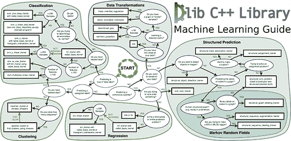
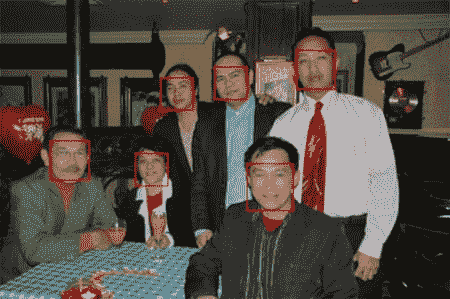
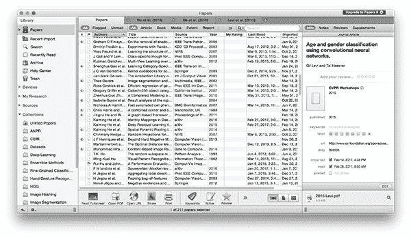
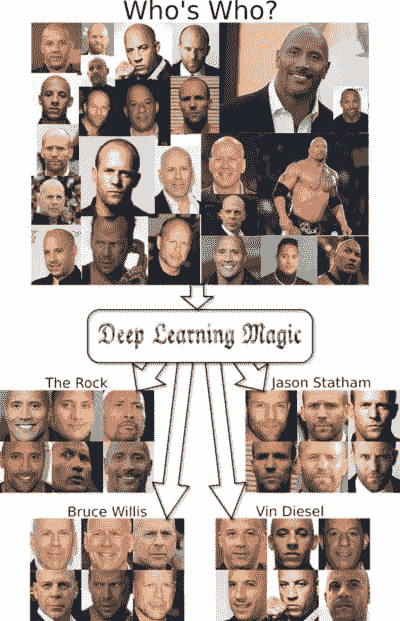

# 采访 dlib 工具包的创建者戴维斯·金

> 原文：<https://pyimagesearch.com/2017/03/13/an-interview-with-davis-king-creator-of-the-dlib-toolkit/>

在今天的博客文章中，我采访了 [Davis King](https://github.com/davisking) ，他是 [dlib](http://dlib.net/) 的创建者和主要维护者，dlib 是一个用 C++编写的用于现实世界机器学习、计算机视觉和数据分析的工具包(在适当的时候包括 Python 绑定)。

我个人在许多项目中使用过 dlib(特别是用于物体检测)，所以很荣幸能在 PyImageSearch 博客上采访 Davis。

在这篇博文的剩余部分，戴维斯:

*   讨论他在计算机视觉和机器学习领域工作背后的*灵感*。
*   解释了 dlib 的*由来，为什么存在，以及这个库主要用来做什么。*
*   谈论维护一个流行的开源库(如 dlib)最困难的方面。
*   描述了他的小说 [*Max-Margin 对象检测*](https://arxiv.org/abs/1502.00046) 论文背后的细节，dlib 库中对象检测的基石。
*   反映了 dlib 的[最新版本，其中包括*深度度量学习*，适用于最先进的人脸识别和人脸验证。](http://blog.dlib.net/2017/02/high-quality-face-recognition-with-deep.html)
*   为刚刚开始计算机视觉和深度学习生涯的读者提供有用的建议和意见。

这些问题大部分来自才华横溢的凯尔·麦克唐纳，我第一次见到他是在 Twitter 上，当时我正和戴维斯谈论他最新的 dlib 版本。Kyle 很友好，让我使用并修改了他最初的问题(同时添加了一些我和 David McDuffee(PyImageSearch 的通信协调员)的其他问题),从而使这次采访成为可能。一定要给凯尔和大卫大声喊出来，并告诉他们谢谢！

**要了解更多关于 Davis King、dlib 工具包以及该库如何用于计算机视觉、机器学习和深度学习的信息，*请继续阅读。***

## dlib 创始人戴维斯·金访谈

阿德里安:嘿，戴维斯！我知道您很忙，感谢您抽出时间接受采访。很荣幸您能来到 PyImageSearch 博客。对于不认识你的人，你是谁，你是做什么的？

戴维斯 :谢谢邀请我。我是一名软件开发人员，研究应用机器学习问题。我的大部分工作是为美国国防应用研究机器视觉和自然语言处理。很多都是用不同种类的传感器，如声纳、激光雷达、雷达、光学相机等，来做计算机视觉的事情。我还致力于工业自动化和自主水下航行器的传感，以及自动化金融交易的机器学习系统。

但是在公开场合，大多数人都知道我是开源项目 dlib([dlib.net](http://dlib.net/))和 MITIE([github.com/mit-nlp/MITIE](https://github.com/mit-nlp/MITIE))的作者。

* * *

**Adrian:** 是什么激励你开始从事计算机视觉、机器学习和深度学习领域的工作？

戴维斯 :我想在一些有趣且重要的领域工作。长久以来，我一直相信自动化非常重要。此外，当我还是个孩子的时候，我就知道我想做一些计算机科学的事情，事实证明我非常擅长编程，而且我热爱数学。机器学习是自动化的前沿所在，涉及大量数学和编程，所以我来了。我也是科幻作家的粉丝，比如[艾萨克·阿西莫夫](https://en.wikipedia.org/wiki/Isaac_Asimov)和[维诺·文奇](https://en.wikipedia.org/wiki/Vernor_Vinge)。机器学习及其相关领域似乎是通向有趣的科幻人工智能的最明显的途径。所以这也很酷，即使现在还很遥远🙂

* * *

**Figure 1:** dlib — A toolkit for real-world computer vision and machine learning ([higher resolution](http://dlib.net/ml_guide.svg)).

阿德里安 :什么是 dlib？图书馆主要用来做什么？

**戴维斯** : Dlib 是一个通用的开源 C++软件库。我在 15 年前开始写它，最初它与机器学习无关。无论如何，我那时是，现在仍然是合同编程的狂热爱好者。所以 dlib 最初的动机是使用“契约式设计”的方法来制作一堆当时还没有的跨平台工具。例如，15 年前，C++还没有令人沮丧的可移植线程、网络或线性代数工具。

dlib 就是这样开始的，作为一个包含一堆随机系统工具的跨平台 C++库。例如，dlib 中最流行的东西之一是 dlib::pipe，这是一种在线程之间传递消息的类型安全工具，它被用于大量不进行任何类型的机器学习的嵌入式/实时处理应用程序。实际上，这仍然是今天的 dlib，一个以契约式设计风格编写的 C++工具集合。只是我花了 10 年时间来制作机器学习工具。因此，截至 2017 年，dlib 由机器学习材料主导，这在过去几年中真正推动了它的流行。特别是，人脸检测、地标和识别示例程序现在可能是 dlib 中最受欢迎的部分。

* * *

阿德里安 :你认为 dlib 在新的研究方面开创了先例吗，或者你渴望让已发表的作品更容易被人理解？

戴维斯 :不尽然。dlib 中有些东西很新颖，比如 [MMOD 探测器](https://arxiv.org/abs/1502.00046)。但总的来说，我对 dlib 的目标一直是制造真正干净和易于使用的工具。这是一个不同于做新颖研究的目标，而且有点不一致，因为全新的想法通常不会以干净和易于使用的形式出现。大多数时候，当我向 dlib 添加一些东西时，它是来自已出版的文献中的一些已经被认为非常棒的东西，这意味着它已经存在了一段时间。

因此，对于 dlib 来说，我的目标无疑是让已发表的作品更容易被人获取。这也是我选择 dlib 许可证的原因。我希望尽可能多的人能够利用最先进的机器学习工具，并将其用于他们想要的任何事情。我觉得这很好。

我也是在工作中完成大部分原创研究，这意味着我通常不能发表。原创研究也很辛苦。我在 dlib 上工作的部分原因是，我可以在工作之余做一些相对容易和放松的事情。还有一个问题是，原创研究，至少是我在日常工作中倾向于做的那种，是非常具体的应用，而不是非常普遍的兴趣。所以它通常不适合 dlib。

* * *

阿德里安 :你认为 dlib 最终会“功能完善”吗，还是一个正在进行的项目？

戴维斯 :不，它永远不会完整。Dlib 只是一个有用工具的集合，显然你总是可以制造更多的工具，除非有一天人类不再对新的更好的东西有想法。但这似乎不太可能。我也很喜欢写软件，并把它免费放到网上。我已经这样做了 15 年，我看不出有任何理由在短期内改变。

* * *

**阿德里安** :维护像 dlib 这样的开源库，最困难的方面是什么？

戴维斯 :让该死的构建系统在任何地方都能工作。dlib 的核心很容易构建。但是 Python 绑定呢？没那么简单。这是因为，正如我从运行 dlib 中学到的，有大量的 Python 版本都是不兼容的，因为为一个 Python 构建的扩展模块不能与另一个兼容。由于 dlib 使用 boost.python 来构建扩展模块，这变得更加糟糕。所以你会遇到这样的问题，有人会为 python 版本 A 安装 boost.python，然后他们会尝试将它用于 Python 版本 B，结果，Python 崩溃了。这里的问题是 python 版本有 3 个地方必须匹配(运行时使用的 Python 解释器、编译 boost.python 时使用的 Python 和编译 dlib 时使用的 Python)，这对用户来说是很大的混淆机会。我从用户那里得到很多关于这个的问题，我不清楚如何避免这种用户困惑。

使这个问题变得特别糟糕的是，在一个用户的系统上安装多个版本的 Python 是很常见的，尤其是在 Mac 上。还有多个包管理器(例如 conda、pip、brew)。所以安装 Python，boost.python，dlib 的方法都有，没有标准什么的。所以超级容易搞混，版本不兼容。

有人正致力于将 dlib 的 Python 绑定从 boost.python 迁移到 pybind11，这将改善这一点。这是因为只有 2 个东西需要匹配(编译后的 dlib 和 Python 解释器)，而不是 3 个(dlib/python/boost)。所以这应该会让事情简单很多。但我确信我仍然会从安装了多个版本 Python 的用户那里获得大量论坛流量。**因此，如果有人有任何关于如何使 Python 绑定安装过程更加简单的想法，请联系 github🙂**

* * *

阿德里安 :开源最令人兴奋的一个方面是看到你的工作是如何被其他人使用的。你见过 dlib 更令人惊讶的用法有哪些？

戴维斯 :看到艺术家使用 dlib，我真的很惊讶。这是我从未预料到的。我想到的通常应用都是工业的。所以看到像凯尔·麦克唐纳这样的人使用它是令人惊讶和酷的。

* * *

**Figure 2:** An example of dlib’s face detector.

艾德里安 :我记得两年前看过你关于 *[Max-Margin 物体检测](https://arxiv.org/abs/1502.00046)* 的论文。本文主要研究基于 HOG 的检测器。你最近更新了 dlib，也将这种方法用于深度学习的对象检测。你是如何将之前的物体检测研究与 dlib 中新的深度学习检测模块融合在一起的？

戴维斯 :那篇论文有两个主要部分。第一个也是最重要的一个论点是，在训练对象检测器时应该使用某个损失函数(MMOD 损失),因为它可以更好地利用可用的训练数据。第二部分描述了当检测器是固定特征提取器(例如，HOG、BoW 等)的一些线性函数时，用于优化该损失的算法。).论文接着做了一些实验来证明 MMOD 损失是一个好主意，并使用了 HOG 和其他一些方法作为例子。但是猪的选择并没有什么根本性的东西。我用它只是因为它在我最初写这篇论文的时候很流行，那是在 2012 年。

然后出现了 CNN，它超级擅长物体探测。我仍然认为 MMOD 损失是学习物体探测器时要走的路，并想用 CNN 试试。所有这些都需要将纸上的 MMOD 损失函数编码成 CNN 损失层。然后你就像每个人用随机梯度下降法一样优化 CNN，结果发现 MMOD 损失对 CNN 也很有效。事实上， [dlib 的一个示例程序](http://blog.dlib.net/2016/10/easily-create-high-quality-object.html)显示它训练一个 CNN 只用 4 张训练图像找到人脸。这比训练 CNN 通常所需的训练数据少得多，支持了 MMOD 更有效利用训练数据的说法。

* * *

**Figure 3:** A screenshot of my Papers2 database. Think of it as iTunes, only for PDF files. Davis recommends keeping up with recent publications in the computer vision and deep learning space.

阿德里安:dlib 最近的很多工作都围绕着深度学习。你如何跟上当前深度学习的趋势(以及一般的研究趋势)？)

戴维斯 :我花很多时间阅读。这是唯一的办法。你得看报纸。有做这些事情的朋友也会有帮助，因为他们会告诉你他们发现的你可能错过的好论文。但这没有你自己阅读论文重要。所以读这篇文章的人不应该认为仅仅靠自己会让事情变得更加困难，因为事实并非如此。你不需要成为某个大实验室的一员来参与这些事情。

对于感兴趣的人来说，有一些学术会议会定期发表很棒的论文，你可以在网上免费找到。对谷歌来说，一些好的会议是 [CVPR](http://cvpr2017.thecvf.com/) 、 [ICML](https://2017.icml.cc/) 、 [NIPS](https://nips.cc/) 和 [ICLR](http://www.iclr.cc/doku.php?id=ICLR2017:main&redirect=1) 。例如，用谷歌搜索“CVPR 论文”，你会发现各种各样的好东西。另一个很好的资源是谷歌学术。在那里你可以搜索到几乎所有的世界学术文献。结果或多或少按引用次数排序，所以你可以很容易地找到真正受欢迎的论文，因为它们被引用了很多。如果你对某个话题感兴趣，但不知道从何入手，这些通常是最好的阅读材料。你也可以点击 google scholar 中的“被 XX 引用”链接，找到你喜欢的任何论文的最重要的后续研究。这将显示所有引用你喜欢的论文的论文，同样，你可以看到引用它的最受欢迎的论文。允许您快速找到研究路径。谷歌学术是如此重要的资源，我怎么推荐都不为过。

***阿德里安注:*** *为了补充戴维斯的建议，我还建议谷歌搜索**“{ { topic } }调查论文”**以查找总结一段时间内特定主题研究趋势的文献调查(通常很长)。查找调查论文是一种**极好的**方式，可以快速跟上您感兴趣的研究领域中以前的开创性方法。*

* * *

**阿德里安** :在你和 MMOD 在 HOG 和深度学习方面的合作中，你的图书馆已经取得了最先进的成果。除了你关于 MMOD 的 arXiv 论文，还有什么原因让你不经常发表文章？

戴维斯 :我发表过一些其他的论文，但是我一般不发表。这没有什么深层原因，除了要花很多时间来完成一篇高质量的论文，然后让它被接受，然后在会议上发表。我的确有一份白天的工作，而且大多数时候，我不能在那里发表我的作品。而且，大多数雇主并不真的在乎你是否发表。我没有那种发表论文对职业成功很重要的工作，如果我纯粹在学术界工作的话，这种工作会很重要。

所以我没有太多动力去埋头写论文。同样值得记住的是，发表论文的根本目的是传播思想。如果我有一些有用的算法，我想让人们使用它，最有效的方法是什么？如果我把它放入 dlib，成千上万的人会使用它，这比一般的学术出版物要多得多。就公共利益最大化而言，我不认为写论文是对我时间的最好利用。

围绕出版也有很多废话。事实上，我在 2012 年写了那篇 MMOD 论文，那是很久以前的事了。我向 CVPR 和其他几个地方提交了两次，每次都得到了好评，除了每次都会有一个评论者发表一些无意义的评论，大意是“我认为实验是错误的，不相信这是可行的”。他们中的一些人显然没有看报纸。这类评论尤其令人恼火，因为与此同时，成千上万的人正在使用这种方法，并取得了巨大的成功。但是你不能说“去运行 dlib，看看它是如何工作的”,因为提交是双盲的，并且在大多数情况下只基于论文。反正发表的人都抱怨这种事。这真是件苦差事，发表论文要花很多时间。我可以通过把想法放在 dlib 中，并附带解释它的文档来更容易地传播它们。所以我通常都是这么做的。

* * *

阿德里安 :我看到 [ODNI](https://www.dni.gov/index.php) 和 [IARPA](https://www.iarpa.gov/) 被列为 dlib 的赞助商。你能告诉我们更多关于这次赞助的情况吗？这种联系是怎么产生的？又是如何推动 dlib 的发展？

戴维斯 :我职业生涯的大部分时间都在国防部工作，我的大多数朋友都是我在那个世界认识的人。IARPA 赞助的发生是因为人们渴望一个易于使用的 C++深度学习库。也就是说，从 C++程序中容易使用的东西。Python 或其他语言中有许多可用的深度学习工具，但 C++中没有，这有点令人惊讶，因为所有的深度学习工具最终都是用 C++或 C 编写的。所以我在国防部认识的一个人说服我编写一个易于使用的 C++深度学习 API，并将其放入 dlib。我维护的另一个开源项目 MITIE 也是由 DARPA 国防部机构赞助的，是 DARPA XDATA 项目的一部分。

然而，dlib 中的大多数东西都不是由任何人赞助的。通常我做 dlib 只是为了好玩。但是，当有人想赞助对 dlib 进行一些添加或更改时，我只接受我认为它实际上是一个有用的工具，有意义放入 dlib 的情况。

* * *

**Figure 4:** Applying deep metric learning in the latest release of dlib to the task of face recognition and face verification.

**阿德里安** :最新版本的 dlib 搭载了深度度量学习，可与其他最先进的人脸识别技术相媲美。是什么促使你从事人脸识别的工作？当你开始做这个项目的时候，你的意图是“解决”人脸识别吗？*(注:我已经看过几次[你的公告博文](http://blog.dlib.net/2017/02/high-quality-face-recognition-with-deep.html)，我实际上有点搞不清楚你是在做人脸识别(给定一张 1 张脸的图像，在 N 张脸的数据库中识别)还是人脸验证(给定两张图像，确定两张照片中的人是否是同一个人)。如果你能详细说明这一点，那将非常有帮助。*

戴维斯 :哦，我不在乎人脸识别。对我来说，有趣的是学习算法，在上一个版本中，它主要是一些深度度量学习工具的添加。度量学习对于很多和人脸没有任何关系的事情都是有用的。这正是我喜欢添加到 dlib 中的那种广泛有用且有趣的工具。我在上一个 dlib 版本中包含人脸识别模型的主要原因是为了展示新工具可以正常工作。它也是有用的教学工具。当我向 dlib 添加新东西时，我会尝试编写示例程序来解释如何使用这些工具以及它们为什么有用和有趣。在深度度量学习的情况下，要写的明显的例子是展示如何进行某种面部识别的例子。所以我添加了人脸识别的东西，因为这是最引人注目的文档，而不是因为我关心人脸识别。

至于你的另一个关于识别和验证的问题，示例程序没有做这两件事。相反，它显示了如何将人脸嵌入到 128D 向量空间中，在该空间中同一个人的图像彼此靠近。它本身没有任何作用。但它是大多数用人脸做有趣事情的系统所使用的基本构件。例如，如果你想进行人脸验证，你需要两张人脸，并检查它们在 128D 空间中是否相距一定距离。如果他们足够接近，你说他们是同一个人。为了进行识别，你可以说“这是我的新面孔，在我的数据库中，它最接近哪张面孔?”？还是离数据库里的一切都很远？”。或者做人脸聚类，dlib 的一个例子，你可以在人脸的矢量嵌入上运行聚类算法，弹出人脸的聚类。

在我的博文中，我提到新的 dlib 模型在 LFW 基准测试中获得了 99.38%的分数。 ***该基准是人脸验证基准。*** 但是你可以很容易地使用工具来做人脸识别或聚类。

* * *

艾德里安 :为 dlib 开发一个新特性时，一般的时间表是什么样子的？拥有一个“基本完成”的特性，对它进行润色，然后发布它，这中间有很长的差距吗？或者你在特写“完成”后马上发表？

戴维斯 :这要看特点。大多数事情不需要那么长时间。例如，我想我用一个周末的时间在 dlib 中编写了 face landmarking 工具。虽然有时需要更长时间。真的要看是什么了。然而，我通常会马上把它放到网上。你通常可以立即看到代码出现在 [github](https://github.com/davisking/dlib) 上。但是我会等到我觉得一切都稳定了再发布官方编号的 dlib。

这也取决于你在时间表中包含了什么。我花很多时间阅读。有时我会对一些事情感到兴奋，这可能涉及到买一本关于某个主题的教科书并从头到尾阅读。然后最终会有一些具体的东西我想添加到 dlib。花在阅读上的时间可能是几个月也可能是几年，取决于你如何看待它。

我有时也会跑题。例如，当我为某些东西编写代码时，我经常会意识到我需要一些其他工具来制作我想要制作的机器学习算法。那我去做另一个工具。在编写另一个工具时，我可能意识到我还需要另一个工具来实现它。有时会失去控制，dlib 全新的主要部分随之而来，比如优化工具或线性代数库。

* * *

阿德里安 :虽然值得，但作为一个开源项目的主要维护者需要你投入时间、创造力和耐心。你觉得管理用户的期望很有挑战性吗？

戴维斯 :不尽然。我在 dlib 上工作是因为我喜欢。我还发现大多数人都很理智。我从用户那里得到的唯一持续不断的令人讨厌的问题来自那些明显不知道如何编程并且明显不想学习的人。像“我不知道怎么编程，你能告诉我打什么吗？”。无一例外，回答这类问题会导致无休止的进一步的问题*“…好吧…那么我之后该键入什么？”*。我肯定没时间在网上给大家做免费的代码编写服务。

但是我会尽力帮忙。我还有一个[“推荐书籍”页面](http://dlib.net/books.html)，供刚刚起步的人使用。

* * *

阿德里安 :作为你所在领域的专家，当你被一个难题困住时，你会找谁？

戴维斯 :通常没有人。不是因为我不想，而是因为通常当你被困在某件事情上时，你不知道有谁知道如何解决它。例如，通常当我试图从一篇论文中实现一些东西时，它起初并不工作。为什么不管用？是因为我的代码有 bug 吗？大概吧。还是因为我忽略了一些微妙但重要的细节？也许吧。是因为论文错了，永远不会成功吗？有时候。

在每一种情况下，你都会发现，在你花了很多时间解决这个问题并陷入困境之后，你会比你可能询问的任何人都更熟悉相关的细节。一部分是因为你写了你的代码，只有你见过它，一部分是因为你试图实现的文件在你的头脑中是新鲜的，而不是在你可能会问的其他人的头脑中。所以问别人可能一点帮助都没有。这并不是说你不应该这样做，有时它帮助很大。但通常你在解决这类问题时都是靠自己。

* * *

阿德里安 :你对那些刚刚开始计算机视觉和深度学习事业的读者有什么建议吗？

**戴维斯** :多读书，不要跳过基本面。这无疑是人们开始面临的最大问题。每个人都想直接跳到结尾最酷的部分。但你不能这么做。如果你跳过重要的事情，那么理解计算机视觉似乎是不可能的，你会很快变得沮丧。在你希望在计算机视觉或机器学习方面取得任何进展之前，你必须理解一堆核心领域。然而，如果你按照正确的顺序学习，一切都会变得容易得多。

具体来说，我会说你需要很好地了解这六件事:如何编程、微积分、线性代数、概率、统计和数值优化。如果你不知道这六个领域，那么你就无法理解机器学习和计算机视觉论文。

你也不能用电脑做事，因为你不会编程。但没什么大不了的，你可以通过阅读来解决这个问题:)。特别是，你应该阅读每一个主题的教科书。我意识到很多人不想读教科书。但是如果你不读书，你就不会学习。事情就是这样。

所以你必须找到一些方法来激发自己阅读线性代数等主题的教科书。获得动力的一个好方法是选择一些你感兴趣的话题。也许你在 CVPR 找到了一些你真正想要理解和实现的文件。所以你读了，但有些部分你不明白。可能他们用了很多线性代数，而你线性代数很弱。现在你知道你需要学习线性代数，更重要的是，你有一个具体的目标，你很兴奋推动你去做。你可以从我的列表中挑选一本书:[http://dlib.net/books.html](http://dlib.net/books.html)。或者你可以去大学网站，看看他们用什么书来上同等的课。

此外，许多机器学习算法最终涉及复杂的循环计算，中间有逻辑语句。当用 Python 执行时，这类事情真的真的很慢，所以尽管这是一个 Python 博客，而且 Python 很棒，我还是要插上学习 C++的插头:)。所以也学 C++。很多时候，你会想做一些在 Python 中不容易矢量化的计算，或者你想写一些定制的 CUDA 代码，或者使用 SIMD 指令，或者其他什么。所有这些在 C++中非常简单，但在函数调用开销高、循环结构慢、无法访问硬件的语言中却非常困难或不可能(例如 Python、MATLAB、Lua)。但是如果你懂 C++的话，只要你愿意，你可以写一个 Python 扩展模块来处理这些事情，这很简单。

## 摘要

在今天的博文中，我们采访了 Davis King，他是用于现实世界计算机视觉和机器学习应用的工具包 [dlib](http://dlib.net/) 的创建者和维护者。

虽然 dlib 主要用在 C++应用程序中，但是某些功能也有 Python 绑定——尽管 Davis 建议使用 C++来利用 dlib 的全部功能。

我可以亲自证明 dlib 的易用性——我已经在许多计算机视觉项目中使用过它，我甚至在 [**PyImageSearch 大师课程**](https://pyimagesearch.com/pyimagesearch-gurus/) 中的对象检测背景下讨论过它。

我想再次感谢戴维斯·金抽出时间来做这次采访(并对凯尔·麦克唐纳和大卫·麦克杜菲帮忙收集这次采访的问题表示感谢)。

为了跟上 Davis，一定要在 Twitter 上关注他，同时关注他在 T2 的 GitHub 项目。

**为了在以后的博客文章(包括采访)发布时得到通知，*请务必在下面的表格中输入您的电子邮件地址！***