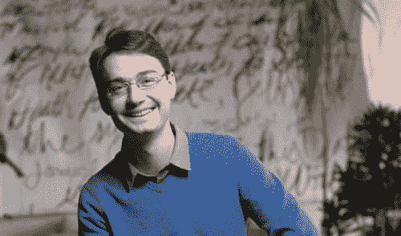
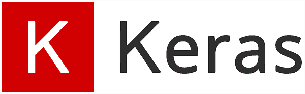
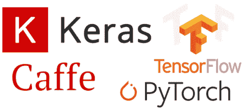
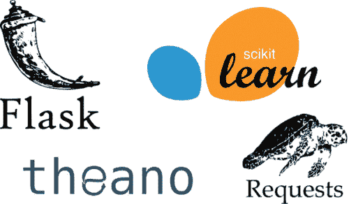

# 弗朗索瓦·乔莱访谈

> 原文：<https://pyimagesearch.com/2018/07/02/an-interview-with-francois-chollet/>

在今天的博文中，我采访了现代深度学习领域最重要的研究人员和实践者之一，**Fran ois Chollet**。

弗朗索瓦不仅是 **Keras 深度学习库**的创建者，他还是**谷歌人工智能研究员。**他还将在今年 8 月的 [PyImageConf 2018](https://www.pyimageconf.com/) 上发表演讲。

**在这次采访中，弗朗索瓦讨论了:**

*   他对人工智能研究的启示
*   他创造 Keras 的原因
*   深度学习最终将如何在每个行业、每个企业和每个非营利组织中普及
*   人工智能行业的问题和挑战(以及我们如何帮助解决它们)
*   他会改变深度学习领域的什么，以及研究社区可能如何陷入困境
*   作为一名图片搜索者，他给你的建议是研究深度学习的最佳方式

请和我一起欢迎弗朗索瓦加入 PyImageSearch——他能来到这里真的是我的荣幸。

## 弗朗索瓦·乔莱访谈

**Figure 1:** Creator of Keras and Google researcher, [François Chollet](https://www.redhat.com/en/open-source-stories/road-to-ai) (Image credit: RedHat).

阿德里安:嗨，弗朗索瓦！我知道你在谷歌人工智能和 Keras 图书馆的工作非常繁忙，我真的很感谢你花时间接受采访。非常荣幸您能来到 PyImageSearch 博客！对于不认识你的人，你是谁，你是做什么的？

我在加州山景城的谷歌公司担任软件工程师。**我开发深度学习库 Keras**。我在 2015 年开始它，作为一个兼职项目，随着时间的推移，它变得比预期的更大——**现在超过 25 万用户，是深度学习世界的一大部分。**我也做一些主题的人工智能研究，包括计算机视觉和程序合成。

* * *

**Adrian:** 是什么激励你开始从事机器学习、深度学习和计算机视觉领域的工作？

**弗朗索瓦:**我迷上 AI 很久了。我最初是从哲学的角度来研究它的——我想了解智力是如何工作的，意识的本质是什么，诸如此类的事情。我从阅读神经心理学开始，从远处看，这个领域应该能够回答这些问题。能学的都学了，结果发现神经心理学并没有什么真正的答案。这太令人失望了。

所以我转向了人工智能——这个想法是试图通过从第一原则开始，自下而上地创造思维来理解思维，这与神经心理学的方法非常相反。当然，那时的大多数人工智能根本不关心大脑以及它们可能如何工作，所以我最终进入了人工智能中似乎与我的兴趣最相关的一个领域:发展认知机器人学，这是关于使用机器人和人工智能来测试人类认知发展模型的。然后，因为我不太擅长长时间做同一件事，我最终分支到了更应用的子领域，比如计算机视觉和自然语言处理。

* * *

**Figure 2:** The Keras deep learning library.

**Adrian:** 给我们介绍一下 [Keras 深度学习库](https://keras.io/)。你为什么要创建它，它填补了现有 ML/DL 库和包中的什么空白？

**弗朗索瓦:**我在 2015 年 2 月/3 月左右创作了 Keras。深度学习在当时是一个非常不同的领域。首先，它比较小。**当时可能有 1 万人在做深度学习。现在已经接近一百万了。**

就工具而言，你没有太多选择。您可以使用 Caffe，它在计算机视觉中很流行，但是只适用于相当狭窄的用例(convnets ),并且不太具有可扩展性。您可以使用 Torch 7，这是一个不错的选择，但这意味着您必须用 Lua 编码，而 Lua 没有 Python 数据科学生态系统的任何好处。任何你想加载的数据格式——你必须在 Lua 中从头开始构建你自己的解析器，因为你在 GitHub 上找不到这样的解析器。然后是 Theano，一个 Python 库，它是 TensorFlow 的精神祖先。我很喜欢这个 ano，它感觉像是未来，但它非常低级，很难使用。你必须从头开始写所有的东西。

当时我正在研究将深度学习应用于自然语言处理，重点是问答。现有工具生态系统中对 RNNs 的支持几乎不存在。所以我决定在 Theano 的基础上制作自己的 Python 库，从我喜欢的 Scikit-Learn API 和 Torch API 的部分借鉴一些想法。当我推出时，主要的价值主张是 Keras 是第一个同时支持 RNNs 和 convnets 的 Python 深度学习库。据我所知，它还有第一个可重用的 LSTM 开源实现(以前可用的实现本质上是研究代码)。而且很容易使用。

Keras 从第一天起就开始获得用户，从那以后就一直是一场不间断的开发马拉松。

* * *

**Figure 3:** Why might we use Keras over other deep learning libraries?

**Adrian:** 为什么深度学习研究人员、从业者或开发人员会选择 Keras，而不是 PyTorch、Caffe 甚至 strict TensorFlow 等其他库/框架？

**Fran ois:**我认为让 Keras 在今天的深度学习框架格局中脱颖而出的是它对用户体验的关注。**Keras API 中的一切都是为了遵循减少认知负荷、更易访问、更高效的最佳实践**。我认为这是 Keras 达到这一水平的主要原因，尽管 Torch 和 Caffe 已经领先一步。无论对于从业者还是研究人员，你都不能夸大易用性和生产力的重要性。**在一个紧密的迭代循环中，尽可能快地从想法到结果，是做伟大研究或开发伟大产品的关键。**

还有，关于 Keras 和 TensorFlow 还有一点。没有“Keras 或 TensorFlow”的选择。Keras 是 TensorFlow 的官方高级接口。它与 TensorFlow 一起打包为 tf.keras 模块。你可以将 Keras 视为深度学习的前端，它针对易用性和生产力进行了调整，可以在不同的后端引擎上运行，TensorFlow 是主要的一个。

* * *

**Adrian:** 开源最令人兴奋的一个方面是看到你的作品如何被其他人使用。你见过的 Keras 有哪些更有趣甚至令人惊讶的用法？

我们这个领域真正吸引人的一点是，你可以用我们的技术和工具解决各种各样的问题。我已经看到 Keras 被用来解决许多我甚至不知道存在的问题。比如优化鲑鱼养殖场的运营。在发展中国家分配小额贷款。为实体店建立自动结账系统。**总的来说，在硅谷的人们意识到的一系列问题和人们在那里面临的、可以用这些技术解决的所有问题之间，似乎存在着差距。**

这就是关注可访问性如此重要的一个重要原因:硅谷本身永远不会解决所有可以解决的问题。不会有一个硅谷的“深度学习行业”垄断深度学习专业知识，并向其他所有人出售咨询服务和软件。相反，深度学习将出现在每个行业、每个企业和非营利组织中，成为每个人手中的工具。让 Keras 和 TensorFlow 这样的框架免费使用并尽可能容易获得是一种发起大规模分布式问题解决浪潮的方式:理解目标领域的人将使用我们的工具自己构建解决方案，其影响力是我们单独一个人的 100 倍。

我认为 Keras 在让每个人都可以访问方面做得很好，相比之下，其他框架的目标只是让专家研究人员和其他内部人士使用。当我与从事深度学习的人交谈时，他们通常在研究和行业圈子之外，他们通常使用 Keras。

* * *

**Figure 4:** Important open source libraries, including Scikit-learn, Requests, Flask, and Theano.

**Adrian:** 除了 Keras 和/或 TensorFlow，你最喜欢的开源库有哪些？

**Fran ois:**我非常喜欢 Scikit-Learn，它在科学 Python 生态系统中产生了巨大的影响。这是一个非常以用户为中心、设计良好的库。我通常是以用户为中心的设计的忠实粉丝。像 Requests 和 Flask 这样的库也是很好的例子。

此外，谈到深度学习框架，我不能夸大 Theano 对深度学习世界的重要性。它有它的问题，但它在许多方面真的很有远见。

* * *

阿德里安:有时候，即使是出于好意的人最好的意图也会带来灾难性的后果——这种逻辑也适用于机器学习和人工智能。你同意这种说法吗？如果是这样，作为 ML/DL 社区，我们能做些什么来帮助确保我们没有造成比我们解决的更多的问题？

**弗朗索瓦:**是的，肯定的。不适当地应用机器学习可能会导致简单、不准确、不负责任、不可审计的决策系统在严重的情况下部署，并对人们的生活产生负面影响。如果你看看公司和政府今天使用机器学习的一些方式，这不是一个假设的风险，而是一个紧迫的问题。

谢天谢地，我认为最近机器学习社区出现了积极的趋势。人们越来越意识到这些问题。一个例子是算法偏差，这是机器学习系统在其决策中反映其训练数据固有的偏差的事实，无论是由于有偏差的数据采样、有偏差的注释，还是现实世界在各方面都有偏差的事实。一年前，这个重要的问题几乎不为人所知。现在，大多数从事机器学习的大公司都在研究这个问题。因此，至少在对其中一些问题的认识方面，我们正在取得进展。但这只是第一步。

* * *

**Adrian:** 如果你能改变深度学习行业的一件事，会是什么？

**Fran ois:**我认为应用深度学习在行业中总体表现良好，除了普遍倾向于过度销售当前技术的能力，并对不久的将来过于乐观(放射科医生在五年内肯定仍会有工作)。**在我看来，有麻烦的是研究界。在这方面，我会改变很多事情。**

首先，我们应该尝试修复研究界破碎的激励机制。目前，我们有许多违背科学方法和科学严谨性的激励措施。**当你过度宣称而调查不足时，在深度学习会议上发表更容易，同时模糊了你的方法论**。人们被增量架构技巧所吸引，如果你不进行对抗性的测试，这些技巧看起来似乎是有效的。他们使用弱基线，他们过度适应他们的基准的验证集。很少有人进行消融研究(试图验证你的经验结果实际上与你提出的想法有关)，对他们的模型进行严格验证(而不是使用验证集作为超参数的训练集)，或者进行显著性测试。

然后，我们有了公关驱动研究的问题。科幻叙事和神经科学术语赋予了人工智能领域一种特殊的光环。当它真的是数学和计算机科学的交叉领域时。一些知名实验室专门为公关挑选他们的研究项目，而不考虑 T2 能从项目中学到什么，能获得什么有用的知识。**我们应该记住，研究的目的是创造知识。不是为了得到媒体的报道，也不是为了升职而发表论文。**

另外，我对我们破碎的复习过程感到难过。深度学习领域在不到 5 年的时间里，从几百人到上万人。他们中的大多数都很年轻，没有经验，经常对这个领域有不切实际的想法，对科学方法没有真正的经验。他们不只是写论文，还会审核论文，这就是为什么你最终会遇到我提到的第一个问题——缺乏严谨性。

* * *

**Adrian:** 你在 2017 年出版了一本书， [*用 Python 进行深度学习*](https://www.manning.com/books/deep-learning-with-python)——恭喜你出版了！你的书涵盖了哪些内容，目标读者是谁？

**Fran ois:**这是为开发者编写的深度学习课程。它带你从基础(理解什么是张量，什么是机器学习等等)到能够自己处理相对高级的问题，比如图像分类、时间序列预测、文本分类等等。它的写作重点是易于理解和切中要点。我尝试做的一件事是用代码而不是数学符号来表达所有的数学概念。**数学符号可能是一个巨大的可及性障碍，它根本不是理解深度学习的必要条件。在许多情况下，代码是处理数学思想的一种非常直观的媒介。**

* * *

**Adrian:** 你会给有兴趣研究深度学习的 PyImageSearch 读者什么建议？你会建议一个“理论第一”的方法，一个“实践”的方法，或者两者之间的某种平衡？

**弗朗索瓦:** **我绝对推荐亲自动手的方法。**理论是一个更高层次的框架，可以帮助你理解迄今为止所积累的经验。在缺乏经验的情况下，理论是没有意义的，过早地关注它可能会导致你对自己以后要做的事情建立误导性的心理模型。

* * *

**Adrian:**Fran ois，你是一名成功的人工智能研究人员，你在开源 DL/ML 社区中备受推崇，你是一名作家，也是一名艺术家。很明显，你是一个喜欢创造新的想法、概念和创造性作品的人。我完全能够欣赏和理解这种创造的动力。然而，当我们创作时，无论是在创意还是艺术作品方面，我们都必然会遇到“讨厌的人”。你会建议某人如何处理这些对我们的作品过分挑剔/完全不尊重的人？

**弗朗索瓦:**我认为不同的人会因为不同的原因表现得像巨魔。但是巨魔似乎在每个领域都遵循同样的剧本，无论是艺术、软件工程还是科学。你可以看到所有人都有相同的模式。知名度更高的人似乎在玩地位游戏，攻击某人以吸引注意力并提升自己在任何观众眼中的地位。匿名者往往是缺乏安全感的人，他们通过扮演看门人的角色来应对自己，憎恨“无足轻重的人”和局外人，并通过对最能提醒他们自己个人失败的人或团体表现出残忍来发泄他们的沮丧。

我的建议是忽略巨魔。不要和他们交往。不要和他们说话，也不要谈论他们——不要给他们平台。与不守信用、以伤害为目的的人交往不会有什么收获(只是压力大)。它剥夺了巨魔们寻求的注意力。

* * *

阿德里安:你将在今年的 [**PyImageConf**](https://www.pyimageconf.com/) 大会上发表演讲——你的到来让我们非常兴奋和幸运。你能告诉我们更多关于你将要谈论的内容吗？

**Fran ois:**我将谈谈我以前在计算机视觉方面的一些研究，特别是在 convnet 架构中使用深度方向可分卷积。在我看来，这是一个真正被低估的模式。它基本上是一组关于视觉空间结构的先验知识，使你能够同时建立更小的模型，运行更快，概括得更好。同样，与全连接网络相比，convnet 利用的平移不变性先验是一个相当大的改进，我认为 con vnet 特征中的深度方向可分性先验在处理 2D 图像或连续 3D 空间时严格优于常规卷积。

## 摘要

在今天的博文中，我们采访了谷歌人工智能研究员、广受欢迎的 Keras 深度学习库的创建者 Franç ois Chollet。

请花点时间在这个帖子上留下评论，并感谢 Franç ois 从百忙之中抽出时间来参加我们的 PyImageSearch 采访。我们真的很荣幸也很幸运有他在这里。

谢谢你，弗朗索瓦！