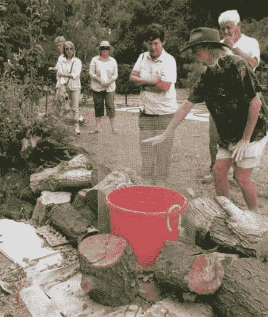
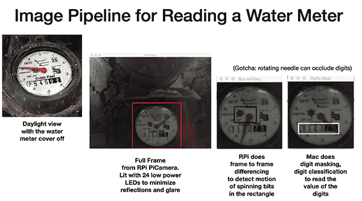
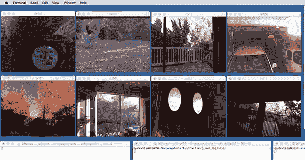
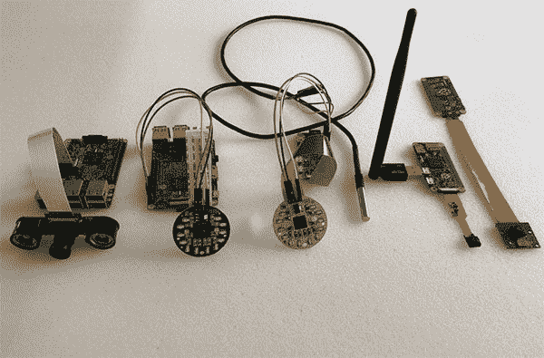
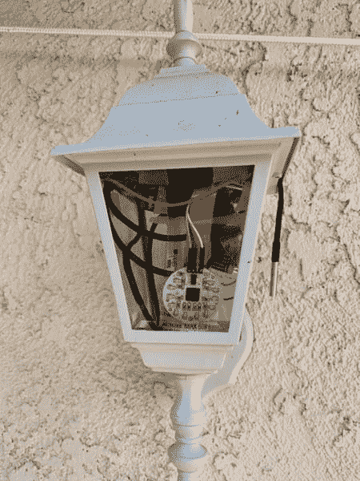
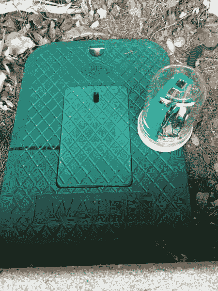
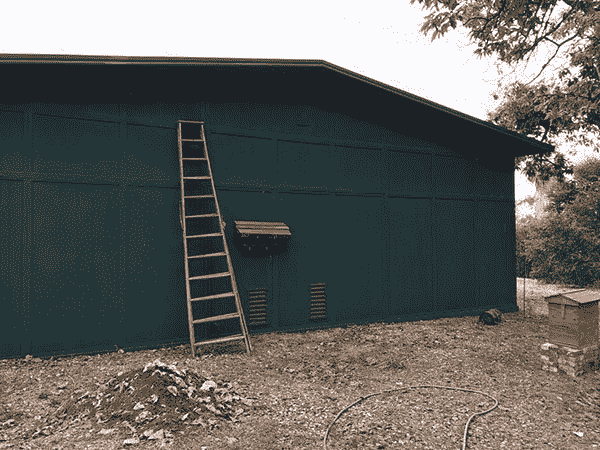
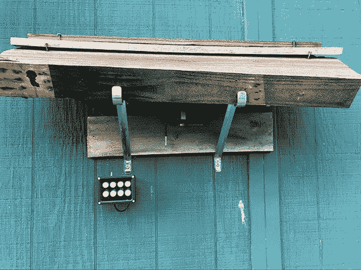
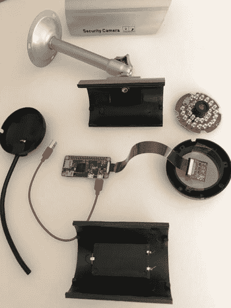
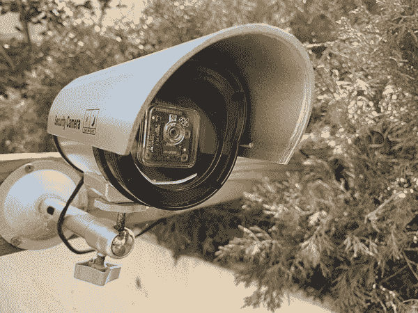

# 采访 ImageZMQ 的创造者杰夫·巴斯

> 原文：<https://pyimagesearch.com/2019/04/17/an-interview-with-jeff-bass-creator-of-imagezmq/>


本周早些时候，我分享了一个关于使用 OpenCV 通过 ImageZMQ — **在网络上传输实时视频的教程，今天我很高兴分享对 ImageZMQ 的创始人杰夫·巴斯的采访！**

Jeff 拥有超过 40 年的电脑和电子产品黑客经验，现在他将计算机视觉+ Raspberry Pis 应用于他的永久农场:

*   数据收集
*   野生动物监测
*   水表和温度读数

杰夫是我有幸遇到的最喜欢的人之一。在他 40 年的职业生涯中，他积累了大量计算机科学、电子学、统计学等方面的知识。

他还在一家大型生物技术公司做了 20 年的统计和数据分析。他给的建议实用、中肯，而且总是说得很好。很荣幸他今天能来到这里。

就个人而言，Jeff 也是 PyImageSearch Gurus course course 的最初成员之一。他是一个长期的读者和支持者——他是真正的*帮助这个博客成为可能。*

很高兴今天有 Jeff 在这里，无论您是在寻找计算机视觉和 OpenCV 的独特、实用的应用，还是只是在寻找如何为计算机科学职业生涯建立投资组合的建议， ***看看这个采访就知道了！***

## 采访 ImageZMQ 的创造者杰夫·巴斯

阿德里安:嘿，杰夫！谢谢你今天来到这里。很高兴你能来到 PyImageSearch 博客。对于不认识你的人，你是谁，你是做什么的？

杰夫:我是一个终生学习者，已经玩了 40 多年的电子产品和电脑。我在研究生院学习计量经济学、统计学和计算机科学。当个人电脑还是新事物的时候，我为个人电脑开发了一个统计软件包。我在一家大型生物技术公司做了 20 年的统计和数据分析。

现在，我已经从创收事业中退休，并在南加州建立了一个小型永久性农场。我正在使用计算机视觉、传感器和树莓 Pis 作为工具来观察和管理农场。我偶尔在花园俱乐部和会议上发言。我真的很喜欢成为 2018 年 PyImageConf 的演讲者。

* * *

**Adrian:** 你最初是如何对计算机视觉和深度学习产生兴趣的？

Jeff:2013 年，当它们首次上市时，我得到了一个树莓 Pi 和一个 Pi 相机模块。当我开始经营农场时，我想用它们来观察和记录野生动物的活动。我已经非常熟悉 Linux 和 C，但是最好的 Pi 相机接口是 Python 中的[“Picamera”模块。](https://picamera.readthedocs.io)我开始了“web 漫游”来学习更多关于 Python 编程和计算机视觉的知识。我浏览了你的教程博客，买了你的 [*实用 Python 和 OpenCV* 的书。一旦我看完你书中的例子，我就被吸引住了。](https://pyimagesearch.com/practical-python-opencv/)

* * *



**Figure 1:** Jeff Bass runs Ying Yang Ranch, a permaculture farm designed to grow food with long term sustainability.

阿德里安:你能告诉我们更多关于你农场的事吗？什么是永久农业？为什么它很重要，它与“传统”农业有什么不同？

杰夫:我把这个农场叫做阴阳农场。这是一个位于郊区的 2 英亩的小型“科学项目”。我开始了解永久栽培的同时，我开始了解树莓。

永久农业是以长期可持续性为主要目标的种植食物的实践和设计原则的集合。它从创造具有不同微生物的深层土壤开始，模仿古老的森林。永久性的设计选择将可持续性置于效率之上。它以科学为基础，强调仔细观察、可重复实验和开放共享最佳实践的循环。

永久性农场通常很小，包括许多不同种类的植物在一起生长，而不是一排排相似的作物。食用植物与本地植物生长在同一空间。我种植无花果、梨、石榴、李子、葡萄、鳄梨、橙子、桑葚、黑莓和其他食物。但是它们与加州海岸的橡树和悬铃木套种在一起。它看起来不太像传统的农场。传统农业效率很高，但会破坏土壤和水资源。永久文化正试图改变这种状况。

* * *



**Figure 2:** Jeff uses Raspberry Pis + computer vision around his farm. An example of such is automatic water meter reading using OpenCV.

阿德里安:树莓汁和计算机视觉对你的农场有什么帮助？

**杰夫:**我们在南加州，距离马里布海岸约 10 英里。干旱和降雨量有限是最严峻的气候问题。**监控和观察很重要，所以我建了一个覆盆子 Pi 摄像系统来读取水表和监控温度，以优化灌溉。**

这引出了更多的问题和许多收集和分析数据的有趣方法:

*   今天浇桑葚花了多少加仑？
*   郊狼最后一次跑到谷仓后面是什么时候？
*   鳄梨树下的温度和土壤湿度是多少？
*   5 个堆肥堆的温度和含水量是多少？
*   它是如何随时间变化的？
*   我们今天生产了多少太阳能电力？
*   雨水桶有多满？
*   鸟儿、蝴蝶和其他生物的活动是如何随着季节和开花结果的变化而变化的？

树莓派还记录了车库和谷仓门的开关。他们可以让我知道包裹什么时候送到。

* * *

阿德里安:你创建了一个名为 [imagezmq](https://github.com/jeffbass/imagezmq) 的库。它是什么，有什么作用？

Jeff:imagezmq 库实现了一个简单快速的 Raspberry Pis(客户端)和服务器网络。

早期，我决定采用分布式设计，使用 Raspberry Pis 来捕获图像，使用 MAC 来分析图像。目标是让 Raspberry Pis 进行图像捕捉和运动检测(水表在旋转吗？)并以编程方式决定将一小部分图像传递给 Mac。

我花了一年时间尝试不同的方法将图像从多个树莓电脑发送到 Mac 电脑。我选择了开源的 ZMQ 库和它的 PyZMQ python 包装器。我的 imagezmq 库使用 zmq 将图像和事件消息从十几个 Raspberry Pis 发送到 Mac hub。ZMQ 快速、小巧、易于使用，并且不需要消息代理。

下面是一对代码片段，展示了如何使用 imagezmq 从 Raspberry Pi 向 Mac 连续发送图像。首先，在每个 Raspberry Pi 上运行的代码:

```py
# run this program on each RPi to send a labelled image stream
import socket
import time
from imutils.video import VideoStream
import imagezmq

sender = imagezmq.ImageSender(connect_to='tcp://jeff-macbook:5555')

rpi_name = socket.gethostname() # send RPi hostname with each image
picam = VideoStream(usePiCamera=True).start()
time.sleep(2.0)  # allow camera sensor to warm up
while True:  # send images as stream until Ctrl-C
	image = picam.read()
	sender.send_image(rpi_name, image)

```

然后是运行在 Mac(服务器)上的代码:

```py
 # run this program on the Mac to display image streams from multiple RPis
import cv2
import imagezmq
image_hub = imagezmq.ImageHub()
while True:  # show streamed images until Ctrl-C
 	rpi_name, image = image_hub.recv_image()
 	cv2.imshow(rpi_name, image) # 1 window for each RPi
 	cv2.waitKey(1)
 	image_hub.send_reply(b'OK')

```

每个 Raspberry Pi 的主机名允许 Mac 将来自该 Raspberry Pi 的图像流放在一个单独的、标记为`cv2.imshow()`的窗口中。我在[我的 imagezmq github 存储库](https://github.com/jeffbass/imagezmq)中有一张照片，显示 8 个 Raspberry Pi 摄像头同时显示在一台 Mac 上:



**Figure 3:** Live streaming video from 8 Raspberry Pis to a central hub using Python, OpenCV, and ImageZMQ.

它在每个 Raspberry Pi 上使用了 12 行 Python 代码，在 Mac 上使用了 8 行 Python 代码。一台 Mac 可以以 10 FPS 的速度跟上 8 到 10 个树莓 pi。 ZMQ 快。

imagezmq 使计算机视觉管道能够轻松地分布在多个 Raspberry Pis 和 MAC 上。Raspberry Pi 以每秒 16 帧的速度捕捉图像。它可以检测水表指针旋转引起的运动。它只发送指针开始移动或停止移动的图像，这只是它捕获的图像的一小部分。然后，Mac 使用更先进的计算机视觉技术读取水表图像的“数字”部分，并确定使用了多少水。每台计算机都能够完成它最适合的计算机视觉管道部分。imagezmq 实现了这一点。

* * *

**Adrian:** 你在阴阳牧场部署过的最喜欢的计算机视觉+树莓 Pi 项目是什么？

杰夫:我用红外线泛光灯在谷仓的后墙上安装了一个树莓派。当运动“像动物一样”时，它跟踪运动并发送图像。我捕捉到了郊狼、浣熊、负鼠、蝙蝠、鹰、松鼠和兔子的图像。我还在研究深度学习模型，以便正确分类。对我和我的邻居来说，更多地了解我们周围的野生动物非常有趣。

* * *



**Figure 4:** A selection of Raspberry Pi components and cameras, including (left to right) Waveshare Combo IR lens and dual IR floodlights, PiNoir IR Camera with IR “Ring Light” floodlight, RPi Zero with PiCamera in white light “Ring Light” with DS18B20 temperature probe, RPi Zero with “Spy Cam” and longer range WiFi, and RPi Zero with older model (and half price) PiCamera.

阿德里安:树莓派虽然便宜，但功能远不及标准笔记本电脑/台式机。在农场使用树莓 Pis 的过程中有哪些经验教训？

杰夫:树莓馅饼很擅长捕捉图像。Pi 相机模块在 Python 中是非常可控的，可以改变曝光模式之类的东西。USB 或笔记本电脑网络摄像头通常根本无法控制。控制曝光和其他相机设置对追踪野生动物甚至读取水表非常有帮助。

Raspberry Pi GPIO 引脚可以收集温度传感器、湿度传感器和其他传感器的读数。GPIO 引脚可以用来控制灯，比如照亮我的水表和谷仓区域的灯。笔记本电脑和台式机不容易做到这些。

另一方面，Raspberry Pis 缺乏高速磁盘驱动器——sd 卡不适合写入大量二进制图像文件。在我的系统中，Raspberry Pis 通过网络发送图像文件，而不是将它们存储在本地。笔记本电脑和台式机有快速的磁盘存储和大量的 RAM 内存，允许更精细的图像处理。我试图让我的树莓派做他们擅长的事情，让苹果做他们擅长的事情。

我的大多数 Raspberry Pi 是 Raspberry Pi 3，但我也使用更便宜、更小的 Raspberry Pi Zero，用于只需要进行简单运动检测的 Pi 相机，如我的车道摄像头。当不需要额外的图像处理时，即使 Pi Zero 的内存更小、处理器功能更弱也足够了。

* * *

阿德里安:你在农场使用什么类型的硬件、相机和树莓派配件？你如何保护你的 Pis 不被淋湿和毁坏？

Jeff: 我在农场的很多地方使用带有 Pi 摄像头的树莓 Pi。它们通常有温度、湿度和其他传感器。我建造了多种围栏来保护树莓。

我最喜欢的一个方法是将现有的户外灯具改造成防水的树莓派容器。你卸下灯泡，拧上一个简单的交流插座适配器，你就有了一个简单的防雨外壳，可以容纳树莓 Pi 和 Pi 相机模块。GPIO 温度探头也很合适。添加 Raspberry Pi 控制的 led 灯很容易，因此灯具仍能像以前一样提供照明:



**Figure 5:** Converting an outdoor light fixture into a waterproof Raspberry Pi container.

另一个外壳是一个简单的带塑料盖的玻璃缸。它适合一个树莓皮和防水。电源和摄像头电缆可以穿过塑料盖中的孔。这就是我的水表 Pi 相机的构造，它已经在各种天气下工作了两年多:



**Figure 6:** A simple Raspberry Pi enclosure using a simple mason jar.

对于红外应用，比如我的谷仓后面的夜间生物摄像机，我把树莓派放在谷仓里面。摄像头和温度传感器电缆穿过谷仓墙壁上的小孔。Pi NoIR 相机模块被保护在一个简单的旧木瓦下。红外光不能穿过玻璃，因此 Pi NoIR 相机模块不能在玻璃外壳中。在其他未受保护的引脚模块上的木瓦悬垂非常有效:



**Figure 7:** A simple wooden overhang to protect the Raspberry Pi.

下面可以看到更近的视图:



**Figure 8:** A closer up view of the overhang (you can see the red light from the Raspberry Pi camera if you look closely).

我还发现便宜(大约 5 美元)的“假安全摄像头”外壳和防水的 Raspberry Pi 和 Pi 摄像头外壳一样好用。他们可以轻松地拿着一个树莓派，他们有一个三脚架一样的角度调节器:



**Figure 9:** The shell of a fake security security camera can easily house a Raspberry Pi + camera module.

一旦将“假”安全摄像机组合在一起，就变成了真正的安全摄像机:



**Figure 10:** Adding the Raspberry Pi + camera components to the security camera shell.

对于电源，我倾向于在 12 伏下运行更长的电源线(超过 20 英尺长)，然后在树莓码头转换为 5 伏。我使用 12 伏的电源适配器，就像汽车上用来给手机充电的那种。便宜又有效。我的大多数树莓 Pis 都与 WiFi 联网，但我在我的谷仓和房子周围的各个地方都有以太网，所以我的一些树莓 Pis 正在使用以太网发送图像。

* * *

**Adrian:** 在你的 PyImageConf 2018 演讲中，你讨论了像这样的项目如何实际上帮助人们建立他们的计算机视觉和深度学习简历。你能详细说明你在那里的意思吗？

**Jeff:** 在我管理编程和数据分析团队的 30 年中，我发现当求职者带着展示他们优势的特定项目来面试时，会非常有帮助。**一个计算机视觉项目——甚至是像我的树莓派水表摄像头这样的爱好项目——真的可以帮助展示实际技能和能力。**

一个记录良好的项目展示了实践经验和解决问题的能力。它展示了完全完成大型项目的能力(80%的解决方案是好的，但 100%的解决方案展示了完成的能力)。一个 portfolio 项目可以展示其他特定的技能，比如使用多个计算机视觉库、编写有效文档的能力、使用 Git / GitHub 作为协作工具的能力以及技术交流技能。能够讲述一个简短的、引人注目的项目故事——关于你的投资组合项目的“电梯演讲”——是很重要的。

* * *

**Adrian:**PyImageSearch 博客、PyImageSearch 大师课程和书籍/课程是如何帮助你使这个项目成功的？

Jeff: 当我开始学习计算机视觉时，我发现网上的许多材料要么过于理论化，要么给出简单的代码片段，没有任何具体的例子或完整的代码。

当我发现你的 PyImageSearch 博客时，我发现你的教程项目非常完整和有用。你为每个正在解决的问题提供了一个可以理解的故事线。你的解释清晰完整，代码功能齐全。运行你博客中的一些程序让我买了你的 [*实用 Python 和 OpenCV* 的书。](https://pyimagesearch.com/practical-python-opencv/)

我参加了你的 [PyImageSearch 大师课程](https://pyimagesearch.com/pyimagesearch-gurus/)，学习了许多特定的计算机视觉技术的编码。我以前读过许多这类技术，但是您的具体代码示例提供了我为自己的项目编写计算机视觉代码所需的“如何做”。

你的大师课程中的车牌号码读取部分是我的水表数字读取程序初稿的基础。你的[深度学习书籍](https://pyimagesearch.com/deep-learning-computer-vision-python-book/)正在帮助我编写下一版本的物体识别软件，用于标记农场周围的动物(浣熊或负鼠？).

* * *

**Adrian:** 你会向其他开发者、研究人员和试图学习计算机视觉+深度学习的学生推荐 PyImageSearch 和书籍/课程吗？

杰夫:我肯定会向那些试图了解这个快速发展领域的人推荐你的 PyImageSearch 博客、书籍和课程。你非常擅长用代码和叙述性讨论的有益组合来解释复杂的技术。你的书和课程为我理解现代计算机视觉算法的理论和实践提供了一个跳跃的起点。

我以前没有用 Python 编程过，它的一些习惯用法对我的 C 语言大脑来说有点奇怪。您的实际例子帮助我以“Python 化”的方式使用 Python 的最佳特性。你的大师课程结构良好，有一个很好的流程，建立在简单的例子上，一课一课地扩展成解决复杂问题的完全开发的程序。您对许多不同的计算机视觉和深度学习技术的报道广泛而全面。你的书和课程物有所值。强烈推荐。

* * *

**Adrian:** 你对阴阳牧场和你目前的计算机视觉/深度学习项目的下一步计划是什么？

杰夫:我想做更多的野生动物鉴定和计数工作。农场紧挨着一片空地，那是一条穿过郊区的野生动物走廊。我要用更先进的深度学习技术来按物种识别不同的动物。特定的动物什么时候来来去去？什么鸟和蝴蝶在季节的哪个部分出现？它们的数量与季节性降雨有什么关系？我想使用深度学习来识别狼群中的特定个体。一只特定的土狼会在我们的区域待多久？当我看拍摄的图像时，我能认出特定的个人。我想用深度学习的软件来做这件事。

* * *

阿德里安:你还有什么想分享的吗？

Jeff: 用软件和硬件构建东西会很有趣。**如果有人正在读这篇文章，不知道如何开始，我建议他们从自己热爱的事情开始。**计算机视觉和深度学习可能会以某种方式帮助他们感兴趣领域的项目。我想做一些永久性农业科学，我的计算机视觉项目正在帮助我做到这一点。我学到了很多东西，做了一些讲座和农场参观来帮助其他人学习…我玩得很开心。

* * *

**Adrian:** 如果一个 PyImageSearch 的读者想聊天，和你联系的最佳地点是哪里？

**Jeff:** 人们可以在我在 GitHub 上的阴阳农场仓库阅读和查看更多项目图片:

[https://github.com/jeffbass/yin-yang-ranch](https://github.com/jeffbass/yin-yang-ranch)

或者他们可以给我发电子邮件，地址是杰夫·yin-yang-ranch.com。

## 摘要

在这篇博文中，我们采访了 ImageZMQ 库的创建者 Jeff Bass(我们在上周的教程中使用了该库),该库用于使用 Python + OpenCV 促进从 Raspberry Pi 到中央服务器/中心的实时视频流。

Jeff 的动机是创建 ImageZMQ 库来帮助他的永久农场。使用 ImageZMQ 和一套 Raspberry Pis，Jeff 可以应用计算机视觉和数据科学技术来收集和分析温度读数、水表流量、用电量、*等等！*

请花点时间感谢 Jeff 抽出时间接受采访。

**在 PyImageSearch 上发布未来的博客文章和采访时，我们会通知您，*请务必在下面的表格中输入您的电子邮件地址，*，我会让您随时了解情况。**