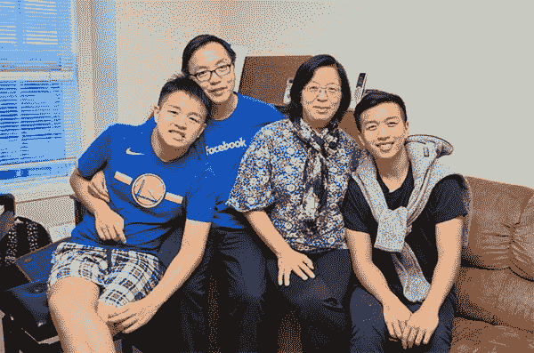
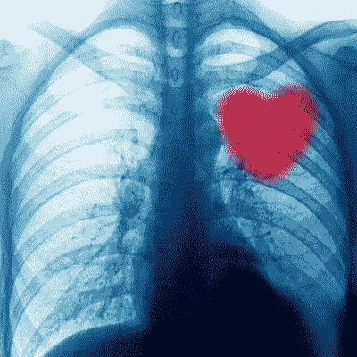
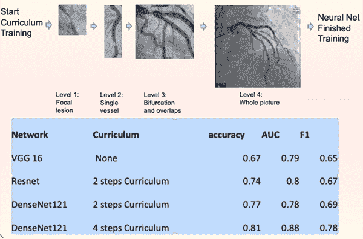
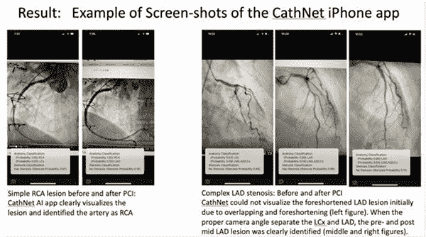

# 采访保罗·李——医生、心脏病专家和深度学习研究员

> 原文：<https://pyimagesearch.com/2019/11/22/an-interview-with-paul-lee-doctor-cardiologist-and-deep-learning-researcher/>

在今天的博文中，我采访了 Paul Lee 博士，他是 PyImageSearch 的读者和纽约西奈山医学院附属的介入心脏病专家。

李博士最近在宾夕法尼亚州费城著名的美国心脏协会科学会议上展示了他的研究，他在会上演示了卷积神经网络如何能够:

*   自动分析和解释冠状动脉造影照片
*   检测患者动脉中的堵塞
*   **并最终帮助*减少*和*预防*心脏病**

此外，**李博士已经证明了*自动血管造影分析*可以部署到智能手机上，**使医生和技术人员比以往任何时候都更容易分析、解释和理解心脏病发作的风险因素。

李博士的工作确实非常出色，为计算机视觉和深度学习算法铺平了道路，以帮助减少和预防心脏病发作。

让我们热烈欢迎李博士分享他的研究。

## 采访保罗·李——医生、心脏病专家和深度学习研究员

阿德里安:嗨，保罗！谢谢你接受这次采访。很高兴您能来到 PyImageSearch 博客。

保罗:谢谢你邀请我。

* * *

**Figure 1:** Dr. Paul Lee, an interventional cardiologist affiliated with NY Mount Sinai School of Medicine, along with his family.

阿德里安:介绍一下你自己，你在哪里工作，你的工作是什么？

**Paul:** 我是纽约西奈山医学院的介入心脏病专家。我在布鲁克林有一家私人诊所。

* * *

**Figure 2:** Radiologists may one day be replaced by Computer Vision, Deep Learning, and Artificial Intelligence.

**Adrian:** 你最初是如何对计算机视觉和深度学习产生兴趣的？

**Paul:** 在《纽约客》杂志 2017 年一篇题为 [*人工智能对医学博士的文章中，当诊断自动化时会发生什么？*](https://www.newyorker.com/magazine/2017/04/03/ai-versus-md) ，乔治·辛顿评论说“他们现在应该停止培训放射科医生”。我意识到总有一天人工智能会取代我。我想成为控制人工智能的人，而不是被取代的人。

* * *

阿德里安:你最近在美国心脏协会上展示了你的作品《自动心脏冠状动脉造影分析》。你能给我们讲讲吗？

保罗:两年前开始上你的课程后，我开始熟悉计算机视觉技术。我决定把你教的东西应用到心脏病学上。

作为一名心脏病专家，我进行冠状动脉造影，以诊断我的病人是否有可能导致心脏病发作的心脏动脉堵塞。我想知道我是否可以应用人工智能来解释冠状动脉造影照片。

尽管困难重重，但由于你的持续支持，神经网络学会了可靠地解释这些图像。

我被邀请在今年费城的美国心脏协会科学会议上展示我的研究。这是心脏病专家最重要的研究会议。我的海报题为*卷积神经网络用于冠状动脉造影的解释(CathNet)* 。

(流通。2019;140:a 12950；[https://ahajournals.org/doi/10.1161/circ.140.suppl_1.12950](https://ahajournals.org/doi/10.1161/circ.140.suppl_1.12950))；海报如下:【https://github.com/AICardiologist/Poster-for-AHA-2019

* * *

**Figure 3:** Normal coronary angiogram *(left)* and stenotic coronary artery *(right)*. Interpretation of angiograms can be subjectives and difficult. Computer vision algorithms can be used to make analyzations more accurate.

阿德里安:你能告诉我们更多关于心脏冠状动脉造影的信息吗？这些图像是如何捕捉的，计算机视觉/深度学习算法如何更好/更有效地分析这些图像(与人类相比)？

**Paul:** 为了明确诊断和治疗冠状动脉疾病(例如，在心脏病发作期间)，心脏病专家进行冠状动脉血管造影，以确定解剖结构和狭窄程度。在手术过程中，心脏病专家从手腕或腿部插入一根狭窄的导管。通过导管，我们将造影剂注入冠状动脉，图像由 x 光捕捉。**然而，血管造影照片的解释有时很困难:计算机视觉有可能使这些决定更加客观和准确。**

**图 3** *(左)*显示正常的冠状动脉造影照片，而**图 3** *(右)*显示狭窄的冠状动脉。

* * *

阿德里安:你的研究中最困难的方面是什么，为什么？

保罗:我只有大约 5000 张照片。

起初，我们不知道为什么在获得高精度方面会有这么多困难。我们认为我们的图像没有经过适当的预处理，或者有些图像很模糊。

后来，我们意识到我们的图像没有问题:问题是 ConvNets 需要大量数据来学习一些对我们人类来说简单的东西。

确定图像中的冠状动脉树中是否有狭窄在计算上是复杂的。因为样本大小取决于分类的复杂性，所以我们很努力。我们必须找到一种用非常有限的样本训练神经网络的方法。

* * *

阿德里安:你花了多长时间来训练你的模型和进行你的研究？

保罗:花了一年多的时间。一半时间用于收集和预处理数据，一半时间用于训练和调整模型。我会收集数据，训练和调整我的模型，收集更多的数据或以不同的方式处理数据，并改进我以前的模型，并不断重复这个循环。

* * *

**Figure 4:** Utilizing curriculum learning to improve model accuracy.

阿德里安:如果你必须选择你在研究过程中应用的最重要的技术，那会是什么？

**Paul:** 我搜遍了 PyImageSearch，寻找用小样本数训练 ConvNets 的技术技巧:迁移学习，图像增强，用 SGD 代替 Adam，学习率计划表，提前停止。

每项技术都有助于 F1 分数的小幅提高，但我只达到了大约 65%的准确率。

我查看了 Kaggle 竞赛解决方案，寻找技术技巧。最大的突破来自一种叫做“课程学习”的技术我首先训练 DenseNet 解释一些非常简单的事情:*“在那一小段直的动脉中有狭窄吗？”那只需要大约一百个样本。*

然后我用有更多分支的更长的动脉段来训练这个预先训练好的网络。课程逐渐建立复杂性，直到学会在复杂图形的背景下解释狭窄。**这种方法极大地提高了我们的测试准确率，达到 82%。**也许预训练步骤通过将信息输入神经网络降低了计算复杂性。

文献中的“课程学习”其实有所不同:它一般是指根据错误率拆分他们的训练样本，然后根据错误率递增对训练数据批次进行排序。相比之下，我实际上创建了学习材料供 ConvNet 学习，而不仅仅是根据错误率重新安排批次。我是从我学习外语的经历中得到这个想法的，而不是从计算机文献中。一开始，我很难理解用日语写的报纸文章。随着我从初级，然后到中级，最后到高级日语课程，我终于可以理解这些文章了。

* * *

**Figure 5:** Example screenshots from the CathNet iPhone app.

**Adrian:** 你的计算机视觉和深度学习工具、库和软件包的选择是什么？

Paul: 我用的是标准包:Keras，Tensorflow，OpenCV 4。

我用 Photoshop 清理图像并创建课程。

最初我使用云实例[用于培训]，但我发现我的 RTX 2080 Ti x 4 工作站更具成本效益。来自 GPU 的“全球变暖”杀死了我妻子的植物，但它大大加快了模型迭代的速度。

我们使用 Core ML 将 Tensorflow 模型转换为 iPhone 应用程序，就像您为您的[口袋妖怪识别应用程序](https://pyimagesearch.com/2018/04/23/running-keras-models-on-ios-with-coreml/)所做的一样。

我们的应用演示视频在这里:

<https://www.youtube.com/embed/CaHPezrpAY8?feature=oembed>