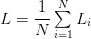

# Python 线性分类简介

> 原文：<https://pyimagesearch.com/2016/08/22/an-intro-to-linear-classification-with-python/>

我们之前学习了 [k-NN 分类器](https://pyimagesearch.com/2021/04/17/your-first-image-classifier-using-k-nn-to-classify-images/)——一个简单到根本不做任何实际“学习”的机器学习模型。我们只需将训练数据存储在模型中，然后在测试时通过将测试数据点与我们的训练数据进行比较来进行预测。

我们已经讨论了 k-NN 的许多利弊，但在大规模数据集和深度学习的背景下，k-NN 最令人望而却步的方面是*数据本身*。虽然训练可能很简单，但测试非常慢，瓶颈是向量之间的距离计算。计算训练点和测试点之间的距离与数据集中的点数成线性比例，当数据集变得非常大时，这种方法就不切实际了。虽然我们可以应用近似最近邻方法，如 [ANN](https://www.cs.umd.edu/~mount/ANN/) 、 [FLANN](https://ieeexplore.ieee.org/document/6809191) 或[airy](https://github.com/spotify/annoy)，来加速搜索，但这仍然不能缓解 k-NN 在实例化中没有维护数据副本的情况下无法工作的问题(或者至少在磁盘上有一个指向训练集的指针，等等)。).

要了解为什么在模型中存储训练数据的精确副本是一个问题，请考虑训练一个 k-NN 模型，然后将其部署到拥有 100、1，000 甚至 1，000，000 个用户的客户群。如果你的训练集只有几兆字节，这可能不是问题——但如果你的训练集是以*千兆字节*到*兆兆字节*来衡量的(正如我们应用深度学习的许多数据集的情况一样)，你就有一个真正的问题了。

考虑一下 [ImageNet 数据集](https://link.springer.com/article/10.1007%2Fs11263-015-0816-y)的训练集，它包括超过 120 万张图像。如果我们在这个数据集上训练一个 k-NN 模型，然后试图将其部署到一组用户，我们将需要这些用户下载 k-NN 模型，它在内部表示 120 万张图像的*副本*。根据您压缩和存储数据的方式，该模型的存储成本和网络开销可能高达数百千兆字节到数千兆字节。这不仅浪费资源，而且对于构建机器学习模型来说也不是最优的。

相反，更理想的方法是定义一个机器学习模型，该模型可以在训练期间从我们的输入数据中*学习* *模式*(要求我们在训练过程中花费更多时间)，但具有由*少量参数*定义的好处，这些参数可以容易地用于表示模型*，而不管训练规模*。这种类型的机器学习称为*参数化学习*，定义为:

> *用一组固定大小的参数(与训练样本的数量无关)来概括数据的学习模型称为参数模型。无论您向参数模型扔多少数据，它都不会改变它需要多少参数的想法。*
> 
> *—* [Russell and Norvig (2009)](https://www.amazon.com/dp/0136042597/)

我们将回顾参数化学习的概念，并讨论如何实现简单的线性分类器。正如我们稍后将看到的，参数化学习是现代机器学习和深度学习算法的基石。

***备注:*** 这份材料的大部分灵感来自安德烈·卡帕西在[斯坦福的 cs231n 班](https://cs231n.github.io/linear-classify/)里面的优秀线性分类笔记。非常感谢 Karpathy 和 cs231n 的其他助教整理了这么容易理解的笔记。

## **Python 线性分类简介**

我已经使用过“参数化”这个词几次了，但是它到底是什么意思呢？

**简单来说:** ***参数化*** **就是定义给定模型必要参数的过程。**在机器学习的任务中，参数化涉及根据四个关键部分定义问题:*数据*，一个*评分函数*，一个*损失函数*，以及*权重和偏差*。我们将在下面逐一回顾。

**数据**

这个组件是我们将要学习的输入数据。该数据包括*和*数据点(即图像的原始像素强度、提取的特征等。)及其相关的类标签。通常我们用多维 **[设计矩阵](https://www.deeplearningbook.org/)** 来表示我们的数据。

设计矩阵中的每一行代表一个数据点，而矩阵的每一列(其本身可以是多维数组)对应于一个不同的特征。例如，考虑 RGB 颜色空间中 100 个图像的数据集，每个图像的大小为 *32×32* 像素。该数据集的设计矩阵将是 *X ⊆ R ^(100×(32×32×3))* ，其中 *X [i]* 定义了 *R* 中的第 *i* 幅图像。使用此符号， *X* [1] 是第一个图像，*X*2 是第二个图像，依此类推。

除了设计矩阵，我们还定义了一个向量 *y* ，其中*y**I为数据集中的第 *i* 个示例提供了类标签。*

**计分功能**

评分函数接受我们的数据作为输入，并将数据映射到类标签。例如，给定我们的输入图像集，评分函数获取这些数据点，应用某个函数 *f* (我们的评分函数)，然后返回预测的类别标签，类似于下面的伪代码:

```py
INPUT_IMAGES => F(INPUT_IMAGES) => OUTPUT_CLASS_LABELS
```

**损失函数**

损失函数量化了我们的*预测类别标签*与我们的*真实类别标签*的吻合程度。这两组标签之间的一致程度越高，*就会降低我们的损失*(并且提高我们的分类精度，至少在训练集上是如此)。

我们在训练机器学习模型时的目标是*最小化损失函数*，从而提高我们的分类精度。

**权重和偏差**

通常表示为 ***W*** 的权重矩阵和偏置向量 ***b*** 被称为我们将实际优化的分类器的**权重**或**参数**。基于我们的得分函数和损失函数的输出，我们将调整和摆弄权重和偏差的值，以提高分类的准确性。

根据您的模型类型，可能存在更多的参数，但在最基本的层面上，这些是您通常会遇到的参数化学习的四个构件。一旦我们定义了这四个关键部分，我们就可以应用优化方法，这些方法允许我们找到一组参数**和 ***b*** ，这些参数使我们的损失函数相对于我们的得分函数最小化(同时增加我们的数据的分类精度)。**

 **接下来，让我们看看这些组件如何一起工作来构建一个线性分类器，将输入数据转换为实际的预测。

### **线性分类:从图像到标签**

在这一节中，我们将探讨机器学习的参数化模型方法的更多数学动机。

开始，我们需要我们的 ***数据*** 。让我们假设我们的训练数据集被表示为*x[I]，其中每个图像具有相关联的类别标签*y[I]。我们将假设 *i = 1，…，N* 和 *y [i] = 1，…，K* ，这意味着我们有 *N* 个维度为 *D* 的数据点，被分成 *K* 个唯一的类别。**

为了使这个想法更加具体，考虑一下来自[图像分类器](https://pyimagesearch.com/2021/04/17/your-first-image-classifier-using-k-nn-to-classify-images/)课程的“动物”数据集。在这样的数据集中，我们可能有 *N = 3，000* 个图像。每幅图像都是 *32×32* 像素，在 RGB 颜色空间中表示(即每幅图像三个通道)。我们可以将每幅图像表示为 *D = 32×32×3 = 3，072* 个不同的值。最后，我们知道总共有 *K = 3* 类标签:一个分别用于狗、猫和熊猫类。

给定这些变量，我们现在必须定义一个评分函数 *f* ，它将图像映射到类标签分数。完成该评分的一种方法是通过简单的线性映射:

**【①**

 **让我们假设每个 *x [i]* 被表示为具有形状[ *D×1* ]的单个列向量(在这个示例中，我们将把 *32×32×3* 图像展平为 3072 个整数的列表)。我们的权重矩阵 ***W*** 将具有[ *K×D* ]的形状(类别标签的数量取决于输入图像的维度)。最后 ***b*** ，**偏置向量**的大小为[ *K×1* ]。偏差向量允许我们在一个或另一个方向上移动和平移我们的得分函数，而不会实际影响我们的权重矩阵 ***W*** 。偏差参数通常对成功学习至关重要。

回到动物数据集示例，每个 *x [i]* 由 3072 个像素值的列表表示，因此 *x [i]* 具有形状*3072×1*。权重矩阵 ***W*** 将具有[*3×3072*]的形状，并且最终偏置向量 ***b*** 将具有[ *3×1* ]的大小。

**图 1** 跟随线性分类评分函数 *f* 的图示。在*左侧*，我们有我们的原始输入图像，表示为 *32×32×3* 图像。然后我们*将这个图像展平*成一个 3072 像素亮度的列表，方法是获取 3D 阵列并将其重新成形为 1D 列表。

我们的权重矩阵 ***W*** 包含三行(每个类别标签一行)和 3072 列(图像中的每个像素一列)。取 ***W*** 和 *x* *[i]* 之间的点积后，我们在偏差向量**中加入——结果就是我们实际的**得分函数**。我们的评分函数在右边的*产生三个值:分别与狗、猫和熊猫标签相关的分数。***

 *****备注:*** 不熟悉取点积的读者，不妨看看这篇快速简洁的[教程](http://pyimg.co/fgcvp)。对于有兴趣深入学习线性代数的读者，我强烈推荐通过 Philip N. Klein (2013) 的《应用于计算机科学的矩阵线性代数的编码。

看着**图 1** 和**方程(1)** ，你可以说服自己，输入*x[I]和*y[I]是*固定的*和*不是我们可以修改*的东西。当然，我们可以通过对输入图像应用各种变换来获得不同的*x[I]*——但是一旦我们将图像传递到评分函数中，**这些值不会改变**。事实上，我们唯一可以控制的参数(就参数化学习而言)是我们的权重矩阵 ***W*** 和我们的偏差向量 ***b*** 。因此，我们的目标是利用我们的得分函数和损失函数来*优化*(即，以系统的方式修改)权重和偏差向量，使得我们的分类准确度*增加*。**

确切地说，我们如何优化权重矩阵取决于我们的损失函数，但通常涉及某种形式的梯度下降。

### **参数化学习和线性分类的优势**

利用参数化学习有两个主要优势:

1.  一旦我们完成了对模型的训练，我们可以丢弃输入数据，只保留权重矩阵 *W* 和偏差向量*b*。这个*大大地*减少了我们模型的大小，因为我们需要存储两组向量(相对于*整个*训练集)。
2.  **分类新的测试数据是*快*。**为了执行分类，我们需要做的就是取 ***W*** 和 *x [i]* 的点积，然后加上 bias***b****(即应用我们的评分函数)。这样做比需要将每个测试点与 k-NN 算法中的每个训练样本进行比较要快得多(T20)。*

 *### **用 Python 实现的简单线性分类器**

现在我们已经回顾了参数化学习和线性分类的概念，让我们使用 Python 实现一个*非常简单的*线性分类器。

这个例子的目的是*而不是*展示我们如何从头到尾训练一个模型。这个例子的目的是展示我们如何初始化一个权重矩阵 ***W*** ，偏置向量 ***b*** ，然后使用这些参数通过一个简单的点积对图像进行分类。

让我们开始这个例子。我们在这里的目标是编写一个 Python 脚本，将**图 2** 正确分类为*的“狗”*

要了解我们如何完成这种分类，请打开一个新文件，将其命名为`linear_example.py`，并插入以下代码:

```py
# import the necessary packages
import numpy as np
import cv2

# initialize the class labels and set the seed of the pseudorandom
# number generator so we can reproduce our results
labels = ["dog", "cat", "panda"]
np.random.seed(1)
```

**第 2 行和第 3 行**导入我们需要的 Python 包。我们将使用 NumPy 进行数值处理，并使用 OpenCV 从磁盘加载示例图像。

**第 7 行**初始化“Animals”数据集的目标类别标签列表，而**第 8 行**为 NumPy 设置伪随机数发生器，确保我们可以重现该实验的结果。

接下来，让我们初始化权重矩阵和偏差向量:

```py
# randomly initialize our weight matrix and bias vector -- in a
# *real* training and classification task, these parameters would
# be *learned* by our model, but for the sake of this example,
# let's use random values
W = np.random.randn(3, 3072)
b = np.random.randn(3)
```

**第 14 行**用正态分布的随机值初始化权重矩阵`W`，均值和单位方差为零。神经网络内部的权重可以取负值、正值和零值。这个权重矩阵有`3`行(每个类别标签一行)和`3072`列(我们的 *32×32×3* 图像中的每个像素一行)。

然后我们初始化**行 15** 上的偏差向量——这个向量也随机填充了在标准正态分布上采样的值。我们的偏差向量有`3`行(对应于类别标签的数量)和一列。

如果我们从零开始训练这个线性分类器*，我们将需要*通过优化过程学习`W`和`b`的值*。然而，由于我们还没有达到训练模型的优化阶段，我已经用值`1`初始化了伪随机数发生器，以确保随机值给我们“正确”的分类(我提前测试了随机初始化值，以确定哪个值给我们正确的分类)。目前，简单地将权重矩阵`W`和偏置向量`b`视为以神奇的方式优化的“黑盒数组”——我们将拉开帷幕，揭示这些参数是如何在未来的课程中学习的。*

 *既然我们的权重矩阵和偏差向量已经初始化，让我们从磁盘加载我们的示例图像:

```py
# load our example image, resize it, and then flatten it into our
# "feature vector" representation
orig = cv2.imread("beagle.png")
image = cv2.resize(orig, (32, 32)).flatten()
```

**第 19 行**通过`cv2.imread`从磁盘加载我们的图像。然后，我们在第 20 行的**上将图像调整为 *32×32* 像素(忽略纵横比)——我们的图像现在表示为一个`(32, 32, 3)` NumPy 数组，我们将其展平为一个 3072 维的向量。**

下一步是通过应用我们的评分函数来计算输出类标签分数:

```py
# compute the output scores by taking the dot product between the
# weight matrix and image pixels, followed by adding in the bias
scores = W.dot(image) + b
```

**第 24 行**是评分函数本身——它只是权重矩阵`W`和输入图像像素强度之间的点积，然后加上偏差`b`。

最后，我们的最后一个代码块处理将每个类标签的评分函数值写入我们的终端，然后将结果显示在我们的屏幕上:

```py
# loop over the scores + labels and display them
for (label, score) in zip(labels, scores):
	print("[INFO] {}: {:.2f}".format(label, score))

# draw the label with the highest score on the image as our
# prediction
cv2.putText(orig, "Label: {}".format(labels[np.argmax(scores)]),
	(10, 30), cv2.FONT_HERSHEY_SIMPLEX, 0.9, (0, 255, 0), 2)

# display our input image
cv2.imshow("Image", orig)
cv2.waitKey(0)
```

要执行我们的示例，只需发出以下命令:

```py
$ python linear_example.py 
[INFO] dog: 7963.93
[INFO] cat: -2930.99
[INFO] panda: 3362.47
```

请注意*狗*类如何具有*最大得分函数值*，这意味着“狗”类将被我们的分类器选为预测。事实上，我们可以在**图 3** 中的**图 2** 上看到正确绘制的文本`dog`。

再次提醒，请记住这是一个*的工作示例*。我 ***特意*** 设置我们的 Python 脚本的随机状态，以生成将导致正确分类的`W`和`b`值(您可以更改**行 8** 上的伪随机种子值，亲自查看不同的随机初始化将如何产生不同的输出预测)。

实际上，你*永远不会*初始化你的`W`和`b`值，并且*认为*会在没有某种学习过程的情况下给你正确的分类。相反，当从头开始训练我们自己的机器学习模型时，我们需要*优化*和*通过优化算法(如梯度下降)学习* `W`和`b`。

我们将在未来的课程中介绍优化和梯度下降，但同时，请花时间确保您理解了第 24 行的**以及线性分类器如何通过获取权重矩阵和输入数据点之间的点积，然后添加偏差来进行分类。因此，我们的*整个模型*可以通过两个值来定义:权重矩阵和偏差向量。当我们从零开始训练机器学习模型时，这种表示不仅*简洁*，而且*强大*。**

## **损失函数的作用**

在上一节中，我们讨论了参数化学习的概念。这种类型的学习允许我们获取多组输入数据和类别标签，并通过定义一组参数并对其进行优化，实际学习一个将*输入映射到*输出预测的函数。

但是为了通过我们的评分函数实际“学习”从输入数据到类标签的映射，我们需要讨论两个重要的概念:

1.  损失函数
2.  优化方法

让我们探讨一下在构建神经网络和深度学习网络时会遇到的常见损失函数。

我们的探索是对损失函数及其在参数化学习中的作用的简要回顾。如果你希望用更严格的数学推导来补充这一课，我强烈推荐[吴恩达的 Coursera 课程](https://www.coursera.org/learn/machine-learning)、[威滕等人(2011)](https://www.amazon.com/Data-Mining-Practical-Techniques-Management/dp/0123748569/ref=sr_1_1?dchild=1&keywords=ISBN%3A+9780123748560&qid=1617456349&s=books&sr=1-1) 、[哈林顿(2012)](https://www.amazon.com/1617290181-9781617290183-Machine-Learning-Paperback/dp/B07L5M2XZ3/) 和[马斯兰德(2009)](https://www.amazon.com/Machine-Learning-Algorithmic-Perspective-Recognition/dp/1420067184/) 。

### 什么是损失函数？

在最基本的层面上，损失函数量化了给定预测器在对数据集中的输入数据点进行分类时的好坏程度。图 4 显示了在 CIFAR-10 数据集上训练的两个独立模型的损失函数随时间的变化情况。损失越小，分类器在对输入数据和输出类别标签之间的关系建模方面就越好(尽管有一点我们可以*过度拟合*我们的模型——通过对训练数据*过于接近*建模，我们的模型失去了概括的能力)。相反，我们的损失越大，*就需要做更多的工作*来提高分类精度。

为了提高我们的分类精度，我们需要调整我们的权重矩阵 ***W*** 或偏差向量 ***b*** 的参数。确切地说*我们如何*着手更新这些参数是一个*优化* *问题*，我们将在以后的课程中讨论这个问题。目前，简单地理解一个*损失函数*可以用来量化我们的*评分函数*在分类输入数据点方面做得有多好。

理想情况下，随着我们调整模型参数，我们的损失应该会随着时间的推移而减少。如**图 4** 所示，**模型#1** 的损失开始略高于**模型#2** ，但随后迅速下降，并在 CIFAR-10 数据集上训练时继续保持较低水平。相反，**型号#2** 的损失最初会降低，但很快会停滞。在此特定示例中，**模型#1** 实现了更低的总体损失，并且可能是用于对来自 CIFAR-10 数据集的其他图像进行分类的更理想的模型。我说“可能”是因为**模型#1** 有可能过度拟合训练数据。我们将在以后的课程中讨论过度拟合的概念以及如何发现它。

### **多级 SVM 损耗**

多类 SVM 损失(顾名思义)的灵感来自于(线性)[支持向量机(SVMs)](http://dx.doi.org/10.1023/A:1022627411411) ，它使用一个评分函数 *f* 将我们的数据点映射到每个类标签的数值分数。这个函数 *f* 是一个简单的学习映射:

**② = W x_i +b")**

 **现在我们有了评分函数，我们需要确定这个函数在进行预测时有多“好”或“坏”(给定权重矩阵***【W】****和偏差向量 ***b*** )。为了做出这个决定，我们需要一个*损失函数*。*

 *回想一下，当创建机器学习模型时，我们有一个*设计矩阵* ***X*** ，其中 ***X*** 中的每一行都包含一个我们希望分类的数据点。在图像分类的上下文中， ***X*** 中的每一行都是一个图像，我们寻求正确地标记这个图像。我们可以通过语法 *x* *[i]* 来访问 ***X*** 里面的第 *i* 个图像。

同样，我们也有一个向量***【y】****，其中包含了我们对每个***【X】***的类标签。这些 ***y*** 值是我们的*基础事实标签*并且我们希望我们的评分函数能够正确预测。就像我们可以通过*x[I]来访问给定的图像一样，我们可以通过*y[I]来访问相关的类标签。***

 *为了简单起见，让我们将我们的评分函数缩写为 *s* :

( **3** ) ")

这意味着我们可以通过第 *i* 个数据点获得第 *j* 类的预测得分:

( **4** ) _{j}")

使用这种语法，我们可以把所有这些放在一起，得到 ***铰链损失函数*** :

( **5** ) ")

***备注:*** 几乎所有的损失函数都包含一个正则项。我现在跳过这个想法，因为当我们更好地理解损失函数时，我们将在未来的课程中回顾正则化。

看着上面的铰链损耗公式，你可能会对它的实际作用感到困惑。本质上，铰链损失函数是对所有*个不正确的类*(*I≦**j*)**求和，并比较我们为第 *j* 个类标签(不正确的类)和第 *y [i]* 个类(正确的类)返回的评分函数 *s* 的输出。我们应用`max` 操作将值箝位在零，这对于确保我们不累加负值很重要。**

 **当损失 *L [i]* = 0 时，给定的*x[I]被正确分类(我将在下一节提供一个数值例子)。为了得到整个训练集的损失，我们简单地取每个个体的平均值:*

**(6)** 

你可能遇到的另一个相关损失函数是 ***平方铰链损失*** :

**^{2}")(7)**

 **平方项通过对输出进行平方来更严重地惩罚我们的损失，这导致预测不正确时损失的二次增长(相对于线性增长)。

至于您应该使用哪个损失函数，这完全取决于您的数据集。标准铰链损失函数通常被更多地使用，但在某些数据集上，平方变化可能会获得更好的精度。总的来说，这是一个您应该考虑调整的*超参数*。

**多级 SVM 损失示例**

现在我们已经了解了铰链损耗背后的数学原理，让我们来看一个实际例子。我们将再次使用“动物”数据集，该数据集旨在将给定图像分类为包含一只*猫*、*狗*或*熊猫*。首先，请看图 5 中的**，这里我已经包含了来自“动物”数据集的三个类的三个训练示例。**

给定一些任意的权重矩阵 ***W*** 和偏置向量 ***b*** ， *f* ( *x，W*)=*W x*+*b*的输出分数显示在矩阵体中。*分数越大*，*越有信心*我们的评分函数是关于预测的。

让我们从计算“狗”类的损失*L[I]开始:*

```py
>>> max(0, 1.33 - 4.26 + 1) + max(0, -1.01 - 4.26 + 1)
0
```

请注意我们的等式是如何包含两项的——狗的预测得分与猫和熊猫的得分之差。此外，观察“狗”的损失如何为*零*——这意味着狗被正确预测。对来自**图 5** 的*图片#1* 的快速调查证明了这一结果是正确的:“狗”的得分高于“猫”和“熊猫”的得分。

类似地，我们可以计算出*图像#2* 的铰链损耗，其中包含一只猫:

```py
>>> max(0, 3.76 - (-1.20) + 1) + max(0, -3.81 - (-1.20) + 1)
5.96
```

在这种情况下，我们的损失函数大于零，说明我们的预测*不正确*。查看我们的评分函数，我们看到我们的模型预测*狗*为建议的标签，评分为 3 *。* 76(因为这是得分最高的标签)。我们知道这个标签是不正确的，在未来的课程中，我们将学习如何自动调整我们的权重来纠正这些预测。

最后，让我们以熊猫为例计算铰链损耗:

```py
>>> max(0, -2.37 - (-2.27) + 1) + max(0, 1.03 - (-2.27) + 1)
5.199999999999999
```

同样，我们的损失是非零的，所以我们知道我们有一个不正确的预测。查看我们的评分函数，我们的模型错误地将这张图像标记为“猫”，而它应该是“熊猫”

然后，我们可以通过取平均值来获得三个示例的总损失:

```py
>>> (0.0 + 5.96 + 5.2) / 3.0
3.72
```

因此，给定我们的三个训练示例，我们的总铰链损耗为 3 *。* 72 为参数 ***W*** 和 ***b*** 。

还要注意，我们的损失只有三幅输入图像中的*幅*幅为零，这意味着我们预测的*幅*幅是不正确的。在未来的课程中，我们将学习如何优化 ***W*** 和 ***b*** 以使用损失函数做出更好的预测，帮助我们朝着正确的方向前进。

### **交叉熵损失和 Softmax 分类器**

虽然铰链损失非常普遍，但在深度学习和卷积神经网络的背景下，你更有可能遇到交叉熵损失和 Softmax 分类器。

这是为什么呢？简单来说:

**Softmax 分类器给你每个类标签的** ***概率*** **，而铰链损耗给你** ***余量*** **。**

对我们人类来说，解释概率比解释分数要容易得多。此外，对于像 ImageNet 这样的数据集，我们经常查看卷积神经网络的 5 级精度(其中我们检查地面实况标签是否在网络为给定输入图像返回的前 5 个预测标签中)。查看(1)真正的类别标签是否存在于前 5 个预测中，以及(2)与每个标签相关联的*概率*是否是一个很好的属性。

**了解交叉熵损失**

Softmax 分类器是二进制形式的逻辑回归的推广。就像在铰链损失或平方铰链损失中一样，我们的映射函数 *f* 被定义为，它获取一组输入数据*x**I*并通过数据 *x* *[i]* 和权重矩阵 ***W*** 的点积将它们映射到输出类别标签(为简洁起见省略了偏差项):

**(8)**  = W x_i")

然而，与铰链损失不同，我们可以将这些分数解释为每个类别标签的*非标准化对数概率*，这相当于用交叉熵损失替换铰链损失函数:

**(9)** ")

那么，我是怎么来到这里的呢？让我们把功能拆开来看看。首先，我们的损失函数应该最小化正确类别的负对数可能性:

** ")(10)**

 **概率陈述可以解释为:

** = e^{s_{y_{i}}} / \sum\limits_{j} e^{s_{j}}")(11)**

 **我们使用标准的评分函数形式:

**")(12)**

 **总的来说，这产生了一个*单个*数据点的最终损失函数，如上所示:

**")(13)**

 **请注意，这里的对数实际上是以 *e* 为底的(自然对数)，因为我们之前对 *e* 取了幂的倒数。通过指数之和的实际取幂和归一化是我们的 *Softmax 函数*。负对数产生我们实际的*交叉熵损失*。

正如铰链损失和平方铰链损失一样，计算整个数据集的交叉熵损失是通过取平均值来完成的:

**(14)**

 **再次，我故意从损失函数中省略正则项。我们将在未来的课程中回到正则化，解释它是什么，如何使用它，以及为什么它对神经网络和深度学习至关重要。如果上面的等式看起来很可怕，不要担心——我们将在下一节通过数字示例来确保您理解交叉熵损失是如何工作的。

**一个工作过的 Softmax 例子**

为了演示实际的交叉熵损失，考虑图 6 。我们的目标是分类上面的图像是否包含一只*狗*、*猫*或*熊猫*。很明显，我们可以看到图像是一只“熊猫”— *但是我们的 Softmax 分类器是怎么想的呢？为了找到答案，我们需要逐一查看图中的四个表格。*

第一个表包括我们的评分函数 *f* 的输出，分别用于三个类中的每一个。这些值是我们的三个类别的*非标准化对数概率*。让我们对评分函数的输出( *e* *^(s)* ，其中 *s* 是我们的评分函数值)，产生我们的*非规范化概率* ( *第二个表*)。

下一步是取**等式(11)** 的分母，对指数求和，并除以和，从而产生与每个类标签 ( *第三表*)相关联的*实际概率。注意概率总和是多少。*

最后，我们可以取负的自然对数，*-*ln(*p*)，其中 *p* 是归一化的概率，产生我们的最终损失(第四个*和最后一个表*)。

在这种情况下，我们的 Softmax 分类器将以 93.93%的置信度正确地将图像报告为*熊猫*。然后，我们可以对训练集中的所有图像重复这一过程，取平均值，并获得训练集的总体交叉熵损失。这个过程允许我们量化一组参数在我们的训练集上表现的好坏。

***备注:*** 我使用了一个随机数生成器来获得这个特定示例的得分函数值。这些值仅用于演示如何执行 Softmax 分类器/交叉熵损失函数的计算。实际上，这些值*不是*随机生成的，而是基于参数 ***W*** *和* ***b*** 的评分函数 *f* 的输出。

## **总结**

在本课中，我们回顾了参数化学习的四个组成部分:

1.  数据
2.  评分功能
3.  损失函数
4.  权重和偏差

在图像分类的上下文中，我们的输入数据是我们的图像数据集。评分函数为给定的输入图像产生*预测*。然后损失函数*量化*一组预测对数据集的好坏程度。最后，权重矩阵和偏置向量使我们能够从输入数据中实际“学习”——这些参数将通过优化方法进行调整和调谐，以获得更高的分类精度。

然后我们回顾了两个流行的损失函数:*铰链损失*和*交叉熵损失*。虽然铰链损失在许多机器学习应用程序(例如，支持向量机)中使用，但我几乎可以绝对肯定地保证，你会看到更多频率的交叉熵损失，主要是因为 Softmax 分类器输出的是*概率*而不是*余量*。概率对于我们人类来说更容易解释，所以这个事实是交叉熵损失和 Softmax 分类器的一个特别好的特性。更多关于铰链损耗和交叉熵损耗的信息，请参考**斯坦福大学的 CS231n 课程([http://cs231n.stanford.edu](http://cs231n.stanford.edu)、[https://cs231n.github.io/linear-classify](https://cs231n.github.io/linear-classify/)**)**。**

在未来的课程中，我们将回顾用于调整权重矩阵和偏差向量的优化方法。优化方法允许我们的算法通过基于我们的得分和损失函数的输出更新权重矩阵和偏差向量，实际上从我们的输入数据中学习。使用这些技术，我们可以对获得更低损耗和更高精度的参数值采取*增量步骤*。优化方法是现代神经网络和深度学习的基石，没有它们，我们将无法从输入数据中学习模式。**************************