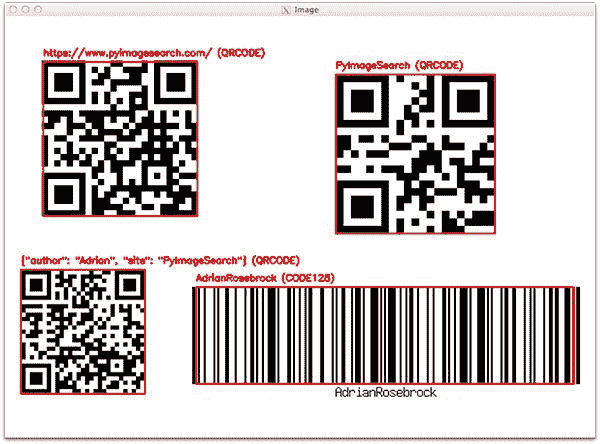
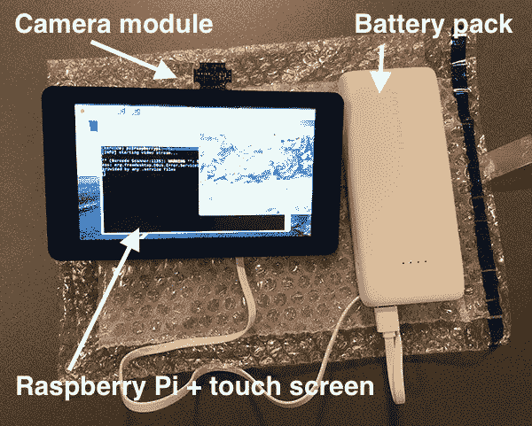
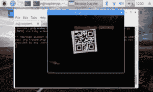
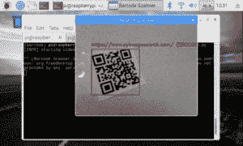
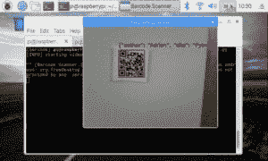
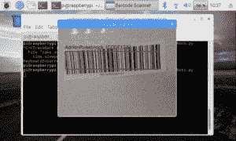

# 带有 ZBar 的 OpenCV 条形码和 QR 码扫描仪

> 原文：<https://pyimagesearch.com/2018/05/21/an-opencv-barcode-and-qr-code-scanner-with-zbar/>


今天这篇关于用 OpenCV 读取条形码和二维码的博文是受到了我从 PyImageSearch 阅读器 Hewitt 那里收到的一个问题的启发:

> 嘿，阿德里安，我真的很喜欢图片搜索博客。我每周都期待你的邮件。继续做你正在做的事情。
> 
> 我有个问题要问你:
> 
> OpenCV 有没有可以用来读取条形码或者二维码的模块？或者我需要使用一个完全独立的库吗？
> 
> 谢谢艾利安。

好问题，休伊特。

简单的回答是*没有*，OpenCV 没有任何可以用来读取和解码条形码和二维码的专用模块。

*然而*，OpenCV 能做的是**方便读取条形码和二维码的过程**，包括从磁盘加载图像，从视频流中抓取新的一帧，并对其进行处理。

一旦我们有了图像或帧，我们就可以**将它传递给专用的 Python 条形码解码库，比如 Zbar。**

然后，ZBar 库将解码条形码或 QR 码。OpenCV 可以返回来执行任何进一步的处理并显示结果。

如果这听起来像一个复杂的过程，它实际上非常简单。ZBar 库及其各种分支和变体已经走过了漫长的道路。其中一套 ZBar 绑定，`pyzbar`，是我个人最喜欢的。

在今天的教程中，我将向您展示如何使用 OpenCV 和 ZBar 读取条形码和二维码。

另外，我还将演示如何将我们的条形码扫描仪部署到 Raspberry Pi 上！

**要了解更多关于使用 OpenCV 和 ZBar 读取条形码和二维码的信息，*请继续阅读。***

## 带有 ZBar 的 OpenCV 条形码和 QR 码扫描仪

今天的博文分为四个部分。

在第一部分，我将向您展示如何安装 [ZBar 库](http://zbar.sourceforge.net/)(使用 Python 绑定)。

ZBar 库将与 OpenCV 一起用于扫描和解码条形码和 QR 码。

一旦 ZBar 和 OpenCV 被正确配置，我将演示如何在*单幅图像*中扫描条形码和 QR 码。

从单幅图像开始会给我们提供为下一步做准备所需的练习:用 OpenCV 和 ZBar 实时读取条形码和二维码，

最后，我将演示如何将我们的实时条形码扫描器部署到 Raspberry Pi。

### 为条形码解码安装 ZBar(使用 Python 绑定)

几周前，来自 LearnOpenCV 博客的 Satya Mallick 发布了一篇关于使用 ZBar 库扫描条形码的非常棒的教程。

在今天的帖子中安装 ZBar 的说明主要是基于他的说明，但是有一些更新，最大的一个是关于我们如何安装 Python `zbar`绑定本身，确保我们可以:

1.  **使用 Python 3** (官方`zbar` Python 绑定只支持 Python 2.7)
2.  **检测并准确定位**条形码在图像中的位置。

安装必要的软件是一个简单的三步过程。

**第一步:**从`apt`或`brew`库安装`zbar`

**为 Ubuntu 或 Raspbian 安装 ZBar】**

安装 ZBar for Ubuntu 可以通过以下命令完成:

```py
$ sudo apt-get install libzbar0

```

**为 macOS 安装 ZBar】**

使用 brew 安装 ZBar for macOS 同样简单(假设您安装了 Homebrew):

```py
$ brew install zbar

```

**步骤 2(可选):**创建一个虚拟环境并安装 OpenCV

您有两种选择:

1.  使用一个已经准备好 OpenCV 的现有虚拟环境(跳过这一步，直接进入**步骤 3** )。
2.  或者创建一个新的、隔离的虚拟环境，包括安装 OpenCV。

虚拟环境是 Python 开发的最佳实践，我强烈建议您利用它们。

我选择创建一个新的、隔离的 Python 3 虚拟环境，并遵循链接在[本页](https://pyimagesearch.com/opencv-tutorials-resources-guides/)的 Ubuntu(或 macOS，取决于我使用的机器)OpenCV 安装说明。在遵循这些说明时，我所做的唯一改变是将我的环境命名为`barcode`:

```py
$ mkvirtualenv barcode -p python3

```

***注意:**如果您的系统上已经安装了 OpenCV，您可以跳过 OpenCV 编译过程，只需将您的`cv2.so`绑定符号链接到新 Python 虚拟环境的`site-packages`目录中。*

**第三步:**安装`pyzbar`

现在我的机器上有了一个名为`barcode`的 Python 3 虚拟环境，我激活了`barcode`环境(您的可能有不同的名称)并安装了`pyzbar`:

```py
$ workon barcode
$ pip install pyzbar

```

如果您没有使用 Python 虚拟环境，您可以:

```py
$ pip install pyzbar

```

如果你试图将`pyzbar`安装到 Python 的系统版本中，确保你也使用了`sudo`命令。

### 用 OpenCV 解码单幅图像中的条形码和 QR 码

[](https://pyimagesearch.com/wp-content/uploads/2018/05/barcode_scanner_output.jpg)

**Figure 1:** Both QR and 1D barcodes can be read with our Python app using ZBar + OpenCV.

在我们实现实时条形码和二维码读取之前，让我们先从一台*单图像*扫描仪开始，先试一试。

打开一个新文件，将其命名为`barcode_scanner_image.py`，并插入以下代码:

```py
# import the necessary packages
from pyzbar import pyzbar
import argparse
import cv2

# construct the argument parser and parse the arguments
ap = argparse.ArgumentParser()
ap.add_argument("-i", "--image", required=True,
	help="path to input image")
args = vars(ap.parse_args())

```

在第 2-4 行上，我们导入我们需要的包。

`pyzbar`和`cv2` (OpenCV)都需要按照上一节中的说明进行安装。

相比之下，`argparse`包含在 Python 安装中，它负责解析命令行参数。

这个脚本(`--image`)有一个*必需的*命令行参数，它在**第 7-10 行**被解析。

在本节的最后，您将看到如何在传递包含输入图像路径的[命令行参数](https://pyimagesearch.com/2018/03/12/python-argparse-command-line-arguments/)的同时运行脚本。

现在，让我们使用输入图像并让`pyzbar`工作:

```py
# load the input image
image = cv2.imread(args["image"])

# find the barcodes in the image and decode each of the barcodes
barcodes = pyzbar.decode(image)

```

在**的第 13** 行，我们通过路径加载输入`image`(包含在我们方便的`args`字典中)。

从那里，我们调用`pyzbar.decode`找到并解码`image` ( **行 16** )中的`barcodes`。这就是泽巴所有神奇的地方。

我们还没有完成——现在我们需要解析包含在`barcodes`变量中的信息:

```py
# loop over the detected barcodes
for barcode in barcodes:
	# extract the bounding box location of the barcode and draw the
	# bounding box surrounding the barcode on the image
	(x, y, w, h) = barcode.rect
	cv2.rectangle(image, (x, y), (x + w, y + h), (0, 0, 255), 2)

	# the barcode data is a bytes object so if we want to draw it on
	# our output image we need to convert it to a string first
	barcodeData = barcode.data.decode("utf-8")
	barcodeType = barcode.type

	# draw the barcode data and barcode type on the image
	text = "{} ({})".format(barcodeData, barcodeType)
	cv2.putText(image, text, (x, y - 10), cv2.FONT_HERSHEY_SIMPLEX,
		0.5, (0, 0, 255), 2)

	# print the barcode type and data to the terminal
	print("[INFO] Found {} barcode: {}".format(barcodeType, barcodeData))

# show the output image
cv2.imshow("Image", image)
cv2.waitKey(0)

```

从第 19 行的**开始，我们循环检测到的`barcodes`。**

在这个循环中，我们继续:

1.  从`barcode.rect`对象(**第 22 行**)中提取包围盒【T1(x，y)- 坐标，使我们能够*定位*并确定*当前条码在输入图像中的*位置。
2.  在检测到的`barcode` ( **线 23** )周围的`image`上绘制一个包围盒矩形。
3.  将`barcode`解码成`"utf-8"`字符串，并提取条形码的类型(**第 27 行和第 28 行**)。在对象上调用`.decode("utf-8")`函数将字节数组转换成字符串是很关键的。您可以通过删除/注释它来进行试验，看看会发生什么——我将把这作为一个试验留给您来尝试。
4.  格式化并在图像上绘制`barcodeData`和`barcodeType`(**第 31-33 行**)。
5.  最后，输出相同的数据和类型信息到终端用于调试目的(**行 36** )。

让我们测试我们的 OpenCV 条形码扫描仪。你应该使用这篇博文底部的 ***【下载】*** 部分下载代码和示例图片。

从那里，打开您的终端并执行以下命令:

```py
$ python barcode_scanner_image.py --image barcode_example.png
[INFO] Found QRCODE barcode: {"author": "Adrian", "site": "PyImageSearch"}
[INFO] Found QRCODE barcode: https://pyimagesearch.com/
[INFO] Found QRCODE barcode: PyImageSearch
[INFO] Found CODE128 barcode: AdrianRosebrock

```

正如您在终端中看到的，所有四个条形码都被找到并被正确解码！

参考**图 1** 获取处理后的图像，该图像覆盖了我们的软件找到的每个条形码的红色矩形和文本。

### 利用 OpenCV 实时读取条形码和二维码

在上一节中，我们学习了如何为单幅图像创建一个 Python + OpenCV 条形码扫描仪。

我们的条形码和二维码扫描仪工作得很好，但它提出了一个问题，*我们能实时检测和解码条形码+二维码吗？*

要找到答案，打开一个新文件，将其命名为`barcode_scanner_video.py`，并插入以下代码:

```py
# import the necessary packages
from imutils.video import VideoStream
from pyzbar import pyzbar
import argparse
import datetime
import imutils
import time
import cv2

# construct the argument parser and parse the arguments
ap = argparse.ArgumentParser()
ap.add_argument("-o", "--output", type=str, default="barcodes.csv",
	help="path to output CSV file containing barcodes")
args = vars(ap.parse_args())

```

在第 2-8 行上，我们导入我们需要的包。

此时，回想上面的解释，你应该认得出`pyzbar`、`argparse`、`cv2`。

我们还将使用`VideoStream`以高效、线程化的方式处理视频帧的捕获。你可以[在这里](https://pyimagesearch.com/2016/01/04/unifying-picamera-and-cv2-videocapture-into-a-single-class-with-opencv/)了解更多关于视频流课程的信息。如果您的系统上没有安装`imutils`，只需使用以下命令:

```py
$ pip install imutils

```

我们将解析一个*可选的*命令行参数`--output`，它包含输出逗号分隔值(CSV)文件的路径。该文件将包含从我们的视频流中检测和解码的每个条形码的时间戳和有效载荷。如果没有指定这个参数，CSV 文件将被放在我们当前的工作目录中，文件名为`"barcodes.csv"` ( **第 11-14 行**)。

从那里，让我们初始化我们的视频流，并打开我们的 CSV 文件:

```py
# initialize the video stream and allow the camera sensor to warm up
print("[INFO] starting video stream...")
# vs = VideoStream(src=0).start()
vs = VideoStream(usePiCamera=True).start()
time.sleep(2.0)

# open the output CSV file for writing and initialize the set of
# barcodes found thus far
csv = open(args["output"], "w")
found = set()

```

在第 18 和 19 行上，我们初始化并开始我们的`VideoStream`。您可以:

*   使用你的 USB 摄像头(取消注释**第 18 行**和注释**第 19 行**
*   或者，如果你正在使用树莓 Pi(像我一样)，你可以使用 PiCamera(取消注释**行 19** 和注释**行 18** )。

我选择使用我的 Raspberry Pi PiCamera，如下一节所示。

然后我们暂停两秒钟，让摄像机预热( **Line 20** )。

我们会将找到的所有条形码写入磁盘的 CSV 文件中(但要确保不会写入重复的条形码)。这是一个(微不足道的)记录条形码的例子。当然，一旦条形码被检测和读取，您可以做任何您想做的事情，例如:

*   将其保存在 SQL 数据库中
*   将其发送到服务器
*   上传到云端
*   发送电子邮件或短信

**实际操作是任意的** —我们只是用 CSV 文件作为例子。

**请随意更新代码，以包含您希望的任何通知。**

我们打开`csv`文件在**行 24** 上写。如果您正在修改代码以追加到文件中，您可以简单地将第二个参数从`"w"`更改为`"a"`(但是您必须以不同的方式搜索文件中的重复项)。

我们还为`found`条形码初始化了一个`set`。该集合将包含唯一的条形码，同时防止重复。

让我们开始捕捉+处理帧:

```py
# loop over the frames from the video stream
while True:
	# grab the frame from the threaded video stream and resize it to
	# have a maximum width of 400 pixels
	frame = vs.read()
	frame = imutils.resize(frame, width=400)

	# find the barcodes in the frame and decode each of the barcodes
	barcodes = pyzbar.decode(frame)

```

在第 28 行的**上，我们开始循环，从我们的视频流中抓取并调整一个`frame`(第 31 行和第 32 行**)的大小。

从那里，我们调用`pyzbar.decode`来检测和解码`frame`中的任何 QR +条形码。

让我们继续循环检测到的`barcodes`:

```py
	# loop over the detected barcodes
	for barcode in barcodes:
		# extract the bounding box location of the barcode and draw
		# the bounding box surrounding the barcode on the image
		(x, y, w, h) = barcode.rect
		cv2.rectangle(frame, (x, y), (x + w, y + h), (0, 0, 255), 2)

		# the barcode data is a bytes object so if we want to draw it
		# on our output image we need to convert it to a string first
		barcodeData = barcode.data.decode("utf-8")
		barcodeType = barcode.type

		# draw the barcode data and barcode type on the image
		text = "{} ({})".format(barcodeData, barcodeType)
		cv2.putText(frame, text, (x, y - 10),
			cv2.FONT_HERSHEY_SIMPLEX, 0.5, (0, 0, 255), 2)

		# if the barcode text is currently not in our CSV file, write
		# the timestamp + barcode to disk and update the set
		if barcodeData not in found:
			csv.write("{},{}\n".format(datetime.datetime.now(),
				barcodeData))
			csv.flush()
			found.add(barcodeData)

```

如果您阅读了前面的部分，这个循环应该看起来非常熟悉。

事实上，**第 38-52 行**与那些*单一形象*剧本的*相同*。有关该代码块的详细介绍，请参考“单图像条形码检测和扫描”部分。

第 56-60 行是新的。在这些行中，我们检查是否发现了一个唯一的(以前没有发现的)条形码(**行 56** )。

如果是这种情况，我们将时间戳和数据写入`csv`文件(**第 57-59 行**)。我们还将`barcodeData`添加到`found`集合中，作为处理重复的简单方法。

在实时条形码扫描器脚本的其余行中，我们显示帧，检查是否按下了退出键，并执行清理:

```py
	# show the output frame
	cv2.imshow("Barcode Scanner", frame)
	key = cv2.waitKey(1) & 0xFF

	# if the `q` key was pressed, break from the loop
	if key == ord("q"):
		break

# close the output CSV file do a bit of cleanup
print("[INFO] cleaning up...")
csv.close()
cv2.destroyAllWindows()
vs.stop()

```

在**行 63** 上，我们显示输出`frame`。

然后在**第 64-68 行**，我们检查按键，如果`"q"`被按下，我们`break`退出主执行循环。

最后，我们在第 72-74 行上执行清理。

### 在 Raspberry Pi 上构建条形码和 QR 码扫描仪

[](https://pyimagesearch.com/wp-content/uploads/2018/05/barcode_scanner_setup.jpg)

**Figure 2:** My Raspberry Pi barcode scanner project consists of a Raspberry Pi, PiCamera, 7-inch touchscreen, and battery pack.

如果我被限制在办公桌前，条形码扫描仪还有什么意思？

我决定带上我的条形码扫描仪，使用我的 Pi、触摸屏和电池组。

图 2 中显示的**是我的设置——正是我最近用于我的[移动 Pokedex 深度学习项目](https://pyimagesearch.com/2018/04/30/a-fun-hands-on-deep-learning-project-for-beginners-students-and-hobbyists/)的设置。如果您想用所示的外围设备构建自己的产品，我列出了产品和链接:**

*   [树莓派 3](https://amzn.to/2Hn1b7b) (也可以用[最新的 3 B+](https://amzn.to/2rmm3p9) )
*   [Raspberry Pi 摄像头模块](https://amzn.to/2Kb9lBd)
*   [Pi Foundation 7”触摸屏显示器](https://amzn.to/2KaYYOa)
*   [便携式充电器 RAVPower 22000mAh 电源组](https://amzn.to/2HpAjmS)

构建这个系统真的很容易，我已经在这篇博文中做了一步一步的说明。

一旦你的移动 ZBar 条形码扫描仪准备好了，使用这篇博文的 ***【下载】*** 部分下载这篇博文的相关代码。

从那里，在您的 Pi 上打开一个终端，使用以下命令启动应用程序(这一步您需要一个键盘/鼠标，但之后您可以断开连接并让应用程序运行):

```py
$ python barcode_scanner_video.py
[INFO] starting video stream...

```

现在，您可以向摄像机展示条形码，完成后，您可以打开`barcodes.csv`文件(或者，如果您愿意，您可以在单独的终端中执行`tail -f barcodes.csv`,以便在数据进入 CSV 文件时实时查看数据)。

我尝试的第一个二维码显示在黑色背景上，ZBar 很容易发现:

[](https://pyimagesearch.com/wp-content/uploads/2018/05/barcode_scanner_result_01.jpg)

**Figure 3:** A QR code with the code “PyImageSearch” is recognized with our Python + ZBar application

然后我走向我的厨房，手里拿着 Pi、屏幕和电池组，找到了另一个二维码:

[](https://pyimagesearch.com/wp-content/uploads/2018/05/barcode_scanner_result_02.jpg)

**Figure 4:** My website, “https://pyimagesearch.com/” is encoded in a QR code and recognized with ZBar and Python on my Raspberry Pi.

成功！它甚至可以在多个角度工作。

现在让我们尝试一个包含 JSON-blob 数据的二维码:

[](https://pyimagesearch.com/wp-content/uploads/2018/05/barcode_scanner_result_03.jpg)

**Figure 5:** An OpenCV barcode and QR scanner with ZBar decodes an image of a QR with ease. I deployed the project to my Raspberry Pi so I can take it on the go.

不是我 OpenCV + ZBar + Python 条码扫描器项目的对手！

最后，我尝试了传统的一维条形码:

[](https://pyimagesearch.com/wp-content/uploads/2018/05/barcode_scanner_result_04.jpg)

**Figure 6:** ZBar coupled with OpenCV and Python makes for a great Raspberry Pi barcode project. My name, “AdrianRosebrock” is encoded in this CODE128 barcode.

一维条形码对系统来说更具挑战性，尤其是在 PiCamera 不支持自动对焦的情况下。也就是说，我也成功地检测和解码了这个条形码。

你可能有最好的运气与 USB 网络摄像头，如罗技 C920 有很大的自动对焦。或者，你可以使用 Jeff Geerling 在他的博客中描述的方法来改变你的 PiCamera 的工厂焦点。

这是一个总结！

如果你有兴趣在我的网站上阅读额外的条形码博客帖子，请查看带有“条形码”标签的帖子。

## 摘要

在今天的博文中，您学习了如何构建 OpenCV 条形码和 QR 码扫描仪。

为此，我们使用了 [ZBar 库](http://zbar.sourceforge.net/)。

一旦 ZBar 库安装到我们的系统上，我们就创建了两个 Python 脚本:

1.  第一个在单一图像中扫描条形码和 QR 码的
2.  以及实时读取条形码和 QR 码的第二脚本

在这两种情况下，我们都使用 OpenCV 来简化构建条形码/QR 码扫描仪的过程。

最后，我们通过将条形码阅读器部署到 Raspberry Pi 来结束今天的博文。

条形码扫描仪足够快，可以在 Raspberry Pi 上实时运行，没有任何问题。

您可以在自己的项目中随意使用这种条形码和 QR 码扫描仪功能！

如果你用它做了一些有趣的事情，一定要在评论中分享你的项目。

我希望你喜欢今天的帖子。下周见。

**为了在 PyImageSearch 上发布博客文章时得到通知，*请务必在下表中输入您的电子邮件地址！***