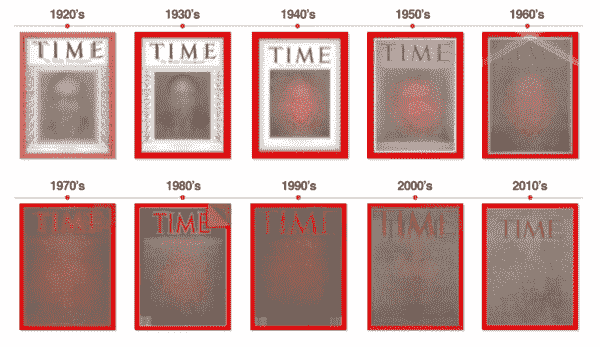
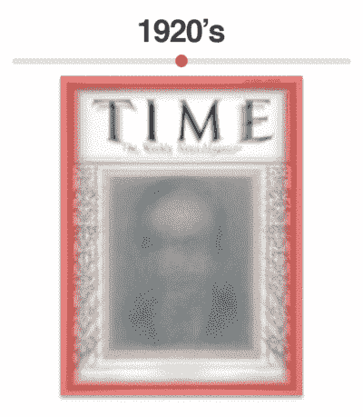
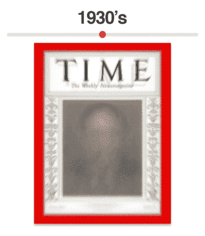
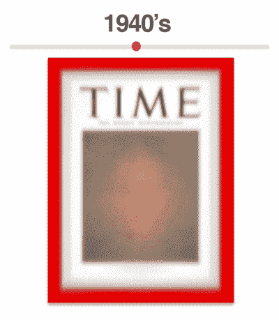
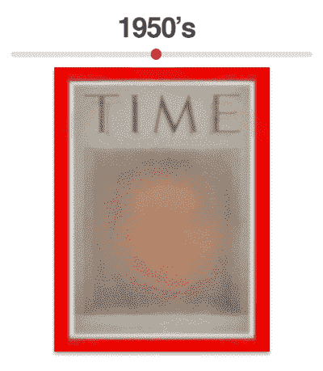
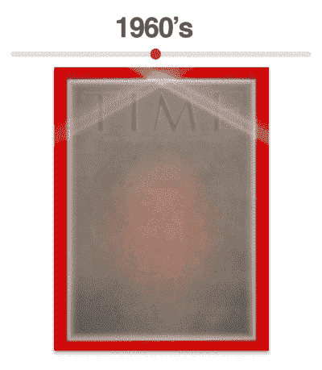
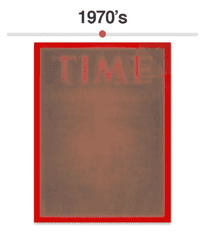
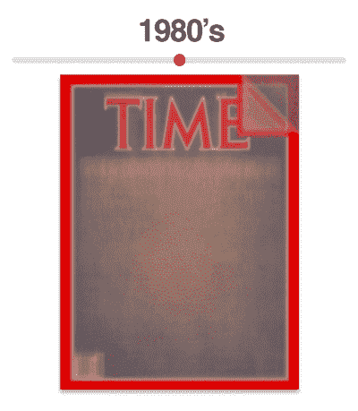
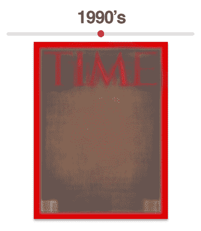
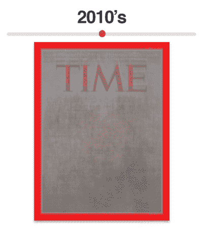

# 分析 91 年《时代》杂志封面的视觉趋势

> 原文：<https://pyimagesearch.com/2015/10/19/analyzing-91-years-of-time-magazine-covers-for-visual-trends/>

[](https://pyimagesearch.com/wp-content/uploads/2015/10/time_analysis_all_covers.png)

今天的博文将建立在我们上周所学的内容之上:[如何使用 Python + Scrapy 构建一个图像刮刀来刮取~ 4000 张*时代*杂志封面图像。](https://pyimagesearch.com/2015/10/12/scraping-images-with-python-and-scrapy/)

现在我们有了这个数据集，我们要用它做什么呢？

问得好。

当检查这些类型的同质数据集时，我最喜欢应用的视觉分析技术之一是简单地在给定的时间窗口 (即时间帧)内对图像进行平均 ***。这个平均是一个简单的操作。我们所需要做的就是循环遍历我们的数据集(或子集)中的每一幅图像，并为每个*** *(x，y)* 【坐标】保持 ***的*平均像素亮度值*。***

通过计算这个平均值，我们可以获得图像数据(即*时间*杂志封面)在给定时间范围内的外观的单一表示。在探索数据集中的可视化趋势时，这是一种简单而高效的方法。

在这篇博文的剩余部分，我们将把我们的*时代*杂志封面数据集分成 10 组——每一组代表已经出版的 ***10** **十年*** *时代*杂志。然后，对于这些组中的每一组，我们将计算该组中所有图像的平均值，给我们一个关于*时间*封面图像看起来如何的*单个* *视觉表示*。该平均图像将允许我们识别封面图像中的*视觉趋势*；具体来说，**在给定的十年中*时间*所使用的营销和广告技术。**

## 分析 91 年《时代》杂志封面的视觉趋势

在我们深入这篇文章之前，通读一下我们之前关于[刮*时间*杂志封面图片](https://pyimagesearch.com/2015/10/12/scraping-images-with-python-and-scrapy/)的课程可能会有所帮助——阅读之前的文章当然不是必须的，但确实有助于给出一些背景。

也就是说，让我们开始吧。打开一个新文件，命名为`analyze_covers.py`，让我们开始编码:

```py
# import the necessary packages
from __future__ import print_function
import numpy as np
import argparse
import json
import cv2

def filter_by_decade(decade, data):
	# initialize the list of filtered rows
	filtered = []

	# loop over the rows in the data list
	for row in data:
		# grab the publication date of the magazine
		pub = int(row["pubDate"].split("-")[0])

		# if the publication date falls within the current decade,
		# then update the filtered list of data
		if pub >= decade and pub < decade + 10:
			filtered.append(row)

	# return the filtered list of data
	return filtered

```

**第 2-6 行**简单地导入我们必需的包——这里没有什么太令人兴奋的。

然后我们在第 8 行的**上定义一个效用函数`filter_by_decade`。顾名思义，这种方法将遍历我们收集的封面图像，并找出所有在指定十年内的封面。我们的`filter_by_decade`函数需要两个参数:我们想要获取封面图片的`decade`，以及`data`，T3 只是来自我们[前一篇文章](https://pyimagesearch.com/2015/10/12/scraping-images-with-python-and-scrapy/)的`output.json`数据。**

现在我们的方法已经定义好了，让我们继续看函数体。我们将初始化`filtered`，这是`data`中符合十年标准的行列表(**第 10 行**)。

然后我们循环遍历`data` ( **第 13 行**)中的每个`row`，提取发布日期(**第 15 行**)，然后更新我们的`filtered`列表，前提是发布日期在我们指定的`decade` ( **第 19 行和第 20 行**)内。

最后，过滤后的行列表在第 23 行上返回给调用者。

既然我们的助手函数已经定义好了，让我们继续解析命令行参数并加载我们的`output.json`文件:

```py
# construct the argument parse and parse the arguments
ap = argparse.ArgumentParser()
ap.add_argument("-o", "--output", required=True,
	help="path to output visualizations directory")
args = vars(ap.parse_args())

# load the JSON data file
data = json.loads(open("output.json").read())

```

同样，这里的代码非常简单。**第 26-29 行**处理解析命令行参数。这里我们只需要一个开关，`--visualizations`，它是到目录的路径，我们将在这个目录中存储 1920 年到 2010 年之间每十年的平均封面图像。

然后我们在第 32 行的**处加载`output.json`文件(同样，这是从我们之前关于用 Python + Scrapy 抓取图像的[文章中生成的)。](https://pyimagesearch.com/2015/10/12/scraping-images-with-python-and-scrapy/)**

我们现在准备对*时间*杂志封面数据集进行实际分析:

```py
# loop over each individual decade Time magazine has been published
for decade in np.arange(1920, 2020, 10):
	# initialize the magazine covers list
	print("[INFO] processing years: {}-{}".format(decade, decade + 9))
	covers = []

	# loop over the magazine issues belonging to the current decade
	for row in filter_by_decade(decade, data):
		# load the image
		cover = cv2.imread("output/{}".format(row["files"][0]["path"]))

		# if the image is None, then there was an issue loading it
		# (this happens for ~3 images in the dataset, likely due to
		# a download problem during the scraping process)
		if cover is not None:
			# resize the magazine cover, flatten it into a single
			# list, and update the list of covers
			cover = cv2.resize(cover, (400, 527)).flatten()
			covers.append(cover)

	# compute the average image of the covers then write the average
	# image to disk
	avg = np.average(covers, axis=0).reshape((527, 400, 3)).astype("uint8")
	p = "{}/{}.png".format(args["output"], decade)
	cv2.imwrite(p, avg)

```

我们首先在第 35 行的**上循环 1920 年和 2010 年之间的每个`decade`，并初始化一个列表`covers`，以存储当前`decade`的实际封面图像。**

对于每一个十年，我们需要从`output.json`中取出属于十年范围内的所有行。幸运的是，这很容易，因为我们有上面定义的`filter_by_decade`方法。

下一步是在**线 43** 上从磁盘加载当前封面图像。如果图像是`None`，那么我们知道从磁盘加载封面时出现了问题——数据集中大约有 3 张图像会出现这种情况，这可能是由于下载问题或抓取过程中的网络问题。

假设`cover`不是`None`，我们需要将它调整到一个规范的已知大小，这样我们就可以计算每个像素位置 ( **第 51 行**)的 ***的平均值。这里我们将图像的大小调整为固定的 *400 x 527 像素*，忽略长宽比——调整后的图像随后被展平为一系列 *400 x 527 x 3= 632，400* 像素(其中 *3* 来自图像的红色、绿色和蓝色通道)。如果我们不将封面大小调整为固定大小，那么我们的行将不会对齐，我们将无法计算十年范围内的平均图像。***

展平后的`cover`然后被累积到**行 52** 上的`covers`列表中。

使用`np.average`功能在**第 56 行**对十年的封面图片进行真正的“分析”。每个*时间*的杂志封面图像都由`covers`列表中一个展平的行表示。因此，要计算十年间所有封面的平均值，我们需要做的就是取每个*列*的平均像素值。这将给我们留下一个单个列表(同样是 *632，400* -dim ),表示每个(x，y)坐标*处的每个红色、绿色和蓝色像素的平均值。*

然而，由于`avg`图像被表示为浮点值的 1D 列表，我们无法将其可视化。首先，我们需要对`avg`图像进行整形，使其宽度为 400 像素，高度为 527 像素，深度为 3(分别用于红色、绿色和蓝色通道)。最后，由于 OpenCV 期望 8 位无符号整数，我们将从`np.average`返回的`float`数据类型转换为`uint8`。

最后，**行 57 和 58** 获取我们的`avg`封面图像并将其写入磁盘。

要运行我们的脚本，只需执行以下命令:

```py
$ python analyze_covers.py --output visualizations

```

几秒钟后，您应该会在您的`visualizations`目录中看到以下图像:

[](https://pyimagesearch.com/wp-content/uploads/2015/10/time_analysis_output.jpg)

**Figure 1:** The output of our analyze_covers.py script for image averaging.

## 结果

[](https://pyimagesearch.com/wp-content/uploads/2015/10/time_analysis_all_covers.png)

**Figure 2:** Visualizing ten decades’ worth of *Time* magazine covers.

我们现在在我们的`visualizations`目录中有 10 张图片，平均每张对应于已经出版的**时间*杂志的 10 个十年。*

 *但是这些可视化实际上意味着什么呢？通过研究它们，我们能获得什么样的洞见？

事实证明， ***相当多***——尤其是关于*时代*如何在过去 90 多年里用他们的封面进行**营销和广告**:

[](https://pyimagesearch.com/wp-content/uploads/2015/10/time_analysis_1920s.png)

**Figure 3:** Average of *Time* magazine covers from 1920-1929.

*   原来*时代*杂志的封面是 ***全*** 黑白。但在 20 世纪 20 年代末，我们可以看到他们开始转移到现在标志性的红色边界。然而，封面的其他部分(包括肖像)仍然是黑白的。
*   *时间*标志总是出现在封面的顶部。
*   华丽的设计将封面肖像框在左边和右边。

[](https://pyimagesearch.com/wp-content/uploads/2015/10/time_analysis_1930s.png)

**Figure 4:** Average of *Time* magazine covers from 1930-1939.

*   *Time* 现在完全投入到他们的红色边框中，实际上边框的厚度已经略有增加。
*   总的来说，从 20 世纪 20 年代到 30 年代的设计变化不大。

[](https://pyimagesearch.com/wp-content/uploads/2015/10/time_analysis_1940s.png)

**Figure 5:** Average of *Time* magazine covers from 1940-1949.

*   我们注意到的第一个变化是**红色边框不是唯一的颜色！**封面人物的肖像开始彩色打印。鉴于肖像区域似乎有相当多的颜色，这种变化可能发生在 20 世纪 40 年代早期的
**   另一个微妙的变化是*“每周新闻杂志”*版式的变化，直接在*“时代”*文本的下面。*   同样值得注意的是，*“TIME”*文本本身与前几十年相比更加固定(即位置变化非常小)。*

*[](https://pyimagesearch.com/wp-content/uploads/2015/10/time_analysis_1950s.png)

**Figure 6:** Average of *Time* magazine covers from 1950-1959.

*   20 世纪 50 年代的封面图片展示了*时代*杂志*的巨变，无论是从 ***封面版式*** 还是 ***营销和广告*** 。*
**   首先，曾经被白色边框/华丽设计框住的肖像现在被扩展到覆盖整个封面——这一趋势一直延续到现代。*   元信息(如期刊名称和出版日期)总是刊登在杂志封面上；然而，我们现在开始在杂志的四个角落里看到这个元信息的一个非常固定和高度格式化的版本。*   最值得注意的是营销和广告方面的变化，用斜黄条来突出这期杂志的封面故事。*

*[](https://pyimagesearch.com/wp-content/uploads/2015/10/time_analysis_1960s.png)

**Figure 7:** Average of *Time* magazine covers from 1960-1969.

*   关于 20 世纪 60 年代的*时代*封面，你首先会注意到的是*“时代”*文字的变化。虽然文本看起来是紫色的，但它实际上是从*黑色*到*红色*的过渡(平均起来是紫色)。之前的几十年*时间*都使用黑色文字作为他们的标志，但是在 20 世纪 60 年代我们可以看到他们转换成了现在现代的红色。
*   其次，您会看到*“TIME”*文本以白色边框突出显示，用于在徽标和中心部分之间形成对比。
*   《时代周刊》仍在使用对角线条进行营销，让他们能够突出封面故事——但这些条现在更多的是“白色”而不是黄色。酒吧的宽度也减少了 1/3。

[](https://pyimagesearch.com/wp-content/uploads/2015/10/time_analysis_1970s.png)

**Figure 8:** Average of *Time* magazine covers from 1970-1979.

*   **在这里，我们看到营销和广告策略的另一个重大变化**——*——*开始使用**的人工折页**(右上角)，让我们可以“先睹为快”这期杂志的内容。
*   **还要注意问题左下角开始出现的条形码。**
*   *“时间”*文本周围的白色边框已被移除。

[](https://pyimagesearch.com/wp-content/uploads/2015/10/time_analysis_1980s.png)

**Figure 9:** Average of *Time* magazine covers from 1980-1989.

*   20 世纪 80 年代的《时间》杂志似乎延续了 20 世纪 70 年代的人工折页营销策略。
*   他们还重新插入了包围*“TIME”*文本的白色边框。
*   条形码现在主要用在左下角。
*   **还要注意，条形码也开始出现在右下角。**

[](https://pyimagesearch.com/wp-content/uploads/2015/10/time_analysis_1990s.png)

**Figure 10:** Average of *Time* magazine covers from 1990-1999.

*   围绕*【TIME】*的白色边框又一次消失了——这让我很好奇这些年他们在进行什么类型的对比测试，以确定白色边框是否有助于杂志的更多销售。
*   条形码现在始终出现在杂志的左下角和右下角，条形码位置的选择高度依赖于美学。
*   还要注意，存在了近 20 年的人工折页现在已经不存在了。
*   最后，请注意*“TIME”*徽标的大小变化很大。

[](https://pyimagesearch.com/wp-content/uploads/2015/10/time_analysis_2000s.png)

**Figure 11:** Average of *Time* magazine covers from 2000-2009.

*   可变标志尺寸在 2000 年代变得更加明显。
*   我们还可以看到条形码完全消失了。

[](https://pyimagesearch.com/wp-content/uploads/2015/10/time_analysis_2010s.png)

**Figure 12:** Average of *Time* magazine covers from 2010-Present.

*   我们现在来到现代*时间*杂志封面。
*   总的来说，2010 年和 2000 年没有太大区别。
*   然而，*时间*标志本身的大小似乎*实质上*变化不大，只沿 *y* 轴波动。

## 摘要

在这篇博文中，我们探索了在[上一课](https://pyimagesearch.com/2015/10/12/scraping-images-with-python-and-scrapy/)中收集的*时间*杂志封面数据集。

为了对数据集进行可视化分析，并确定杂志封面的趋势和变化，我们对几十年来的*封面进行了平均。鉴于《T2 时间》已经出版了十年，这给我们留下了十种不同的视觉表现。*

总的来说，封面的变化可能看起来很微妙，但它们实际上对杂志的发展很有洞察力，特别是在营销和广告方面。

以下方面的变化:

1.  标志颜色和白色镶边
2.  突出封面故事的横幅
3.  和人工折页

清楚地表明 *Time* 杂志正试图确定哪些策略足够“吸引眼球”,让读者从当地的报摊上买一份。

此外，他们在白边和无白边之间的转换向我表明，他们正在进行一系列的对比测试，积累了几十年的数据，最终形成了他们现在的现代标志。***